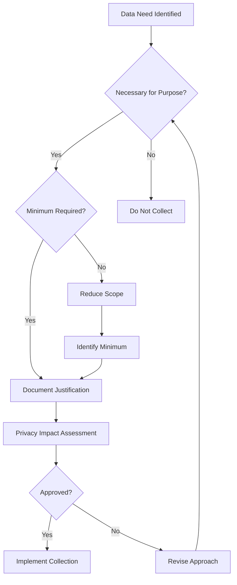
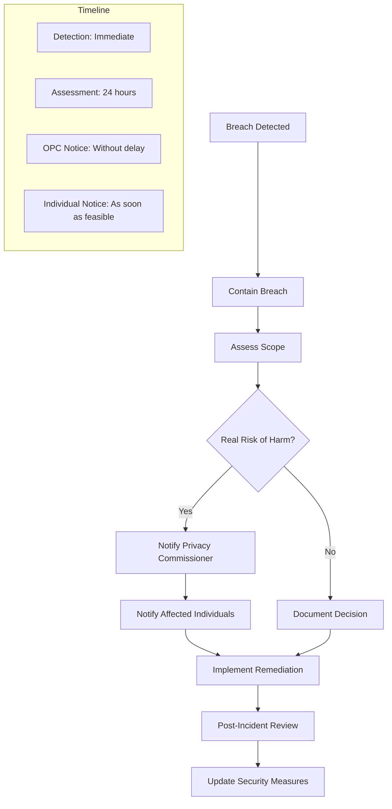

# Data Privacy (PIPEDA)

## Overview

The Personal Information Protection and Electronic Documents Act (PIPEDA) governs how private sector organizations in Canada collect, use, and disclose personal information. REFLEKT must comply with PIPEDA's fair information principles to protect customer privacy.

## PIPEDA Principles

### 1. Accountability

```typescript
interface PrivacyGovernance {
  privacyOfficer: {
    name: string
    title: 'Chief Privacy Officer'
    email: 'privacy@reflekt.ai'
    responsibilities: [
      'Privacy program oversight',
      'Policy development and maintenance',
      'Privacy impact assessments',
      'Breach response coordination',
      'Regulatory liaison',
      'Training and awareness'
    ]
  }

  accountability: {
    policies: PolicyDocument[]
    procedures: Procedure[]
    training: TrainingProgram
    audits: AuditSchedule
    vendorManagement: ThirdPartyOversight
  }

  reporting: {
    board: 'Quarterly privacy report'
    regulator: 'Annual compliance attestation'
    public: 'Privacy transparency report'
  }
}
```

### 2. Identifying Purposes

```yaml
data_collection_purposes:
  primary_purposes:
    identity_verification:
      - "Comply with KYC requirements"
      - "Prevent fraud and money laundering"
      - "Verify customer identity"

    service_delivery:
      - "Provide financial data aggregation"
      - "Perform credit assessments"
      - "Generate financial analytics"
      - "Process transactions"

    account_management:
      - "Manage customer accounts"
      - "Provide customer support"
      - "Send service communications"

  secondary_purposes:
    product_improvement:
      - "Enhance service features"
      - "Develop new products"
      - "Improve user experience"

    analytics:
      - "Generate aggregated insights"
      - "Perform risk analysis"
      - "Create industry benchmarks"

    marketing:
      - "Send promotional materials (with consent)"
      - "Personalize offerings"
      - "Conduct market research"
```

### 3. Consent

```typescript
class ConsentManagement {
  async obtainConsent(
    customer: Customer,
    purpose: Purpose,
    type: ConsentType
  ): Promise<Consent> {
    const consent = {
      customerId: customer.id,
      purpose: purpose.id,
      type: type,

      // Consent elements
      informed: {
        purposeExplained: true,
        useDescribed: true,
        consequencesStated: true,
        rightsExplained: true
      },

      voluntary: {
        noCoercion: true,
        alternativesAvailable: true,
        withdrawalOption: true
      },

      specific: {
        limitedToPurpose: true,
        timebound: purpose.duration,
        scopeDefined: true
      },

      // Consent record
      record: {
        timestamp: new Date(),
        method: 'electronic' | 'written' | 'verbal',
        version: this.getConsentVersion(),
        ipAddress: this.getIPAddress(),
        evidence: this.captureEvidence()
      }
    }

    await this.storeConsent(consent)
    return consent
  }

  async withdrawConsent(
    customerId: string,
    consentId: string
  ): Promise<void> {
    const consent = await this.getConsent(consentId)

    // Process withdrawal
    consent.withdrawn = {
      timestamp: new Date(),
      method: 'customer_request',
      processed: true
    }

    // Stop related processing
    await this.stopProcessing(consent.purpose)

    // Update systems
    await this.propagateWithdrawal(consent)

    // Confirm to customer
    await this.sendWithdrawalConfirmation(customerId)
  }
}
```

### 4. Limiting Collection



### 5. Limiting Use, Disclosure, and Retention

```typescript
interface DataGovernance {
  use: {
    restrictions: {
      purposeLimitation: boolean
      internalAccessControls: boolean
      needToKnow: boolean
      auditLogging: boolean
    }

    permissions: {
      roles: Role[]
      dataClassification: Classification[]
      accessMatrix: AccessControl[][]
    }
  }

  disclosure: {
    authorized: {
      consent: 'Required unless exception applies'
      legalObligation: 'Court order or subpoena'
      vitalInterests: 'Life-threatening emergency'
      publicRecord: 'Already public information'
    }

    agreements: {
      dataProcessing: Agreement[]
      confidentiality: NDA[]
      crossBorder: TransferAgreement[]
    }
  }

  retention: {
    schedule: {
      customerData: '7 years after relationship ends'
      transactionData: '7 years from transaction'
      marketingData: '2 years from last interaction'
      technicalLogs: '1 year'
    }

    destruction: {
      method: 'Secure deletion/shredding'
      verification: 'Certificate of destruction'
      audit: 'Destruction log maintained'
    }
  }
}
```

### 6. Accuracy

```yaml
data_accuracy:
  collection:
    - Verify at source
    - Use authoritative sources
    - Validate format and completeness
    - Cross-reference multiple sources

  maintenance:
    - Regular accuracy reviews
    - Customer update mechanisms
    - Automated validation rules
    - Data quality monitoring

  correction:
    process:
      1. Customer request received
      2. Verify customer identity
      3. Review correction request
      4. Validate new information
      5. Update all instances
      6. Notify third parties
      7. Confirm to customer

    timeline: "Within 30 days"
    documentation: "Maintain correction log"
```

### 7. Safeguards

```typescript
class DataSecurity {
  technicalSafeguards = {
    encryption: {
      atRest: 'AES-256',
      inTransit: 'TLS 1.3',
      keyManagement: 'HSM-based'
    },

    accessControl: {
      authentication: 'Multi-factor',
      authorization: 'Role-based (RBAC)',
      sessionManagement: 'Secure tokens',
      privilegedAccess: 'Just-in-time'
    },

    monitoring: {
      intrusion: 'IDS/IPS',
      logging: 'Comprehensive audit logs',
      anomaly: 'ML-based detection',
      vulnerability: 'Regular scanning'
    }
  }

  organizationalSafeguards = {
    policies: [
      'Information Security Policy',
      'Acceptable Use Policy',
      'Access Control Policy',
      'Incident Response Plan'
    ],

    training: {
      frequency: 'Annual + onboarding',
      topics: ['Data handling', 'Phishing', 'Password security'],
      testing: 'Simulations and assessments'
    },

    vendorManagement: {
      dueDiligence: 'Security assessments',
      contracts: 'Data protection clauses',
      monitoring: 'Ongoing compliance checks'
    }
  }

  physicalSafeguards = {
    facilities: {
      access: 'Badge + biometric',
      surveillance: '24/7 CCTV',
      environmental: 'Climate control, fire suppression'
    },

    devices: {
      encryption: 'Full disk encryption',
      disposal: 'Secure wiping/destruction',
      theft: 'Remote wipe capability'
    }
  }
}
```

### 8. Openness

```markdown
## Privacy Documentation

### Public Documents
- Privacy Policy (website)
- Privacy Notice (account opening)
- Cookie Policy
- Data Processing Terms

### Information Available on Request
- Data inventory
- Third-party processors list
- Data retention schedule
- Security measures overview
- Privacy impact assessments (summary)

### Transparency Reporting
- Number of access requests
- Number of correction requests
- Number of complaints
- Number of breaches
- Law enforcement requests
```

### 9. Individual Access

```typescript
class SubjectAccessRequest {
  async processRequest(request: AccessRequest): Promise<Response> {
    // Step 1: Verify identity
    const verified = await this.verifyIdentity(request.requester)
    if (!verified) {
      return this.requestAdditionalVerification()
    }

    // Step 2: Locate all data
    const data = await this.findAllData(request.subject)

    // Step 3: Review for exceptions
    const reviewed = await this.applyExceptions(data, {
      legalPrivilege: true,
      commercialConfidential: true,
      thirdPartyInfo: true,
      ongoingInvestigation: true
    })

    // Step 4: Prepare response
    const response = {
      personalData: reviewed.data,
      sources: reviewed.sources,
      recipients: reviewed.sharedWith,
      purposes: reviewed.purposes,
      retentionPeriod: reviewed.retention,

      format: request.preferredFormat || 'PDF',
      delivery: request.preferredDelivery || 'secure_email'
    }

    // Step 5: Deliver within timeline
    await this.deliver(response, {
      deadline: '30 days',
      extension: 'Additional 30 days if complex'
    })

    return response
  }
}
```

### 10. Challenging Compliance

```yaml
complaint_process:
  internal:
    step_1:
      contact: "privacy@reflekt.ai"
      response_time: "Acknowledge within 2 business days"
      resolution_target: "30 days"

    step_2:
      escalation: "Chief Privacy Officer"
      review: "Independent review of complaint"
      resolution_target: "Additional 30 days"

  external:
    privacy_commissioner:
      contact: "Office of the Privacy Commissioner of Canada"
      phone: "1-800-282-1376"
      website: "https://www.priv.gc.ca"

    process:
      - File complaint online or by mail
      - OPC investigation
      - Findings and recommendations
      - Potential Federal Court review
```

## Privacy by Design

### Implementation Framework

```typescript
interface PrivacyByDesign {
  principles: {
    proactive: 'Prevent privacy invasions before they occur'
    default: 'Maximum privacy protection by default'
    embedded: 'Privacy built into system design'
    functional: 'Accommodate all legitimate interests'
    lifecycle: 'Secure throughout data lifecycle'
    transparent: 'Ensure all stakeholders can verify'
    respectful: 'Keep user interests paramount'
  }

  implementation: {
    planning: {
      privacyImpactAssessment: boolean
      dataFlowMapping: boolean
      riskAnalysis: boolean
      mitigationStrategies: Strategy[]
    }

    development: {
      minimization: 'Collect minimum necessary'
      pseudonymization: 'Replace identifiers where possible'
      encryption: 'Encrypt by default'
      accessControls: 'Granular permissions'
    }

    testing: {
      privacyTesting: 'Dedicated privacy test cases'
      penetrationTesting: 'Security assessments'
      complianceAudit: 'Regulatory compliance check'
    }
  }
}
```

## Data Breach Management

### Breach Response Plan



### Breach Documentation

```typescript
interface BreachRecord {
  incident: {
    id: string
    detectedAt: Date
    reportedBy: string
    type: 'unauthorized_access' | 'loss' | 'theft' | 'disclosure'
  }

  assessment: {
    dataAffected: {
      categories: DataCategory[]
      volume: number
      sensitivity: 'low' | 'medium' | 'high'
    }

    individualsAffected: {
      count: number
      identifiable: boolean
      jurisdiction: string[]
    }

    riskOfHarm: {
      level: 'low' | 'medium' | 'high'
      factors: string[]
      mitigation: string[]
    }
  }

  response: {
    containment: {
      actions: string[]
      timestamp: Date
      successful: boolean
    }

    notifications: {
      regulator: {
        notified: boolean
        date: Date
        reference: string
      }
      individuals: {
        notified: boolean
        date: Date
        method: string
        count: number
      }
    }

    remediation: {
      immediate: Action[]
      longTerm: Action[]
      preventive: Action[]
    }
  }
}
```

## Cross-Border Data Transfers

### Transfer Mechanisms

```yaml
international_transfers:
  adequacy_decisions:
    eu_canada: "Adequate protection recognized"

  contractual_safeguards:
    standard_clauses:
      - EU Standard Contractual Clauses
      - APEC Cross-Border Privacy Rules

    additional_measures:
      - Encryption in transit and at rest
      - Access controls
      - Audit rights
      - Data localization options

  consent_based:
    requirements:
      - Explicit consent
      - Clear explanation of risks
      - Destination country identified
      - Safeguards described
```

## Special Categories of Data

### Sensitive Information

```typescript
interface SensitiveDataHandling {
  categories: {
    financial: {
      data: ['Bank accounts', 'Credit cards', 'Investment accounts']
      additionalProtection: ['Tokenization', 'PCI DSS compliance']
    }

    health: {
      data: ['Medical conditions', 'Prescriptions', 'Insurance claims']
      additionalProtection: ['Explicit consent', 'Limited access']
    }

    government: {
      data: ['SIN', 'Passport', 'Driver license']
      additionalProtection: ['Encryption', 'No unnecessary collection']
    }
  }

  controls: {
    collection: 'Only when necessary and with explicit consent'
    storage: 'Enhanced encryption and access controls'
    use: 'Strictly limited to stated purpose'
    disclosure: 'Only with explicit consent or legal requirement'
    retention: 'Minimum necessary period'
    destruction: 'Secure and verified destruction'
  }
}
```

## Children's Privacy

### Special Protections

```yaml
children_privacy:
  age_verification:
    - Age declaration
    - Parental consent for under 13
    - Enhanced protections for 13-18

  data_minimization:
    - Collect absolute minimum
    - No behavioral advertising
    - No sale of children's data

  parental_rights:
    - Access child's data
    - Correct inaccuracies
    - Delete data
    - Withdraw consent
```

## Privacy Training Program

### Training Curriculum

```typescript
interface PrivacyTraining {
  audiences: {
    allStaff: {
      topics: [
        'PIPEDA basics',
        'Privacy principles',
        'Data handling procedures',
        'Breach response',
        'Customer rights'
      ]
      frequency: 'Annual'
      duration: '2 hours'
    }

    dataHandlers: {
      topics: [
        'Data classification',
        'Access controls',
        'Secure disposal',
        'Incident reporting',
        'Third-party sharing'
      ]
      frequency: 'Semi-annual'
      duration: '4 hours'
    }

    developers: {
      topics: [
        'Privacy by design',
        'Data minimization',
        'Secure coding',
        'Privacy testing',
        'API security'
      ]
      frequency: 'Quarterly'
      duration: '3 hours'
    }
  }

  delivery: {
    methods: ['Online modules', 'Workshops', 'Simulations']
    testing: 'Required with 80% pass rate'
    certification: 'Annual recertification'
  }
}
```

## Compliance Monitoring

### Privacy Metrics

```yaml
privacy_kpis:
  operational:
    - Access requests completed on time: >95%
    - Consent capture rate: 100%
    - Data accuracy rate: >98%
    - Breach response time: <24 hours

  compliance:
    - Privacy complaints: <5 per year
    - Regulatory findings: 0
    - Audit findings addressed: 100%
    - Training completion: 100%

  risk:
    - High-risk data minimized: Ongoing
    - Third-party assessments: 100% complete
    - Privacy impact assessments: All new projects
    - Vulnerability remediation: <30 days
```

## Vendor Management

### Third-Party Privacy Requirements

```typescript
class VendorPrivacyManagement {
  async assessVendor(vendor: Vendor): Promise<Assessment> {
    const assessment = {
      privacyPractices: await this.reviewPrivacyPolicy(vendor),
      securityMeasures: await this.assessSecurity(vendor),
      dataLocation: await this.verifyDataResidency(vendor),
      subprocessors: await this.identifySubprocessors(vendor),
      certifications: await this.verifyCertifications(vendor),

      risk: this.calculateRisk(vendor),
      requirements: this.determineRequirements(vendor),

      contractualTerms: {
        dataProcessingAgreement: 'Required',
        confidentiality: 'Required',
        auditRights: 'Required',
        breachNotification: '24 hours',
        dataReturn: 'Upon termination',
        liabilityAndIndemnity: 'Appropriate allocation'
      }
    }

    return assessment
  }
}
```

## Technology Controls

### Privacy-Enhancing Technologies

```yaml
privacy_technologies:
  anonymization:
    - Remove direct identifiers
    - Generalize quasi-identifiers
    - Add statistical noise
    - K-anonymity implementation

  pseudonymization:
    - Replace identifiers with pseudonyms
    - Maintain mapping separately
    - Encrypt mapping table
    - Regular rotation

  encryption:
    - End-to-end encryption
    - Zero-knowledge architecture
    - Homomorphic encryption (where applicable)
    - Secure multi-party computation

  access_controls:
    - Attribute-based access control
    - Purpose-based restrictions
    - Time-limited access
    - Break-glass procedures
```

## Next Steps

1. Complete privacy impact assessment
2. Update privacy policy and notices
3. Implement consent management system
4. Deploy data subject request portal
5. Establish breach response team
6. Train all staff on privacy
7. Audit third-party processors
8. Test privacy controls
