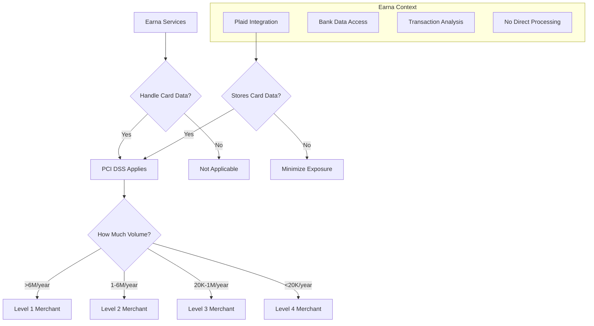
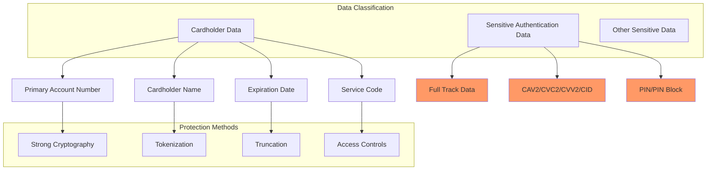
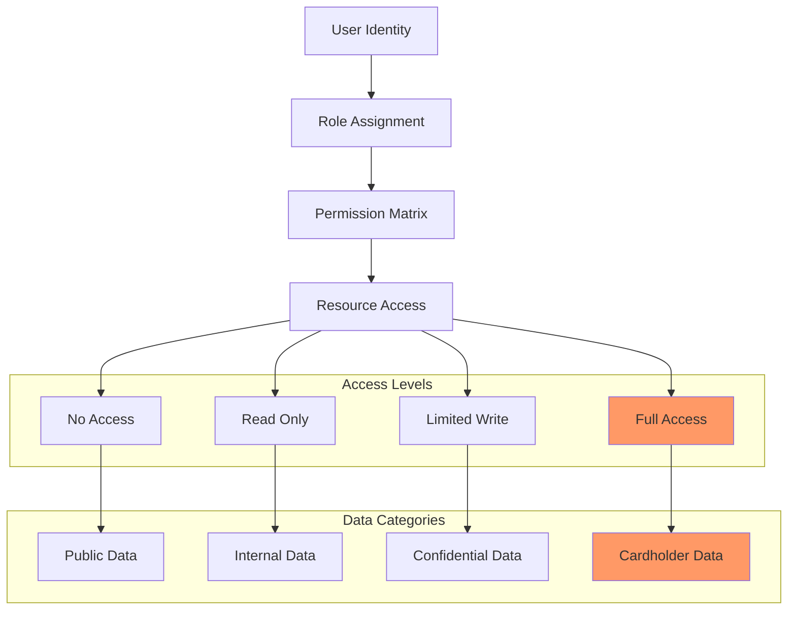
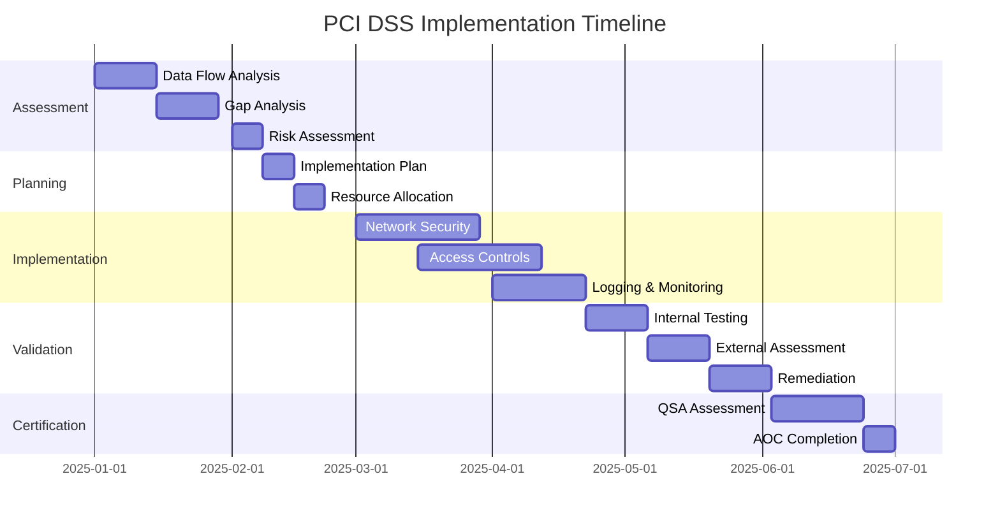
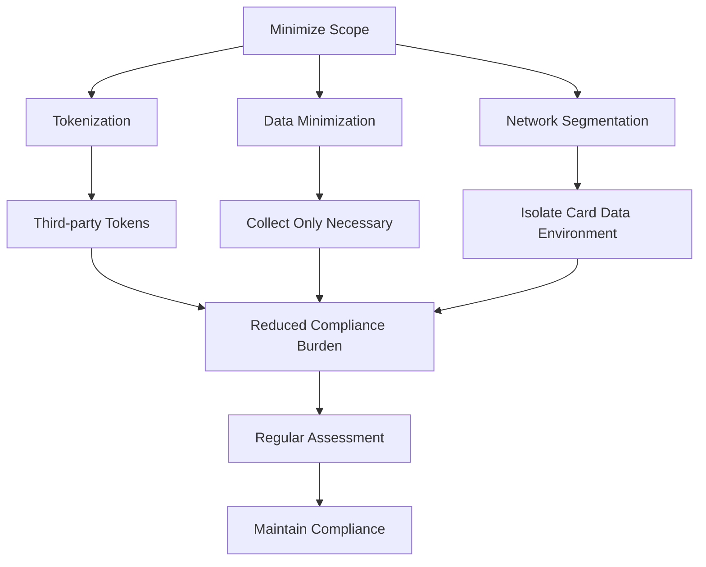

# PCI DSS Compliance

## Overview

The Payment Card Industry Data Security Standard (PCI DSS) is a security standard for organizations that handle credit card information. While Earna AI primarily focuses on data aggregation rather than payment processing, we must ensure PCI DSS compliance when handling any payment card data.

## Applicability Assessment



## Current Data Flow Analysis

### Plaid Integration

```typescript
interface PlaidDataFlow {
  cardDataHandling: {
    storage: 'No direct card storage'
    transmission: 'Encrypted channels only'
    processing: 'Analysis of transaction metadata'

    riskFactors: {
      bankStatements: 'May contain masked card numbers'
      transactionData: 'May include merchant card transactions'
      accountInfo: 'Linked payment methods'
    }
  }

  mitigations: {
    tokenization: 'Use Plaid tokens instead of raw data'
    dataMinimization: 'Only collect necessary fields'
    encryption: 'AES-256 for any card-related data'

    pciFocus: {
      requirement1: 'Network security controls'
      requirement3: 'Protect stored cardholder data'
      requirement4: 'Encrypt transmission of cardholder data'
    }
  }
}
```

## PCI DSS Requirements

### Requirement 1: Install and maintain network security controls

```yaml
network_security:
  firewalls:
    deployment:
      - Perimeter firewalls (cloud WAF)
      - Host-based firewalls on servers
      - Database access controls
      - API gateway restrictions

    configuration:
      - Default deny policies
      - Whitelist approved traffic
      - Regular rule reviews
      - Change management process

  network_segmentation:
    zones:
      dmz: "Public-facing services"
      application: "Internal application servers"
      database: "Backend data stores"
      management: "Administrative access"

    controls:
      - VLANs/subnets
      - Access control lists
      - Network monitoring
      - Intrusion detection
```

### Requirement 2: Apply secure configurations

```typescript
class SecureConfiguration {
  systemHardening = {
    servers: {
      removeDefaults: 'Remove default accounts and passwords'
      disableServices: 'Disable unnecessary services'
      updateSoftware: 'Apply security patches promptly'
      antiMalware: 'Install and maintain anti-malware'
    }

    applications: {
      secureDefaults: 'Change default settings'
      encryption: 'Enable encryption features'
      authentication: 'Strong authentication mechanisms'
      logging: 'Enable comprehensive logging'
    }

    databases: {
      accessControls: 'Restrict database access'
      encryption: 'Encrypt sensitive data'
      monitoring: 'Enable audit logging'
      patching: 'Regular security updates'
    }
  }

  configurationStandards = {
    documentation: 'Maintain configuration baselines'
    automation: 'Use configuration management tools'
    testing: 'Validate configurations regularly'
    changeControl: 'Approve configuration changes'
  }
}
```

### Requirement 3: Protect stored cardholder data



### Requirement 4: Protect cardholder data with strong cryptography during transmission

```typescript
interface TransmissionSecurity {
  encryption: {
    protocols: {
      web: 'TLS 1.2+ for all web traffic'
      api: 'TLS 1.3 for API communications'
      database: 'TLS for database connections'
      internal: 'IPSec for internal networks'
    }

    keyManagement: {
      generation: 'Use cryptographically strong keys'
      distribution: 'Secure key exchange protocols'
      storage: 'Hardware security modules (HSM)'
      rotation: 'Regular key rotation schedule'
    }
  }

  implementation: {
    certificates: {
      source: 'Trusted certificate authorities'
      validation: 'Validate certificate chains'
      monitoring: 'Monitor certificate expiration'
      replacement: 'Automate certificate renewal'
    }

    configuration: {
      cipherSuites: 'Strong cipher suites only'
      protocols: 'Disable weak protocols (SSLv3, TLS 1.0/1.1)'
      perfectForwardSecrecy: 'Enable PFS where possible'
      hsts: 'HTTP Strict Transport Security'
    }
  }
}
```

### Requirement 5: Protect all systems and networks from malicious software

```yaml
malware_protection:
  antivirus:
    deployment:
      - All servers and workstations
      - Real-time scanning enabled
      - Regular signature updates
      - Behavioral analysis

    management:
      - Centralized management console
      - Automated policy deployment
      - Quarantine procedures
      - Incident response integration

  additional_controls:
    email_security:
      - Spam filtering
      - Attachment scanning
      - URL protection
      - Phishing detection

    web_security:
      - Web application firewall
      - Content filtering
      - Malicious site blocking
      - Download scanning

    endpoint_protection:
      - Device control
      - Application whitelisting
      - Exploit protection
      - Network access control
```

### Requirement 6: Develop and maintain secure systems and software

```typescript
class SecureDevelopment {
  sdlc = {
    planning: {
      threatModeling: 'Identify security threats early'
      securityRequirements: 'Define security specifications'
      architectureReview: 'Security architecture approval'
    }

    development: {
      secureCoding: 'Follow secure coding guidelines'
      codeReview: 'Security-focused code reviews'
      staticAnalysis: 'Automated security testing'
      thirdParty: 'Vet third-party components'
    }

    testing: {
      securityTesting: 'Dedicated security test cases'
      penetrationTesting: 'External security assessment'
      vulnerabilityScanning: 'Automated vulnerability detection'
      dynamicTesting: 'Runtime security testing'
    }

    deployment: {
      secureConfiguration: 'Deploy with secure settings'
      changeManagement: 'Controlled deployment process'
      rollback: 'Ability to quickly rollback'
      monitoring: 'Security monitoring post-deployment'
    }
  }

  vulnerabilityManagement = {
    scanning: {
      frequency: 'Monthly internal, quarterly external'
      scope: 'All systems in cardholder data environment'
      tools: 'Multiple scanning technologies'
    }

    remediation: {
      critical: 'Within 30 days'
      high: 'Within 90 days'
      medium: 'Within 180 days'
      low: 'Risk-based prioritization'
    }

    tracking: {
      database: 'Vulnerability tracking system'
      reporting: 'Regular status reports'
      metrics: 'Remediation time tracking'
    }
  }
}
```

### Requirement 7: Restrict access to cardholder data by business need to know



### Requirement 8: Identify users and authenticate access to system components

```typescript
interface AccessControl {
  userManagement: {
    identification: {
      uniqueUserIds: 'Each user has unique identifier'
      namingConvention: 'Consistent naming standards'
      lifecycle: 'Provisioning, modification, deprovisioning'
    }

    authentication: {
      multiFactor: 'MFA for all administrative access'
      passwordPolicy: {
        length: 'Minimum 12 characters'
        complexity: 'Mix of character types'
        history: 'Cannot reuse last 4 passwords'
        expiry: 'Change every 90 days'
      }

      lockout: {
        attempts: 'Lock after 6 failed attempts'
        duration: '30 minutes or manual unlock'
        monitoring: 'Alert on lockout events'
      }
    }
  }

  privilegedAccess: {
    assignment: 'Principle of least privilege'
    review: 'Regular access reviews (quarterly)'
    segregation: 'Separate admin accounts'
    monitoring: 'Enhanced logging for privileged actions'
  }

  systemAccounts: {
    shared: 'Prohibited for cardholder data access'
    service: 'Unique accounts for each service'
    generic: 'Disabled or removed'
    vendor: 'Temporary access only'
  }
}
```

### Requirement 9: Restrict physical access to cardholder data

```yaml
physical_security:
  facilities:
    access_controls:
      - Badge-based access systems
      - Biometric authentication
      - Visitor management
      - Security guards

    monitoring:
      - 24/7 video surveillance
      - Motion detectors
      - Access logging
      - Incident response

    environmental:
      - Climate control
      - Fire suppression
      - Power backup (UPS)
      - Natural disaster protection

  media_handling:
    storage:
      - Locked cabinets/rooms
      - Environmental controls
      - Access logging
      - Inventory management

    transportation:
      - Secure courier services
      - Chain of custody
      - Tamper-evident packaging
      - Insurance coverage

    disposal:
      - Secure destruction
      - Certificate of destruction
      - Witness destruction
      - Audit trail
```

### Requirement 10: Log and monitor all network resources and cardholder data

```typescript
class AuditLogging {
  loggingRequirements = {
    events: [
      'User access attempts',
      'Administrative actions',
      'System access',
      'Data access',
      'Network access',
      'Privilege escalation',
      'System modifications',
      'File access'
    ],

    details: {
      userId: 'User identifier',
      timestamp: 'Date and time',
      eventType: 'Type of event',
      success: 'Success or failure',
      source: 'Source of event',
      resource: 'Resource accessed',
      details: 'Additional event details'
    }
  }

  logManagement = {
    centralization: 'Central log management system',
    protection: 'Logs protected from tampering',
    retention: 'Minimum 1 year, 3 months online',
    backup: 'Regular log backups',

    monitoring: {
      realTime: 'Real-time log analysis',
      alerting: 'Automated alerting on suspicious events',
      correlation: 'Event correlation and analysis',
      investigation: 'Log analysis tools and procedures'
    }
  }

  timeSync = {
    ntp: 'Network Time Protocol synchronization',
    sources: 'Authoritative time sources',
    monitoring: 'Time drift monitoring',
    accuracy: 'Accurate to within seconds'
  }
}
```

### Requirement 11: Test security of systems and network regularly

```yaml
security_testing:
  vulnerability_scanning:
    internal:
      frequency: "Monthly"
      scope: "All systems in CDE"
      remediation: "Critical within 30 days"

    external:
      frequency: "Quarterly"
      scope: "Public-facing systems"
      provider: "ASV (Approved Scanning Vendor)"

  penetration_testing:
    frequency: "Annual"
    scope: "Network and applications"
    methodology: "Industry-standard methodology"
    reporting: "Executive summary and technical details"

  wireless_security:
    scanning:
      frequency: "Quarterly"
      scope: "All facility locations"
      detection: "Unauthorized access points"

    configuration:
      - WPA2/WPA3 encryption
      - Strong authentication
      - Default SSID changes
      - Firewall protection

  change_detection:
    file_integrity:
      - Critical system files
      - Configuration files
      - Application files
      - Database files

    monitoring:
      - Real-time detection
      - Automated alerts
      - Investigation procedures
      - Response protocols
```

### Requirement 12: Support information security with organizational policies and programs

```typescript
interface SecurityGovernance {
  informationSecurity: {
    policy: {
      scope: 'All personnel and systems'
      ownership: 'CISO responsibility'
      review: 'Annual policy review'
      approval: 'Board or executive approval'
    }

    procedures: {
      incident: 'Security incident response'
      vulnerability: 'Vulnerability management'
      access: 'Access control procedures'
      change: 'Change management'
    }
  }

  riskManagement: {
    assessment: {
      frequency: 'Annual risk assessment'
      methodology: 'Formal risk assessment process'
      documentation: 'Risk register and treatment plans'
      monitoring: 'Ongoing risk monitoring'
    }

    treatment: {
      accept: 'Documented risk acceptance'
      mitigate: 'Risk mitigation controls'
      transfer: 'Insurance and contracts'
      avoid: 'Eliminate risk sources'
    }
  }

  awareness: {
    training: {
      allPersonnel: 'Annual security awareness training'
      specialized: 'Role-based security training'
      contractors: 'Third-party personnel training'
      testing: 'Knowledge verification testing'
    }

    communication: {
      policies: 'Policy communication'
      updates: 'Security update notifications'
      incidents: 'Security incident awareness'
      culture: 'Security culture promotion'
    }
  }
}
```

## Implementation Roadmap

### Phase 1: Assessment and Planning (Month 1-2)



### Phase 2: Technical Implementation (Month 3-4)

```yaml
technical_implementation:
  network_security:
    - Deploy WAF (Web Application Firewall)
    - Configure network segmentation
    - Implement intrusion detection
    - Set up VPN for remote access

  data_protection:
    - Implement tokenization
    - Deploy encryption solutions
    - Configure key management
    - Set up data loss prevention

  access_controls:
    - Deploy identity management
    - Implement multi-factor authentication
    - Configure privileged access management
    - Set up access monitoring

  monitoring:
    - Deploy SIEM solution
    - Configure log collection
    - Set up alerting rules
    - Implement incident response
```

### Phase 3: Process and Compliance (Month 5-6)

```typescript
interface ComplianceActivities {
  documentation: {
    policies: 'Information security policy'
    procedures: 'Operational procedures'
    standards: 'Technical standards'
    guidelines: 'Implementation guidelines'
  }

  training: {
    awareness: 'General security awareness'
    roleSpecific: 'PCI DSS specific training'
    technical: 'Technical security training'
    incident: 'Incident response training'
  }

  testing: {
    vulnerability: 'Vulnerability assessments'
    penetration: 'Penetration testing'
    controls: 'Control effectiveness testing'
    incident: 'Incident response testing'
  }

  assessment: {
    internal: 'Internal compliance assessment'
    external: 'QSA assessment'
    remediation: 'Gap remediation'
    certification: 'AOC completion'
  }
}
```

## Ongoing Compliance

### Maintenance Requirements

```yaml
ongoing_activities:
  quarterly:
    - Vulnerability scanning (external)
    - Access review
    - Policy review
    - Security metrics review

  monthly:
    - Vulnerability scanning (internal)
    - Security training
    - Incident review
    - Control testing

  continuous:
    - Log monitoring
    - Security alerts
    - Patch management
    - Threat intelligence
```

### Key Performance Indicators

```typescript
interface PCIMetrics {
  technical: {
    vulnerabilityRemediationTime: number     // Days
    patchInstallationTime: number           // Days
    systemUptimePercentage: number          // Percentage
    encryptionCoverage: number              // Percentage
  }

  operational: {
    incidentResponseTime: number            // Hours
    falsePositiveRate: number              // Percentage
    complianceScore: number                 // Score out of 100
    auditFindingsClosed: number            // Count
  }

  business: {
    complianceCost: number                 // Annual cost
    businessImpact: number                 // Downtime hours
    customerTrust: number                  // Survey score
    regulatoryRisk: number                 // Risk score
  }
}
```

## Cost Estimation

```yaml
implementation_costs:
  technology:
    security_tools: "$50,000 - $100,000"
    infrastructure: "$25,000 - $50,000"
    monitoring: "$30,000 - $60,000"
    consulting: "$75,000 - $150,000"

  ongoing:
    maintenance: "$20,000 - $40,000/year"
    assessment: "$15,000 - $30,000/year"
    training: "$5,000 - $10,000/year"
    monitoring: "$24,000 - $48,000/year"

  total_first_year: "$180,000 - $360,000"
  annual_ongoing: "$64,000 - $128,000"
```

## Risk Mitigation

### If PCI DSS Required



### Alternative Approaches

```typescript
interface ScopeReduction {
  tokenization: {
    approach: 'Use payment processor tokens'
    benefit: 'Remove card data from environment'
    implementation: 'Plaid tokenization features'
  }

  minimization: {
    approach: 'Collect minimum necessary data'
    benefit: 'Reduce compliance scope'
    implementation: 'Data classification and filtering'
  }

  outsourcing: {
    approach: 'Use PCI compliant service providers'
    benefit: 'Transfer compliance responsibility'
    implementation: 'Vendor due diligence'
  }
}
```

## Next Steps

1. **Scope Assessment**: Determine exact PCI DSS applicability
2. **Gap Analysis**: Identify compliance gaps
3. **Implementation Planning**: Create detailed project plan
4. **Technology Deployment**: Implement required security controls
5. **Process Development**: Establish compliance processes
6. **Assessment**: Conduct formal PCI DSS assessment
7. **Certification**: Obtain Attestation of Compliance (AOC)
8. **Maintenance**: Establish ongoing compliance program

## Resources

### Standards and Guidance
- [PCI Security Standards Council](https://www.pcisecuritystandards.org/)
- [PCI DSS Requirements](https://www.pcisecuritystandards.org/documents/PCI_DSS-QRG-v3_2_1.pdf)
- [Self-Assessment Questionnaires](https://www.pcisecuritystandards.org/document_library/)

### Tools and Vendors
- **Approved Scanning Vendors (ASV)**: For quarterly vulnerability scans
- **Qualified Security Assessors (QSA)**: For compliance assessments
- **Payment Card Industry Forensic Investigators (PFI)**: For incident response

### Contact Information
- **PCI DSS Questions**: compliance@earna.ai
- **Security Team**: security@earna.ai
- **Emergency**: security-incident@earna.ai
