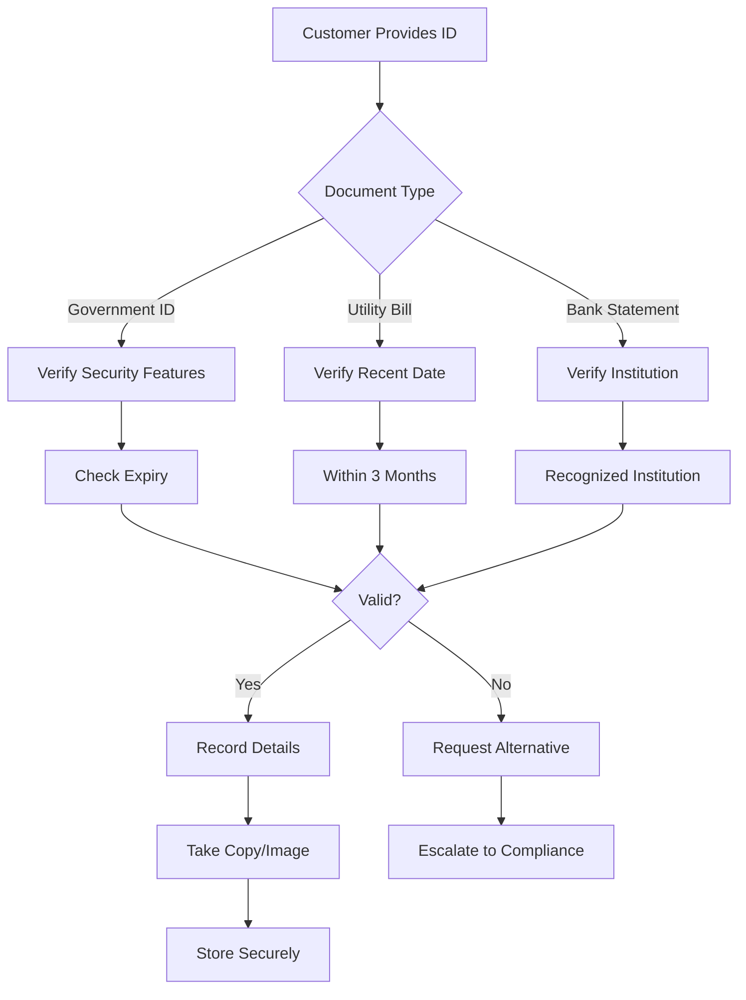
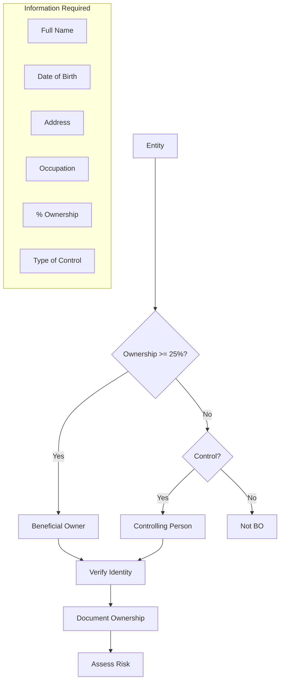
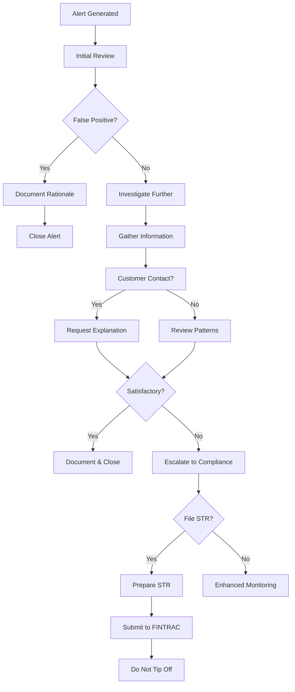
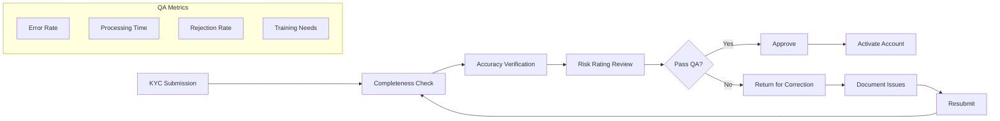

# AML/KYC Procedures

## Overview

Anti-Money Laundering (AML) and Know Your Customer (KYC) procedures form the foundation of REFLEKT's compliance program. These procedures ensure we properly identify customers, assess risks, and detect suspicious activities in accordance with Canadian regulations.

## Customer Identification Program (CIP)

### Individual Customers

```typescript
interface IndividualKYC {
  required: {
    fullName: {
      first: string
      middle?: string
      last: string
    }
    dateOfBirth: Date
    address: {
      street: string
      city: string
      province: string
      postalCode: string
      country: string
    }
    identification: {
      type: 'drivers_license' | 'passport' | 'pr_card'
      number: string
      expiryDate: Date
      issuingJurisdiction: string
    }
    occupation: string
    employerName?: string
  }

  verification: {
    method: 'document' | 'credit_bureau' | 'dual_process'
    timestamp: Date
    verifiedBy: string
    result: 'pass' | 'fail' | 'pending'
  }
}
```

### Business Customers

```typescript
interface BusinessKYC {
  required: {
    legalName: string
    operatingName?: string
    businessNumber: string
    incorporationDate: Date
    jurisdiction: string

    address: {
      registered: Address
      operating?: Address
    }

    natureOfBusiness: string
    naicsCode: string

    ownership: {
      structure: 'corporation' | 'partnership' | 'sole_proprietorship'
      beneficialOwners: BeneficialOwner[]
      controllingPersons: Person[]
    }

    directors: Director[]
    signingAuthorities: SigningAuthority[]
  }
}
```

## Verification Procedures

### Document Verification



### Dual Process Method

When original documents are unavailable:

```yaml
dual_process:
  option_1:
    source_1: "Credit bureau report"
    source_2: "Bank statement"
    requirement: "Both from different sources"

  option_2:
    source_1: "Government benefits statement"
    source_2: "Utility bill"
    requirement: "Different organizations"

  option_3:
    source_1: "Employment letter"
    source_2: "Insurance document"
    requirement: "Independent verification"

  timeline: "Within 30 days of account opening"
  documentation: "Retain copies of both sources"
```

## Risk Assessment

### Customer Risk Rating

```typescript
class CustomerRiskAssessment {
  calculateRiskScore(customer: Customer): RiskProfile {
    let score = 0

    // Geographic Risk
    if (this.isHighRiskCountry(customer.country)) score += 30
    if (this.isMediumRiskCountry(customer.country)) score += 15

    // Product Risk
    if (customer.products.includes('wire_transfers')) score += 20
    if (customer.products.includes('cash_intensive')) score += 25

    // Customer Type Risk
    if (customer.isPEP) score += 40
    if (customer.isNonProfit) score += 15
    if (customer.isMSB) score += 30

    // Behavioral Risk
    if (customer.hasAdverseMedia) score += 20
    if (customer.hasComplexStructure) score += 15

    return {
      score,
      level: this.determineLevel(score),
      reviewFrequency: this.getReviewFrequency(score),
      enhancedDueDiligence: score > 60
    }
  }

  determineLevel(score: number): RiskLevel {
    if (score <= 30) return 'LOW'
    if (score <= 60) return 'MEDIUM'
    return 'HIGH'
  }
}
```

### Risk Categories

| Risk Level | Score Range | Review Frequency | Due Diligence |
|------------|-------------|------------------|---------------|
| Low | 0-30 | Annual | Standard |
| Medium | 31-60 | Semi-annual | Standard + Enhanced Monitoring |
| High | 61-100 | Quarterly | Enhanced (EDD) |

## Enhanced Due Diligence (EDD)

### When Required

```yaml
edd_triggers:
  mandatory:
    - Politically Exposed Persons (PEPs)
    - High-risk jurisdictions
    - Complex ownership structures
    - Adverse media findings
    - Unusual transaction patterns

  discretionary:
    - Large transaction volumes
    - Rapid movement of funds
    - Inconsistent information
    - Reluctance to provide information
    - Unusual business relationships
```

### EDD Procedures

```typescript
interface EnhancedDueDiligence {
  additionalInformation: {
    sourceOfWealth: {
      description: string
      documentation: Document[]
      verified: boolean
    }

    sourceOfFunds: {
      origin: string
      trail: TransactionRecord[]
      verified: boolean
    }

    purposeOfAccount: {
      stated: string
      expectedActivity: ActivityProfile
      verified: boolean
    }
  }

  ongoingMonitoring: {
    frequency: 'monthly' | 'weekly' | 'daily'
    transactionLimits: {
      daily: number
      monthly: number
      perTransaction: number
    }

    alertThresholds: {
      velocityIncrease: number  // percentage
      patternDeviation: number  // score
      geographicChange: boolean
    }
  }

  approval: {
    level: 'senior_management' | 'compliance_officer' | 'board'
    approvedBy: string
    approvalDate: Date
    conditions: string[]
  }
}
```

## Beneficial Ownership

### Identification Requirements



### Ownership Structure Documentation

```typescript
class BeneficialOwnershipAnalysis {
  async analyzeStructure(entity: Entity): Promise<OwnershipMap> {
    const layers: OwnershipLayer[] = []

    // First layer - direct ownership
    const directOwners = await this.getDirectOwners(entity)
    layers.push({ level: 1, owners: directOwners })

    // Subsequent layers - indirect ownership
    let currentLevel = directOwners
    let level = 2

    while (currentLevel.some(o => o.isEntity)) {
      const nextLevel = await this.getNextLayer(currentLevel)
      if (nextLevel.length === 0) break

      layers.push({ level, owners: nextLevel })
      currentLevel = nextLevel
      level++

      if (level > 5) {
        this.flagComplexStructure(entity)
        break
      }
    }

    return this.consolidateOwnership(layers)
  }

  consolidateOwnership(layers: OwnershipLayer[]): OwnershipMap {
    const ultimateBOs: UltimateBeneficialOwner[] = []

    // Calculate ultimate ownership percentages
    for (const layer of layers) {
      for (const owner of layer.owners) {
        if (owner.isPerson) {
          const ultimatePercentage = this.calculateUltimateOwnership(owner, layers)
          if (ultimatePercentage >= 25) {
            ultimateBOs.push({
              person: owner,
              percentage: ultimatePercentage,
              verified: false
            })
          }
        }
      }
    }

    return { ultimateBOs, structure: layers }
  }
}
```

## Sanctions and PEP Screening

### Screening Lists

```yaml
sanctions_lists:
  canadian:
    - OSFI Consolidated List
    - Regulations Establishing a List of Entities
    - United Nations Al-Qaida and Taliban Regulations

  international:
    - OFAC SDN List (US)
    - UN Security Council Consolidated List
    - EU Consolidated Financial Sanctions List
    - UK HM Treasury Sanctions List

  pep_databases:
    - World-Check
    - Dow Jones Risk & Compliance
    - LexisNexis WorldCompliance

  adverse_media:
    - Major news sources
    - Regulatory enforcement actions
    - Court records
```

### Screening Process

```typescript
class SanctionsScreening {
  async screenCustomer(customer: Customer): Promise<ScreeningResult> {
    const results: ScreeningMatch[] = []

    // Name screening
    const nameMatches = await this.screenName(customer.name)
    results.push(...nameMatches)

    // Address screening
    const addressMatches = await this.screenAddress(customer.address)
    results.push(...addressMatches)

    // Associated parties screening
    for (const associate of customer.associates) {
      const associateMatches = await this.screenName(associate.name)
      results.push(...associateMatches)
    }

    // PEP screening
    const pepMatches = await this.screenPEP(customer)
    results.push(...pepMatches)

    // Adverse media screening
    const mediaMatches = await this.screenAdverseMedia(customer)
    results.push(...mediaMatches)

    return {
      matches: results,
      hasMatches: results.length > 0,
      requiresReview: results.some(r => r.score > 0.7),
      autoReject: results.some(r => r.isSanctioned)
    }
  }

  calculateMatchScore(customer: string, match: string): number {
    // Fuzzy matching algorithm
    const exactMatch = customer.toLowerCase() === match.toLowerCase()
    if (exactMatch) return 1.0

    const similarity = this.levenshteinSimilarity(customer, match)
    const soundexMatch = this.soundex(customer) === this.soundex(match)

    return (similarity * 0.7) + (soundexMatch ? 0.3 : 0)
  }
}
```

## Transaction Monitoring

### Monitoring Rules

```typescript
interface MonitoringRule {
  id: string
  name: string
  category: 'structuring' | 'velocity' | 'pattern' | 'geographic'
  threshold: number
  timeframe: 'daily' | 'weekly' | 'monthly'
  action: 'alert' | 'block' | 'review'
}

const monitoringRules: MonitoringRule[] = [
  {
    id: 'STR001',
    name: 'Potential Structuring',
    category: 'structuring',
    threshold: 9900, // Just below $10,000
    timeframe: 'daily',
    action: 'alert'
  },
  {
    id: 'VEL001',
    name: 'Unusual Velocity',
    category: 'velocity',
    threshold: 500, // 500% increase
    timeframe: 'weekly',
    action: 'review'
  },
  {
    id: 'GEO001',
    name: 'High-Risk Geography',
    category: 'geographic',
    threshold: 1, // Any transaction
    timeframe: 'daily',
    action: 'alert'
  }
]
```

### Alert Investigation



## Suspicious Transaction Reporting

### STR Indicators

```yaml
suspicious_indicators:
  structuring:
    - Multiple transactions just below reporting threshold
    - Deposits followed by immediate withdrawals
    - Use of multiple accounts for similar transactions

  unusual_patterns:
    - Activity inconsistent with customer profile
    - Sudden change in transaction volume
    - Complex transaction chains
    - Round dollar amounts

  geographic:
    - Transactions with high-risk jurisdictions
    - Unexpected international transfers
    - Multiple geographic locations in short time

  behavioral:
    - Reluctance to provide information
    - Unusual concern about compliance
    - Request to cancel transaction after learning of reporting
    - Use of multiple identities
```

### STR Process

```typescript
class STRManagement {
  async createSTR(alert: Alert): Promise<STR> {
    const str = {
      id: generateSTRId(),
      alert: alert,
      status: 'draft',
      createdAt: new Date(),

      narrative: await this.generateNarrative(alert),

      customer: {
        info: await this.getCustomerInfo(alert.customerId),
        accounts: await this.getCustomerAccounts(alert.customerId),
        transactions: await this.getRelevantTransactions(alert)
      },

      suspicion: {
        category: this.categorizeSuspicion(alert),
        indicators: this.identifyIndicators(alert),
        amount: this.calculateSuspiciousAmount(alert)
      }
    }

    // Quality review
    await this.qualityReview(str)

    // Management approval
    await this.getApproval(str)

    // File with FINTRAC
    const filed = await this.fileWithFINTRAC(str)

    // Update records
    await this.updateRecords(str, filed)

    return str
  }

  generateNarrative(alert: Alert): string {
    return `
      On ${alert.date}, unusual activity was detected on account ${alert.accountId}.

      The activity involved ${alert.description}.

      This activity is considered suspicious because ${alert.reason}.

      The customer's expected activity is ${alert.expectedActivity},
      however the observed activity was ${alert.observedActivity}.

      Investigation revealed ${alert.investigationFindings}.

      Based on the above, there are reasonable grounds to suspect that
      the transaction is related to money laundering or terrorist financing.
    `
  }
}
```

## Record Keeping

### KYC Records

```yaml
record_retention:
  customer_identification:
    what: "All documents used to verify identity"
    period: "5 years after last transaction"
    format: "Original or certified copy"

  beneficial_ownership:
    what: "Ownership structure and verification"
    period: "5 years after last transaction"
    format: "Electronic or paper"

  risk_assessments:
    what: "Initial and periodic assessments"
    period: "5 years from assessment date"
    format: "Electronic with audit trail"

  screening_results:
    what: "Sanctions and PEP screening"
    period: "5 years from screening date"
    format: "Electronic with timestamp"
```

### Transaction Records

```typescript
interface TransactionRecord {
  required: {
    transactionId: string
    date: Date
    amount: number
    currency: string

    parties: {
      originator: Party
      beneficiary: Party
      intermediaries?: Party[]
    }

    purpose: string
    method: 'wire' | 'ach' | 'cash' | 'check' | 'other'

    audit: {
      recordedBy: string
      recordedAt: Date
      approvedBy?: string
      approvedAt?: Date
    }
  }

  retention: {
    period: '5 years'
    location: 'secure_database'
    encryption: 'AES-256'
    backups: 'daily'
  }
}
```

## Quality Assurance

### QA Program



### Performance Metrics

```typescript
interface KYCMetrics {
  operational: {
    averageCompletionTime: number  // minutes
    firstPassRate: number          // percentage
    backlogCount: number
    overdueReviews: number
  }

  quality: {
    errorRate: number              // percentage
    missingDocumentRate: number    // percentage
    incorrectRiskRating: number    // percentage
    customerComplaints: number
  }

  compliance: {
    strFilingTimeliness: number    // percentage on time
    falsePositiveRate: number      // percentage
    regulatoryFindings: number
    trainingCompletion: number     // percentage
  }

  targets: {
    completionTime: '<30 minutes'
    firstPassRate: '>90%'
    errorRate: '<5%'
    strTimeliness: '100%'
  }
}
```

## Training Requirements

### KYC/AML Training Program

```yaml
training_curriculum:
  new_employees:
    duration: "16 hours"
    topics:
      - Regulatory framework
      - Customer identification procedures
      - Document verification
      - Risk assessment methodology
      - Red flags and indicators
      - Sanctions screening
      - STR process
      - Record keeping
    assessment: "Required - 80% pass"

  annual_refresher:
    duration: "4 hours"
    topics:
      - Regulatory updates
      - Policy changes
      - Case studies
      - Common errors
      - Best practices
    assessment: "Required - 80% pass"

  specialized:
    compliance_team:
      - Advanced investigation techniques
      - STR quality and narrative writing
      - Regulatory examination preparation

    customer_facing:
      - Customer interaction best practices
      - Document collection procedures
      - Escalation protocols

    management:
      - Oversight responsibilities
      - Risk tolerance and appetite
      - Regulatory expectations
```

## Technology and Automation

### KYC Platform Requirements

```typescript
interface KYCPlatform {
  features: {
    documentCapture: {
      ocr: boolean
      mobileCapture: boolean
      liveness: boolean
    }

    verification: {
      governmentDatabase: boolean
      creditBureau: boolean
      biometric: boolean
    }

    screening: {
      realTime: boolean
      batchProcessing: boolean
      continuousMonitoring: boolean
    }

    workflow: {
      caseManagement: boolean
      escalation: boolean
      audit: boolean
    }
  }

  integration: {
    core: 'API' | 'batch' | 'realtime'
    screening: 'API' | 'file' | 'direct'
    reporting: 'automated' | 'manual'
  }

  security: {
    encryption: 'AES-256'
    mfa: true
    audit: 'comprehensive'
    dataResidency: 'Canada'
  }
}
```

## Regulatory Updates

Stay current with regulatory changes:

- FINTRAC Guidance Updates
- FATF Recommendations
- Provincial Requirements
- Industry Best Practices

## Next Steps

1. Implement automated KYC workflow
2. Configure transaction monitoring rules
3. Establish quality assurance program
4. Deploy sanctions screening solution
5. Train all relevant staff
6. Document all procedures
7. Test effectiveness regularly
