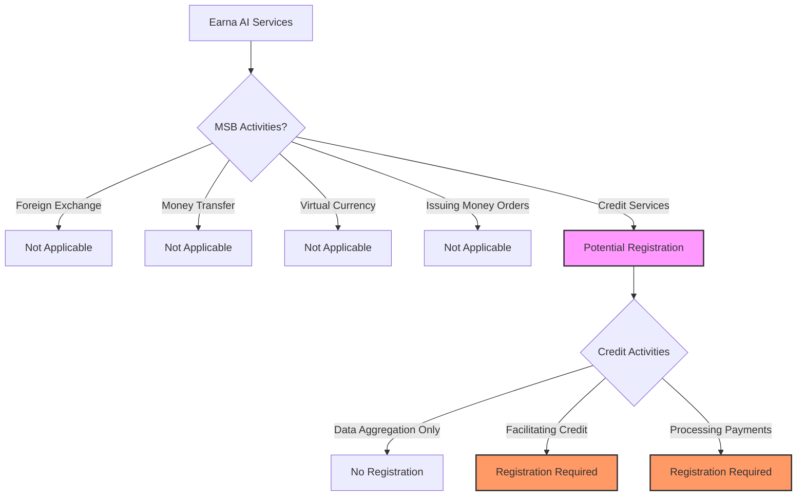
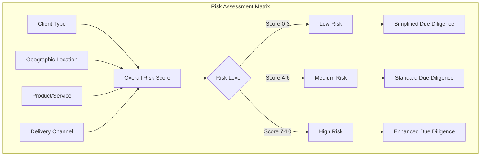
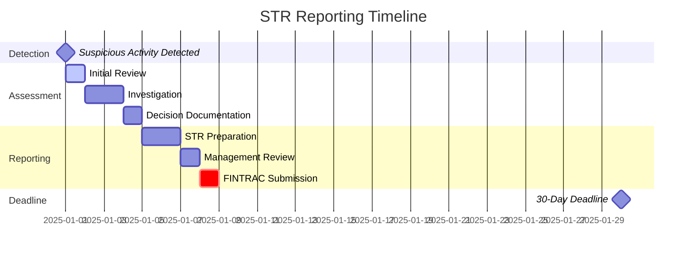
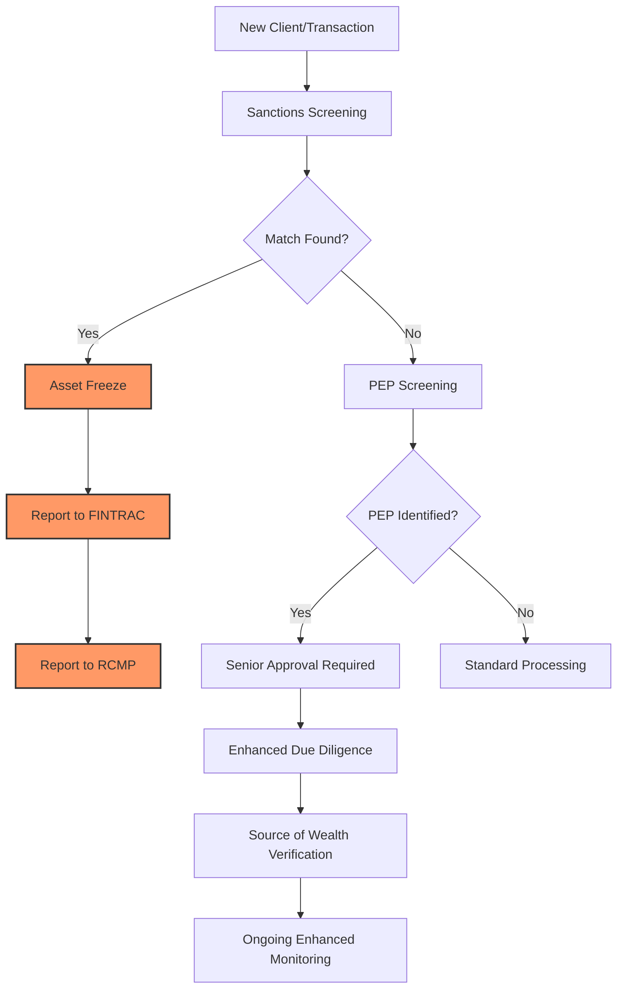

# FINTRAC Requirements

## Overview

The Financial Transactions and Reports Analysis Centre of Canada (FINTRAC) is Canada's financial intelligence unit and anti-money laundering (AML) and anti-terrorist financing (ATF) regulator. This document outlines Earna AI's requirements and compliance obligations under the Proceeds of Crime (Money Laundering) and Terrorist Financing Act (PCMLTFA).

## Business Classification

### Money Services Business (MSB) Assessment



### Current Status

Based on Earna AI's current business model:
- **Primary Activity**: Financial data aggregation and credit assessment
- **FINTRAC Registration**: Not currently required (data aggregation only)
- **Future Consideration**: Registration required if expanding to payment processing or credit facilitation

## Compliance Program Requirements

### 1. Compliance Officer

```typescript
interface ComplianceOfficer {
  appointment: {
    boardApproval: boolean
    writtenAppointment: boolean
    reportingLine: 'Board' | 'CEO'
  }
  responsibilities: [
    'Implement compliance program',
    'Report to senior management',
    'Oversee compliance policies',
    'Coordinate training programs',
    'Conduct effectiveness reviews',
    'File regulatory reports',
    'Liaise with FINTRAC'
  ]
  qualifications: {
    knowledge: 'AML/ATF regulations'
    experience: 'Financial services compliance'
    training: 'FINTRAC requirements'
    authority: 'Decision-making power'
  }
}
```

### 2. Written Compliance Policies and Procedures

#### Required Documentation

| Policy Document | Purpose | Review Frequency |
|----------------|---------|-----------------|
| Compliance Program Manual | Overall framework | Annual |
| Client Identification Procedures | KYC requirements | Annual |
| Beneficial Ownership Procedures | Ultimate ownership | Annual |
| Business Relationship Procedures | Ongoing monitoring | Annual |
| Risk Assessment Methodology | Risk-based approach | Annual |
| Suspicious Transaction Procedures | STR detection and reporting | Semi-annual |
| Record Keeping Procedures | Documentation requirements | Annual |
| Training Program | Staff education | Annual |

#### Policy Framework

```yaml
compliance_policies:
  client_identification:
    individuals:
      - Full legal name
      - Date of birth
      - Address
      - Occupation
      - Government-issued ID verification

    corporations:
      - Corporate name
      - Business number
      - Address
      - Nature of business
      - Incorporation details
      - Directors and signing authorities

    verification_methods:
      reliable_sources:
        - Government-issued photo ID
        - Credit bureau reports
        - Bank statements
        - Utility bills
        - Corporate registries

      dual_process:
        - Two different reliable sources
        - Within risk-based timeframe
        - Document all attempts

  beneficial_ownership:
    threshold: "25% ownership or control"
    requirements:
      - Identify all beneficial owners
      - Verify identity of beneficial owners
      - Determine ownership structure
      - Document control relationships

    ongoing_monitoring:
      - Annual review minimum
      - Trigger-based updates
      - Material change notifications

  record_keeping:
    retention_period: "5 years minimum"
    formats:
      - Original documents
      - Certified copies
      - Electronic records
      - Audit trail

    required_records:
      - Client identification
      - Beneficial ownership
      - Transaction records
      - Risk assessments
      - STR documentation
      - Training records
```

### 3. Risk Assessment

#### Risk-Based Approach

```typescript
class RiskAssessment {
  // Client risk factors
  assessClientRisk(client: Client): RiskLevel {
    const factors = {
      geographic: this.assessGeographicRisk(client.location),
      product: this.assessProductRisk(client.products),
      delivery: this.assessDeliveryChannelRisk(client.channel),
      client: this.assessClientTypeRisk(client.type)
    }

    return this.calculateOverallRisk(factors)
  }

  // Geographic risk assessment
  assessGeographicRisk(location: Location): RiskScore {
    const highRiskJurisdictions = [
      'Iran', 'North Korea', // FATF blacklist
      'Myanmar', 'Syria', // Enhanced monitoring
      // ... other high-risk countries
    ]

    if (highRiskJurisdictions.includes(location.country)) {
      return { score: 10, level: 'High' }
    }

    // Assess based on corruption index, AML standards
    return this.calculateGeographicScore(location)
  }

  // Enhanced due diligence triggers
  requiresEDD(client: Client): boolean {
    return (
      client.riskLevel === 'High' ||
      client.isPEP ||
      client.hasAdverseMedia ||
      client.complexStructure ||
      client.location.isHighRisk
    )
  }
}
```

#### Risk Matrix



### 4. Ongoing Training Program

#### Training Requirements

```typescript
interface TrainingProgram {
  onboarding: {
    topics: [
      'PCMLTFA overview',
      'FINTRAC requirements',
      'Company policies',
      'Red flag indicators',
      'Reporting obligations',
      'Penalties for non-compliance'
    ]
    duration: '8 hours'
    assessment: {
      required: true
      passingScore: 80
      retakePolicy: 'Mandatory within 7 days'
    }
  }

  ongoing: {
    frequency: 'Annual'
    topics: [
      'Regulatory updates',
      'Policy changes',
      'Case studies',
      'Emerging threats',
      'Technology updates',
      'Best practices'
    ]
    delivery: [
      'In-person sessions',
      'E-learning modules',
      'Webinars',
      'Self-study materials'
    ]
  }

  roleSpecific: {
    frontLine: [
      'Customer identification',
      'Transaction monitoring',
      'Suspicious activity detection'
    ]
    compliance: [
      'Regulatory reporting',
      'Risk assessment',
      'Policy implementation'
    ]
    management: [
      'Oversight responsibilities',
      'Escalation procedures',
      'Board reporting'
    ]
  }
}
```

### 5. Effectiveness Review

#### Two-Year Review Cycle

```yaml
effectiveness_review:
  frequency: "Every two years"

  scope:
    policies_procedures:
      - Adequacy assessment
      - Implementation effectiveness
      - Compliance with regulations
      - Industry best practices

    risk_assessment:
      - Methodology validity
      - Risk rating accuracy
      - Mitigation effectiveness
      - Emerging risks coverage

    training_program:
      - Content relevance
      - Delivery effectiveness
      - Knowledge retention
      - Behavioral change

    technology_systems:
      - Detection capabilities
      - False positive rates
      - System integration
      - Data quality

  methodology:
    testing:
      - Transaction sampling
      - File reviews
      - Staff interviews
      - System walkthroughs

    metrics:
      - KYC completion rates
      - STR quality scores
      - Training completion
      - Audit findings

    benchmarking:
      - Industry standards
      - Regulatory expectations
      - Peer comparisons
      - Best practices

  documentation:
    - Review plan
    - Testing procedures
    - Findings report
    - Remediation plan
    - Board presentation
```

## Reporting Obligations

### Suspicious Transaction Reports (STRs)

#### Detection and Reporting Process

```typescript
class STRProcessor {
  async processTransaction(transaction: Transaction): Promise<STRResult> {
    // Step 1: Detection
    const alerts = await this.detectSuspiciousActivity(transaction)

    if (alerts.length === 0) {
      return { required: false }
    }

    // Step 2: Investigation
    const investigation = await this.investigate(transaction, alerts)

    // Step 3: Decision
    if (this.hasReasonableGrounds(investigation)) {
      // Step 4: Report
      const str = await this.createSTR({
        transaction,
        alerts,
        investigation,
        narrative: this.generateNarrative(investigation)
      })

      // Step 5: File with FINTRAC
      await this.fileWithFINTRAC(str)

      // Step 6: Document
      await this.documentDecision(str)

      return {
        required: true,
        reportId: str.id,
        filedDate: str.filedDate
      }
    }

    // Document decision not to file
    await this.documentNoFileDecision(investigation)

    return { required: false, documented: true }
  }

  // Reasonable grounds indicators
  hasReasonableGrounds(investigation: Investigation): boolean {
    return (
      investigation.hasStructuring ||
      investigation.hasUnusualPattern ||
      investigation.hasNoEconomicPurpose ||
      investigation.matchesThreatIndicators ||
      investigation.involvesSanctionedParty
    )
  }
}
```

#### STR Timeline Requirements



### Large Cash Transaction Reports

```yaml
large_cash_transactions:
  threshold: "$10,000 CAD"

  reporting_requirement:
    single_transaction: "≥ $10,000"
    multiple_transactions: "24-hour rule"

  information_required:
    transaction_details:
      - Date and time
      - Amount
      - Currency
      - Purpose
      - Method (cash in/out)

    client_information:
      - Full name
      - Address
      - Date of birth
      - Occupation
      - ID verification

    third_party:
      - Name
      - Address
      - Relationship
      - Beneficial ownership

  timeline: "Within 15 days"
  submission: "FINTRAC F2R system"
```

### Electronic Funds Transfer Reports

```yaml
electronic_funds_transfers:
  threshold: "$10,000 CAD"

  types:
    outgoing_eft:
      - International transfers
      - Domestic transfers ≥ $10,000

    incoming_eft:
      - International transfers
      - Domestic transfers ≥ $10,000

  required_information:
    sender:
      - Name and address
      - Account details
      - Reference number

    recipient:
      - Name and address
      - Account details
      - Financial institution

    transaction:
      - Amount
      - Currency
      - Date
      - Purpose

  timeline: "Within 5 business days"
```

## Sanctions and PEP Screening

### Screening Requirements

```typescript
interface ScreeningProgram {
  sanctions: {
    lists: [
      'OSFI Consolidated List',
      'UN Security Council',
      'OFAC SDN List',
      'EU Consolidated List',
      'UK HM Treasury'
    ]
    frequency: 'Real-time and daily batch'
    actions: {
      match: 'Freeze assets immediately'
      potentialMatch: 'Investigate within 24 hours'
      reporting: 'Report to FINTRAC and RCMP'
    }
  }

  pep: {
    definition: {
      domestic: 'Canadian political figures'
      foreign: 'Foreign political figures'
      international: 'International organization heads'
      family: 'Family members of PEPs'
      associates: 'Close associates of PEPs'
    }
    screening: {
      onboarding: 'Mandatory'
      periodic: 'Annual minimum'
      transactionBased: 'High-value transactions'
    }
    measures: {
      seniorApproval: 'Required for relationship'
      sourceOfWealth: 'Documented verification'
      enhancedMonitoring: 'Ongoing'
    }
  }
}
```

### Screening Process Flow



## Record Keeping Requirements

### Retention Periods

| Record Type | Retention Period | Format |
|------------|------------------|--------|
| Client identification | 5 years after last transaction | Original or certified copy |
| Beneficial ownership | 5 years after last transaction | Electronic or paper |
| Transaction records | 5 years from transaction date | Electronic preferred |
| STR documentation | 5 years from filing | Secure electronic |
| Risk assessments | 5 years from assessment | Electronic |
| Training records | 5 years from training | Electronic |
| Correspondence | 5 years from date | Electronic |

### Record Management System

```typescript
class RecordManagement {
  // Record creation
  async createRecord(data: RecordData): Promise<Record> {
    const record = {
      id: generateUUID(),
      type: data.type,
      content: await this.encrypt(data.content),
      createdAt: new Date(),
      createdBy: getCurrentUser(),
      retentionDate: this.calculateRetention(data.type),
      metadata: {
        client: data.clientId,
        transaction: data.transactionId,
        checksum: this.generateChecksum(data.content)
      }
    }

    await this.store(record)
    await this.createAuditLog(record)

    return record
  }

  // Retention management
  async manageRetention(): Promise<void> {
    const expiredRecords = await this.getExpiredRecords()

    for (const record of expiredRecords) {
      // Verify no active holds
      if (!await this.hasLegalHold(record)) {
        await this.secureDelete(record)
        await this.logDeletion(record)
      }
    }
  }

  // Retrieval for regulators
  async retrieveForRegulator(request: RegulatoryRequest): Promise<RecordSet> {
    const records = await this.searchRecords(request.criteria)

    return {
      records: await this.decrypt(records),
      metadata: this.generateMetadata(records),
      attestation: this.generateAttestation(records)
    }
  }
}
```

## Penalties for Non-Compliance

### Administrative Monetary Penalties (AMPs)

```yaml
penalty_structure:
  minor_violations:
    first_offense: "Up to $1,000"
    subsequent: "Up to $100,000"
    examples:
      - Late report filing
      - Minor record keeping gaps
      - Training documentation issues

  serious_violations:
    first_offense: "Up to $100,000"
    subsequent: "Up to $500,000"
    examples:
      - Failure to report STR
      - No compliance program
      - Systematic KYC failures

  very_serious_violations:
    first_offense: "Up to $500,000"
    subsequent: "Up to $1,000,000"
    examples:
      - Willful non-compliance
      - Obstruction of examination
      - False reporting
```

### Criminal Penalties

```yaml
criminal_offenses:
  money_laundering:
    penalty: "Up to 10 years imprisonment"
    fine: "Up to $1,000,000"

  terrorist_financing:
    penalty: "Up to 10 years imprisonment"
    fine: "Unlimited"

  failure_to_report:
    penalty: "Up to 5 years imprisonment"
    fine: "Up to $2,000,000"

  disclosure_of_str:
    penalty: "Up to 2 years imprisonment"
    fine: "Up to $5,000"
```

## Compliance Monitoring Dashboard

```typescript
interface ComplianceDashboard {
  realTimeMonitoring: {
    transactionAlerts: Alert[]
    sanctionsMatches: Match[]
    pepIdentifications: PEP[]
    systemHealth: HealthStatus
  }

  kpiMetrics: {
    kycCompletionRate: number      // Target: 100%
    strFilingTimeliness: number    // Target: 100% within 30 days
    trainingCompletion: number      // Target: 100%
    auditFindings: Finding[]        // Target: 0 critical
    falsePositiveRate: number      // Target: < 20%
  }

  regulatoryCalendar: {
    upcomingDeadlines: Deadline[]
    scheduledReviews: Review[]
    trainingSchedule: Training[]
    auditSchedule: Audit[]
  }

  riskIndicators: {
    highRiskClients: number
    dormantAccounts: number
    unusualPatterns: Pattern[]
    geographicExposure: GeoRisk[]
  }
}
```

## Implementation Checklist

### Phase 1: Foundation (Month 1-2)
- [ ] Appoint Compliance Officer
- [ ] Develop written policies and procedures
- [ ] Establish risk assessment methodology
- [ ] Set up record keeping system

### Phase 2: Systems (Month 2-3)
- [ ] Implement KYC/KYB procedures
- [ ] Deploy sanctions screening
- [ ] Configure transaction monitoring
- [ ] Establish reporting mechanisms

### Phase 3: Operations (Month 3-4)
- [ ] Conduct staff training
- [ ] Perform initial risk assessments
- [ ] Test detection systems
- [ ] Document all processes

### Phase 4: Review (Month 4-6)
- [ ] Conduct internal audit
- [ ] Perform effectiveness review
- [ ] Address identified gaps
- [ ] Prepare for regulatory examination

## Resources and Support

### FINTRAC Resources
- [FINTRAC Guidance](https://www.fintrac-canafe.gc.ca/guidance-directives/overview-apercu/1-eng)
- [Compliance Assessment Tool](https://www.fintrac-canafe.gc.ca/guidance-directives/compliance-conformite/1-eng)
- [F2R Reporting System](https://www10.fintrac-canafe.gc.ca/f2r/)

### Contact Information
- **FINTRAC National Call Centre**: 1-866-346-8722
- **Email**: guidelines-lignesdirectrices@fintrac-canafe.gc.ca
- **Regional Offices**: [Contact List](https://www.fintrac-canafe.gc.ca/contact-contactez/1-eng)

### Industry Associations
- **ACAMS Canada**: Professional development and certification
- **CAMS Certification**: Certified Anti-Money Laundering Specialist
- **ICA Compliance**: International Compliance Association

## Next Steps

1. Review [Provincial License Requirements](/compliance/provincial-licenses)
2. Implement [AML/KYC Procedures](/compliance/aml-kyc)
3. Configure [Data Privacy Controls](/compliance/data-privacy)
4. Establish [Record Keeping System](/compliance/record-keeping)
