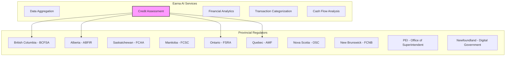
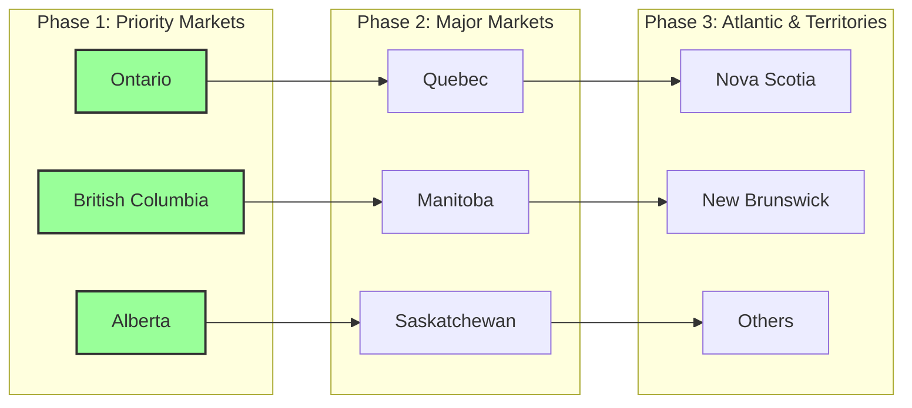

# Provincial Licenses

## Overview

Each Canadian province and territory has its own financial services regulatory framework. This document outlines the licensing requirements for Earna AI to operate legally across Canada, based on our services of financial data aggregation, credit assessment, and financial analytics.

## Service Classification by Province



## British Columbia

### Regulator: BC Financial Services Authority (BCFSA)

```yaml
regulator:
  name: "BC Financial Services Authority"
  website: "https://www.bcfsa.ca"
  contact: "604-660-3555"
  email: "info@bcfsa.ca"

licensing_requirements:
  credit_services:
    applicable: true
    legislation: "Business Practices and Consumer Protection Act"
    license_type: "Credit Services License"

    triggers:
      - "Providing credit reports"
      - "Credit counselling services"
      - "Debt pooling or consolidation"
      - "Credit repair services"

    exemptions:
      - "Pure data aggregation"
      - "Financial education only"
      - "No credit arrangement facilitation"

  money_services:
    applicable: false
    reason: "Not handling client funds"

  mortgage_broker:
    applicable: false
    reason: "Not arranging mortgages"
```

### BC Application Process

```typescript
interface BCLicenseApplication {
  requirements: {
    corporate: {
      bcRegistration: 'Required'
      registeredOffice: 'BC address required'
      extraProvincialRegistration: 'If incorporated elsewhere'
    }

    financial: {
      securityBond: 50000  // CAD
      financialStatements: 'Audited preferred'
      businessPlan: 'Required'
      projections: '3 years'
    }

    personnel: {
      criminelRecordChecks: 'All directors and officers'
      competencyRequirements: 'Industry experience'
      designatedIndividual: 'BC resident required'
    }

    operational: {
      trustAccount: 'If handling client funds'
      complaintsProcess: 'Documented procedure'
      privacyPolicy: 'PIPA compliant'
      businessPremises: 'Physical location in BC'
    }
  }

  timeline: {
    processing: '6-8 weeks'
    renewal: 'Annual'
    reportingFrequency: 'Annual'
  }

  costs: {
    applicationFee: 500
    annualFee: 1500
    securityBond: 50000
  }
}
```

### BC Compliance Requirements

```yaml
ongoing_compliance:
  record_keeping:
    - Client agreements
    - Transaction records
    - Complaint register
    - Trust account records
    retention: "7 years"

  reporting:
    annual_report:
      deadline: "Within 90 days of fiscal year end"
      contents:
        - Financial statements
        - Business activities summary
        - Complaint statistics
        - Material changes

    change_notifications:
      - Directors/officers changes
      - Business address changes
      - Control changes
      - Material business changes
      timeline: "Within 10 days"

  consumer_protection:
    disclosures:
      - Service fees
      - Cancellation rights
      - Complaint process
      - Privacy policy

    prohibited_practices:
      - Misleading representations
      - Unconscionable acts
      - Tied selling
      - Unfair practices
```

## Alberta

### Regulator: Alberta Financial and Insurance Regulator (ABFIR)

```yaml
regulator:
  name: "Alberta Financial and Insurance Regulator"
  website: "https://www.abfir.ca"
  contact: "780-427-8322"
  email: "info@abfir.ca"

licensing_requirements:
  designated_business:
    applicable: "Potentially"
    legislation: "Consumer Protection Act"
    license_type: "Designated Business License"

    triggers:
      - "Credit repair services"
      - "Debt repayment services"
      - "Credit counselling (for fee)"

    exemptions:
      - "Information services only"
      - "No debt management"
      - "No credit repair claims"

  loan_broker:
    applicable: false
    reason: "Not arranging loans"
```

### Alberta Application Process

```typescript
interface AlbertaLicenseApplication {
  requirements: {
    corporate: {
      albertaRegistration: 'Extra-provincial or Alberta corp'
      registeredOffice: 'Alberta address'
      businessLicense: 'Municipal license required'
    }

    financial: {
      securityDeposit: 25000  // CAD minimum
      financialStatements: 'Recent statements'
      insuranceRequirements: {
        generalLiability: 2000000
        errorsOmissions: 1000000
      }
    }

    personnel: {
      designatedManager: 'Alberta resident'
      trainingRequirements: 'Industry knowledge'
      backgroundChecks: 'All key personnel'
    }
  }

  process: {
    steps: [
      'Pre-application consultation',
      'Submit application',
      'Background investigations',
      'Compliance review',
      'License issuance'
    ]
    timeline: '4-6 weeks'
  }

  costs: {
    applicationFee: 750
    annualLicense: 2000
    securityDeposit: 25000
  }
}
```

## Saskatchewan

### Regulator: Financial and Consumer Affairs Authority (FCAA)

```yaml
regulator:
  name: "Financial and Consumer Affairs Authority"
  website: "https://www.fcaa.gov.sk.ca"
  contact: "306-787-5645"

licensing_requirements:
  credit_reporting:
    applicable: "Review required"
    legislation: "Credit Reporting Act"
    considerations:
      - "Data aggregation may not require license"
      - "Credit scoring may require registration"

  consumer_protection:
    legislation: "Consumer Protection Act"
    registration: "May be required for certain services"
```

## Manitoba

### Regulator: Financial and Consumer Services Commission (FCSC)

```yaml
regulator:
  name: "Manitoba Financial Services Agency"
  website: "https://mbfinancial.ca"
  contact: "204-945-2542"

licensing_requirements:
  credit_services:
    applicable: "Case-by-case"
    legislation: "Consumer Protection Act"
    review_factors:
      - Service offerings
      - Fee structure
      - Marketing claims
      - Consumer interaction
```

## Ontario

### Regulator: Financial Services Regulatory Authority (FSRA)

```yaml
regulator:
  name: "Financial Services Regulatory Authority of Ontario"
  website: "https://www.fsrao.ca"
  contact: "416-250-7250"
  email: "contactcentre@fsrao.ca"

licensing_requirements:
  mortgage_brokering:
    applicable: false
    reason: "Not arranging mortgages"

  credit_unions:
    applicable: false
    reason: "Not a deposit-taking institution"

  loan_and_trust:
    applicable: false
    reason: "Not providing loans or trust services"

  collection_agency:
    applicable: false
    reason: "Not collecting debts"
```

### Ontario Consumer Protection

```typescript
interface OntarioCompliance {
  consumerProtection: {
    legislation: 'Consumer Protection Act, 2002'
    requirements: {
      contracts: {
        writtenAgreements: 'Required for services > $50'
        coolingOffPeriod: '10 days for certain services'
        disclosures: [
          'Total cost',
          'Payment terms',
          'Cancellation rights',
          'Service description'
        ]
      }

      prohibitions: [
        'Unfair practices',
        'False representations',
        'Unconscionable representations',
        'Renegotiation of agreements'
      ]

      advertising: {
        truthfulness: 'All claims must be substantiated'
        clarity: 'Clear and comprehensible'
        disclosures: 'Material terms disclosed'
      }
    }
  }

  privacy: {
    legislation: 'Personal Information Protection and Electronic Documents Act'
    requirements: [
      'Privacy policy',
      'Consent for collection',
      'Purpose limitation',
      'Data security'
    ]
  }
}
```

## Quebec

### Regulator: Autorité des marchés financiers (AMF)

```yaml
regulator:
  name: "Autorité des marchés financiers"
  website: "https://lautorite.qc.ca"
  contact: "1-877-525-0337"
  email: "information@lautorite.qc.ca"

licensing_requirements:
  money_services:
    applicable: "If offering payment services"
    legislation: "Money-Services Businesses Act"
    license: "Money-services business license"

    triggers:
      - "Currency exchange"
      - "Funds transfer"
      - "Check cashing"
      - "Issuing/redeeming payment instruments"

  credit_assessment:
    applicable: "Potentially"
    legislation: "Act respecting the distribution of financial products and services"
    review_required: "Case-by-case basis"

  consumer_credit:
    legislation: "Consumer Protection Act"
    permits_required:
      - "If extending credit"
      - "If credit brokering"
```

### Quebec Language Requirements

```typescript
interface QuebecLanguageCompliance {
  charter: 'Charter of the French Language (Bill 101)'

  requirements: {
    documentation: {
      contracts: 'Must be in French'
      customerCommunications: 'French required'
      website: 'French version mandatory'
      advertising: 'French predominant'
    }

    exceptions: {
      expressRequest: 'Customer can request English'
      documentation: 'Must still provide French'
    }

    enforcement: {
      agency: 'Office québécois de la langue française'
      penalties: 'Up to $20,000 per violation'
    }
  }

  implementation: {
    priority: 'High - before Quebec launch'
    timeline: 'Complete French translation required'
    resources: [
      'Certified translators',
      'Legal review in French',
      'Bilingual customer service'
    ]
  }
}
```

## Atlantic Provinces

### Nova Scotia

```yaml
regulator:
  name: "Nova Scotia Securities Commission"
  website: "https://nssc.novascotia.ca"
  contact: "902-424-7768"

requirements:
  credit_services:
    legislation: "Consumer Protection Act"
    licensing: "Review required based on services"

  collection_agency:
    applicable: false
    reason: "Not collecting debts"
```

### New Brunswick

```yaml
regulator:
  name: "Financial and Consumer Services Commission"
  website: "https://www.fcnb.ca"
  contact: "1-866-933-2222"

requirements:
  consumer_credit:
    legislation: "Cost of Credit Disclosure Act"
    compliance: "Disclosure requirements if extending credit"

  collection_agency:
    applicable: false
    reason: "Not collecting debts"
```

### Prince Edward Island

```yaml
regulator:
  name: "Office of the Superintendent of Insurance"
  contact: "902-368-4550"

requirements:
  consumer_protection:
    legislation: "Business Practices Act"
    registration: "May be required"
    review: "Case-by-case basis"
```

### Newfoundland and Labrador

```yaml
regulator:
  name: "Digital Government and Service NL"
  website: "https://www.gov.nl.ca/dgsnl/"
  contact: "709-729-2946"

requirements:
  consumer_protection:
    legislation: "Consumer Protection and Business Practices Act"
    licensing: "Review required"
    factors:
      - Service type
      - Consumer interaction
      - Fee structure
```

## Territories

### Northwest Territories, Yukon, and Nunavut

```yaml
territories:
  northwest_territories:
    regulator: "Department of Municipal and Community Affairs"
    legislation: "Consumer Protection Act"
    licensing: "Business license required"

  yukon:
    regulator: "Department of Community Services"
    legislation: "Consumers Protection Act"
    requirements: "Business registration"

  nunavut:
    regulator: "Department of Community and Government Services"
    requirements: "Business license"
```

## Multi-Provincial Operations

### Passport System

```typescript
interface PassportSystem {
  overview: {
    purpose: 'Simplified multi-provincial licensing'
    availability: 'Limited for certain sectors'
    coordination: 'Through Canadian Securities Administrators'
  }

  applicability: {
    securities: 'Yes - through CSA'
    insurance: 'Yes - through CCIR'
    creditServices: 'No - individual provincial licenses'
    moneyServices: 'No - individual requirements'
  }

  strategy: {
    primaryJurisdiction: 'Establish in one province first'
    expansion: 'Sequential provincial applications'
    harmonization: 'Leverage similar requirements'
  }
}
```

### Compliance Strategy



## License Application Tracker

```typescript
class LicenseTracker {
  provinces = {
    BC: {
      status: 'Not Started',
      regulator: 'BCFSA',
      licenseType: 'Credit Services',
      priority: 'High',
      estimatedTimeline: '6-8 weeks',
      requirements: {
        application: false,
        financials: false,
        securityBond: false,
        backgroundChecks: false,
        businessPlan: false
      }
    },

    AB: {
      status: 'Not Started',
      regulator: 'ABFIR',
      licenseType: 'Designated Business',
      priority: 'High',
      estimatedTimeline: '4-6 weeks',
      requirements: {
        application: false,
        financials: false,
        securityDeposit: false,
        insurance: false,
        backgroundChecks: false
      }
    },

    ON: {
      status: 'Analysis',
      regulator: 'FSRA',
      licenseType: 'None Required',
      priority: 'High',
      notes: 'Consumer Protection Act compliance only'
    },

    QC: {
      status: 'Not Started',
      regulator: 'AMF',
      licenseType: 'TBD',
      priority: 'Medium',
      specialRequirements: ['French language compliance'],
      estimatedTimeline: '8-12 weeks'
    }
  }

  getTotalCosts(): CostSummary {
    return {
      applicationFees: 3500,
      annualFees: 8500,
      securityDeposits: 75000,
      insurance: 3000000,
      legalFees: 25000,  // Estimated
      translationFees: 15000  // Quebec
    }
  }

  getTimeline(): Timeline {
    return {
      phase1: '3 months',  // ON, BC, AB
      phase2: '6 months',  // QC, MB, SK
      phase3: '9 months',  // Atlantic & Territories
      total: '9-12 months for full coverage'
    }
  }
}
```

## Compliance Maintenance

### Annual Requirements by Province

| Province | Annual Report | Fee Payment | Renewal | Audits |
|----------|--------------|-------------|---------|--------|
| BC | Yes - 90 days | Annual | Annual | Possible |
| AB | Yes - 60 days | Annual | Annual | Random |
| SK | If required | Annual | Annual | As needed |
| MB | If required | Annual | Annual | As needed |
| ON | N/A | N/A | N/A | Consumer complaints |
| QC | Yes | Annual | Variable | Regular |
| NS | If required | Annual | Annual | As needed |
| NB | If required | Annual | Annual | As needed |

### Change Management

```yaml
material_changes:
  notify_immediately:
    - Control changes
    - Cease operations
    - Bankruptcy/insolvency
    - Criminal charges

  notify_within_10_days:
    - Director/officer changes
    - Address changes
    - Business model changes
    - Name changes

  notify_within_30_days:
    - Policy changes
    - System changes
    - Partnership changes
    - Service modifications
```

## Risk Assessment by Province

```typescript
interface ProvincialRiskAssessment {
  high_risk: {
    provinces: ['QC', 'BC'],
    factors: [
      'Complex regulatory requirements',
      'Active enforcement',
      'High penalties',
      'Language requirements (QC)'
    ]
  }

  medium_risk: {
    provinces: ['AB', 'MB', 'SK'],
    factors: [
      'Moderate regulatory framework',
      'Standard enforcement',
      'Clear requirements'
    ]
  }

  low_risk: {
    provinces: ['ON', 'Atlantic provinces', 'Territories'],
    factors: [
      'Limited licensing requirements',
      'Consumer protection focus',
      'Complaint-driven enforcement'
    ]
  }
}
```

## Implementation Roadmap

### Phase 1: Foundation (Months 1-3)
- [ ] Complete regulatory analysis for all provinces
- [ ] Engage legal counsel in key provinces
- [ ] Prepare base documentation package
- [ ] Establish corporate structure

### Phase 2: Priority Provinces (Months 3-6)
- [ ] Submit BC application
- [ ] Submit Alberta application
- [ ] Ensure Ontario compliance
- [ ] Begin Quebec preparation

### Phase 3: Expansion (Months 6-9)
- [ ] Submit Quebec application (with French docs)
- [ ] Apply in Manitoba and Saskatchewan
- [ ] Assess Atlantic provinces

### Phase 4: Maintenance (Ongoing)
- [ ] Annual renewals
- [ ] Compliance reporting
- [ ] Regulatory updates
- [ ] Change notifications

## Legal Resources

### Law Firms Specializing in Financial Services

| Province | Recommended Firms | Expertise |
|----------|------------------|-----------|
| BC | Fasken, Blake Cassels | Financial services licensing |
| AB | Bennett Jones, Osler | Regulatory compliance |
| ON | McCarthy Tétrault, Torys | Financial regulation |
| QC | Stikeman Elliott, Davies | AMF regulations, French requirements |

### Regulatory Consultants

- **MNP LLP**: National coverage, licensing support
- **PwC Canada**: Regulatory compliance advisory
- **Deloitte**: Financial services regulatory
- **KPMG**: Licensing and compliance

## Cost Summary

```yaml
total_estimated_costs:
  year_1:
    application_fees: $10,000
    legal_fees: $50,000
    security_deposits: $75,000
    insurance: $30,000
    translation: $15,000
    consulting: $25,000
    total: $205,000

  annual_ongoing:
    license_renewals: $15,000
    reporting_costs: $10,000
    compliance_monitoring: $20,000
    legal_updates: $10,000
    total: $55,000
```

## Next Steps

1. Prioritize provinces based on market opportunity
2. Engage local legal counsel in priority provinces
3. Prepare standardized documentation package
4. Begin with Ontario operations (least restrictive)
5. Apply for BC and Alberta licenses
6. Prepare Quebec French documentation
7. Monitor regulatory changes and updates

## References

- [BCFSA Credit Services](https://www.bcfsa.ca/industry-resources/credit-services)
- [ABFIR Designated Businesses](https://www.abfir.ca/designated-businesses)
- [FSRA Ontario](https://www.fsrao.ca)
- [AMF Quebec](https://lautorite.qc.ca/en/general-public)
- [FCNB New Brunswick](https://www.fcnb.ca)
- [FCAA Saskatchewan](https://www.fcaa.gov.sk.ca)
