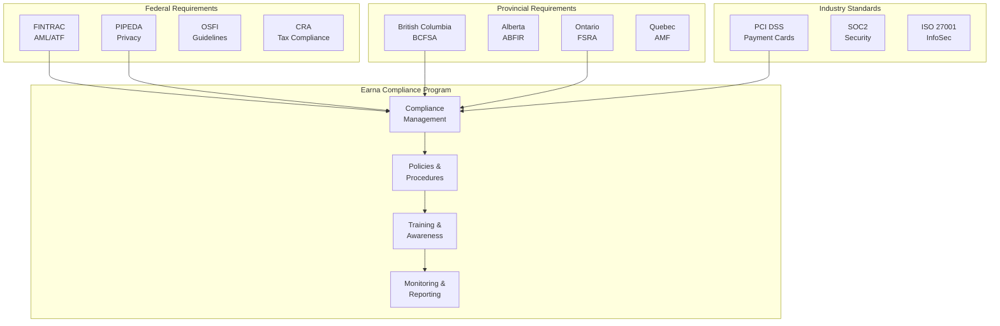
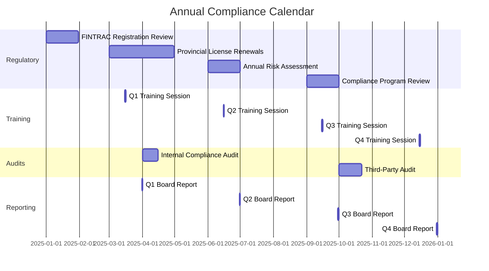

# Compliance Overview

## Introduction

Earna AI operates in the Canadian financial services sector, requiring compliance with federal and provincial regulations for financial technology services, anti-money laundering (AML), know your customer (KYC), and data privacy requirements.

## Regulatory Landscape



## Business Model Classification

### Service Description

Earna AI provides:
- **Financial data aggregation** via Plaid integration
- **Credit assessment tools** using AI/ML models
- **Financial analytics** for individuals and businesses
- **Transaction categorization** and insights
- **Cash flow analysis** and predictions

### Regulatory Classification

Based on our services, Earna AI is classified as:

| Jurisdiction | Classification | Requirement |
|--------------|---------------|-------------|
| Federal (FINTRAC) | Money Services Business (MSB) | Registration required if handling funds |
| British Columbia | Credit Services Provider | License may be required |
| Alberta | Designated Business | Registration for specific activities |
| Ontario | Financial Services Provider | Compliance with FSRA guidelines |
| Quebec | Financial Services | AMF authorization if required |

## Compliance Framework

### Governance Structure

```typescript
interface ComplianceGovernance {
  leadership: {
    chiefComplianceOfficer: {
      name: 'TBD'
      reportsTo: 'CEO'
      responsibilities: [
        'Regulatory compliance oversight',
        'Policy development and maintenance',
        'Regulatory relationship management',
        'Compliance risk assessment'
      ]
    }
    complianceCommittee: {
      members: ['CEO', 'CCO', 'CFO', 'Legal Counsel']
      meetingFrequency: 'Monthly'
      responsibilities: [
        'Review compliance metrics',
        'Approve policy changes',
        'Oversee remediation efforts',
        'Review regulatory changes'
      ]
    }
  }
  reporting: {
    board: 'Quarterly compliance report'
    regulators: 'As required by regulation'
    internal: 'Monthly dashboards'
  }
}
```

### Compliance Program Components

#### 1. Risk Assessment

```yaml
risk_assessment:
  frequency: "Annual + significant changes"
  methodology: "COSO Framework"

  categories:
    regulatory_risk:
      - FINTRAC non-compliance
      - Provincial licensing gaps
      - Privacy breaches
      - Consumer protection violations

    operational_risk:
      - KYC/AML failures
      - Data quality issues
      - Third-party compliance
      - System failures

    reputational_risk:
      - Regulatory sanctions
      - Media coverage
      - Customer complaints
      - Partner concerns

  risk_matrix:
    high_impact_high_probability:
      - "Immediate remediation required"
      - "Board notification"
      - "Regulatory disclosure if required"

    high_impact_low_probability:
      - "Mitigation plan required"
      - "Quarterly monitoring"
      - "Insurance consideration"
```

#### 2. Policies and Procedures

| Policy | Purpose | Review Frequency |
|--------|---------|------------------|
| AML/ATF Policy | FINTRAC compliance | Annual |
| KYC Procedures | Customer identification | Annual |
| Privacy Policy | PIPEDA compliance | Annual |
| Data Retention | Record keeping requirements | Annual |
| Suspicious Transaction Reporting | STR procedures | Semi-annual |
| Compliance Training | Employee education | Annual |
| Third-Party Management | Vendor compliance | Annual |
| Incident Response | Breach procedures | Semi-annual |

#### 3. Training Program

```typescript
interface ComplianceTraining {
  onboarding: {
    topics: [
      'Regulatory overview',
      'AML/KYC basics',
      'Privacy requirements',
      'Reporting obligations',
      'Red flags identification'
    ]
    duration: '4 hours'
    testing: true
    passingScore: 80
  }
  annual: {
    topics: [
      'Regulatory updates',
      'Policy changes',
      'Case studies',
      'Incident review',
      'Best practices'
    ]
    duration: '2 hours'
    testing: true
    passingScore: 80
  }
  roleSpecific: {
    customerFacing: [
      'KYC procedures',
      'Suspicious activity detection',
      'Customer privacy'
    ]
    technical: [
      'Data protection',
      'System security',
      'Audit logging'
    ]
    management: [
      'Oversight responsibilities',
      'Reporting requirements',
      'Risk management'
    ]
  }
}
```

## Key Compliance Requirements

### FINTRAC Requirements

- **Registration**: Required if qualifying as MSB
- **Compliance Program**: Documented policies and procedures
- **Compliance Officer**: Appointed with defined responsibilities
- **Risk Assessment**: Regular assessment of ML/TF risks
- **Training**: Ongoing training for relevant staff
- **Effectiveness Review**: Two-year review cycle

### Provincial Requirements

#### British Columbia (BCFSA)
- Business license for financial services
- Consumer protection compliance
- Disclosure requirements
- Fair business practices

#### Alberta (ABFIR)
- Registration if providing regulated services
- Consumer protection standards
- Complaint handling procedures

#### Ontario (FSRA)
- Compliance with financial services regulations
- Consumer protection requirements
- Fair treatment of customers

#### Quebec (AMF)
- Authorization for financial services
- French language requirements
- Consumer protection standards
- Privacy requirements (in addition to PIPEDA)

### Data Privacy (PIPEDA)

- **Consent**: Obtain consent for data collection
- **Purpose Limitation**: Use data only for stated purposes
- **Data Minimization**: Collect only necessary data
- **Retention Limits**: Keep data only as long as needed
- **Security Safeguards**: Protect personal information
- **Access Rights**: Provide access to personal data
- **Correction Rights**: Allow correction of errors
- **Breach Notification**: Report breaches to Privacy Commissioner

## Compliance Monitoring

### Key Performance Indicators

```typescript
interface ComplianceKPIs {
  regulatory: {
    filedReports: number           // Target: 100% on time
    regulatoryFindings: number      // Target: 0 critical
    licenseStatus: 'Active' | 'Pending' | 'Expired'
    lastAudit: Date
  }
  operational: {
    kycCompletionRate: number      // Target: 100%
    kycReviewBacklog: number       // Target: < 10
    suspiciousTransactions: number  // Track and report
    trainingCompletion: number      // Target: 100%
  }
  quality: {
    falsePositives: number         // Target: < 10%
    customerComplaints: number     // Target: < 5/month
    dataBreaches: number           // Target: 0
    privacyIncidents: number       // Target: 0
  }
}
```

### Compliance Dashboard

```yaml
dashboard:
  real_time_monitoring:
    - Transaction monitoring alerts
    - KYC verification queue
    - Sanctions screening results
    - System availability

  daily_reports:
    - New customer onboarding
    - High-risk transactions
    - Failed KYC attempts
    - System errors

  weekly_reports:
    - Compliance metrics summary
    - Training completion status
    - Policy violations
    - Regulatory updates

  monthly_reports:
    - Risk assessment update
    - Compliance scorecard
    - Incident summary
    - Regulatory filing status
```

## Regulatory Reporting

### FINTRAC Reporting

| Report Type | Trigger | Timeline | Method |
|-------------|---------|----------|--------|
| Suspicious Transaction (STR) | Reasonable grounds to suspect ML/TF | Within 30 days | F2R system |
| Large Cash Transaction | Cash ≥ $10,000 | Within 15 days | F2R system |
| Electronic Funds Transfer | EFT ≥ $10,000 | Within 5 days | F2R system |
| Terrorist Property | Immediate knowledge | Immediately | F2R system |

### Provincial Reporting

| Province | Report Type | Frequency | Recipient |
|----------|-------------|-----------|-----------|
| BC | Annual Return | Annual | BCFSA |
| AB | Compliance Report | As required | ABFIR |
| ON | Information Return | Annual | FSRA |
| QC | Activity Report | Annual | AMF |

## Compliance Technology

### Automated Compliance Tools

```typescript
class ComplianceAutomation {
  // KYC automation
  async performKYC(customer: Customer): Promise<KYCResult> {
    const checks = await Promise.all([
      this.verifyIdentity(customer),
      this.checkSanctions(customer),
      this.checkPEP(customer),
      this.checkAdverseMedia(customer),
      this.assessRisk(customer)
    ])

    return {
      status: this.determineStatus(checks),
      riskScore: this.calculateRiskScore(checks),
      requiredActions: this.getRequiredActions(checks)
    }
  }

  // Transaction monitoring
  async monitorTransaction(transaction: Transaction): Promise<MonitoringResult> {
    const alerts = []

    // Pattern detection
    if (await this.detectStructuring(transaction)) {
      alerts.push({ type: 'structuring', severity: 'high' })
    }

    if (await this.detectVelocity(transaction)) {
      alerts.push({ type: 'velocity', severity: 'medium' })
    }

    if (await this.detectGeographicRisk(transaction)) {
      alerts.push({ type: 'geographic', severity: 'high' })
    }

    return {
      alerts,
      requiresReview: alerts.length > 0,
      autoEscalate: alerts.some(a => a.severity === 'high')
    }
  }
}
```

## Compliance Calendar



## Incident Management

### Compliance Incident Response

```yaml
incident_response:
  classification:
    critical:
      - Regulatory breach
      - Large-scale privacy breach
      - Systemic AML failure
      response_time: Immediate
      escalation: CEO, Board, Legal

    high:
      - Individual privacy breach
      - Missed regulatory filing
      - Failed audit finding
      response_time: Within 4 hours
      escalation: CCO, Legal

    medium:
      - Policy violation
      - Training non-completion
      - Process deviation
      response_time: Within 24 hours
      escalation: Compliance team

    low:
      - Documentation gap
      - Minor process issue
      response_time: Within 72 hours
      escalation: Team lead

  process:
    1_detection: "Identify and classify incident"
    2_containment: "Prevent further impact"
    3_investigation: "Determine root cause"
    4_remediation: "Fix underlying issue"
    5_notification: "Inform stakeholders/regulators"
    6_review: "Lessons learned and prevention"
```

## Contact Information

### Regulatory Bodies

| Organization | Purpose | Contact |
|--------------|---------|---------|
| FINTRAC | AML/ATF Compliance | 1-866-346-8722 |
| OSFI | Financial Institution Oversight | 1-800-385-8647 |
| Privacy Commissioner | PIPEDA Compliance | 1-800-282-1376 |
| BCFSA | BC Financial Services | 604-660-3555 |
| FSRA | Ontario Financial Services | 416-250-7250 |
| AMF | Quebec Financial Services | 1-877-525-0337 |

### Internal Contacts

- **Chief Compliance Officer**: compliance@earna.ai
- **Privacy Officer**: privacy@earna.ai
- **Compliance Hotline**: compliance-hotline@earna.ai

## Next Steps

1. [FINTRAC Requirements](/compliance/fintrac) - Detailed FINTRAC compliance
2. [Provincial Licenses](/compliance/provincial-licenses) - Provincial requirements
3. [AML/KYC Procedures](/compliance/aml-kyc) - Customer due diligence
4. [Data Privacy](/compliance/data-privacy) - PIPEDA compliance
