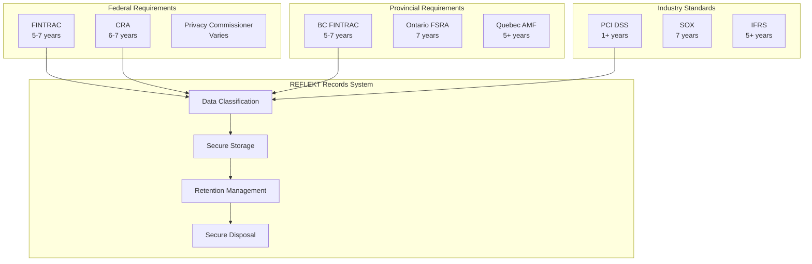
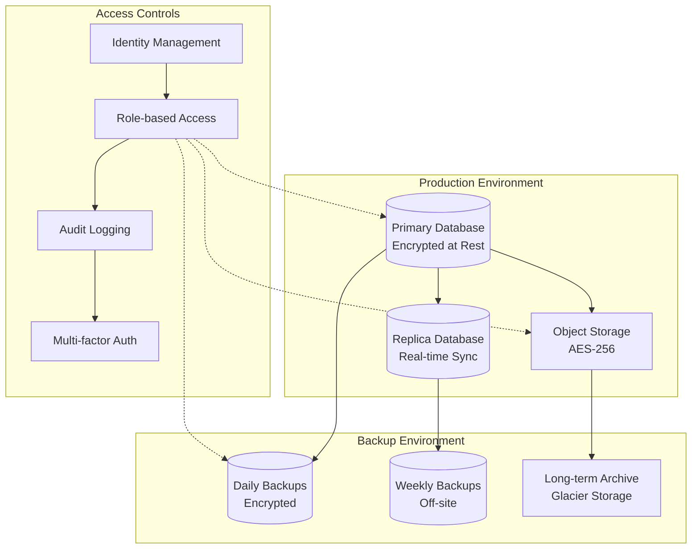
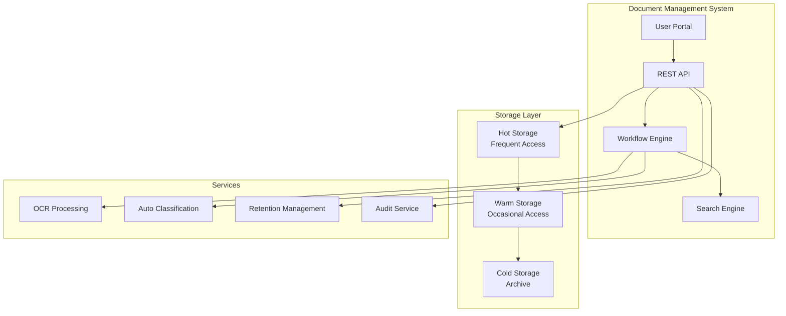
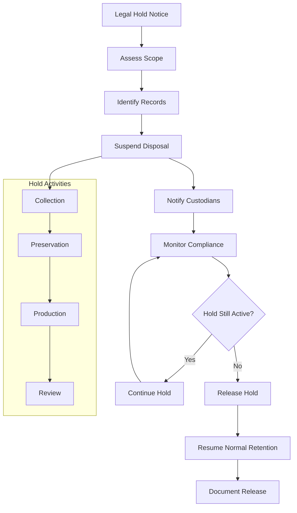
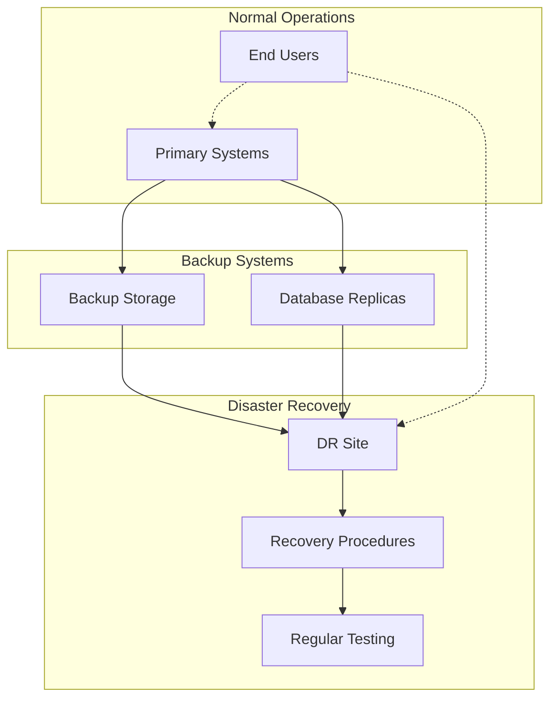

# Record Keeping

## Overview

Effective record keeping is fundamental to regulatory compliance. REFLEKT maintains comprehensive records to demonstrate compliance with various Canadian regulations including PCMLTFA, PIPEDA, and provincial requirements. This document outlines record types, retention periods, storage requirements, and management procedures.

## Regulatory Framework



## Record Classification

### Primary Record Types

```typescript
interface RecordClassification {
  customerRecords: {
    category: 'Customer Due Diligence'
    types: [
      'Identity verification documents',
      'Beneficial ownership information',
      'Risk assessments',
      'PEP/sanctions screening results',
      'Enhanced due diligence documentation'
    ]
    retention: '5 years after account closure'
    regulation: 'PCMLTFA'
  }

  transactionRecords: {
    category: 'Transaction Information'
    types: [
      'Transaction details and amounts',
      'Account information',
      'Correspondent banking info',
      'Wire transfer instructions',
      'Supporting documentation'
    ]
    retention: '5 years from transaction date'
    regulation: 'PCMLTFA'
  }

  complianceRecords: {
    category: 'Compliance Documentation'
    types: [
      'Suspicious transaction reports',
      'Compliance policies and procedures',
      'Training records',
      'Audit reports',
      'Regulatory correspondence'
    ]
    retention: '5-7 years depending on type'
    regulation: 'Multiple'
  }

  businessRecords: {
    category: 'Corporate Records'
    types: [
      'Financial statements',
      'Board minutes',
      'Contracts and agreements',
      'Insurance policies',
      'License applications'
    ]
    retention: '7 years minimum'
    regulation: 'Provincial/Corporate'
  }
}
```

### Data Sensitivity Levels

```yaml
sensitivity_classification:
  public:
    description: "Information available to general public"
    examples: ["Marketing materials", "Public announcements"]
    protection: "Standard"

  internal:
    description: "Internal business information"
    examples: ["Policies", "Procedures", "Training materials"]
    protection: "Access controlled"

  confidential:
    description: "Sensitive business information"
    examples: ["Financial data", "Strategic plans", "Vendor contracts"]
    protection: "Encrypted, need-to-know"

  restricted:
    description: "Highly sensitive regulated information"
    examples: ["Customer data", "Transaction records", "STRs"]
    protection: "Encrypted, logged access, retention managed"
```

## Retention Schedule

### Detailed Retention Matrix

| Record Type | Regulation | Retention Period | Storage Location | Disposal Method |
|-------------|------------|------------------|------------------|-----------------|
| **Customer Records** |
| Identity verification | PCMLTFA | 5 years after closure | Secure database | Secure deletion |
| Beneficial ownership | PCMLTFA | 5 years after closure | Secure database | Secure deletion |
| Risk assessments | PCMLTFA | 5 years after closure | Secure database | Secure deletion |
| PEP/sanctions screening | PCMLTFA | 5 years from screening | Secure database | Secure deletion |
| **Transaction Records** |
| Transaction details | PCMLTFA | 5 years from transaction | Secure database | Secure deletion |
| Account records | PCMLTFA | 5 years after closure | Secure database | Secure deletion |
| Wire instructions | PCMLTFA | 5 years from transfer | Secure database | Secure deletion |
| **Compliance Records** |
| STR records | PCMLTFA | 5 years from filing | Secure database | Secure deletion |
| Training records | PCMLTFA | 5 years from training | HR system | Secure deletion |
| Audit reports | Multiple | 7 years from report | Document system | Secure deletion |
| **Privacy Records** |
| Consent records | PIPEDA | 1 year after withdrawal | Privacy system | Secure deletion |
| Access requests | PIPEDA | 1 year from response | Privacy system | Secure deletion |
| Breach records | PIPEDA | 2 years from resolution | Incident system | Secure deletion |
| **Financial Records** |
| General ledger | CRA | 6 years from year end | Financial system | Secure deletion |
| Tax records | CRA | 6 years from filing | Financial system | Secure deletion |
| Payroll records | Provincial | 7 years from payment | HR system | Secure deletion |

### Retention Management System

```typescript
class RetentionManager {
  async scheduleRetention(record: Record): Promise<RetentionSchedule> {
    const policy = await this.getRetentionPolicy(record.type)

    const schedule = {
      recordId: record.id,
      creationDate: record.createdDate,
      retentionPeriod: policy.retentionPeriod,
      disposalDate: this.calculateDisposalDate(record, policy),
      legalHolds: await this.checkLegalHolds(record),

      milestones: {
        archive: this.calculateArchiveDate(record, policy),
        review: this.calculateReviewDate(record, policy),
        disposal: this.calculateDisposalDate(record, policy)
      }
    }

    await this.createRetentionEntry(schedule)
    return schedule
  }

  async processDisposal(): Promise<DisposalResult[]> {
    const dueForDisposal = await this.getRecordsDueForDisposal()
    const results: DisposalResult[] = []

    for (const record of dueForDisposal) {
      // Check for legal holds
      if (await this.hasActiveLegalHold(record)) {
        continue
      }

      // Verify disposal authorization
      const authorized = await this.getDisposalAuthorization(record)
      if (!authorized) {
        continue
      }

      // Perform secure disposal
      const result = await this.securelyDisposeRecord(record)
      results.push(result)

      // Create disposal certificate
      await this.createDisposalCertificate(record, result)
    }

    return results
  }
}
```

## Storage Requirements

### Technical Infrastructure



### Security Controls

```typescript
interface StorageSecurityControls {
  encryption: {
    atRest: {
      algorithm: 'AES-256'
      keyManagement: 'AWS KMS / Google Cloud KMS'
      keyRotation: 'Annual'
      compliance: 'FIPS 140-2 Level 3'
    }

    inTransit: {
      protocol: 'TLS 1.3'
      certificateValidation: true
      perfectForwardSecrecy: true
    }

    applicationLevel: {
      sensitiveFields: 'Field-level encryption'
      keys: 'Separate key management service'
      algorithms: 'AES-256-GCM'
    }
  }

  accessControl: {
    authentication: 'Multi-factor authentication'
    authorization: 'Role-based access control (RBAC)'
    audit: 'Comprehensive access logging'

    permissions: {
      read: 'Business need-to-know basis'
      write: 'Authorized personnel only'
      admin: 'Privileged access management'
      delete: 'Dual authorization required'
    }
  }

  backup: {
    frequency: {
      incremental: 'Hourly'
      full: 'Daily'
      archival: 'Weekly'
    }

    locations: {
      primary: 'Same region, different availability zone'
      secondary: 'Different geographic region'
      offline: 'Air-gapped storage for critical records'
    }

    testing: {
      restoration: 'Monthly restore tests'
      integrity: 'Weekly backup validation'
      recovery: 'Annual disaster recovery test'
    }
  }
}
```

## Record Management Procedures

### Document Lifecycle

```yaml
document_lifecycle:
  creation:
    standards: "Standardized templates and formats"
    metadata: "Automatic metadata capture"
    classification: "Automatic data classification"
    versioning: "Version control system"

  storage:
    indexing: "Searchable index creation"
    filing: "Automated filing by type/date"
    duplication: "Duplicate detection and prevention"
    compression: "Lossless compression"

  access:
    authentication: "Multi-factor authentication"
    authorization: "Role-based permissions"
    tracking: "Complete access audit trail"
    download: "Controlled download procedures"

  maintenance:
    review: "Periodic content review"
    migration: "Format migration as needed"
    integrity: "Regular integrity checks"
    updates: "Controlled update procedures"

  disposition:
    evaluation: "Retention policy evaluation"
    approval: "Disposal authorization"
    execution: "Secure disposal execution"
    certification: "Disposal certification"
```

### Metadata Management

```typescript
interface DocumentMetadata {
  required: {
    documentId: string
    title: string
    documentType: string
    classification: 'Public' | 'Internal' | 'Confidential' | 'Restricted'
    creator: string
    creationDate: Date
    lastModified: Date
    version: string
  }

  compliance: {
    retentionPeriod: number
    regulatoryBasis: string[]
    legalHolds: LegalHold[]
    disposalDate: Date
    disposalMethod: string
  }

  business: {
    department: string
    businessPurpose: string
    relatedRecords: string[]
    keywords: string[]
    customFields: Record<string, any>
  }

  technical: {
    format: string
    size: number
    checksum: string
    location: string
    backupStatus: BackupStatus
  }
}
```

## Physical Records Management

### Physical Document Handling

```yaml
physical_records:
  reception:
    scanning: "High-resolution document scanning"
    indexing: "Barcode or QR code indexing"
    verification: "Quality assurance checks"
    storage: "Secure physical storage"

  storage_facilities:
    security:
      - 24/7 surveillance
      - Access control systems
      - Environmental controls
      - Fire suppression systems

    organization:
      - Standardized filing systems
      - Box and folder labeling
      - Location tracking
      - Inventory management

  handling:
    access: "Controlled access procedures"
    checkout: "Document checkout system"
    tracking: "Chain of custody maintenance"
    return: "Verification upon return"

  disposal:
    shredding: "Cross-cut shredding minimum"
    witnessed: "Witnessed destruction"
    certification: "Certificate of destruction"
    documentation: "Complete disposal records"
```

## Electronic Records Management

### Digital Repository Architecture



### System Requirements

```typescript
interface DocumentManagementSystem {
  functionality: {
    capture: 'Multi-format document ingestion'
    storage: 'Scalable, secure storage'
    retrieval: 'Fast, indexed search'
    workflow: 'Automated business processes'
    compliance: 'Retention and disposal management'
  }

  features: {
    versioning: 'Complete version history'
    collaboration: 'Controlled document sharing'
    approval: 'Electronic approval workflows'
    templates: 'Standardized document templates'
    reporting: 'Comprehensive analytics'
  }

  integration: {
    authentication: 'SSO integration'
    apis: 'RESTful API access'
    backup: 'Enterprise backup systems'
    compliance: 'GRC tool integration'
    notifications: 'Email and alert systems'
  }

  compliance: {
    audit: 'Comprehensive audit trails'
    encryption: 'End-to-end encryption'
    access: 'Granular access controls'
    retention: 'Automated retention management'
    disposal: 'Secure disposal capabilities'
  }
}
```

## Legal Hold Management

### Legal Hold Process



### Hold Management System

```typescript
class LegalHoldManager {
  async createHold(holdRequest: HoldRequest): Promise<LegalHold> {
    const hold = {
      holdId: generateHoldId(),
      matter: holdRequest.matter,
      issuedBy: holdRequest.legalCounsel,
      issuedDate: new Date(),
      scope: holdRequest.scope,

      custodians: await this.identifyCustodians(holdRequest.scope),
      records: await this.identifyRecords(holdRequest.scope),

      status: 'active',
      notifications: [],
      compliance: []
    }

    // Suspend disposal for affected records
    await this.suspendDisposal(hold.records)

    // Notify custodians
    await this.notifyCustodians(hold.custodians, hold)

    // Create hold documentation
    await this.documentHold(hold)

    return hold
  }

  async releaseHold(holdId: string, releaseReason: string): Promise<void> {
    const hold = await this.getHold(holdId)

    // Update hold status
    hold.status = 'released'
    hold.releaseDate = new Date()
    hold.releaseReason = releaseReason

    // Resume normal retention
    await this.resumeRetention(hold.records)

    // Notify custodians
    await this.notifyHoldRelease(hold.custodians, hold)

    // Document release
    await this.documentHoldRelease(hold)

    await this.updateHold(hold)
  }
}
```

## Audit and Compliance

### Record Keeping Audits

```yaml
audit_program:
  internal_audits:
    frequency: "Quarterly"
    scope: "Random sampling of record types"
    criteria:
      - Completeness of records
      - Accuracy of metadata
      - Compliance with retention schedules
      - Security control effectiveness

  external_audits:
    frequency: "Annual"
    auditors: "Independent third parties"
    standards:
      - ISO 27001
      - SOC 2 Type II
      - Regulatory requirements

  regulatory_examinations:
    frequency: "As required by regulators"
    preparedness:
      - Document readily available
      - Staff training on examination process
      - Coordination procedures
      - Response protocols
```

### Compliance Monitoring

```typescript
interface ComplianceMonitoring {
  metrics: {
    retention: {
      complianceRate: number        // % of records with correct retention
      overdueDisposals: number      // Number of overdue disposals
      legalHoldCompliance: number   // % compliance with legal holds
    }

    security: {
      accessViolations: number      // Unauthorized access attempts
      encryptionCoverage: number    // % of records encrypted
      backupSuccess: number         // % successful backups
    }

    quality: {
      metadataCompleteness: number  // % records with complete metadata
      integrityFailures: number     // Number of integrity check failures
      indexingErrors: number        // Search indexing errors
    }
  }

  alerting: {
    retentionViolations: 'Real-time alerts'
    securityIncidents: 'Immediate escalation'
    systemFailures: 'Automated notifications'
  }

  reporting: {
    dashboard: 'Real-time compliance dashboard'
    monthly: 'Monthly compliance report'
    regulatory: 'Regulatory examination packages'
  }
}
```

## Training and Awareness

### Record Keeping Training Program

```yaml
training_program:
  general_awareness:
    audience: "All employees"
    frequency: "Annual"
    topics:
      - Record keeping responsibilities
      - Data classification
      - Retention requirements
      - Legal holds
      - Security procedures

  specialized_training:
    records_managers:
      - Advanced retention management
      - System administration
      - Audit procedures
      - Legal hold management

    compliance_officers:
      - Regulatory requirements
      - Risk assessment
      - Audit coordination
      - Incident response

    legal_counsel:
      - Legal hold procedures
      - Discovery management
      - Privilege protection
      - Litigation support
```

## Technology Solutions

### Recommended Tools

```typescript
interface RecordKeepingTechnology {
  documentManagement: {
    enterprise: ['SharePoint', 'Box', 'Google Workspace']
    specialized: ['OpenText', 'IBM FileNet', 'M-Files']
    considerations: ['Integration', 'Scalability', 'Compliance features']
  }

  retention: {
    tools: ['Compliance360', 'MetricStream', 'ServiceNow GRC']
    features: ['Automated scheduling', 'Policy management', 'Reporting']
  }

  legalHold: {
    solutions: ['Exterro', 'Onna', 'Microsoft Purview']
    capabilities: ['Hold management', 'Collection', 'Review']
  }

  backup: {
    cloud: ['AWS Backup', 'Azure Backup', 'Google Cloud Backup']
    onPremise: ['Veeam', 'Commvault', 'Veritas']
    hybrid: ['Integrated solutions']
  }
}
```

## Cost Management

### Record Keeping Costs

```yaml
cost_analysis:
  storage_costs:
    hot_storage: "$0.023/GB/month"
    warm_storage: "$0.0125/GB/month"
    cold_storage: "$0.004/GB/month"
    backup: "$0.05/GB/month"

  operational_costs:
    staff: "2 FTE for record management"
    systems: "$50,000/year software licensing"
    facilities: "$10,000/year physical storage"
    compliance: "$25,000/year audit and consulting"

  optimization:
    archival: "Move to cold storage after 2 years"
    compression: "30% storage reduction"
    automation: "50% staff time savings"
    cloud: "25% cost reduction vs on-premise"
```

## Disaster Recovery

### Business Continuity



### Recovery Procedures

```typescript
interface DisasterRecovery {
  rto: '24 hours'  // Recovery Time Objective
  rpo: '1 hour'    // Recovery Point Objective

  procedures: {
    assessment: 'Assess scope of disaster'
    activation: 'Activate DR procedures'
    recovery: 'Restore systems and data'
    testing: 'Verify data integrity'
    communication: 'Notify stakeholders'
    documentation: 'Document incident and recovery'
  }

  testing: {
    frequency: 'Semi-annual'
    scope: 'Full system recovery'
    metrics: ['RTO achievement', 'RPO achievement', 'Data integrity']
  }
}
```

## Next Steps

1. **System Selection**: Choose appropriate document management system
2. **Policy Development**: Finalize retention policies
3. **Implementation**: Deploy technology solutions
4. **Training**: Train all relevant staff
5. **Testing**: Test all procedures
6. **Monitoring**: Establish ongoing monitoring
7. **Continuous Improvement**: Regular process optimization

## Resources

### Regulatory Guidance
- [FINTRAC Record Keeping Requirements](https://www.fintrac-canafe.gc.ca/guidance-directives/recordkeeping-guide-eng)
- [PIPEDA Privacy Principles](https://www.priv.gc.ca/en/privacy-topics/privacy-laws-in-canada/the-personal-information-protection-and-electronic-documents-act-pipeda/)
- [CRA Record Keeping Requirements](https://www.canada.ca/en/revenue-agency/services/tax/businesses/topics/keeping-records.html)

### Industry Standards
- ISO 15489: Records Management
- ISO 27001: Information Security Management
- ARMA International Standards

### Contact Information
- **Records Manager**: records@reflekt.ai
- **Compliance Team**: compliance@reflekt.ai
- **IT Support**: it-support@reflekt.ai
- **Legal Counsel**: legal@reflekt.ai
