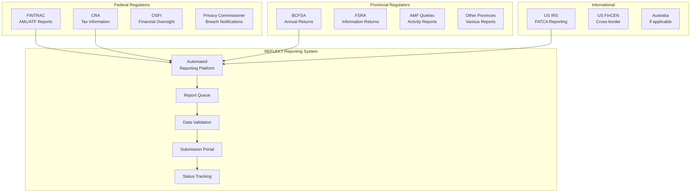
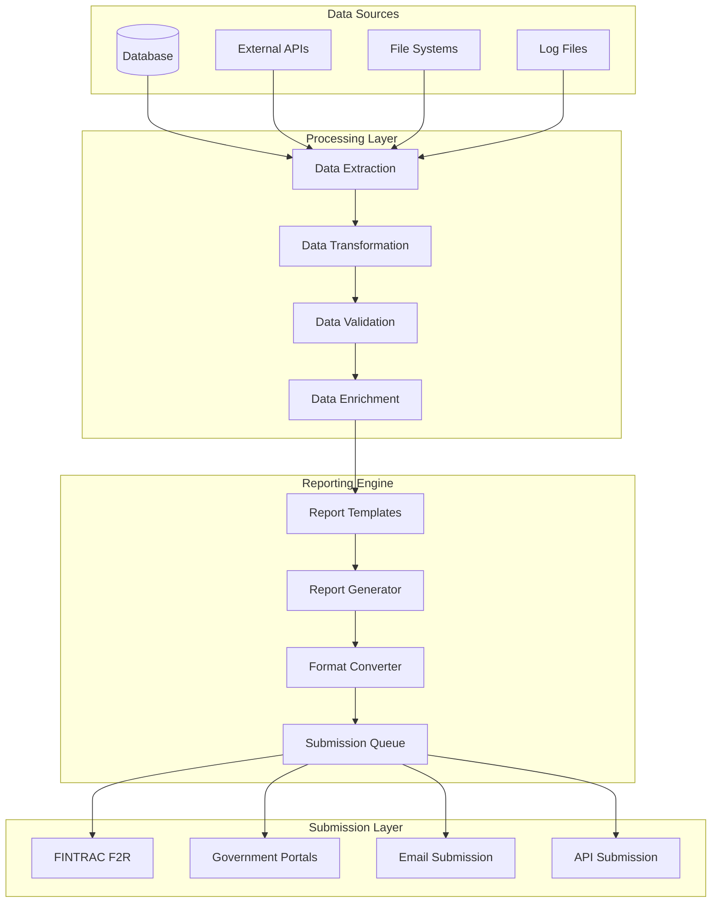
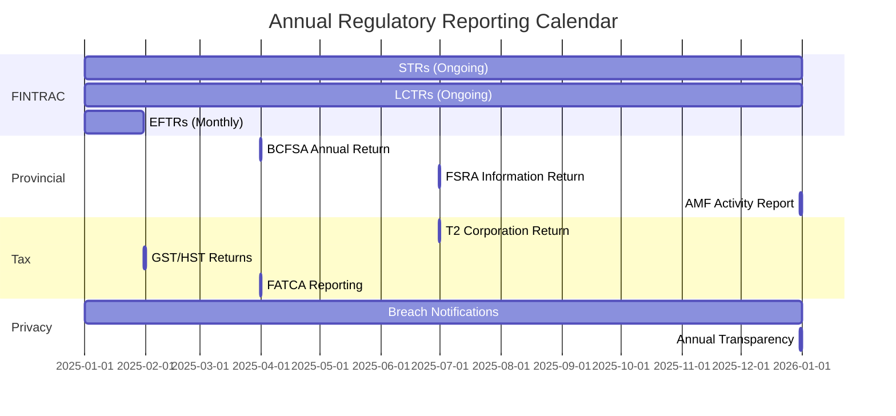
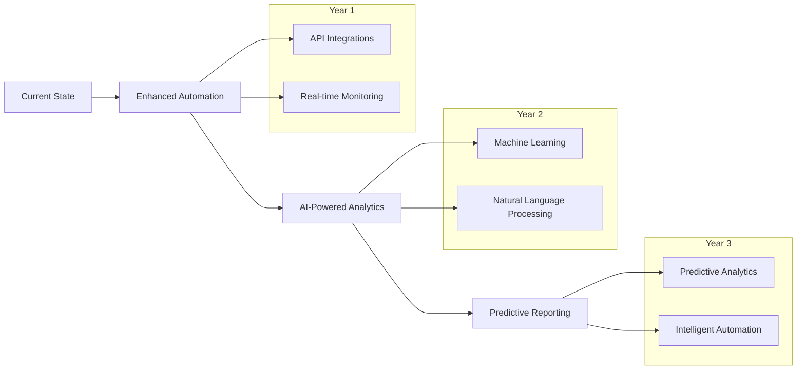

# Regulatory Reporting

## Overview

Regulatory reporting is a critical component of REFLEKT's compliance program. This document outlines the various regulatory reports required by Canadian authorities and international partners, including submission timelines, content requirements, and management processes.

## Reporting Framework



## FINTRAC Reporting

### Suspicious Transaction Reports (STRs)

```typescript
interface STRReport {
  header: {
    reportId: string
    submissionDate: Date
    reportType: 'STR'
    entityInfo: {
      name: 'REFLEKT Inc.'
      fintracId: string
      address: Address
      contact: ContactInfo
    }
  }

  suspiciousTransaction: {
    transactionId: string
    amount: number
    currency: 'CAD' | 'USD'
    date: Date
    location: string

    parties: {
      conductor: Person | Entity
      beneficiary?: Person | Entity
      thirdParty?: Person | Entity
    }

    suspicionInfo: {
      category: 'ML' | 'TF' | 'Both'
      indicators: Indicator[]
      narrative: string
      reasonableSuspicion: string
    }
  }

  supporting: {
    relatedTransactions: Transaction[]
    previousReports: STRReference[]
    additionalInfo: string
  }
}

class STRSubmission {
  async submitSTR(str: STRReport): Promise<SubmissionResult> {
    // Validate report completeness
    const validation = await this.validateSTR(str)
    if (!validation.valid) {
      throw new Error(`STR validation failed: ${validation.errors}`)
    }

    // Submit via F2R system
    const submission = await this.submitToF2R(str)

    // Record submission
    await this.recordSubmission({
      reportId: str.header.reportId,
      submissionDate: new Date(),
      fintracReference: submission.reference,
      status: 'submitted'
    })

    // Update case status
    await this.updateCaseStatus(str.suspiciousTransaction.transactionId, 'reported')

    return submission
  }
}
```

### Large Cash Transaction Reports (LCTRs)

```yaml
lctr_requirements:
  threshold: "$10,000 CAD"
  timeline: "15 days from transaction"

  required_info:
    transaction:
      - Date and time
      - Amount
      - Currency
      - Location
      - Purpose
      - Method of receipt/payment

    individual:
      - Full name
      - Address
      - Date of birth
      - Occupation
      - Employer
      - Identification details

    entity:
      - Full name
      - Address
      - Nature of business
      - Business number
      - Signing authority details

  reporting_rules:
    single_transaction: "≥ $10,000"
    multiple_transactions: "24-hour rule applies"
    conductor_vs_beneficiary: "Report both if different"
```

### Electronic Funds Transfer Reports (EFTRs)

```typescript
interface EFTReport {
  report: {
    type: 'EFTI' | 'EFTO'  // Incoming or Outgoing
    amount: number
    threshold: 10000
    currency: string
    reportingPeriod: DateRange
  }

  transferInfo: {
    initiationDate: Date
    completionDate: Date
    amount: number
    currency: string
    exchangeRate?: number

    remittanceInfo: {
      purpose: string
      instructions: string
      reference: string
    }
  }

  parties: {
    ordering: {
      name: string
      address: Address
      account?: AccountInfo
      institution: FinancialInstitution
    }

    beneficiary: {
      name: string
      address: Address
      account?: AccountInfo
      institution: FinancialInstitution
    }

    intermediary?: FinancialInstitution[]
  }
}
```

### Terrorist Property Reports (TPRs)

```yaml
tpr_requirements:
  trigger: "Immediate knowledge of terrorist property"
  timeline: "Immediately (without delay)"

  actions:
    freeze: "Freeze assets immediately"
    report: "Report to FINTRAC"
    notify_rcmp: "Notify RCMP"
    no_disclosure: "Do not tip off"

  content:
    property_details:
      - Description of property
      - Location
      - Value estimate
      - Freezing actions taken

    person_details:
      - Name and aliases
      - Address
      - Date of birth
      - Identification
      - Associated entities
```

## Provincial Reporting

### British Columbia (BCFSA)

```typescript
interface BCFSAReporting {
  annualReturn: {
    dueDate: '90 days after fiscal year end'
    content: {
      financialStatements: 'Audited preferred'
      businessActivities: 'Detailed description'
      materialChanges: 'Any significant changes'
      complianceAttestation: 'Signed compliance statement'
      complaintsRegister: 'Summary of complaints'
    }
  }

  quarterlyReports: {
    required: 'If specified in license conditions'
    content: {
      businessVolume: 'Transaction volumes'
      customerCount: 'Active customers'
      incidents: 'Security incidents'
      changes: 'Material changes'
    }
  }

  changeNotifications: {
    timeline: '10 days'
    triggers: [
      'Director/officer changes',
      'Ownership changes',
      'Address changes',
      'Business model changes'
    ]
  }
}
```

### Ontario (FSRA)

```yaml
fsra_reporting:
  information_returns:
    frequency: "Annual"
    due_date: "As specified by FSRA"

    content:
      - Business operations summary
      - Consumer complaints
      - Material changes
      - Financial position
      - Compliance status

  incident_reporting:
    timeline: "Promptly"
    types:
      - Data breaches
      - System failures
      - Regulatory violations
      - Consumer harm
```

### Quebec (AMF)

```typescript
interface AMFReporting {
  activityReport: {
    frequency: 'Annual'
    language: 'French (primarily)'

    content: {
      businessActivities: 'Detailed in French'
      financialPosition: 'Financial statements'
      compliance: 'Compliance attestation'
      risks: 'Risk assessment summary'
    }
  }

  changeNotifications: {
    timeline: '30 days'
    language: 'French required'

    changes: [
      'Corporate structure',
      'Key personnel',
      'Business operations',
      'Material contracts'
    ]
  }
}
```

## Tax Reporting

### Canada Revenue Agency (CRA)

```yaml
cra_reporting:
  corporate_returns:
    form: "T2 Corporation Income Tax Return"
    due_date: "6 months after fiscal year end"

    schedules:
      - Schedule 1: Net Income/Loss
      - Schedule 8: Capital Cost Allowance
      - Schedule 50: Shareholder Information

  information_returns:
    t4a: "Statement of Pension, Retirement, Annuity"
    t5: "Statement of Investment Income"
    nr4: "Non-resident tax withheld"

  gst_hst:
    registration: "If revenue > $30,000"
    filing: "Quarterly or annual"
    payment: "Monthly if large registrant"
```

### FATCA and CRS Reporting

```typescript
interface InternationalTaxReporting {
  fatca: {
    applicability: 'If serving US persons'
    forms: ['8966', '8938']
    timeline: 'March 31 annually'

    requirements: {
      accountHolders: 'Identify US persons'
      balances: 'Report account balances'
      income: 'Report investment income'
      closures: 'Report account closures'
    }
  }

  crs: {
    participating: 'Canada participates in CRS'
    exchange: 'Automatic exchange of information'

    reportable: {
      accounts: 'Financial accounts'
      jurisdictions: 'CRS participating jurisdictions'
      thresholds: 'Various by jurisdiction'
    }
  }
}
```

## Privacy and Data Protection Reporting

### Privacy Commissioner of Canada

```yaml
privacy_reporting:
  breach_notifications:
    threshold: "Real risk of significant harm"
    timeline: "As soon as feasible"

    content:
      - Description of breach
      - Personal information involved
      - Number of individuals affected
      - Steps taken to reduce harm
      - Measures to prevent recurrence

  annual_disclosure:
    optional: "But recommended for transparency"
    content:
      - Privacy policies and practices
      - Access requests handled
      - Complaints received
      - Breaches reported
```

### Provincial Privacy Authorities

```typescript
interface ProvincialPrivacyReporting {
  alberta: {
    authority: 'Office of the Information and Privacy Commissioner'
    threshold: 'Real risk of significant harm'
    timeline: '72 hours'
  }

  britishColumbia: {
    authority: 'Office of the Information and Privacy Commissioner'
    threshold: 'Unauthorized access or disclosure'
    timeline: 'Without unreasonable delay'
  }

  quebec: {
    authority: 'Commission d\'accès à l\'information'
    threshold: 'Incident involving confidentiality'
    timeline: 'As soon as possible'
    language: 'French required'
  }
}
```

## Automated Reporting System

### System Architecture



### Report Automation

```typescript
class ReportingAutomation {
  async generateReport(
    reportType: ReportType,
    period: ReportingPeriod
  ): Promise<Report> {

    // Extract data
    const rawData = await this.extractData(reportType, period)

    // Apply business rules
    const transformedData = await this.applyBusinessRules(rawData, reportType)

    // Validate data quality
    const validationResult = await this.validateData(transformedData)
    if (!validationResult.valid) {
      throw new Error(`Data validation failed: ${validationResult.errors}`)
    }

    // Generate report
    const report = await this.generateReportContent(transformedData, reportType)

    // Format for submission
    const formattedReport = await this.formatReport(report, reportType)

    // Queue for submission
    await this.queueForSubmission(formattedReport, reportType)

    return formattedReport
  }

  async scheduleReports(): Promise<void> {
    const schedules = [
      { type: 'STR', trigger: 'event-based' },
      { type: 'LCTR', frequency: 'daily', delay: '15 days' },
      { type: 'EFTR', frequency: 'monthly' },
      { type: 'Annual Return', frequency: 'yearly' }
    ]

    for (const schedule of schedules) {
      await this.createScheduledJob(schedule)
    }
  }
}
```

## Quality Assurance

### Report Review Process

```yaml
qa_process:
  automated_checks:
    - Data completeness
    - Format validation
    - Business rule compliance
    - Regulatory requirement mapping

  manual_review:
    reviewer: "Compliance Officer"
    criteria:
      - Accuracy of information
      - Narrative quality (for STRs)
      - Supporting documentation
      - Regulatory compliance

  approval_workflow:
    level_1: "Report Preparer"
    level_2: "Compliance Officer"
    level_3: "Senior Management (for critical reports)"

  quality_metrics:
    accuracy_rate: ">99%"
    timeliness: "100% on time"
    rejection_rate: "<1%"
    regulator_feedback: "Track and address"
```

### Error Handling

```typescript
interface ReportingErrorHandling {
  validation: {
    dataQuality: 'Check data completeness and accuracy'
    formatCompliance: 'Verify format requirements'
    businessRules: 'Apply regulatory business rules'
  }

  submission: {
    retry: 'Automatic retry for transient failures'
    escalation: 'Manual intervention for persistent failures'
    notification: 'Alert compliance team of failures'
  }

  tracking: {
    auditTrail: 'Complete audit trail of all activities'
    errorLog: 'Detailed error logging'
    statusTracking: 'Real-time status updates'
  }
}
```

## Reporting Calendar



## Performance Metrics

### Reporting KPIs

```typescript
interface ReportingKPIs {
  timeliness: {
    onTimeSubmission: number      // Target: 100%
    averageSubmissionTime: number // Days before deadline
    missedDeadlines: number       // Target: 0
  }

  quality: {
    accuracyRate: number          // Target: >99%
    rejectionRate: number         // Target: <1%
    errorRate: number             // Target: <0.1%
    regulatorFeedback: number     // Target: Positive
  }

  efficiency: {
    automationRate: number        // Target: >80%
    processTime: number           // Hours per report
    resourceUtilization: number   // FTE dedicated to reporting
    costPerReport: number         // Average cost
  }
}
```

## Incident Management

### Reporting Failures

```yaml
incident_response:
  detection:
    - Automated monitoring alerts
    - Manual identification
    - Regulator notification

  classification:
    critical: "Missed regulatory deadline"
    high: "Data quality issues"
    medium: "Process delays"
    low: "Minor formatting errors"

  response:
    immediate: "Within 1 hour"
    investigation: "Within 4 hours"
    resolution: "Within 24 hours"
    prevention: "Within 1 week"

  communication:
    internal: "Compliance team, management"
    external: "Regulators if required"
    documentation: "Incident report and lessons learned"
```

## Training and Awareness

### Reporting Team Training

```typescript
interface ReportingTraining {
  roles: {
    analysts: {
      topics: ['Data analysis', 'Report preparation', 'Quality checks']
      frequency: 'Quarterly'
    }

    officers: {
      topics: ['Regulatory requirements', 'Review procedures', 'Escalation']
      frequency: 'Semi-annually'
    }

    management: {
      topics: ['Oversight responsibilities', 'Risk management', 'Strategy']
      frequency: 'Annually'
    }
  }

  content: {
    regulatory: 'Current regulatory requirements'
    systems: 'Reporting system training'
    procedures: 'Standard operating procedures'
    quality: 'Quality assurance practices'
  }
}
```

## Vendor Management

### Third-Party Reporting Services

```yaml
vendor_oversight:
  due_diligence:
    - Regulatory expertise
    - System capabilities
    - Security measures
    - Reference checks

  contracts:
    - Service level agreements
    - Data protection clauses
    - Liability and indemnification
    - Termination procedures

  monitoring:
    - Performance metrics
    - Quality assessments
    - Security reviews
    - Compliance audits
```

## Future Enhancements

### Technology Roadmap



## Contact Information

### Regulatory Contacts

| Regulator | Department | Phone | Email |
|-----------|------------|-------|-------|
| FINTRAC | Compliance | 1-866-346-8722 | guidelines-lignesdirectrices@fintrac-canafe.gc.ca |
| BCFSA | Consumer Services | 604-660-3555 | info@bcfsa.ca |
| FSRA | Contact Centre | 416-250-7250 | contactcentre@fsrao.ca |
| AMF Quebec | Information | 1-877-525-0337 | information@lautorite.qc.ca |
| Privacy Commissioner | Complaints | 1-800-282-1376 | info@priv.gc.ca |

### Internal Contacts

- **Chief Compliance Officer**: compliance@reflekt.ai
- **Reporting Manager**: reporting@reflekt.ai
- **Technical Support**: reporting-support@reflekt.ai
- **Emergency**: compliance-emergency@reflekt.ai

## Next Steps

1. **System Implementation**: Deploy automated reporting system
2. **Process Documentation**: Create detailed procedures
3. **Staff Training**: Train reporting team
4. **Testing**: Conduct end-to-end testing
5. **Go-Live**: Begin automated reporting
6. **Monitoring**: Establish ongoing monitoring
7. **Optimization**: Continuously improve processes
