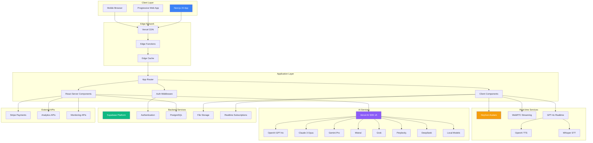
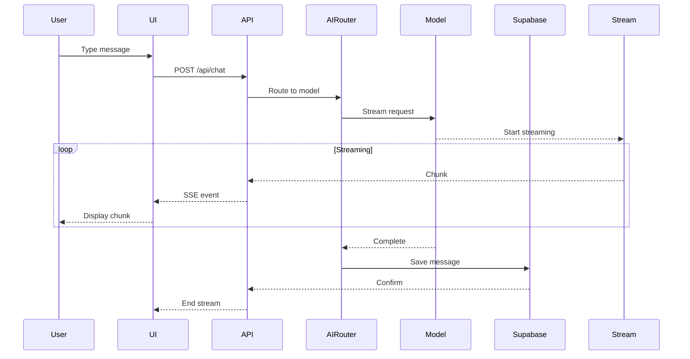
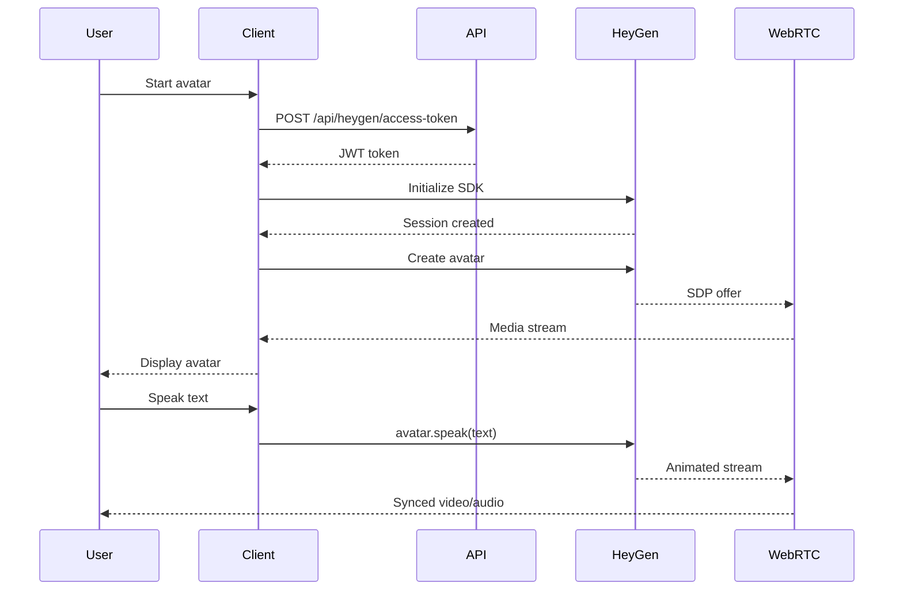
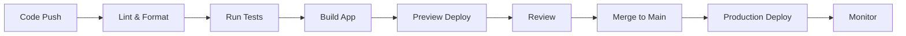

import { Tabs, Callout } from 'nextra/components'

# Architecture Overview

Earna AI Console is a sophisticated multi-model AI platform powered by GPT-4o as the primary model, combining chat interfaces, interactive avatars, and voice conversations. Built with Next.js 15, Vercel AI SDK v5, and Supabase, it delivers a scalable, real-time AI experience with full TypeScript strict mode support.

## Architecture Principles

### Design Philosophy
- **Modular AI Integration**: Hot-swappable AI models via Vercel AI SDK v5
- **Real-time Communication**: WebRTC for avatars, WebSockets for voice
- **Edge-First**: Optimized for Vercel Edge Functions
- **Type-Safe**: End-to-end TypeScript with strict typing
- **Component-Based**: Reusable UI components with shadcn/ui
- **Serverless**: Designed for auto-scaling and global distribution

## High-Level Architecture



## Component Architecture

### Frontend Architecture

#### Technology Stack
- **Framework**: Next.js 15.0.4 with App Router
- **UI Library**: React 19 RC
- **Styling**: Tailwind CSS v4 + shadcn/ui
- **State Management**: Zustand + React Query
- **Real-time**: WebSockets, WebRTC, Server-Sent Events
- **Type Safety**: TypeScript 5.7

#### Directory Structure
```typescript
console/
├── app/                        # Next.js App Router
│   ├── (auth)/                # Authentication routes
│   │   ├── sign-in/
│   │   ├── sign-up/
│   │   └── callback/
│   ├── api/                   # API Routes
│   │   ├── chat/             # Chat endpoints
│   │   ├── heygen/           # Avatar endpoints
│   │   ├── realtime-session/ # Voice endpoints
│   │   ├── tts/              # Text-to-speech
│   │   └── models/           # Model management
│   ├── chat/                  # Main chat interface
│   └── settings/              # User settings
├── components/
│   ├── ui/                    # shadcn/ui components
│   ├── chat/                  # Chat components
│   │   ├── message.tsx
│   │   ├── chat-input.tsx
│   │   ├── voice-mode.tsx
│   │   └── avatar-modal.tsx
│   ├── layout/               # Layout components
│   └── providers/            # Context providers
├── lib/
│   ├── ai/                   # AI integration
│   │   ├── models/          # Model registry
│   │   ├── tools/           # AI tools
│   │   └── prompts/         # System prompts
│   ├── supabase/            # Database client
│   ├── auth/                # Authentication
│   └── utils/               # Utilities
└── hooks/                    # Custom React hooks
```

### AI Integration Layer

#### Vercel AI SDK v5 Architecture
```typescript
// lib/ai/models/registry.ts
export const MODEL_REGISTRY = {
  // OpenAI Models (Primary)
  'gpt-4o': {
    provider: openai,
    model: 'gpt-4o',
    features: ['chat', 'vision', 'tools', 'voice'],
    contextLength: 128000,
    primary: true,
  },
  'o1-preview': {
    provider: openai,
    model: 'o1-preview',
    features: ['reasoning'],
    contextLength: 128000,
  },

  // Anthropic Models (Alternative)
  'claude-3-opus-20240229': {
    provider: anthropic,
    model: 'claude-3-opus-20240229',
    features: ['chat', 'vision', 'tools'],
    contextLength: 200000,
  },

  // Google Models (Alternative)
  'gemini-1.5-pro': {
    provider: google,
    model: 'gemini-1.5-pro',
    features: ['chat', 'vision', 'tools'],
    contextLength: 1000000,
  },

  // ... more models
}

// Model selection and routing
export async function routeToModel(modelId: string, messages: Message[]) {
  const config = MODEL_REGISTRY[modelId];
  if (!config) throw new Error(`Unknown model: ${modelId}`);

  return streamText({
    model: config.provider(config.model),
    messages,
    temperature: 0.7,
    maxTokens: 4096,
  });
}
```

### Real-time Communication

#### WebRTC Architecture (HeyGen Avatars)
```typescript
// components/avatar/webrtc-manager.ts
class WebRTCManager {
  private pc: RTCPeerConnection;
  private config: RTCConfiguration = {
    iceServers: [
      { urls: 'stun:stun.l.google.com:19302' },
      {
        urls: 'turn:relay.heygen.com:3478',
        username: 'user',
        credential: 'pass'
      }
    ]
  };

  async initializeConnection(offer: RTCSessionDescriptionInit) {
    this.pc = new RTCPeerConnection(this.config);

    // Set up event handlers
    this.pc.onicecandidate = this.handleIceCandidate;
    this.pc.ontrack = this.handleRemoteStream;

    // Create answer
    await this.pc.setRemoteDescription(offer);
    const answer = await this.pc.createAnswer();
    await this.pc.setLocalDescription(answer);

    return answer;
  }
}
```

#### WebSocket Architecture (Voice Mode)
```typescript
// hooks/use-realtime-voice.ts
class RealtimeVoiceConnection {
  private ws: WebSocket;
  private audioContext: AudioContext;

  connect(sessionKey: string) {
    this.ws = new WebSocket('wss://api.openai.com/v1/realtime', [], {
      headers: {
        'Authorization': `Bearer ${sessionKey}`,
        'OpenAI-Beta': 'realtime=v1'
      }
    });

    this.ws.onmessage = (event) => {
      const data = JSON.parse(event.data);

      switch(data.type) {
        case 'response.audio.delta':
          this.playAudioChunk(data.delta);
          break;
        case 'response.text.delta':
          this.updateTranscript(data.delta);
          break;
      }
    };
  }

  sendAudio(pcm16Data: ArrayBuffer) {
    this.ws.send(JSON.stringify({
      type: 'input_audio_buffer.append',
      audio: arrayBufferToBase64(pcm16Data)
    }));
  }
}
```

### Database Architecture

#### Supabase Schema
```sql
-- Core tables
CREATE TABLE users (
  id UUID PRIMARY KEY REFERENCES auth.users(id),
  email TEXT UNIQUE,
  username TEXT UNIQUE,
  subscription_tier TEXT DEFAULT 'free',
  daily_message_count INTEGER DEFAULT 0,
  settings JSONB DEFAULT '{}',
  created_at TIMESTAMPTZ DEFAULT NOW()
);

CREATE TABLE chats (
  id UUID PRIMARY KEY DEFAULT gen_random_uuid(),
  user_id UUID REFERENCES users(id) ON DELETE CASCADE,
  title TEXT,
  model TEXT DEFAULT 'gpt-4o',
  system_prompt TEXT,
  created_at TIMESTAMPTZ DEFAULT NOW(),
  updated_at TIMESTAMPTZ DEFAULT NOW()
);

CREATE TABLE messages (
  id UUID PRIMARY KEY DEFAULT gen_random_uuid(),
  chat_id UUID REFERENCES chats(id) ON DELETE CASCADE,
  role TEXT CHECK (role IN ('user', 'assistant', 'system', 'tool')),
  content TEXT NOT NULL,
  model TEXT,
  tokens_used INTEGER,
  attachments JSONB DEFAULT '[]',
  created_at TIMESTAMPTZ DEFAULT NOW()
);

-- Indexes for performance
CREATE INDEX idx_chats_user_id ON chats(user_id);
CREATE INDEX idx_messages_chat_id ON messages(chat_id);
CREATE INDEX idx_messages_created_at ON messages(created_at DESC);

-- Row Level Security
ALTER TABLE users ENABLE ROW LEVEL SECURITY;
ALTER TABLE chats ENABLE ROW LEVEL SECURITY;
ALTER TABLE messages ENABLE ROW LEVEL SECURITY;

-- RLS Policies
CREATE POLICY "Users can view own data" ON users
  FOR SELECT USING (auth.uid() = id);

CREATE POLICY "Users can manage own chats" ON chats
  FOR ALL USING (auth.uid() = user_id);

CREATE POLICY "Users can manage own messages" ON messages
  FOR ALL USING (
    EXISTS (
      SELECT 1 FROM chats
      WHERE chats.id = messages.chat_id
      AND chats.user_id = auth.uid()
    )
  );
```

## Data Flow Patterns

### Chat Message Processing


### Avatar Session Flow


## Security Architecture

### Authentication Flow
```typescript
// Multi-layer security
interface SecurityLayers {
  // Layer 1: Edge middleware
  edge: {
    rateLimit: RateLimiter;
    ddosProtection: CloudflareProtection;
    geoBlocking: GeoFilter;
  };

  // Layer 2: Application auth
  application: {
    supabaseAuth: SupabaseClient;
    sessionManagement: SessionManager;
    jwtValidation: JWTVerifier;
  };

  // Layer 3: Database RLS
  database: {
    rowLevelSecurity: PostgresRLS;
    encryptedFields: FieldEncryption;
    auditLogging: AuditLogger;
  };

  // Layer 4: API protection
  api: {
    apiKeyValidation: APIKeyValidator;
    requestSigning: RequestSigner;
    responseEncryption: ResponseEncryptor;
  };
}
```

### Data Protection
- **Encryption at Rest**: Supabase automatic encryption
- **Encryption in Transit**: TLS 1.3 enforced
- **API Keys**: Environment variables, never exposed
- **User Data**: GDPR compliant storage
- **File Storage**: Signed URLs with expiration

## Performance Optimization

### Caching Strategy
```typescript
// Multi-level caching
const cacheLayers = {
  // Browser cache
  browser: {
    strategy: 'cache-first',
    duration: '1h',
    storage: 'localStorage'
  },

  // Edge cache (Vercel)
  edge: {
    strategy: 'stale-while-revalidate',
    duration: '5m',
    regions: ['global']
  },

  // Database cache
  database: {
    strategy: 'read-through',
    duration: '10m',
    invalidation: 'on-write'
  },

  // Redis cache (optional)
  redis: {
    strategy: 'write-through',
    duration: '1h',
    eviction: 'LRU'
  }
};
```

### Optimization Techniques
- **Code Splitting**: Dynamic imports for heavy components
- **React Server Components**: Reduced client bundle
- **Image Optimization**: Next.js Image component
- **Font Optimization**: Next/font with preloading
- **Lazy Loading**: Intersection Observer for components
- **Streaming SSR**: Progressive rendering

## Scalability Architecture

### Horizontal Scaling
```yaml
scaling:
  vercel:
    functions:
      maxDuration: 300s
      maxMemory: 3008MB
      regions:
        - iad1  # US East
        - sfo1  # US West
        - lhr1  # Europe
        - sin1  # Asia

  supabase:
    database:
      plan: Pro
      compute: 4GB RAM, 2 CPUs
      connections: 200 direct, 10000 pooled
      storage: 100GB

  cdn:
    provider: Vercel Edge Network
    locations: 100+ global
    caching: Automatic
```

### Load Distribution
- **API Routes**: Auto-scaled Vercel Functions
- **Static Assets**: Global CDN distribution
- **Database**: Connection pooling with pgBouncer
- **File Storage**: S3-compatible with CDN
- **WebSockets**: Distributed across regions

## Monitoring & Observability

### Metrics Collection
```typescript
// Application metrics
export const metrics = {
  // Performance
  apiLatency: new Histogram('api_latency_ms'),
  dbQueryTime: new Histogram('db_query_ms'),
  aiResponseTime: new Histogram('ai_response_ms'),

  // Usage
  activeUsers: new Gauge('active_users'),
  messagesPerMinute: new Counter('messages_per_minute'),
  modelsUsed: new Counter('models_used'),

  // Errors
  errorRate: new Gauge('error_rate'),
  failedRequests: new Counter('failed_requests'),

  // Business
  subscriptions: new Gauge('active_subscriptions'),
  storageUsed: new Gauge('storage_bytes'),
};
```

### Logging Strategy
- **Application Logs**: Vercel Functions logs
- **Error Tracking**: Sentry integration (optional)
- **Analytics**: Vercel Analytics + Web Vitals
- **Custom Events**: Supabase audit logs
- **Performance**: Real User Monitoring (RUM)

## Deployment Architecture

### Environment Configuration
```typescript
// Environment strategy
const environments = {
  development: {
    url: 'http://localhost:3000',
    database: 'local-supabase',
    features: ['debug', 'verbose-logging']
  },

  preview: {
    url: 'https://[branch].vercel.app',
    database: 'staging-supabase',
    features: ['preview-features']
  },

  production: {
    url: 'https://earna.sh',
    database: 'production-supabase',
    features: ['analytics', 'monitoring']
  }
};
```

### CI/CD Pipeline


## Technology Decisions

### Why These Technologies?

<Callout type="info">
Each technology was chosen for specific advantages in building a real-time AI platform.
</Callout>

#### Next.js 15
- React Server Components for performance
- App Router for modern patterns
- Built-in optimizations
- Excellent DX with Fast Refresh

#### Vercel AI SDK v5
- Unified interface for 8+ providers
- Streaming support
- Tool calling capabilities
- Type-safe abstractions

#### Supabase
- Open source alternative to Firebase
- PostgreSQL with real-time
- Built-in authentication
- Row Level Security

#### HeyGen
- High-quality avatar streaming
- WebRTC integration
- Multiple avatar options
- Real-time lip sync

#### Tailwind CSS v4
- Utility-first approach
- Excellent performance
- Great DX with IntelliSense
- shadcn/ui compatibility

## Future Roadmap

### Planned Features
- **Mobile Apps**: React Native applications
- **Voice Cloning**: Custom voice models
- **3D Avatars**: Three.js integration
- **Collaboration**: Multi-user chat rooms
- **Plugins**: Extensible tool system
- **Fine-tuning**: Custom model training
- **Analytics Dashboard**: Usage insights
- **API Platform**: Developer SDK

### Technical Improvements
- **GraphQL API**: Flexible queries
- **Event Sourcing**: Complete audit trail
- **CQRS Pattern**: Read/write optimization
- **Microservices**: Service decomposition
- **Kubernetes**: Container orchestration
- **Multi-region**: Global deployment

## Best Practices

### Development Guidelines
1. **Type Safety**: Use TypeScript strictly
2. **Component Patterns**: Follow React best practices
3. **Error Boundaries**: Graceful error handling
4. **Accessibility**: WCAG 2.1 compliance
5. **Performance**: Core Web Vitals optimization
6. **Security**: OWASP Top 10 prevention
7. **Testing**: Unit, integration, and E2E tests
8. **Documentation**: Inline comments and docs

### Code Quality
- **Linting**: ESLint with strict rules
- **Formatting**: Prettier configuration
- **Type Checking**: TypeScript strict mode
- **Code Reviews**: PR requirements
- **Git Hooks**: Pre-commit validation
- **CI Checks**: Automated quality gates

## Conclusion

The Earna AI Console architecture is designed for scalability, performance, and developer experience. By leveraging modern technologies and best practices, it provides a robust foundation for building sophisticated AI applications with real-time capabilities.
