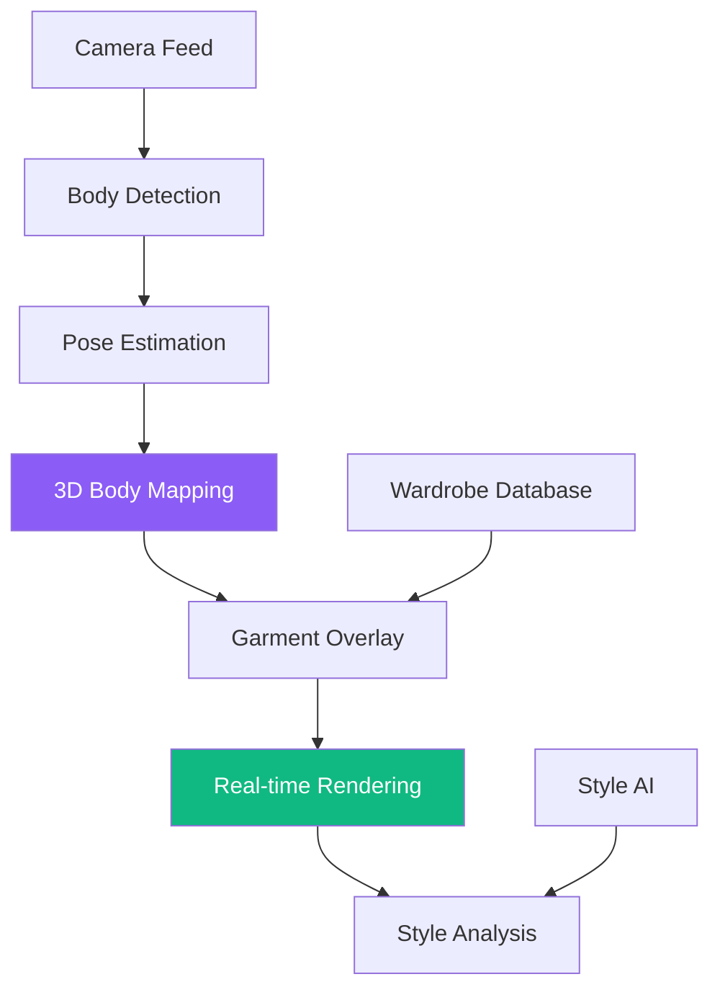

# AR Style Guidance

REFLEKT's **AR Style Guidance** brings fashion and technology together, allowing you to virtually try on outfits, receive personalized style recommendations, and make confident wardrobe decisions—all through your smart mirror's advanced augmented reality capabilities.

## Overview

AR Style Guidance uses computer vision and augmented reality to overlay clothing, accessories, and style suggestions directly onto your reflection. Get instant feedback on outfit combinations, discover new looks, and build confidence in your personal style.

### Key Features

- **Virtual Try-On**: See how clothes look without physically wearing them
- **Outfit Combinations**: AI-generated outfit suggestions from your wardrobe
- **Color Matching**: Intelligent color palette recommendations
- **Style Profiles**: Personalized fashion guidance based on preferences
- **Wardrobe Management**: Digital catalog of your clothing items
- **Shopping Integration**: Try items from partner retailers virtually

## How It Works

### AR Technology Stack



### Body Mapping

REFLEKT creates a 3D model of your body:

1. **Skeletal Detection**: Identifies body joints and posture
2. **Body Measurements**: Estimates dimensions (height, shoulders, waist)
3. **Movement Tracking**: Follows your movements in real-time
4. **Depth Sensing**: Creates accurate 3D representation

**Privacy Note**: Body mapping is temporary and deleted after session. No body images are stored.

## Virtual Try-On

### Supported Item Types

| Category | Examples | AR Accuracy |
|----------|----------|-------------|
| 👔 Tops | Shirts, blouses, sweaters, jackets | 95% realistic |
| 👖 Bottoms | Pants, skirts, shorts | 90% realistic |
| 👗 Dresses | Full-length, cocktail, casual | 92% realistic |
| 🧥 Outerwear | Coats, jackets, blazers | 93% realistic |
| 👓 Accessories | Glasses, hats, scarves, jewelry | 97% realistic |
| 👠 Footwear | Shoes, boots, sneakers (basic) | 85% realistic |

### Try-On Experience

**Activation**:
```
Voice: "REFLEKT, show me outfit options"
Touch: Tap AR Style icon
Automatic: Active Mode style suggestions
```

**Interaction Flow**:
```yaml
Step 1: Select Category
  - "What would you like to try on?"
  - [Tops] [Bottoms] [Outerwear] [Full Outfit]

Step 2: Choose Source
  - Your Wardrobe (saved items)
  - Shopping Catalog (partner stores)
  - Outfit Generator (AI combinations)

Step 3: Virtual Try-On
  - Item overlays on your body
  - Real-time movement tracking
  - 360° view (turn to see all angles)

Step 4: Customization
  - Change colors
  - Try different sizes
  - Mix and match pieces

Step 5: Decision
  - [Save to Favorites] [Add to Wardrobe] [Shop Now]
```

### Realistic Rendering

REFLEKT's AR engine provides:

- **Fabric Simulation**: Realistic material draping and movement
- **Lighting Adaptation**: Matches room lighting conditions
- **Shadow Casting**: Natural shadows for depth perception
- **Color Accuracy**: True-to-life color representation
- **Fit Indication**: Visual cues for size appropriateness

## Style Recommendations

### AI Fashion Advisor

REFLEKT's style AI considers:

**Personal Factors**:
- Body type and proportions
- Skin tone and undertones
- Personal color palette
- Style preferences (casual, formal, trendy, classic)
- Previous outfit choices

**Contextual Factors**:
- Weather and season
- Calendar events (meeting, date, workout)
- Occasion formality
- Current fashion trends (optional)

**Wardrobe Factors**:
- Available items
- Recent purchases
- Item wear frequency
- Seasonal appropriateness

### Outfit Generation

**AI-Generated Combinations**:

```yaml
Example Suggestion:
  Occasion: "Client presentation this morning"
  Weather: "Cool, 60°F, partly cloudy"

  Recommended Outfit:
    Top: "Navy blazer over white button-down"
    Bottom: "Gray dress pants"
    Shoes: "Brown oxford shoes"
    Accessories: "Silver watch, minimal jewelry"

  Style Notes:
    - "Professional but approachable"
    - "Navy complements your undertones"
    - "Layering appropriate for temperature"

  Alternatives:
    - Swap blazer for charcoal cardigan (less formal)
    - Add pocket square for extra polish
```

### Color Theory Integration

**Intelligent Color Matching**:

```javascript
// Example color palette analysis
User Profile:
  Skin Tone: "Medium-warm"
  Hair Color: "Dark brown"
  Eye Color: "Brown"

Best Colors:
  - Earth tones (olive, camel, rust)
  - Warm jewel tones (emerald, sapphire, amethyst)
  - Creams and warm whites

Avoid:
  - Cool pastels (baby blue, lavender)
  - Stark black (try charcoal instead)
  - Neon colors (overpowering)
```

**Outfit Color Harmony**:
- Complementary colors
- Analogous schemes
- Monochromatic variations
- Accent color suggestions

## Wardrobe Management

### Digital Closet

**Adding Items**:

1. **Camera Scan**: Hold item in front of mirror → auto-capture
2. **Photo Upload**: Import from phone gallery
3. **Shopping Integration**: Auto-add purchased items
4. **Manual Entry**: Input item details manually

**Item Information Stored**:
```yaml
Shirt_Navy_ButtonDown_001:
  Type: "Button-down shirt"
  Color: "Navy blue"
  Brand: "J.Crew"
  Size: "Medium"
  Season: ["Spring", "Summer", "Fall"]
  Formality: "Business casual"
  Last Worn: "2025-11-14"
  Wear Count: 12
  Care: "Machine wash cold"
  Tags: ["work", "versatile", "favorite"]
```

### Outfit History

Track what you've worn:

- **Calendar Integration**: "What did I wear to last month's client meeting?"
- **Photo Log**: Daily outfit photos (optional)
- **Outfit Rotation**: Ensures variety, prevents repeats
- **Frequency Analytics**: "You wear this blazer 2x/week"

### Packing Assistant

**Trip Planning**:
```
Destination: "New York City"
Dates: "Nov 20-24 (5 days)"
Weather: "40-55°F, chance of rain"
Events: "2 business meetings, 1 dinner, casual sightseeing"

Recommended Packing List:
  Professional:
    - 2 business outfits (meetings)
    - 1 smart-casual (dinner)
  Casual:
    - 2 daytime outfits
    - Comfortable walking shoes
  Essentials:
    - Umbrella
    - Light jacket
    - Scarf (versatile accessory)

Outfit Visualization: [Preview each day's outfit]
```

## Shopping Integration

### Partner Retail Network

Try before you buy from partner stores:

- **Fashion Retailers**: Nordstrom, Bloomingdale's, Macy's
- **Fast Fashion**: Zara, H&M, Uniqlo
- **Online Brands**: Everlane, Reformation, Stitch Fix
- **Luxury**: Saks Fifth Avenue, Neiman Marcus

### Virtual Shopping Experience

**Browse & Try**:
```
1. Browse catalog on mirror
2. Select item to try virtually
3. See it on your body in real-time
4. Check fit and style
5. Add to cart or save for later
6. Purchase through integrated checkout
```

**Fit Prediction**:
```
Based on your body measurements:
  - Size Recommendation: "Medium (best fit)"
  - Fit Type: "True to size"
  - Similar Items You Own: "Fits like your J.Crew oxford"
  - User Reviews: "95% say fits as expected"
```

### Sustainable Fashion

REFLEKT promotes conscious consumption:

- **Wardrobe Utilization**: "You have 3 similar blue shirts already"
- **Cost Per Wear**: Calculate value of purchases
- **Sustainable Brands**: Highlight eco-friendly options
- **Secondhand Suggestions**: Vintage and thrift alternatives

## Style Profiles

### Pre-Built Profiles

Choose a style archetype:

| Profile | Description | Key Elements |
|---------|-------------|--------------|
| Professional | Business attire, polished looks | Blazers, dress shirts, neutral colors |
| Casual Chic | Effortless, put-together casual | Jeans, tees, minimal accessories |
| Trendy | Fashion-forward, on-trend pieces | Bold patterns, latest styles |
| Classic | Timeless, traditional wardrobe | White shirts, navy blazers, tailored pants |
| Bohemian | Free-spirited, artistic expression | Flowing fabrics, earth tones, layers |
| Minimalist | Clean lines, simple color palette | Black, white, gray, structured pieces |
| Athleisure | Sporty comfort meets style | Sneakers, leggings, fitted tops |

### Custom Style Profile

Build your own:

```yaml
My Style Profile:
  Name: "Modern Professional"

  Preferred Items:
    - Tailored blazers
    - Wide-leg trousers
    - Silk blouses
    - Statement accessories

  Color Palette:
    Primary: ["Navy", "Charcoal", "Camel"]
    Accent: ["Burgundy", "Forest Green"]
    Neutral: ["White", "Cream", "Black"]

  Avoid:
    - Overly casual items (ripped jeans, graphic tees)
    - Neon colors
    - Ultra-trendy fast fashion

  Formality Range: "Business casual to business formal"

  Lifestyle Needs:
    - Work: 60%
    - Social: 25%
    - Casual: 15%
```

## Advanced Features

### Body Proportion Analysis

REFLEKT analyzes your proportions to suggest:

- **Best Fits**: "V-neck tops elongate your torso"
- **Proportional Balance**: "High-waisted pants balance your frame"
- **Flattering Cuts**: "A-line dresses complement your shape"

**Example Analysis**:
```
Body Type: "Inverted Triangle"

Styling Tips:
  - Balance broader shoulders with A-line skirts
  - V-necks and scoop necks create vertical lines
  - Avoid shoulder pads and boat necks
  - Embrace colorful bottoms, neutral tops
```

### Pattern & Print Guidance

**Scale Recommendations**:
- Small patterns for petite frames
- Large patterns for taller individuals
- Vertical stripes for elongation
- Horizontal stripes for added volume

**Pattern Mixing**:
```
Stripes + Florals: ✓ (vary scale)
Polka dots + Plaid: ✓ (same color family)
Leopard + Zebra: ✗ (too busy)
```

### Accessory Suggestions

Complete the look:

```yaml
Outfit: Navy suit, white shirt

Accessory Recommendations:
  Tie/Scarf:
    - "Burgundy silk tie (adds sophistication)"
    - "Patterned pocket square (subtle detail)"

  Jewelry:
    - "Silver watch (classic, professional)"
    - "Minimal stud earrings"

  Footwear:
    - "Brown leather oxfords (warm contrast to navy)"
    - "Black pumps (timeless professional)"

  Bag:
    - "Structured leather tote (polished)"
```

## Technical Specifications

### Hardware Requirements

- **Camera**: RGB-D camera (color + depth sensing)
- **Processor**: GPU for real-time rendering
- **Display**: High-resolution mirror display (4K recommended)
- **Sensors**: Depth sensor for 3D body mapping

### Performance Metrics

| Feature | Target | Actual |
|---------|--------|--------|
| AR Overlay Latency | <50ms | ~35ms |
| Frame Rate | 60fps | 60fps |
| Body Tracking Accuracy | >95% | ~97% |
| Item Rendering Quality | Photorealistic | High fidelity |

### Supported Formats

**3D Garment Models**:
- FBX, OBJ, glTF formats
- Texture mapping (diffuse, normal, roughness)
- Physics simulation data

## Privacy & Data

### What's Stored

```yaml
Stored Locally:
  - Wardrobe catalog (items you've added)
  - Outfit history (what you wore when)
  - Style preferences
  - Body measurements (encrypted)

NOT Stored:
  - Live video feed
  - Full-body images
  - Biometric data beyond measurements
```

### User Control

- **Delete Wardrobe**: Remove all saved items
- **Clear History**: Erase outfit logs
- **Reset Measurements**: Clear body data
- **Opt-out of Shopping**: Disable retail integration

## Use Cases

### Morning Outfit Selection

**Scenario**:
```
7:15 AM - User approaches mirror

REFLEKT: "Good morning! Based on today's client presentation
          and 60°F weather, I suggest..."

[Shows 3 outfit options with AR overlay]

User: "Show me option 2 with the gray pants"

[REFLEKT swaps pants virtually]

User: "Perfect. Save this outfit."

Total time: 90 seconds
Decision: Confident and informed
```

### Online Shopping

**Scenario**:
```
User: "Show me blazers from Nordstrom"

[REFLEKT displays catalog]

User selects navy blazer → tries virtually → sees fit

REFLEKT: "This blazer runs large. Recommend size Small
          based on your measurements."

User: "Add to cart"

Result: Reduced return rate, satisfied purchase
```

### Special Event Preparation

**Scenario**:
```
Event: Wedding in 2 weeks

User: "Help me find a wedding outfit"

REFLEKT:
  - Analyzes formality (semi-formal)
  - Checks weather forecast
  - Reviews existing wardrobe
  - Suggests 5 complete outfits

User tries each virtually → saves favorite → shops for missing piece
```

## Troubleshooting

**Q: AR overlay doesn't align with my body**
- A: Recalibrate body tracking in Settings → AR Style → Calibrate
- A: Ensure good lighting and clear view of full body

**Q: Colors look off**
- A: Adjust display color calibration
- A: Check room lighting (natural light recommended)

**Q: Movements are laggy**
- A: Close other apps to free up processing power
- A: Reduce AR quality setting for faster performance

**Q: Can't find an item in my wardrobe**
- A: Use search function with color/type filters
- A: Check if item is in correct category

## Related Features

- [Active Mode](/console/core-features/active-mode) - Receives daily outfit suggestions
- [Mood Sensing](/console/core-features/mood-sensing) - Mood-appropriate style recommendations
- [Voice Assistant](/console/core-features/voice-assistant) - Hands-free outfit browsing

## Next Steps

1. [Add items to your digital wardrobe](/console/get-started)
2. [Complete style profile setup](/console/development/configuration)
3. [Explore shopping integrations](/console/development/integrations)

---

**Your style, visualized. Your confidence, amplified. Your wardrobe, optimized.**
