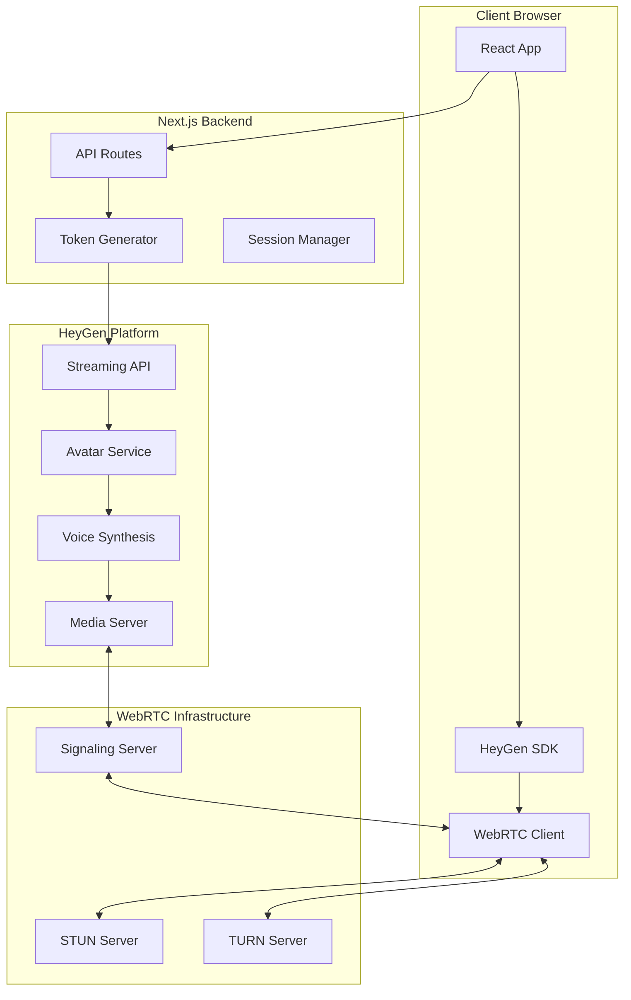
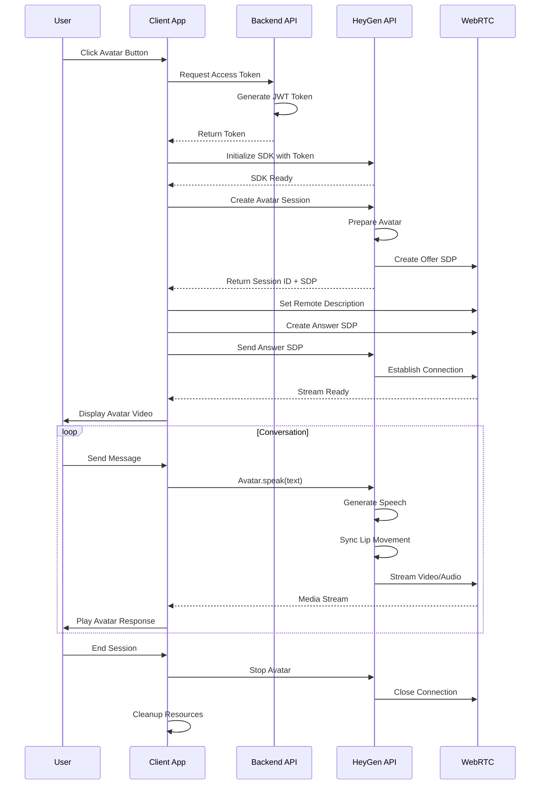
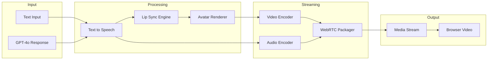

import { Tabs, Callout, Steps } from 'nextra/components'

# Interactive Avatars

REFLEKT Console integrates **HeyGen Streaming Avatar** technology to provide real-time interactive avatars that can speak responses from GPT-4o and other AI models through WebRTC streaming.

## Overview

The interactive avatar system provides:
- Real-time avatar rendering synchronized with AI responses
- WebRTC peer-to-peer streaming for low latency
- Multiple avatar options with different personalities
- Voice synthesis and lip-sync animation
- Session management and state handling

## Architecture

### System Architecture



### Sequence Diagram



## Data Flow



## Setup

<Steps>
### Get HeyGen API Keys

1. Sign up at [HeyGen Platform](https://app.heygen.com)
2. Navigate to API Settings
3. Generate your API key and secret

### Configure Environment

Add to your `.env.local`:

```env
# HeyGen Configuration
NEXT_PUBLIC_HEYGEN_API_KEY=your_api_key
HEYGEN_SECRET_KEY=your_secret_key

# Optional: Custom TURN server
TURN_SERVER_URL=turn:your-server.com:3478
TURN_USERNAME=username
TURN_PASSWORD=password
```

### Install Dependencies

The HeyGen SDK is already included in the console:

```json
{
  "dependencies": {
    "@heygen/streaming-avatar": "^2.0.16"
  }
}
```

### Enable Avatar Mode

The avatar button appears automatically in the chat interface when HeyGen is configured.
</Steps>

## Implementation

### API Routes

<Tabs items={['Access Token', 'Create Session', 'List Avatars']}>
  <Tabs.Tab>
    **Generate Access Token**
    
    ```typescript
    // app/api/heygen/access-token/route.ts
    import { SignJWT } from 'jose';
    
    export async function POST(req: Request) {
      try {
        const apiKey = process.env.NEXT_PUBLIC_HEYGEN_API_KEY;
        const secretKey = process.env.HEYGEN_SECRET_KEY;
        
        if (!apiKey || !secretKey) {
          return NextResponse.json(
            { error: 'HeyGen not configured' },
            { status: 500 }
          );
        }
        
        // Create JWT token
        const token = await new SignJWT({
          api_key: apiKey,
          exp: Math.floor(Date.now() / 1000) + 3600, // 1 hour
        })
        .setProtectedHeader({ alg: 'HS256' })
        .setIssuedAt()
        .sign(new TextEncoder().encode(secretKey));
        
        return NextResponse.json({ token });
      } catch (error) {
        console.error('Token generation failed:', error);
        return NextResponse.json(
          { error: 'Failed to generate token' },
          { status: 500 }
        );
      }
    }
    ```
  </Tabs.Tab>
  
  <Tabs.Tab>
    **Create Avatar Session**
    
    ```typescript
    // app/api/heygen/create-session/route.ts
    export async function POST(req: Request) {
      const { avatarId, voice, quality = 'high' } = await req.json();
      
      try {
        const response = await fetch(
          'https://api.heygen.com/v1/streaming/new',
          {
            method: 'POST',
            headers: {
              'X-Api-Key': process.env.HEYGEN_API_KEY!,
              'Content-Type': 'application/json',
            },
            body: JSON.stringify({
              avatar_id: avatarId,
              voice: {
                voice_id: voice?.voiceId || 'en-US-BrianNeural',
                rate: voice?.rate || 1.0,
                pitch: voice?.pitch || 0,
              },
              quality,
              version: 'latest',
            }),
          }
        );
        
        if (!response.ok) {
          throw new Error(`HeyGen API error: ${response.status}`);
        }
        
        const data = await response.json();
        
        return NextResponse.json({
          sessionId: data.session_id,
          sdp: data.sdp,
          iceServers: data.ice_servers || [],
        });
      } catch (error) {
        console.error('Session creation failed:', error);
        return NextResponse.json(
          { error: 'Failed to create session' },
          { status: 500 }
        );
      }
    }
    ```
  </Tabs.Tab>
  
  <Tabs.Tab>
    **List Available Avatars**
    
    ```typescript
    // app/api/heygen/list-avatars/route.ts
    export async function GET() {
      try {
        const response = await fetch(
          'https://api.heygen.com/v1/avatars',
          {
            headers: {
              'X-Api-Key': process.env.HEYGEN_API_KEY!,
            },
          }
        );
        
        if (!response.ok) {
          throw new Error('Failed to fetch avatars');
        }
        
        const data = await response.json();
        
        // Filter and format avatars
        const avatars = data.avatars.map((avatar: any) => ({
          id: avatar.avatar_id,
          name: avatar.name,
          preview: avatar.preview_url,
          gender: avatar.gender,
          style: avatar.style,
        }));
        
        return NextResponse.json({ avatars });
      } catch (error) {
        console.error('Failed to list avatars:', error);
        return NextResponse.json(
          { error: 'Failed to fetch avatars' },
          { status: 500 }
        );
      }
    }
    ```
  </Tabs.Tab>
</Tabs>

### Client Components

<Tabs items={['Avatar Modal', 'Session Hook', 'WebRTC Manager']}>
  <Tabs.Tab>
    **Avatar Modal Component**
    
    ```tsx
    // app/components/avatar/avatar-modal.tsx
    import { useState, useEffect } from 'react';
    import { StreamingAvatar } from '@heygen/streaming-avatar';
    
    export function AvatarModal({ isOpen, onClose }) {
      const [avatar, setAvatar] = useState<StreamingAvatar | null>(null);
      const [isLoading, setIsLoading] = useState(false);
      const [selectedAvatar, setSelectedAvatar] = useState('josh_lite3_20230714');
      
      const initializeAvatar = async () => {
        setIsLoading(true);
        
        try {
          // Get access token
          const tokenResponse = await fetch('/api/heygen/access-token', {
            method: 'POST',
          });
          const { token } = await tokenResponse.json();
          
          // Initialize SDK
          const newAvatar = new StreamingAvatar({ token });
          
          // Set up event listeners
          newAvatar.on('stream-ready', (stream) => {
            const videoElement = document.getElementById('avatar-video') as HTMLVideoElement;
            if (videoElement && stream) {
              videoElement.srcObject = stream;
              videoElement.play();
            }
          });
          
          newAvatar.on('stream-disconnected', () => {
            console.log('Stream disconnected');
          });
          
          setAvatar(newAvatar);
        } catch (error) {
          console.error('Failed to initialize avatar:', error);
        } finally {
          setIsLoading(false);
        }
      };
      
      const startSession = async () => {
        if (!avatar) return;
        
        try {
          await avatar.createStartAvatar({
            avatarName: selectedAvatar,
            quality: 'high',
            voice: {
              voiceId: 'en-US-BrianNeural',
              rate: 1.0,
            },
          });
        } catch (error) {
          console.error('Failed to start session:', error);
        }
      };
      
      const speak = async (text: string) => {
        if (!avatar) return;
        
        try {
          await avatar.speak({
            text,
            taskType: 'talk',
          });
        } catch (error) {
          console.error('Failed to speak:', error);
        }
      };
      
      return (
        <Dialog open={isOpen} onOpenChange={onClose}>
          <DialogContent className="max-w-4xl">
            <DialogHeader>
              <DialogTitle>Interactive Avatar</DialogTitle>
            </DialogHeader>
            
            <div className="grid grid-cols-2 gap-4">
              <div className="aspect-video bg-black rounded-lg overflow-hidden">
                <video
                  id="avatar-video"
                  className="w-full h-full object-cover"
                  autoPlay
                  playsInline
                />
              </div>
              
              <div className="space-y-4">
                <Select value={selectedAvatar} onValueChange={setSelectedAvatar}>
                  <SelectTrigger>
                    <SelectValue placeholder="Choose an avatar" />
                  </SelectTrigger>
                  <SelectContent>
                    <SelectItem value="josh_lite3_20230714">Josh</SelectItem>
                    <SelectItem value="anna_public">Anna</SelectItem>
                    <SelectItem value="wayne_lite">Wayne</SelectItem>
                  </SelectContent>
                </Select>
                
                <div className="flex gap-2">
                  <Button onClick={initializeAvatar} disabled={isLoading}>
                    Initialize
                  </Button>
                  <Button onClick={startSession} disabled={!avatar}>
                    Start Session
                  </Button>
                </div>
                
                <Textarea
                  placeholder="Enter text for avatar to speak..."
                  onKeyDown={(e) => {
                    if (e.key === 'Enter' && !e.shiftKey) {
                      e.preventDefault();
                      speak(e.currentTarget.value);
                      e.currentTarget.value = '';
                    }
                  }}
                />
              </div>
            </div>
          </DialogContent>
        </Dialog>
      );
    }
    ```
  </Tabs.Tab>
  
  <Tabs.Tab>
    **useStreamingAvatar Hook**
    
    ```typescript
    // app/components/avatar/logic/useStreamingAvatarSession.ts
    import { useEffect, useRef, useState } from 'react';
    import { StreamingAvatar, TaskType } from '@heygen/streaming-avatar';
    
    export function useStreamingAvatarSession() {
      const [avatar, setAvatar] = useState<StreamingAvatar | null>(null);
      const [isInitialized, setIsInitialized] = useState(false);
      const [isConnected, setIsConnected] = useState(false);
      const [isLoading, setIsLoading] = useState(false);
      const [error, setError] = useState<string | null>(null);
      
      const videoRef = useRef<HTMLVideoElement>(null);
      const audioRef = useRef<HTMLAudioElement>(null);
      
      // Initialize avatar SDK
      const initialize = async () => {
        if (isInitialized) return;
        
        setIsLoading(true);
        setError(null);
        
        try {
          // Get access token from API
          const response = await fetch('/api/heygen/access-token', {
            method: 'POST',
          });
          
          if (!response.ok) {
            throw new Error('Failed to get access token');
          }
          
          const { token } = await response.json();
          
          // Create avatar instance
          const newAvatar = new StreamingAvatar({
            token,
            basePath: '/api/heygen/sdk-proxy',
          });
          
          // Set up event handlers
          newAvatar.on('stream-ready', (stream) => {
            if (videoRef.current && stream) {
              videoRef.current.srcObject = stream;
              videoRef.current.play().catch(console.error);
            }
            setIsConnected(true);
          });
          
          newAvatar.on('stream-disconnected', () => {
            setIsConnected(false);
            if (videoRef.current) {
              videoRef.current.srcObject = null;
            }
          });
          
          newAvatar.on('error', (error) => {
            console.error('Avatar error:', error);
            setError(error.message);
          });
          
          setAvatar(newAvatar);
          setIsInitialized(true);
        } catch (err) {
          console.error('Initialization failed:', err);
          setError(err instanceof Error ? err.message : 'Failed to initialize');
        } finally {
          setIsLoading(false);
        }
      };
      
      // Start avatar session
      const startSession = async (avatarId: string, voiceId?: string) => {
        if (!avatar || !isInitialized) {
          throw new Error('Avatar not initialized');
        }
        
        setIsLoading(true);
        setError(null);
        
        try {
          await avatar.createStartAvatar({
            avatarName: avatarId,
            quality: 'high',
            voice: {
              voiceId: voiceId || 'en-US-BrianNeural',
              rate: 1.0,
              pitch: 0,
            },
          });
        } catch (err) {
          console.error('Failed to start session:', err);
          setError(err instanceof Error ? err.message : 'Failed to start session');
          throw err;
        } finally {
          setIsLoading(false);
        }
      };
      
      // Make avatar speak
      const speak = async (text: string, taskType: TaskType = 'talk') => {
        if (!avatar || !isConnected) {
          throw new Error('Avatar not connected');
        }
        
        try {
          await avatar.speak({ text, taskType });
        } catch (err) {
          console.error('Failed to speak:', err);
          setError(err instanceof Error ? err.message : 'Failed to speak');
          throw err;
        }
      };
      
      // Stop avatar session
      const stopSession = async () => {
        if (!avatar) return;
        
        try {
          await avatar.stopAvatar();
          setIsConnected(false);
        } catch (err) {
          console.error('Failed to stop session:', err);
        }
      };
      
      // Cleanup on unmount
      useEffect(() => {
        return () => {
          if (avatar) {
            avatar.stopAvatar().catch(console.error);
          }
        };
      }, [avatar]);
      
      return {
        videoRef,
        audioRef,
        isInitialized,
        isConnected,
        isLoading,
        error,
        initialize,
        startSession,
        speak,
        stopSession,
      };
    }
    ```
  </Tabs.Tab>
  
  <Tabs.Tab>
    **WebRTC Connection Manager**
    
    ```typescript
    // app/components/avatar/logic/webrtc-manager.ts
    export class WebRTCManager {
      private pc: RTCPeerConnection | null = null;
      private localStream: MediaStream | null = null;
      private remoteStream: MediaStream | null = null;
      
      constructor(private config: RTCConfiguration) {}
      
      async initialize(sdp: string): Promise<string> {
        // Create peer connection
        this.pc = new RTCPeerConnection(this.config);
        
        // Set up event handlers
        this.pc.onicecandidate = (event) => {
          if (event.candidate) {
            console.log('New ICE candidate:', event.candidate);
          }
        };
        
        this.pc.ontrack = (event) => {
          console.log('Received remote track');
          this.remoteStream = event.streams[0];
        };
        
        // Set remote description
        await this.pc.setRemoteDescription({
          type: 'offer',
          sdp: sdp,
        });
        
        // Create answer
        const answer = await this.pc.createAnswer();
        await this.pc.setLocalDescription(answer);
        
        return answer.sdp!;
      }
      
      async addIceCandidate(candidate: RTCIceCandidateInit): Promise<void> {
        if (!this.pc) throw new Error('Peer connection not initialized');
        
        await this.pc.addIceCandidate(new RTCIceCandidate(candidate));
      }
      
      getRemoteStream(): MediaStream | null {
        return this.remoteStream;
      }
      
      async close(): Promise<void> {
        if (this.localStream) {
          this.localStream.getTracks().forEach(track => track.stop());
        }
        
        if (this.pc) {
          this.pc.close();
          this.pc = null;
        }
      }
      
      getConnectionState(): RTCPeerConnectionState | null {
        return this.pc?.connectionState || null;
      }
      
      getStats(): Promise<RTCStatsReport> | null {
        return this.pc?.getStats() || null;
      }
    }
    ```
  </Tabs.Tab>
</Tabs>

## Avatar Gallery

Default avatars available in the system:

| Avatar ID | Name | Style | Voice Options |
|-----------|------|-------|--------------|
| josh_lite3_20230714 | Josh | Professional | en-US-BrianNeural, en-US-GuyNeural |
| anna_public | Anna | Friendly | en-US-JennyNeural, en-US-AriaNeural |
| wayne_lite | Wayne | Casual | en-US-ChristopherNeural, en-US-EricNeural |
| monica | Monica | Corporate | en-US-MichelleNeural, en-US-MonicaNeural |
| kayla | Kayla | Energetic | en-US-SaraNeural, en-US-AmberNeural |

## Voice Configuration

<Callout type="info">
HeyGen supports Azure Neural voices. You can customize voice parameters for each avatar.
</Callout>

```typescript
// Voice configuration options
interface VoiceConfig {
  voiceId: string;      // Azure voice ID
  rate?: number;        // Speed: 0.5 to 2.0 (default: 1.0)
  pitch?: number;       // Pitch: -50 to 50 (default: 0)
  volume?: number;      // Volume: 0 to 100 (default: 100)
  emotion?: string;     // Optional emotion style
}

// Example configurations
const voices = {
  professional: {
    voiceId: 'en-US-BrianNeural',
    rate: 0.95,
    pitch: -5,
  },
  friendly: {
    voiceId: 'en-US-JennyNeural',
    rate: 1.05,
    pitch: 5,
  },
  authoritative: {
    voiceId: 'en-US-GuyNeural',
    rate: 0.9,
    pitch: -10,
  },
};
```

## Integration with Chat

Connect the avatar to your chat system:

```typescript
// app/components/chat/chat-with-avatar.tsx
export function ChatWithAvatar() {
  const { messages, sendMessage } = useChat();
  const { speak, isConnected } = useStreamingAvatarSession();
  
  useEffect(() => {
    // Make avatar speak GPT-4o responses
    const lastMessage = messages[messages.length - 1];
    
    if (lastMessage?.role === 'assistant' && isConnected) {
      speak(lastMessage.content);
    }
  }, [messages, isConnected]);
  
  return (
    <div className="flex gap-4">
      <div className="flex-1">
        <ChatInterface />
      </div>
      <div className="w-96">
        <AvatarModal />
      </div>
    </div>
  );
}
```

## Performance Optimization

### Connection Quality

```typescript
// Monitor WebRTC connection quality
async function monitorConnectionQuality(pc: RTCPeerConnection) {
  const stats = await pc.getStats();
  
  stats.forEach((report) => {
    if (report.type === 'inbound-rtp' && report.mediaType === 'video') {
      console.log({
        packetsLost: report.packetsLost,
        jitter: report.jitter,
        frameRate: report.framesPerSecond,
        bytesReceived: report.bytesReceived,
      });
    }
  });
}
```

### Bandwidth Management

```typescript
// Adjust quality based on network conditions
function adjustQuality(bandwidth: number): 'low' | 'medium' | 'high' {
  if (bandwidth < 500000) return 'low';      // < 500 Kbps
  if (bandwidth < 1000000) return 'medium';  // < 1 Mbps
  return 'high';                             // >= 1 Mbps
}
```

## Troubleshooting

### Common Issues

| Issue | Cause | Solution |
|-------|-------|----------|
| Avatar not loading | Missing API key | Check HEYGEN_API_KEY in environment |
| No video stream | WebRTC blocked | Check browser permissions and firewall |
| Audio sync issues | Network latency | Use closer TURN server or reduce quality |
| Session timeout | Token expired | Refresh token every hour |
| Black video | CORS issues | Use the proxy route configuration |

### Debug Mode

Enable debug logging:

```typescript
// Enable HeyGen SDK debug mode
const avatar = new StreamingAvatar({
  token,
  debug: true,
  logLevel: 'verbose',
});

// Log WebRTC stats
setInterval(async () => {
  const stats = await avatar.getStats();
  console.log('Avatar stats:', stats);
}, 5000);
```

## Security Considerations

<Callout type="warning">
Never expose your HeyGen secret key in client-side code. Always generate access tokens server-side.
</Callout>

1. **Token Generation**: Always generate tokens server-side with expiration
2. **CORS Policy**: Configure proper CORS headers for WebRTC
3. **Rate Limiting**: Implement rate limiting on session creation
4. **Session Management**: Clean up abandoned sessions
5. **Content Filtering**: Validate text before sending to avatar

## Cost Optimization

- **Session Duration**: Close sessions when not in use
- **Quality Settings**: Use appropriate quality for use case
- **Caching**: Cache avatar list to reduce API calls
- **Pooling**: Reuse sessions when possible

## Next Steps

- [Voice Mode](/docs/voice-audio) - Add real-time voice conversations with GPT-4o
- [API Reference](/docs/api) - Complete API documentation
- [Supabase Setup](/docs/supabase) - Database configuration