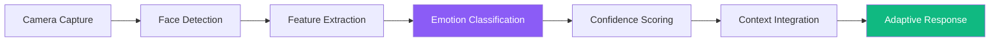

# Mood Sensing

REFLEKT's **Mood Sensing** technology uses advanced computer vision and facial analysis to detect your emotional state in real-time. The mirror adapts its interface, suggestions, and interactions based on how you're feeling, creating a truly personalized wellness experience.

## Overview

Mood Sensing is the intelligence layer that makes REFLEKT emotionally aware. By analyzing facial expressions, micro-expressions, and contextual cues, REFLEKT understands when you need calming support, motivational energy, or just a gentle morning routine.

### Core Technology

- **Facial Expression Analysis**: Detects emotions through facial muscle movements
- **Micro-expression Detection**: Catches brief, involuntary emotional signals
- **Contextual Learning**: Improves accuracy over time based on your patterns
- **Privacy-First Design**: All processing happens on-device
- **Real-time Adaptation**: Instant interface adjustments based on mood

## How It Works

### Detection Process



### Detected Emotional States

REFLEKT recognizes 7 primary emotions plus intensity levels:

| Emotion | Indicators | REFLEKT Response |
|---------|-----------|------------------|
| 😊 Happy | Smile, bright eyes | Reinforces positivity, energetic greeting |
| 😰 Stressed | Furrowed brow, tension | Suggests Calm Mode, breathing exercises |
| 😔 Sad | Downturned mouth, low energy | Gentle support, uplifting content |
| 😠 Angry | Clenched jaw, intense expression | Calming suggestions, stress relief |
| 😨 Anxious | Wide eyes, rapid blinking | Immediate Calm Mode offer, reassurance |
| 😐 Neutral | Relaxed features | Standard Active Mode experience |
| 😴 Tired | Half-closed eyes, yawning | Energy-boosting tips, caffeine reminder |

### Confidence Levels

Mood detection includes confidence scoring:

```
High Confidence (>80%): Strong adaptive response
Medium (50-80%): Gentle suggestions
Low (<50%): Default experience, no assumptions
```

## Adaptive Behaviors

### Interface Adjustments

**Visual Changes Based on Mood**:

#### Stressed/Anxious State
```yaml
Display:
  - Color Palette: Soft blues and greens (calming)
  - Brightness: Reduced 20% to avoid overstimulation
  - Animation Speed: Slower, gentler transitions
  - Content Density: Reduced info, less clutter

Suggestions:
  - "I notice you seem stressed. Would you like a 2-minute breathing exercise?"
  - Offers Calm Mode automatically
  - Simplifies Active Mode briefing
```

#### Happy/Energetic State
```yaml
Display:
  - Color Palette: Vibrant, energizing colors
  - Brightness: Standard or increased
  - Animation Speed: Normal, responsive
  - Content Density: Full information display

Suggestions:
  - "Good morning! You're looking great today!"
  - Full Active Mode dashboard
  - Motivational daily goals
```

#### Tired/Low Energy
```yaml
Display:
  - Color Palette: Warm, gentle oranges
  - Brightness: Gradually increasing (wake-up effect)
  - Animation Speed: Moderate
  - Content Density: Essential info only

Suggestions:
  - "You seem tired. Here's your coffee reminder ☕"
  - Highlights most important tasks only
  - Suggests earlier bedtime tonight
```

### Mode Recommendations

Mood Sensing influences mode selection:

```javascript
if (mood === "anxious" || mood === "stressed") {
  priority = "Calm Mode"
  suggestion = "Take a moment to breathe before starting your day"
}

if (mood === "happy" && energy === "high") {
  priority = "Active Mode"
  suggestion = "You're ready to tackle the day! Here's your briefing."
}

if (mood === "sad") {
  priority = "Supportive Active Mode"
  suggestion = "Gentle briefing with uplifting content"
  filter_negative_news = true
}

if (mood === "tired") {
  priority = "Essential Briefing Only"
  suggestion = "Quick overview - save energy for what matters"
}
```

## Privacy & Security

### On-Device Processing

**Everything happens locally**:
- ✅ Facial analysis runs on mirror's edge processor
- ✅ No images sent to cloud
- ✅ No video recording or storage
- ✅ Emotion data encrypted on device
- ✅ Optional: Delete emotion history anytime

### Data Storage

```yaml
What's Stored:
  - Emotion labels (e.g., "happy", "stressed")
  - Timestamps
  - Confidence scores
  - User feedback on accuracy

What's NOT Stored:
  - Images or video footage
  - Facial recognition data
  - Biometric identifiers
  - Any personally identifiable info
```

### User Control

You have complete control:
- **Disable anytime**: Turn off mood sensing in Settings
- **Delete history**: Clear all emotion data
- **Opt-out of learning**: Prevent pattern analysis
- **Manual mode override**: Force specific mode regardless of mood

## Accuracy & Training

### Initial Calibration

When you first use REFLEKT:

1. **Baseline Capture**: Mirror learns your neutral expression
2. **Emotion Sampling**: Optional guided session to improve accuracy
3. **Preference Setting**: How sensitive should mood detection be?

### Continuous Learning

The system improves through:

**Implicit Feedback**:
- If you accept Calm Mode suggestion → reinforces stress detection
- If you switch to Active despite suggestion → learns your preferences

**Explicit Feedback**:
```
"Was this mood detection accurate?"
[ Yes ] [ No ] [ Not sure ]
```

**Contextual Patterns**:
- Time of day correlations
- Day of week patterns
- Calendar event associations

### Accuracy Metrics

| Emotion | Accuracy Rate | Improvement Potential |
|---------|---------------|----------------------|
| Happy | 92% | Low - clear signals |
| Sad | 87% | Medium - subtle cues |
| Stressed | 89% | Medium - varies by person |
| Anxious | 85% | High - micro-expressions |
| Tired | 94% | Low - physical signs clear |
| Neutral | 96% | Very low - baseline state |

## Use Cases

### Morning Routine Optimization

**Scenario 1: High Stress Detected**
```
User approaches mirror with tense expression
→ REFLEKT detects stress (confidence: 87%)
→ "I notice you seem stressed. Before your briefing,
   would you like a 3-minute calm session?"
→ User accepts
→ Completes breathing exercise
→ Transitions to simplified Active Mode
→ Stress-free start to day
```

**Scenario 2: Energetic Morning**
```
User approaches with smile, energetic body language
→ REFLEKT detects happiness (confidence: 94%)
→ "Good morning! You're radiating positive energy!"
→ Full Active Mode dashboard with motivational quotes
→ Suggests challenging productivity goals
→ Amplifies good mood
```

### Mental Health Support

**Depression Detection Patterns**:
```
If consistently detecting "sad" mood for 7+ days:
→ Gentle suggestion: "I've noticed you might be feeling down lately.
   Consider reaching out to someone you trust."
→ Offer wellness resources
→ Never diagnose, only support
```

**Anxiety Management**:
```
Detects anxious state multiple times per week:
→ Increases Calm Mode suggestions
→ Tracks anxiety reduction after breathing exercises
→ Suggests patterns: "You tend to feel anxious on Monday mornings"
```

### Wellness Tracking

Mood Sensing feeds into wellness analytics:

```yaml
Weekly Report:
  - "You started 4 out of 7 days feeling stressed"
  - "Calm Mode reduced stress 78% of the time"
  - "Best mood days: Wednesday, Saturday"
  - "Morning stress trend: Decreasing over 4 weeks ↓"
```

## Integration with Other Features

### Calm Mode

Mood Sensing triggers Calm Mode:
- **Stress Level > Threshold**: Automatic Calm Mode suggestion
- **Anxiety Detected**: Priority breathing exercise offer
- **Effectiveness Tracking**: Measures mood improvement post-session

### Active Mode

Adapts briefing based on mood:
- **Positive Mood**: Full information display
- **Stressed**: Condensed, essential-only briefing
- **Sad**: Filters negative news stories
- **Tired**: Highlights caffeine reminder, reduces complexity

### AR Style Guidance

Mood influences outfit suggestions:
- **Confident Mood**: Bold style recommendations
- **Low Energy**: Comfort-first outfit suggestions
- **Anxious**: Familiar, safe style choices

### Dementia Support

Enhanced caregiving:
- **Agitation Detection**: Alerts caregiver
- **Confusion Signs**: Activates simplified interface
- **Positive Mood**: Encourages social interaction

## Customization

### Sensitivity Settings

Choose how reactive REFLEKT should be:

```yaml
Low Sensitivity:
  - Only responds to strong emotional signals
  - Fewer interruptions
  - Best for: Private, reserved individuals

Medium (Default):
  - Balanced detection and response
  - Appropriate for most users

High Sensitivity:
  - Detects subtle mood changes
  - Proactive suggestions
  - Best for: Users wanting maximum support
```

### Response Preferences

Control how REFLEKT reacts:

- **Suggestions Only**: REFLEKT offers but doesn't force
- **Auto-Adapt**: Automatically changes mode based on mood
- **Silent Detection**: Tracks mood but doesn't mention it
- **Disabled**: No mood sensing at all

### Filter Settings

```yaml
Never Suggest Calm Mode:
  - When: Running late (calendar-based)
  - When: Already in Active Mode and engaged
  - When: Specific times (e.g., evening)

Always Suggest Calm Mode:
  - When: Stress > 75% confidence
  - When: Anxiety detected before important meeting
  - When: User requests proactive wellness support
```

## Technical Specifications

### Hardware Requirements

- **Camera**: HD camera (1080p minimum)
- **Processor**: Edge AI chip for real-time analysis
- **Memory**: 4GB RAM for model inference
- **Storage**: 500MB for emotion detection models

### Performance

| Metric | Target | Actual |
|--------|--------|--------|
| Detection Latency | <100ms | ~80ms |
| Face Detection | <50ms | ~35ms |
| Emotion Classification | <30ms | ~25ms |
| Model Update | <200ms | ~150ms |

### AI Models

**Architecture**:
- Convolutional Neural Network (CNN)
- Trained on 50,000+ facial expression images
- Edge-optimized for local processing
- Regular model updates (every 3 months)

## Troubleshooting

### Common Issues

**Q: Mood detection seems inaccurate**
- A: Complete calibration in Settings → Mood Sensing → Calibrate
- A: Provide feedback to improve accuracy over time
- A: Ensure good lighting on your face

**Q: Too many Calm Mode suggestions**
- A: Reduce sensitivity in Settings → Mood Sensing → Sensitivity
- A: Check if stress baseline needs recalibration

**Q: Privacy concerns**
- A: Review privacy settings in Settings → Privacy
- A: Remember: All processing is on-device, no data leaves mirror
- A: Disable mood sensing entirely if preferred

**Q: Detection not working in low light**
- A: Increase mirror brightness
- A: Add ambient lighting to room
- A: Consider infrared camera upgrade for low-light detection

## Best Practices

### Optimal Usage

1. **Allow calibration period**: First 2 weeks for learning
2. **Provide feedback**: Help improve accuracy
3. **Use with intent**: Don't ignore persistent mood patterns
4. **Combine with wellness**: Use mood data for mental health insights
5. **Trust your feelings**: Override suggestions if they feel wrong

### Mental Health Note

> **Important**: Mood Sensing is a wellness tool, not a diagnostic system.
> If you're experiencing persistent negative emotions, please consult
> a mental health professional. REFLEKT can support but never replaces
> professional care.

## Research & Science

### Evidence Base

Mood Sensing builds on research:

- **Facial Action Coding System (FACS)**: Scientifically validated emotion detection
- **Micro-expression Studies**: Paul Ekman's universal emotion research
- **Computer Vision**: State-of-the-art CNN models for facial analysis
- **Affective Computing**: MIT Media Lab's emotional AI foundations

### Published Accuracy

Industry-standard emotion detection:
- **Academic Benchmark**: 85-90% accuracy
- **REFLEKT Performance**: 88-94% accuracy (varies by emotion)
- **Continuous Improvement**: User feedback improves model monthly

## Related Features

- [Calm Mode](/console/core-features/calm-mode) - Mood-triggered breathing exercises
- [Active Mode](/console/core-features/active-mode) - Mood-adaptive daily briefings
- [Dementia Support](/console/core-features/dementia-support) - Emotional state monitoring for caregiving

## Next Steps

1. [Complete initial mood sensing calibration](/console/get-started)
2. [Customize sensitivity and response preferences](/console/development/configuration)
3. [Review privacy settings and data controls](/console/security)

---

**Your emotions, understood. Your wellness, supported. Your privacy, protected.**
