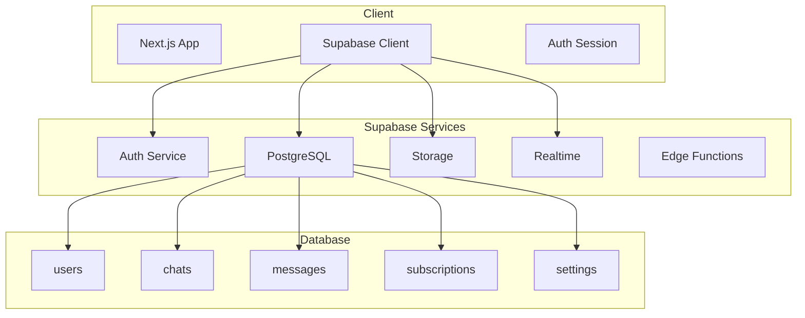

import { Tabs, Callout, Steps } from 'nextra/components'

# Backend Infrastructure

REFLEKT Console uses **Supabase** as the backend for authentication, PostgreSQL database, real-time subscriptions, and file storage for the GPT-4o powered chat platform. This guide covers complete setup, schema design, RLS policies, and best practices.

## Overview

Supabase provides:
- **Authentication**: Email/password, OAuth, magic links
- **Database**: PostgreSQL with Row Level Security (RLS)
- **Storage**: S3-compatible file storage
- **Real-time**: WebSocket subscriptions for live updates
- **Edge Functions**: Serverless functions (optional)
- **Vector Database**: pgvector for embeddings (optional)

## Architecture



## Setup

<Steps>
### Create Supabase Project

1. Go to [supabase.com](https://supabase.com) and create an account
2. Create a new project
3. Choose a region close to your users
4. Save your database password securely

### Get API Keys

Navigate to **Settings → API** in your Supabase dashboard:

```env
# Add to .env.local
NEXT_PUBLIC_SUPABASE_URL=https://your-project.supabase.co
NEXT_PUBLIC_SUPABASE_ANON_KEY=your-anon-key
SUPABASE_SERVICE_ROLE_KEY=your-service-role-key
```

### Install Client Libraries

```bash
pnpm add @supabase/supabase-js @supabase/ssr
```

### Configure Client

Create the Supabase client configuration:

```typescript
// lib/supabase/client.ts
import { createBrowserClient } from '@supabase/ssr'
import type { Database } from '@/types/database'

export function createClient() {
  return createBrowserClient<Database>(
    process.env.NEXT_PUBLIC_SUPABASE_URL!,
    process.env.NEXT_PUBLIC_SUPABASE_ANON_KEY!
  )
}
```

```typescript
// lib/supabase/server.ts
import { createServerClient } from '@supabase/ssr'
import { cookies } from 'next/headers'
import type { Database } from '@/types/database'

export async function createServerSupabaseClient() {
  const cookieStore = await cookies()

  return createServerClient<Database>(
    process.env.NEXT_PUBLIC_SUPABASE_URL!,
    process.env.NEXT_PUBLIC_SUPABASE_ANON_KEY!,
    {
      cookies: {
        getAll() {
          return cookieStore.getAll()
        },
        setAll(cookiesToSet) {
          cookiesToSet.forEach(({ name, value, options }) =>
            cookieStore.set(name, value, options)
          )
        },
      },
    }
  )
}
```
</Steps>

## Database Schema

<Tabs items={['Core Tables', 'Migrations', 'Types']}>
  <Tabs.Tab>
    **Core Database Tables**

    ```sql
    -- Users table (extends Supabase auth.users)
    CREATE TABLE public.users (
      id UUID PRIMARY KEY REFERENCES auth.users(id) ON DELETE CASCADE,
      email TEXT UNIQUE,
      username TEXT UNIQUE,
      full_name TEXT,
      avatar_url TEXT,
      created_at TIMESTAMP WITH TIME ZONE DEFAULT NOW(),
      updated_at TIMESTAMP WITH TIME ZONE DEFAULT NOW(),
      is_anonymous BOOLEAN DEFAULT false,
      subscription_tier TEXT DEFAULT 'free',
      daily_message_count INTEGER DEFAULT 0,
      daily_pro_message_count INTEGER DEFAULT 0,
      last_message_reset TIMESTAMP WITH TIME ZONE DEFAULT NOW(),
      settings JSONB DEFAULT '{}',
      metadata JSONB DEFAULT '{}'
    );

    -- Chats table
    CREATE TABLE public.chats (
      id UUID PRIMARY KEY DEFAULT gen_random_uuid(),
      user_id UUID REFERENCES public.users(id) ON DELETE CASCADE,
      title TEXT,
      model TEXT DEFAULT 'gpt-4o',
      system_prompt TEXT,
      temperature FLOAT DEFAULT 0.7,
      max_tokens INTEGER DEFAULT 4096,
      created_at TIMESTAMP WITH TIME ZONE DEFAULT NOW(),
      updated_at TIMESTAMP WITH TIME ZONE DEFAULT NOW(),
      is_archived BOOLEAN DEFAULT false,
      metadata JSONB DEFAULT '{}'
    );

    -- Messages table
    CREATE TABLE public.messages (
      id UUID PRIMARY KEY DEFAULT gen_random_uuid(),
      chat_id UUID REFERENCES public.chats(id) ON DELETE CASCADE,
      role TEXT NOT NULL CHECK (role IN ('user', 'assistant', 'system', 'tool')),
      content TEXT NOT NULL,
      model TEXT,
      tokens_used INTEGER,
      cost DECIMAL(10,6),
      attachments JSONB DEFAULT '[]',
      tool_calls JSONB DEFAULT '[]',
      created_at TIMESTAMP WITH TIME ZONE DEFAULT NOW(),
      metadata JSONB DEFAULT '{}'
    );

    -- Subscriptions table
    CREATE TABLE public.subscriptions (
      id UUID PRIMARY KEY DEFAULT gen_random_uuid(),
      user_id UUID REFERENCES public.users(id) ON DELETE CASCADE,
      stripe_customer_id TEXT UNIQUE,
      stripe_subscription_id TEXT UNIQUE,
      plan TEXT NOT NULL,
      status TEXT NOT NULL,
      current_period_start TIMESTAMP WITH TIME ZONE,
      current_period_end TIMESTAMP WITH TIME ZONE,
      created_at TIMESTAMP WITH TIME ZONE DEFAULT NOW(),
      updated_at TIMESTAMP WITH TIME ZONE DEFAULT NOW(),
      metadata JSONB DEFAULT '{}'
    );

    -- Settings table
    CREATE TABLE public.settings (
      id UUID PRIMARY KEY DEFAULT gen_random_uuid(),
      user_id UUID REFERENCES public.users(id) ON DELETE CASCADE,
      key TEXT NOT NULL,
      value JSONB NOT NULL,
      created_at TIMESTAMP WITH TIME ZONE DEFAULT NOW(),
      updated_at TIMESTAMP WITH TIME ZONE DEFAULT NOW(),
      UNIQUE(user_id, key)
    );

    -- Create indexes for performance
    CREATE INDEX idx_chats_user_id ON public.chats(user_id);
    CREATE INDEX idx_messages_chat_id ON public.messages(chat_id);
    CREATE INDEX idx_messages_created_at ON public.messages(created_at DESC);
    CREATE INDEX idx_subscriptions_user_id ON public.subscriptions(user_id);
    CREATE INDEX idx_settings_user_id ON public.settings(user_id);
    ```
  </Tabs.Tab>

  <Tabs.Tab>
    **Database Migrations**

    ```sql
    -- Migration: 001_initial_schema.sql
    BEGIN;

    -- Enable necessary extensions
    CREATE EXTENSION IF NOT EXISTS "uuid-ossp";
    CREATE EXTENSION IF NOT EXISTS "pgcrypto";
    CREATE EXTENSION IF NOT EXISTS "pg_trgm"; -- For text search

    -- Create updated_at trigger function
    CREATE OR REPLACE FUNCTION trigger_set_updated_at()
    RETURNS TRIGGER AS $$
    BEGIN
      NEW.updated_at = NOW();
      RETURN NEW;
    END;
    $$ LANGUAGE plpgsql;

    -- Apply updated_at triggers
    CREATE TRIGGER set_updated_at
      BEFORE UPDATE ON public.users
      FOR EACH ROW
      EXECUTE FUNCTION trigger_set_updated_at();

    CREATE TRIGGER set_updated_at
      BEFORE UPDATE ON public.chats
      FOR EACH ROW
      EXECUTE FUNCTION trigger_set_updated_at();

    CREATE TRIGGER set_updated_at
      BEFORE UPDATE ON public.subscriptions
      FOR EACH ROW
      EXECUTE FUNCTION trigger_set_updated_at();

    CREATE TRIGGER set_updated_at
      BEFORE UPDATE ON public.settings
      FOR EACH ROW
      EXECUTE FUNCTION trigger_set_updated_at();

    COMMIT;

    -- Migration: 002_vector_search.sql
    -- For AI embeddings and semantic search
    BEGIN;

    CREATE EXTENSION IF NOT EXISTS vector;

    CREATE TABLE public.embeddings (
      id UUID PRIMARY KEY DEFAULT gen_random_uuid(),
      message_id UUID REFERENCES public.messages(id) ON DELETE CASCADE,
      embedding vector(1536), -- OpenAI embeddings dimension
      created_at TIMESTAMP WITH TIME ZONE DEFAULT NOW()
    );

    CREATE INDEX idx_embeddings_vector ON public.embeddings
    USING ivfflat (embedding vector_cosine_ops)
    WITH (lists = 100);

    COMMIT;

    -- Migration: 003_audit_logs.sql
    BEGIN;

    CREATE TABLE public.audit_logs (
      id UUID PRIMARY KEY DEFAULT gen_random_uuid(),
      user_id UUID REFERENCES public.users(id) ON DELETE SET NULL,
      action TEXT NOT NULL,
      entity_type TEXT,
      entity_id UUID,
      old_data JSONB,
      new_data JSONB,
      ip_address INET,
      user_agent TEXT,
      created_at TIMESTAMP WITH TIME ZONE DEFAULT NOW()
    );

    CREATE INDEX idx_audit_logs_user_id ON public.audit_logs(user_id);
    CREATE INDEX idx_audit_logs_created_at ON public.audit_logs(created_at DESC);

    COMMIT;
    ```
  </Tabs.Tab>

  <Tabs.Tab>
    **TypeScript Types**

    ```typescript
    // types/database.ts
    export type Json =
      | string
      | number
      | boolean
      | null
      | { [key: string]: Json | undefined }
      | Json[]

    export interface Database {
      public: {
        Tables: {
          users: {
            Row: {
              id: string
              email: string | null
              username: string | null
              full_name: string | null
              avatar_url: string | null
              created_at: string
              updated_at: string
              is_anonymous: boolean
              subscription_tier: string
              daily_message_count: number
              daily_pro_message_count: number
              last_message_reset: string
              settings: Json
              metadata: Json
            }
            Insert: Omit<Row, 'id' | 'created_at' | 'updated_at'>
            Update: Partial<Insert>
          }
          chats: {
            Row: {
              id: string
              user_id: string
              title: string | null
              model: string | null
              system_prompt: string | null
              temperature: number
              max_tokens: number
              created_at: string
              updated_at: string
              is_archived: boolean
              metadata: Json
            }
            Insert: Omit<Row, 'id' | 'created_at' | 'updated_at'>
            Update: Partial<Insert>
          }
          messages: {
            Row: {
              id: string
              chat_id: string
              role: 'user' | 'assistant' | 'system' | 'tool'
              content: string
              model: string | null
              tokens_used: number | null
              cost: number | null
              attachments: Json
              tool_calls: Json
              created_at: string
              metadata: Json
            }
            Insert: Omit<Row, 'id' | 'created_at'>
            Update: Partial<Insert>
          }
          subscriptions: {
            Row: {
              id: string
              user_id: string
              stripe_customer_id: string | null
              stripe_subscription_id: string | null
              plan: string
              status: string
              current_period_start: string | null
              current_period_end: string | null
              created_at: string
              updated_at: string
              metadata: Json
            }
            Insert: Omit<Row, 'id' | 'created_at' | 'updated_at'>
            Update: Partial<Insert>
          }
          settings: {
            Row: {
              id: string
              user_id: string
              key: string
              value: Json
              created_at: string
              updated_at: string
            }
            Insert: Omit<Row, 'id' | 'created_at' | 'updated_at'>
            Update: Partial<Insert>
          }
        }
      }
    }
    ```
  </Tabs.Tab>
</Tabs>

## Row Level Security (RLS)

<Callout type="warning">
Always enable RLS on all tables to ensure data security. Never expose the service role key to the client.
</Callout>

```sql
-- Enable RLS on all tables
ALTER TABLE public.users ENABLE ROW LEVEL SECURITY;
ALTER TABLE public.chats ENABLE ROW LEVEL SECURITY;
ALTER TABLE public.messages ENABLE ROW LEVEL SECURITY;
ALTER TABLE public.subscriptions ENABLE ROW LEVEL SECURITY;
ALTER TABLE public.settings ENABLE ROW LEVEL SECURITY;

-- Users policies
CREATE POLICY "Users can view own profile"
  ON public.users FOR SELECT
  USING (auth.uid() = id);

CREATE POLICY "Users can update own profile"
  ON public.users FOR UPDATE
  USING (auth.uid() = id);

-- Chats policies
CREATE POLICY "Users can view own chats"
  ON public.chats FOR SELECT
  USING (auth.uid() = user_id);

CREATE POLICY "Users can create own chats"
  ON public.chats FOR INSERT
  WITH CHECK (auth.uid() = user_id);

CREATE POLICY "Users can update own chats"
  ON public.chats FOR UPDATE
  USING (auth.uid() = user_id);

CREATE POLICY "Users can delete own chats"
  ON public.chats FOR DELETE
  USING (auth.uid() = user_id);

-- Messages policies
CREATE POLICY "Users can view messages in own chats"
  ON public.messages FOR SELECT
  USING (
    EXISTS (
      SELECT 1 FROM public.chats
      WHERE chats.id = messages.chat_id
      AND chats.user_id = auth.uid()
    )
  );

CREATE POLICY "Users can create messages in own chats"
  ON public.messages FOR INSERT
  WITH CHECK (
    EXISTS (
      SELECT 1 FROM public.chats
      WHERE chats.id = messages.chat_id
      AND chats.user_id = auth.uid()
    )
  );

-- Subscriptions policies
CREATE POLICY "Users can view own subscription"
  ON public.subscriptions FOR SELECT
  USING (auth.uid() = user_id);

-- Settings policies
CREATE POLICY "Users can manage own settings"
  ON public.settings FOR ALL
  USING (auth.uid() = user_id);
```

## Authentication

<Tabs items={['Setup', 'Email Auth', 'OAuth', 'Session Management']}>
  <Tabs.Tab>
    **Authentication Setup**

    ```typescript
    // lib/auth/config.ts
    import { createClient } from '@/lib/supabase/client'

    export const authConfig = {
      providers: ['email', 'google', 'github'],
      redirectTo: process.env.NEXT_PUBLIC_APP_URL || 'http://localhost:3000',
      emailRedirectTo: '/auth/callback',

      // Session configuration
      session: {
        expiresIn: 60 * 60 * 24 * 7, // 7 days
        refreshThreshold: 60 * 60, // Refresh if less than 1 hour left
      },

      // Rate limiting
      rateLimits: {
        signUp: { points: 5, duration: 60 * 60 }, // 5 signups per hour
        signIn: { points: 10, duration: 60 * 60 }, // 10 attempts per hour
      }
    }
    ```
  </Tabs.Tab>

  <Tabs.Tab>
    **Email Authentication**

    ```typescript
    // app/auth/sign-up/page.tsx
    'use client'

    import { useState } from 'react'
    import { createClient } from '@/lib/supabase/client'
    import { useRouter } from 'next/navigation'

    export default function SignUp() {
      const [email, setEmail] = useState('')
      const [password, setPassword] = useState('')
      const [loading, setLoading] = useState(false)
      const router = useRouter()
      const supabase = createClient()

      const handleSignUp = async (e: React.FormEvent) => {
        e.preventDefault()
        setLoading(true)

        const { data, error } = await supabase.auth.signUp({
          email,
          password,
          options: {
            emailRedirectTo: `${window.location.origin}/auth/callback`,
            data: {
              // Additional user metadata
              full_name: '',
              avatar_url: '',
            }
          }
        })

        if (error) {
          console.error('Sign up error:', error)
        } else {
          // Create user profile
          await supabase.from('users').insert({
            id: data.user?.id,
            email: data.user?.email,
          })

          router.push('/auth/verify-email')
        }

        setLoading(false)
      }

      return (
        <form onSubmit={handleSignUp}>
          <input
            type="email"
            value={email}
            onChange={(e) => setEmail(e.target.value)}
            placeholder="Email"
            required
          />
          <input
            type="password"
            value={password}
            onChange={(e) => setPassword(e.target.value)}
            placeholder="Password"
            required
          />
          <button type="submit" disabled={loading}>
            {loading ? 'Creating account...' : 'Sign Up'}
          </button>
        </form>
      )
    }
    ```

    ```typescript
    // app/auth/sign-in/page.tsx
    export default function SignIn() {
      const handleSignIn = async (e: React.FormEvent) => {
        e.preventDefault()

        const { data, error } = await supabase.auth.signInWithPassword({
          email,
          password,
        })

        if (!error) {
          router.push('/chat')
        }
      }

      const handleMagicLink = async () => {
        const { error } = await supabase.auth.signInWithOtp({
          email,
          options: {
            emailRedirectTo: `${window.location.origin}/auth/callback`,
          }
        })
      }

      return (
        // Sign in form UI
      )
    }
    ```
  </Tabs.Tab>

  <Tabs.Tab>
    **OAuth Providers**

    ```typescript
    // app/auth/oauth/page.tsx
    import { createClient } from '@/lib/supabase/client'

    export default function OAuthSignIn() {
      const supabase = createClient()

      const signInWithGoogle = async () => {
        const { error } = await supabase.auth.signInWithOAuth({
          provider: 'google',
          options: {
            redirectTo: `${window.location.origin}/auth/callback`,
            queryParams: {
              access_type: 'offline',
              prompt: 'consent',
            }
          }
        })
      }

      const signInWithGitHub = async () => {
        const { error } = await supabase.auth.signInWithOAuth({
          provider: 'github',
          options: {
            redirectTo: `${window.location.origin}/auth/callback`,
            scopes: 'read:user user:email'
          }
        })
      }

      return (
        <div>
          <button onClick={signInWithGoogle}>
            Sign in with Google
          </button>
          <button onClick={signInWithGitHub}>
            Sign in with GitHub
          </button>
        </div>
      )
    }
    ```

    ```typescript
    // app/auth/callback/route.ts
    import { createServerSupabaseClient } from '@/lib/supabase/server'
    import { NextResponse } from 'next/server'

    export async function GET(request: Request) {
      const requestUrl = new URL(request.url)
      const code = requestUrl.searchParams.get('code')

      if (code) {
        const supabase = await createServerSupabaseClient()
        await supabase.auth.exchangeCodeForSession(code)
      }

      return NextResponse.redirect(new URL('/chat', request.url))
    }
    ```
  </Tabs.Tab>

  <Tabs.Tab>
    **Session Management**

    ```typescript
    // hooks/use-auth.ts
    import { useEffect, useState } from 'react'
    import { createClient } from '@/lib/supabase/client'
    import type { User, Session } from '@supabase/supabase-js'

    export function useAuth() {
      const [user, setUser] = useState<User | null>(null)
      const [session, setSession] = useState<Session | null>(null)
      const [loading, setLoading] = useState(true)
      const supabase = createClient()

      useEffect(() => {
        // Get initial session
        supabase.auth.getSession().then(({ data: { session } }) => {
          setSession(session)
          setUser(session?.user ?? null)
          setLoading(false)
        })

        // Listen for auth changes
        const { data: { subscription } } = supabase.auth.onAuthStateChange(
          (_event, session) => {
            setSession(session)
            setUser(session?.user ?? null)
          }
        )

        return () => subscription.unsubscribe()
      }, [])

      const signOut = async () => {
        await supabase.auth.signOut()
        setUser(null)
        setSession(null)
      }

      const refreshSession = async () => {
        const { data: { session }, error } = await supabase.auth.refreshSession()
        if (!error && session) {
          setSession(session)
        }
        return { session, error }
      }

      return {
        user,
        session,
        loading,
        signOut,
        refreshSession,
        isAuthenticated: !!user,
      }
    }
    ```

    ```typescript
    // middleware.ts
    import { createServerClient } from '@supabase/ssr'
    import { NextResponse } from 'next/server'
    import type { NextRequest } from 'next/server'

    export async function middleware(request: NextRequest) {
      const response = NextResponse.next()

      const supabase = createServerClient(
        process.env.NEXT_PUBLIC_SUPABASE_URL!,
        process.env.NEXT_PUBLIC_SUPABASE_ANON_KEY!,
        {
          cookies: {
            getAll() {
              return request.cookies.getAll()
            },
            setAll(cookiesToSet) {
              cookiesToSet.forEach(({ name, value }) =>
                request.cookies.set(name, value)
              )
              cookiesToSet.forEach(({ name, value, options }) =>
                response.cookies.set(name, value, options)
              )
            },
          },
        }
      )

      const { data: { session } } = await supabase.auth.getSession()

      // Protected routes
      if (!session && request.nextUrl.pathname.startsWith('/chat')) {
        return NextResponse.redirect(new URL('/auth/sign-in', request.url))
      }

      return response
    }

    export const config = {
      matcher: ['/chat/:path*', '/settings/:path*']
    }
    ```
  </Tabs.Tab>
</Tabs>

## Storage

Configure and use Supabase Storage for file uploads:

```typescript
// lib/storage/config.ts
export const storageConfig = {
  buckets: {
    chatFiles: 'chat-files',
    avatars: 'avatars',
    documents: 'documents'
  },

  limits: {
    maxFileSize: 10 * 1024 * 1024, // 10MB
    allowedMimeTypes: [
      'image/jpeg',
      'image/png',
      'image/gif',
      'application/pdf',
      'text/plain',
      'application/json'
    ]
  }
}
```

```typescript
// lib/storage/upload.ts
import { createClient } from '@/lib/supabase/client'

export async function uploadFile(
  file: File,
  bucket: string,
  path?: string
) {
  const supabase = createClient()
  const fileName = path || `${Date.now()}-${file.name}`

  const { data, error } = await supabase.storage
    .from(bucket)
    .upload(fileName, file, {
      cacheControl: '3600',
      upsert: false
    })

  if (error) throw error

  // Get public URL
  const { data: { publicUrl } } = supabase.storage
    .from(bucket)
    .getPublicUrl(data.path)

  return { path: data.path, publicUrl }
}

export async function deleteFile(bucket: string, path: string) {
  const supabase = createClient()

  const { error } = await supabase.storage
    .from(bucket)
    .remove([path])

  if (error) throw error
}

export async function getSignedUrl(
  bucket: string,
  path: string,
  expiresIn = 3600
) {
  const supabase = createClient()

  const { data, error } = await supabase.storage
    .from(bucket)
    .createSignedUrl(path, expiresIn)

  if (error) throw error
  return data.signedUrl
}
```

## Real-time Subscriptions

```typescript
// hooks/use-realtime.ts
import { useEffect } from 'react'
import { createClient } from '@/lib/supabase/client'

export function useRealtimeMessages(chatId: string, onNewMessage: (message: any) => void) {
  const supabase = createClient()

  useEffect(() => {
    const channel = supabase
      .channel(`messages:${chatId}`)
      .on(
        'postgres_changes',
        {
          event: 'INSERT',
          schema: 'public',
          table: 'messages',
          filter: `chat_id=eq.${chatId}`
        },
        (payload) => {
          onNewMessage(payload.new)
        }
      )
      .subscribe()

    return () => {
      supabase.removeChannel(channel)
    }
  }, [chatId])
}

// Presence for collaborative features
export function usePresence(chatId: string) {
  const supabase = createClient()
  const [presences, setPresences] = useState({})

  useEffect(() => {
    const channel = supabase.channel(`presence:${chatId}`)

    channel
      .on('presence', { event: 'sync' }, () => {
        setPresences(channel.presenceState())
      })
      .on('presence', { event: 'join' }, ({ key, newPresences }) => {
        console.log('User joined:', key, newPresences)
      })
      .on('presence', { event: 'leave' }, ({ key, leftPresences }) => {
        console.log('User left:', key, leftPresences)
      })
      .subscribe(async (status) => {
        if (status === 'SUBSCRIBED') {
          await channel.track({
            online_at: new Date().toISOString(),
            user_id: user?.id,
          })
        }
      })

    return () => {
      channel.untrack()
      supabase.removeChannel(channel)
    }
  }, [chatId])

  return presences
}
```

## Query Patterns

```typescript
// lib/queries/chat-queries.ts
import { createServerSupabaseClient } from '@/lib/supabase/server'

export async function getUserChats(userId: string) {
  const supabase = await createServerSupabaseClient()

  const { data, error } = await supabase
    .from('chats')
    .select(`
      *,
      messages (
        id,
        role,
        content,
        created_at
      )
    `)
    .eq('user_id', userId)
    .eq('is_archived', false)
    .order('updated_at', { ascending: false })
    .limit(20)

  return { data, error }
}

export async function getChatWithMessages(chatId: string) {
  const supabase = await createServerSupabaseClient()

  const { data, error } = await supabase
    .from('chats')
    .select(`
      *,
      messages (
        *
      )
    `)
    .eq('id', chatId)
    .single()

  if (data) {
    data.messages.sort((a, b) =>
      new Date(a.created_at).getTime() - new Date(b.created_at).getTime()
    )
  }

  return { data, error }
}

export async function searchMessages(query: string, userId: string) {
  const supabase = await createServerSupabaseClient()

  const { data, error } = await supabase
    .rpc('search_messages', {
      search_query: query,
      user_id: userId
    })

  return { data, error }
}
```

## Performance Optimization

### Connection Pooling

```typescript
// lib/supabase/pool.ts
import { createClient } from '@supabase/supabase-js'

class SupabasePool {
  private pool: ReturnType<typeof createClient>[] = []
  private currentIndex = 0
  private maxConnections = 5

  constructor() {
    for (let i = 0; i < this.maxConnections; i++) {
      this.pool.push(
        createClient(
          process.env.NEXT_PUBLIC_SUPABASE_URL!,
          process.env.NEXT_PUBLIC_SUPABASE_ANON_KEY!
        )
      )
    }
  }

  getClient() {
    const client = this.pool[this.currentIndex]
    this.currentIndex = (this.currentIndex + 1) % this.maxConnections
    return client
  }
}

export const supabasePool = new SupabasePool()
```

### Caching Strategies

```typescript
// lib/cache/supabase-cache.ts
import { unstable_cache } from 'next/cache'

export const getCachedUser = unstable_cache(
  async (userId: string) => {
    const supabase = await createServerSupabaseClient()
    const { data } = await supabase
      .from('users')
      .select('*')
      .eq('id', userId)
      .single()
    return data
  },
  ['user'],
  {
    revalidate: 60 * 5, // 5 minutes
    tags: ['user']
  }
)
```

## Security Best Practices

<Callout type="error">
Never expose the service role key in client-side code. Always use it only in server-side API routes.
</Callout>

1. **Always enable RLS** on all tables
2. **Use service role key** only in server-side code
3. **Validate input** before database operations
4. **Implement rate limiting** for sensitive operations
5. **Use prepared statements** to prevent SQL injection
6. **Audit sensitive operations** with audit logs
7. **Encrypt sensitive data** before storing
8. **Regular backups** and point-in-time recovery

## Monitoring

```typescript
// lib/monitoring/supabase-metrics.ts
export async function trackDatabaseOperation({
  operation,
  table,
  duration,
  success,
  error
}: DatabaseMetrics) {
  // Log to your monitoring service
  console.log({
    timestamp: new Date().toISOString(),
    operation,
    table,
    duration,
    success,
    error: error?.message
  })
}
```

## Next Steps

- [API Routes](/docs/api) - Complete API documentation
- [Security](/docs/security) - Security best practices
- [Deployment](/docs/deployment) - Production deployment guide
- [Architecture](/docs/architecture) - System design overview
