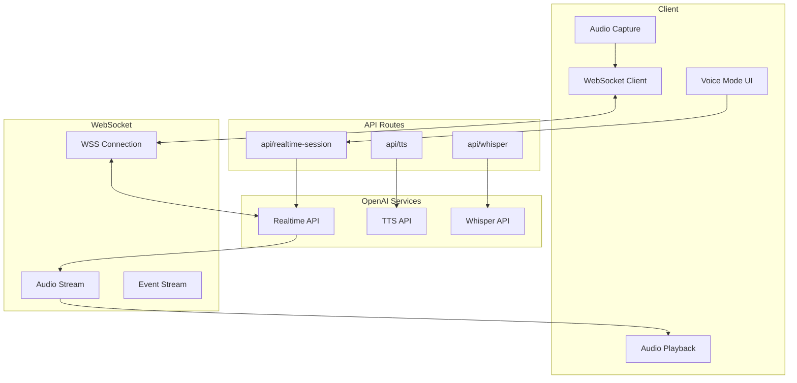

import { Tabs, Callout, Steps } from 'nextra/components'

# Real-time Voice Features

REFLEKT Console implements real-time voice conversations using **GPT-4o Realtime API** for natural dialogue and **OpenAI TTS** for high-quality text-to-speech synthesis.

## Overview

The voice system provides:
- Real-time bidirectional audio streaming
- Natural conversation with interruption handling
- Multiple voice options and personalities
- Low-latency WebSocket connections
- Audio transcription and synthesis
- Browser-based audio capture and playback

## Architecture



## Setup

<Steps>
### Configure OpenAI API

Add to your `.env.local`:

```env
# OpenAI Configuration (Required for voice)
OPENAI_API_KEY=sk-...
NEXT_PUBLIC_OPENAI_API_KEY=sk-... # For client-side WebSocket

# Optional: Custom endpoints
OPENAI_BASE_URL=https://api.openai.com/v1
REALTIME_API_URL=wss://api.openai.com/v1/realtime
```

### Enable Microphone Access

The browser will request microphone permissions on first use. Ensure HTTPS is enabled in production.

### Test Audio Setup

```bash
# Test TTS generation
curl -X POST http://localhost:3000/api/tts \
  -H "Content-Type: application/json" \
  -d '{"text": "Hello, this is a test", "voice": "alloy"}'

# Should return audio/mpeg data
```
</Steps>

## GPT-4o Realtime API

### WebSocket Connection

<Tabs items={['Client Setup', 'Session Management', 'Event Handling']}>
  <Tabs.Tab>
    **Client WebSocket Setup**
    
    ```typescript
    // app/components/chat/voice-mode-realtime.tsx
    import { useEffect, useRef, useState } from 'react';
    
    export function VoiceModeRealtime() {
      const wsRef = useRef<WebSocket | null>(null);
      const [isConnected, setIsConnected] = useState(false);
      const [isRecording, setIsRecording] = useState(false);
      
      const connectWebSocket = async () => {
        try {
          // Get ephemeral key from server
          const response = await fetch('/api/realtime-session', {
            method: 'POST',
          });
          const { key, url } = await response.json();
          
          // Connect to GPT-4o Realtime API
          const ws = new WebSocket(
            `${url}?model=gpt-4o-realtime-preview`,
            [],
            {
              headers: {
                'Authorization': `Bearer ${key}`,
                'OpenAI-Beta': 'realtime=v1',
              }
            }
          );
          
          ws.onopen = () => {
            console.log('Connected to GPT-4o Realtime API');
            setIsConnected(true);
            
            // Configure session
            ws.send(JSON.stringify({
              type: 'session.update',
              session: {
                modalities: ['text', 'audio'],
                instructions: 'You are a helpful AI assistant.',
                voice: 'alloy',
                input_audio_format: 'pcm16',
                output_audio_format: 'pcm16',
                input_audio_transcription: {
                  model: 'whisper-1'
                },
                turn_detection: {
                  type: 'server_vad',
                  threshold: 0.5,
                  prefix_padding_ms: 300,
                  silence_duration_ms: 500
                },
                temperature: 0.8,
                max_response_output_tokens: 4096
              }
            }));
          };
          
          ws.onmessage = handleRealtimeMessage;
          ws.onerror = (error) => {
            console.error('WebSocket error:', error);
            setIsConnected(false);
          };
          
          ws.onclose = () => {
            console.log('Disconnected from GPT-4o Realtime API');
            setIsConnected(false);
          };
          
          wsRef.current = ws;
        } catch (error) {
          console.error('Failed to connect:', error);
        }
      };
      
      return (
        <div className="voice-mode-container">
          <button onClick={connectWebSocket} disabled={isConnected}>
            {isConnected ? 'Connected' : 'Connect Voice'}
          </button>
        </div>
      );
    }
    ```
  </Tabs.Tab>
  
  <Tabs.Tab>
    **Server Session Creation**
    
    ```typescript
    // app/api/realtime-session/route.ts
    import { NextResponse } from 'next/server';
    
    export async function POST(req: Request) {
      try {
        // Create ephemeral key for client
        const response = await fetch(
          'https://api.openai.com/v1/realtime/sessions',
          {
            method: 'POST',
            headers: {
              'Authorization': `Bearer ${process.env.OPENAI_API_KEY}`,
              'Content-Type': 'application/json',
            },
            body: JSON.stringify({
              model: 'gpt-4o-realtime-preview',
              voice: 'alloy',
            }),
          }
        );
        
        if (!response.ok) {
          throw new Error('Failed to create session');
        }
        
        const data = await response.json();
        
        return NextResponse.json({
          key: data.client_secret?.value || process.env.OPENAI_API_KEY,
          url: 'wss://api.openai.com/v1/realtime',
          session_id: data.id,
        });
      } catch (error) {
        console.error('Session creation failed:', error);
        return NextResponse.json(
          { error: 'Failed to create session' },
          { status: 500 }
        );
      }
    }
    ```
  </Tabs.Tab>
  
  <Tabs.Tab>
    **Event Handling**
    
    ```typescript
    // Handle Realtime API events
    function handleRealtimeMessage(event: MessageEvent) {
      const message = JSON.parse(event.data);
      
      switch (message.type) {
        case 'session.created':
          console.log('Session created:', message.session);
          break;
          
        case 'conversation.item.created':
          console.log('New conversation item:', message.item);
          break;
          
        case 'response.audio.delta':
          // Handle audio chunk
          const audioData = base64ToArrayBuffer(message.delta);
          playAudioChunk(audioData);
          break;
          
        case 'response.audio_transcript.delta':
          // Handle transcript update
          updateTranscript(message.delta);
          break;
          
        case 'response.done':
          console.log('Response complete');
          break;
          
        case 'error':
          console.error('Realtime error:', message.error);
          break;
      }
    }
    
    // Convert base64 to ArrayBuffer
    function base64ToArrayBuffer(base64: string): ArrayBuffer {
      const binaryString = atob(base64);
      const bytes = new Uint8Array(binaryString.length);
      for (let i = 0; i < binaryString.length; i++) {
        bytes[i] = binaryString.charCodeAt(i);
      }
      return bytes.buffer;
    }
    ```
  </Tabs.Tab>
</Tabs>

### Audio Capture & Streaming

```typescript
// app/components/chat/audio-capture.tsx
export function AudioCapture({ onAudioData }: { onAudioData: (data: ArrayBuffer) => void }) {
  const mediaRecorderRef = useRef<MediaRecorder | null>(null);
  const audioContextRef = useRef<AudioContext | null>(null);
  
  const startRecording = async () => {
    try {
      const stream = await navigator.mediaDevices.getUserMedia({ 
        audio: {
          channelCount: 1,
          sampleRate: 24000,
          echoCancellation: true,
          noiseSuppression: true,
        } 
      });
      
      // Create audio context for processing
      audioContextRef.current = new AudioContext({ sampleRate: 24000 });
      const source = audioContextRef.current.createMediaStreamSource(stream);
      const processor = audioContextRef.current.createScriptProcessor(4096, 1, 1);
      
      processor.onaudioprocess = (e) => {
        const inputData = e.inputBuffer.getChannelData(0);
        
        // Convert Float32Array to PCM16
        const pcm16 = new Int16Array(inputData.length);
        for (let i = 0; i < inputData.length; i++) {
          const s = Math.max(-1, Math.min(1, inputData[i]));
          pcm16[i] = s < 0 ? s * 0x8000 : s * 0x7FFF;
        }
        
        onAudioData(pcm16.buffer);
      };
      
      source.connect(processor);
      processor.connect(audioContextRef.current.destination);
      
    } catch (error) {
      console.error('Failed to start recording:', error);
    }
  };
  
  const stopRecording = () => {
    if (mediaRecorderRef.current) {
      mediaRecorderRef.current.stop();
    }
    if (audioContextRef.current) {
      audioContextRef.current.close();
    }
  };
  
  return (
    <div>
      <button onClick={startRecording}>Start Recording</button>
      <button onClick={stopRecording}>Stop Recording</button>
    </div>
  );
}
```

### Audio Playback

```typescript
// app/components/chat/audio-playback.tsx
export class AudioPlayer {
  private audioContext: AudioContext;
  private audioQueue: AudioBuffer[] = [];
  private isPlaying = false;
  
  constructor() {
    this.audioContext = new AudioContext();
  }
  
  async playPCM16(pcm16Data: ArrayBuffer) {
    // Convert PCM16 to Float32
    const pcm16 = new Int16Array(pcm16Data);
    const float32 = new Float32Array(pcm16.length);
    
    for (let i = 0; i < pcm16.length; i++) {
      float32[i] = pcm16[i] / (pcm16[i] < 0 ? 0x8000 : 0x7FFF);
    }
    
    // Create audio buffer
    const audioBuffer = this.audioContext.createBuffer(
      1,                    // mono
      float32.length,       // frame count
      24000                 // sample rate
    );
    
    audioBuffer.getChannelData(0).set(float32);
    
    // Add to queue
    this.audioQueue.push(audioBuffer);
    
    // Start playback if not already playing
    if (!this.isPlaying) {
      this.playNextInQueue();
    }
  }
  
  private async playNextInQueue() {
    if (this.audioQueue.length === 0) {
      this.isPlaying = false;
      return;
    }
    
    this.isPlaying = true;
    const audioBuffer = this.audioQueue.shift()!;
    
    const source = this.audioContext.createBufferSource();
    source.buffer = audioBuffer;
    source.connect(this.audioContext.destination);
    
    source.onended = () => {
      this.playNextInQueue();
    };
    
    source.start();
  }
  
  stop() {
    this.audioQueue = [];
    this.isPlaying = false;
  }
}
```

## Text-to-Speech (TTS)

### API Implementation

```typescript
// app/api/tts/route.ts
import OpenAI from 'openai';
import { NextResponse } from 'next/server';

const openai = new OpenAI({
  apiKey: process.env.OPENAI_API_KEY,
});

export async function POST(req: Request) {
  try {
    const { text, voice = 'alloy', speed = 1.0 } = await req.json();
    
    if (!text) {
      return NextResponse.json(
        { error: 'Text is required' },
        { status: 400 }
      );
    }
    
    // Generate speech
    const response = await openai.audio.speech.create({
      model: 'tts-1',
      voice: voice as any,
      input: text,
      speed,
    });
    
    // Get audio data
    const buffer = Buffer.from(await response.arrayBuffer());
    
    // Return audio response
    return new Response(buffer, {
      headers: {
        'Content-Type': 'audio/mpeg',
        'Content-Length': buffer.length.toString(),
      },
    });
  } catch (error) {
    console.error('TTS generation failed:', error);
    return NextResponse.json(
      { error: 'Failed to generate speech' },
      { status: 500 }
    );
  }
}
```

### Client Integration

```typescript
// app/components/chat/message-assistant-tts.tsx
export function MessageWithTTS({ content }: { content: string }) {
  const [isPlaying, setIsPlaying] = useState(false);
  const [audioUrl, setAudioUrl] = useState<string | null>(null);
  const audioRef = useRef<HTMLAudioElement>(null);
  
  const generateSpeech = async () => {
    try {
      const response = await fetch('/api/tts', {
        method: 'POST',
        headers: { 'Content-Type': 'application/json' },
        body: JSON.stringify({
          text: content,
          voice: 'nova', // or 'alloy', 'echo', 'fable', 'onyx', 'shimmer'
          speed: 1.0,
        }),
      });
      
      if (!response.ok) throw new Error('TTS failed');
      
      const blob = await response.blob();
      const url = URL.createObjectURL(blob);
      setAudioUrl(url);
      
      // Auto-play
      if (audioRef.current) {
        audioRef.current.src = url;
        audioRef.current.play();
        setIsPlaying(true);
      }
    } catch (error) {
      console.error('Failed to generate speech:', error);
    }
  };
  
  return (
    <div className="message-with-tts">
      <div className="message-content">{content}</div>
      <div className="tts-controls">
        <button onClick={generateSpeech} disabled={isPlaying}>
          <SpeakerIcon />
        </button>
        <audio
          ref={audioRef}
          onEnded={() => setIsPlaying(false)}
          controls
          hidden
        />
      </div>
    </div>
  );
}
```

## Voice Configuration

### Available Voices

<Callout type="info">
GPT-4o provides 6 distinct voices, each with unique characteristics suitable for different use cases.
</Callout>

| Voice | Description | Best For |
|-------|-------------|----------|
| alloy | Neutral and balanced | General purpose |
| nova | Warm and friendly | Customer service |
| echo | Smooth and professional | Business applications |
| fable | Expressive and dynamic | Storytelling |
| onyx | Deep and authoritative | News and documentation |
| shimmer | Soft and gentle | Meditation and relaxation |

### Voice Settings

```typescript
// Voice configuration interface
interface VoiceSettings {
  voice: 'alloy' | 'nova' | 'echo' | 'fable' | 'onyx' | 'shimmer';
  speed: number;        // 0.25 to 4.0
  temperature: number;  // 0.0 to 1.0 (Realtime only)
  format: 'mp3' | 'opus' | 'aac' | 'flac' | 'wav' | 'pcm';
}

// Example presets
const voicePresets = {
  professional: {
    voice: 'echo',
    speed: 0.95,
    temperature: 0.3,
  },
  conversational: {
    voice: 'nova',
    speed: 1.0,
    temperature: 0.7,
  },
  educational: {
    voice: 'fable',
    speed: 0.9,
    temperature: 0.5,
  },
};
```

## Whisper Transcription

```typescript
// app/api/whisper/route.ts
export async function POST(req: Request) {
  try {
    const formData = await req.formData();
    const audioFile = formData.get('audio') as File;
    
    if (!audioFile) {
      return NextResponse.json(
        { error: 'Audio file required' },
        { status: 400 }
      );
    }
    
    // Transcribe with Whisper
    const transcription = await openai.audio.transcriptions.create({
      file: audioFile,
      model: 'whisper-1',
      language: 'en',
      response_format: 'json',
      temperature: 0,
    });
    
    return NextResponse.json({
      text: transcription.text,
    });
  } catch (error) {
    console.error('Transcription failed:', error);
    return NextResponse.json(
      { error: 'Failed to transcribe audio' },
      { status: 500 }
    );
  }
}
```

## Complete Voice Mode Implementation

<Tabs items={['Component', 'Hook', 'Utils']}>
  <Tabs.Tab>
    **Voice Mode Component**
    
    ```tsx
    // app/components/chat/voice-mode.tsx
    export function VoiceMode() {
      const [mode, setMode] = useState<'idle' | 'listening' | 'thinking' | 'speaking'>('idle');
      const { 
        startConversation,
        stopConversation,
        isConnected,
        transcript,
        response
      } = useRealtimeConversation();
      
      return (
        <div className="voice-mode">
          <div className="status-indicator">
            {mode === 'idle' && <IdleIcon />}
            {mode === 'listening' && <MicIcon className="animate-pulse" />}
            {mode === 'thinking' && <LoadingIcon className="animate-spin" />}
            {mode === 'speaking' && <SpeakerIcon className="animate-pulse" />}
          </div>
          
          <div className="transcript">
            {transcript && (
              <div className="user-speech">{transcript}</div>
            )}
            {response && (
              <div className="ai-response">{response}</div>
            )}
          </div>
          
          <button
            onClick={isConnected ? stopConversation : startConversation}
            className={cn(
              'voice-button',
              isConnected && 'active'
            )}
          >
            {isConnected ? 'Stop' : 'Start'} Conversation
          </button>
        </div>
      );
    }
    ```
  </Tabs.Tab>
  
  <Tabs.Tab>
    **useRealtimeConversation Hook**
    
    ```typescript
    // hooks/use-realtime-conversation.ts
    export function useRealtimeConversation() {
      const [ws, setWs] = useState<WebSocket | null>(null);
      const [isConnected, setIsConnected] = useState(false);
      const [transcript, setTranscript] = useState('');
      const [response, setResponse] = useState('');
      
      const audioPlayer = useRef(new AudioPlayer());
      const audioCapture = useRef<AudioCapture | null>(null);
      
      const startConversation = async () => {
        // Get session credentials
        const { key, url } = await fetch('/api/realtime-session', {
          method: 'POST'
        }).then(r => r.json());
        
        // Connect WebSocket
        const websocket = new WebSocket(url);
        
        websocket.onopen = () => {
          setIsConnected(true);
          
          // Configure session
          websocket.send(JSON.stringify({
            type: 'session.update',
            session: {
              modalities: ['text', 'audio'],
              voice: 'nova',
            }
          }));
          
          // Start audio capture
          audioCapture.current = new AudioCapture((data) => {
            websocket.send(JSON.stringify({
              type: 'input_audio_buffer.append',
              audio: arrayBufferToBase64(data),
            }));
          });
          audioCapture.current.start();
        };
        
        websocket.onmessage = (event) => {
          const message = JSON.parse(event.data);
          
          switch (message.type) {
            case 'response.audio.delta':
              const audioData = base64ToArrayBuffer(message.delta);
              audioPlayer.current.playPCM16(audioData);
              break;
              
            case 'conversation.item.input_audio_transcription.completed':
              setTranscript(message.transcript);
              break;
              
            case 'response.audio_transcript.delta':
              setResponse(prev => prev + message.delta);
              break;
          }
        };
        
        setWs(websocket);
      };
      
      const stopConversation = () => {
        audioCapture.current?.stop();
        audioPlayer.current.stop();
        ws?.close();
        setIsConnected(false);
      };
      
      return {
        startConversation,
        stopConversation,
        isConnected,
        transcript,
        response,
      };
    }
    ```
  </Tabs.Tab>
  
  <Tabs.Tab>
    **Audio Utilities**
    
    ```typescript
    // utils/audio.ts
    
    // Convert ArrayBuffer to base64
    export function arrayBufferToBase64(buffer: ArrayBuffer): string {
      const bytes = new Uint8Array(buffer);
      let binary = '';
      for (let i = 0; i < bytes.byteLength; i++) {
        binary += String.fromCharCode(bytes[i]);
      }
      return btoa(binary);
    }
    
    // Convert base64 to ArrayBuffer
    export function base64ToArrayBuffer(base64: string): ArrayBuffer {
      const binaryString = atob(base64);
      const bytes = new Uint8Array(binaryString.length);
      for (let i = 0; i < binaryString.length; i++) {
        bytes[i] = binaryString.charCodeAt(i);
      }
      return bytes.buffer;
    }
    
    // Resample audio
    export function resampleAudio(
      audioData: Float32Array,
      fromSampleRate: number,
      toSampleRate: number
    ): Float32Array {
      const ratio = fromSampleRate / toSampleRate;
      const newLength = Math.round(audioData.length / ratio);
      const result = new Float32Array(newLength);
      
      for (let i = 0; i < newLength; i++) {
        const index = i * ratio;
        const indexFloor = Math.floor(index);
        const indexCeil = Math.min(indexFloor + 1, audioData.length - 1);
        const fraction = index - indexFloor;
        
        result[i] = audioData[indexFloor] * (1 - fraction) + 
                   audioData[indexCeil] * fraction;
      }
      
      return result;
    }
    ```
  </Tabs.Tab>
</Tabs>

## Performance Optimization

### Audio Buffer Management

```typescript
// Optimize audio buffering for smooth playback
class OptimizedAudioPlayer {
  private bufferThreshold = 0.5; // seconds
  private maxBufferSize = 5.0;   // seconds
  
  async play(audioData: ArrayBuffer) {
    const currentBufferDuration = this.getBufferDuration();
    
    // Drop audio if buffer is too full
    if (currentBufferDuration > this.maxBufferSize) {
      console.warn('Audio buffer overflow, dropping frames');
      return;
    }
    
    // Start playback when enough is buffered
    if (!this.isPlaying && currentBufferDuration > this.bufferThreshold) {
      this.startPlayback();
    }
    
    this.addToBuffer(audioData);
  }
}
```

### Latency Reduction

```typescript
// Reduce latency with optimized settings
const realtimeConfig = {
  // Audio settings for low latency
  audio: {
    sampleRate: 24000,      // Lower sample rate
    channelCount: 1,        // Mono audio
    echoCancellation: true,
    noiseSuppression: true,
    autoGainControl: true,
  },
  
  // WebSocket settings
  websocket: {
    binaryType: 'arraybuffer',
    reconnectInterval: 1000,
    maxReconnectAttempts: 3,
  },
  
  // Voice activity detection
  vad: {
    threshold: 0.5,
    prefixPadding: 300,     // ms before speech
    suffixPadding: 500,     // ms after speech
  },
};
```

## Troubleshooting

### Common Issues

| Issue | Cause | Solution |
|-------|-------|----------|
| No audio output | Browser autoplay policy | User interaction required before playing audio |
| High latency | Network conditions | Use closer servers, reduce audio quality |
| Echo/feedback | Speaker bleeding to mic | Use headphones or echo cancellation |
| Choppy audio | Buffer underrun | Increase buffer threshold |
| WebSocket disconnects | Token expiration | Implement automatic reconnection |

### Debug Logging

```typescript
// Enable debug logging for voice mode
const DEBUG = process.env.NODE_ENV === 'development';

function debugLog(category: string, message: any) {
  if (DEBUG) {
    console.log(`[Voice:${category}]`, message);
  }
}

// Log audio metrics
setInterval(() => {
  if (DEBUG && audioContext) {
    debugLog('Metrics', {
      currentTime: audioContext.currentTime,
      state: audioContext.state,
      sampleRate: audioContext.sampleRate,
      latency: audioContext.baseLatency,
    });
  }
}, 5000);
```

## Security Considerations

<Callout type="warning">
Always validate and sanitize audio input. Never expose API keys in client code.
</Callout>

1. **API Key Security**: Use server-side session creation
2. **Audio Validation**: Check file size and format
3. **Rate Limiting**: Limit API calls per user
4. **Content Filtering**: Monitor for inappropriate content
5. **Privacy**: Inform users about audio recording

## Next Steps

- [WebRTC Guide](/docs/webrtc) - Advanced WebRTC configuration
- [API Reference](/docs/api) - Complete API documentation
- [Security](/docs/security) - Audio security best practices