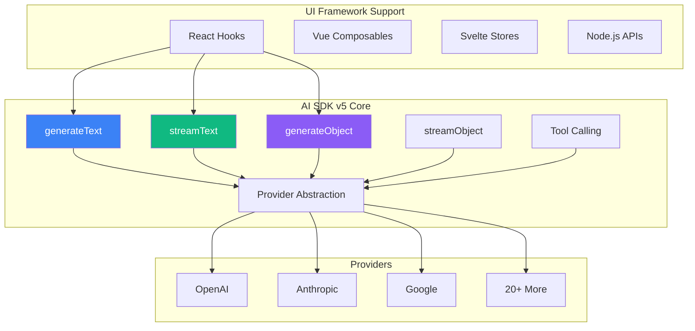

import { Tabs, Callout } from 'nextra/components'

export const Card = ({ title, href, children }) => (
  <div className="border border-gray-200 dark:border-gray-700 rounded-lg p-4 hover:border-gray-300 dark:hover:border-gray-600 transition-colors">
    <h3 className="font-semibold text-lg mb-2">
      {href ? <a href={href} className="text-blue-600 dark:text-blue-400 hover:underline">{title}</a> : title}
    </h3>
    <div className="text-gray-600 dark:text-gray-300">
      {children}
    </div>
  </div>
)

export const Cards = ({ children }) => (
  <div className="grid grid-cols-1 md:grid-cols-2 lg:grid-cols-3 xl:grid-cols-4 gap-4 mt-4">
    {children}
  </div>
)

# AI SDK v5: Next Generation AI Development

Vercel AI SDK v5 represents a major evolution in building AI-powered applications. This guide explores the powerful features and improvements that make v5 the definitive toolkit for AI development.

## Architecture Overview



## Core Functions

### Text Generation

<Tabs items={['generateText', 'streamText', 'Real Example']}>
  <Tabs.Tab>
    **generateText - Non-streaming text generation**

    ```typescript
    import { generateText } from 'ai';
    import { openai } from '@ai-sdk/openai';

    const { text, usage, finishReason } = await generateText({
      model: openai('gpt-4o'),
      messages: [
        { role: 'system', content: 'You are a helpful assistant' },
        { role: 'user', content: 'Explain quantum computing' }
      ],
      temperature: 0.7,
      maxTokens: 1000
    });

    console.log(text); // Complete response
    console.log(usage); // Token usage metrics
    ```
  </Tabs.Tab>

  <Tabs.Tab>
    **streamText - Streaming text generation**

    ```typescript
    import { streamText } from 'ai';

    const result = await streamText({
      model: openai('gpt-4o'),
      messages: [{ role: 'user', content: prompt }],
      onFinish({ text, usage, finishReason }) {
        // Called when streaming completes
        saveToDatabase({ text, usage });
      }
    });

    // Stream to client
    return result.toDataStreamResponse();

    // Or process chunks
    for await (const chunk of result.textStream) {
      console.log(chunk);
    }
    ```
  </Tabs.Tab>

  <Tabs.Tab>
    **Real-world Implementation**

    ```typescript
    // app/api/analyze/route.ts
    export async function POST(req: Request) {
      const { document } = await req.json();

      const result = await streamText({
        model: openai('gpt-4o'),
        messages: [
          {
            role: 'system',
            content: 'You are a document analyst. Provide insights and summaries.'
          },
          {
            role: 'user',
            content: `Analyze this document: ${document}`
          }
        ],
        temperature: 0.3, // Lower for analytical tasks
        onFinish: async ({ text, usage }) => {
          // Log analytics
          await analytics.track('document_analyzed', {
            model: 'gpt-4o',
            tokens: usage.totalTokens,
            cost: calculateCost(usage)
          });
        }
      });

      return result.toDataStreamResponse();
    }
    ```
  </Tabs.Tab>
</Tabs>

### Structured Output Generation

<Callout type="info">
**Game Changer**: V5's structured outputs ensure type-safe data extraction with automatic validation.
</Callout>

<Tabs items={['Object Generation', 'Streaming Objects', 'Complex Schemas']}>
  <Tabs.Tab>
    **generateObject - Type-safe object generation**

    ```typescript
    import { generateObject } from 'ai';
    import { z } from 'zod';

    const ProductSchema = z.object({
      name: z.string().describe('Product name'),
      price: z.number().describe('Price in USD'),
      features: z.array(z.string()).describe('Key features'),
      inStock: z.boolean(),
      categories: z.array(z.enum(['electronics', 'clothing', 'food']))
    });

    const { object } = await generateObject({
      model: openai('gpt-4o'),
      schema: ProductSchema,
      prompt: 'Extract product info from this description...'
    });

    // object is fully typed as z.infer<typeof ProductSchema>
    console.log(object.name); // TypeScript knows this is a string
    ```
  </Tabs.Tab>

  <Tabs.Tab>
    **streamObject - Progressive object streaming**

    ```typescript
    import { streamObject } from 'ai';

    const ReportSchema = z.object({
      title: z.string(),
      summary: z.string(),
      sections: z.array(z.object({
        heading: z.string(),
        content: z.string(),
        importance: z.enum(['high', 'medium', 'low'])
      }))
    });

    const { partialObjectStream } = await streamObject({
      model: openai('gpt-4o'),
      schema: ReportSchema,
      prompt: 'Generate a comprehensive report on...'
    });

    // Stream partial updates to UI
    for await (const partialObject of partialObjectStream) {
      // Update UI progressively
      updateReportUI(partialObject);
    }
    ```
  </Tabs.Tab>

  <Tabs.Tab>
    **Complex Nested Schemas**

    ```typescript
    const CompanySchema = z.object({
      company: z.object({
        name: z.string(),
        founded: z.number(),
        headquarters: z.object({
          city: z.string(),
          country: z.string(),
          coordinates: z.object({
            lat: z.number(),
            lng: z.number()
          })
        })
      }),
      products: z.array(z.object({
        id: z.string(),
        name: z.string(),
        launchDate: z.string(),
        pricing: z.discriminatedUnion('type', [
          z.object({
            type: z.literal('subscription'),
            monthly: z.number(),
            annual: z.number()
          }),
          z.object({
            type: z.literal('one-time'),
            price: z.number()
          })
        ])
      })),
      metrics: z.object({
        revenue: z.number(),
        employees: z.number(),
        marketCap: z.number().optional()
      })
    });

    const { object } = await generateObject({
      model: openai('gpt-4o'),
      schema: CompanySchema,
      prompt: companyDescription
    });
    ```
  </Tabs.Tab>
</Tabs>

## Advanced Tool Calling

V5's tool calling system enables complex multi-step workflows with automatic execution:

```typescript
import { generateText, tool } from 'ai';
import { z } from 'zod';

// Define reusable tools
const databaseTool = tool({
  description: 'Query the database',
  parameters: z.object({
    query: z.string(),
    table: z.enum(['users', 'products', 'orders'])
  }),
  execute: async ({ query, table }) => {
    return await db.query(query, { table });
  }
});

const emailTool = tool({
  description: 'Send an email',
  parameters: z.object({
    to: z.string().email(),
    subject: z.string(),
    body: z.string()
  }),
  execute: async ({ to, subject, body }) => {
    await sendEmail({ to, subject, body });
    return { success: true, messageId: generateId() };
  }
});

const calculationTool = tool({
  description: 'Perform complex calculations',
  parameters: z.object({
    operation: z.enum(['sum', 'average', 'forecast']),
    data: z.array(z.number())
  }),
  execute: async ({ operation, data }) => {
    switch (operation) {
      case 'sum': return data.reduce((a, b) => a + b, 0);
      case 'average': return data.reduce((a, b) => a + b, 0) / data.length;
      case 'forecast': return forecastNextValue(data);
    }
  }
});

// Use tools in complex workflows
const result = await generateText({
  model: openai('gpt-4o'),
  messages: [
    {
      role: 'user',
      content: 'Find users who made purchases last month, calculate their average spending, and email them a summary'
    }
  ],
  tools: {
    database: databaseTool,
    email: emailTool,
    calculate: calculationTool
  },
  toolChoice: 'auto',
  maxToolRoundtrips: 5 // Allow multiple tool calls
});
```

## UI Framework Integration

### React Hooks

<Tabs items={['useChat', 'useCompletion', 'useObject', 'useAssistant']}>
  <Tabs.Tab>
    **useChat - Full chat interface**

    ```tsx
    import { useChat } from 'ai/react';

    export function ChatInterface() {
      const {
        messages,
        input,
        handleInputChange,
        handleSubmit,
        isLoading,
        error,
        reload,
        stop,
        append,
        setMessages
      } = useChat({
        api: '/api/chat',
        initialMessages: [],
        onResponse(response) {
          // Handle response headers
        },
        onFinish(message) {
          // Message complete
          trackEvent('message_sent', { length: message.content.length });
        },
        onError(error) {
          toast.error('Failed to send message');
        }
      });

      return (
        <div>
          {messages.map(m => (
            <div key={m.id} className={m.role}>
              {m.content}
            </div>
          ))}

          <form onSubmit={handleSubmit}>
            <input
              value={input}
              onChange={handleInputChange}
              placeholder="Type a message..."
              disabled={isLoading}
            />
            <button type="submit">Send</button>
            {isLoading && <button onClick={stop}>Stop</button>}
          </form>
        </div>
      );
    }
    ```
  </Tabs.Tab>

  <Tabs.Tab>
    **useCompletion - Text completion**

    ```tsx
    import { useCompletion } from 'ai/react';

    export function CodeCompletion() {
      const {
        completion,
        input,
        handleInputChange,
        handleSubmit,
        isLoading,
        complete
      } = useCompletion({
        api: '/api/complete',
        onFinish: (prompt, completion) => {
          saveCompletion({ prompt, completion });
        }
      });

      return (
        <div>
          <textarea
            value={input}
            onChange={handleInputChange}
            placeholder="Start typing code..."
            onKeyDown={(e) => {
              if (e.key === 'Tab') {
                e.preventDefault();
                complete(); // Trigger completion
              }
            }}
          />

          {completion && (
            <div className="suggestion">
              {completion}
            </div>
          )}
        </div>
      );
    }
    ```
  </Tabs.Tab>

  <Tabs.Tab>
    **useObject - Structured data streaming**

    ```tsx
    import { useObject } from 'ai/react';
    import { z } from 'zod';

    const AnalysisSchema = z.object({
      sentiment: z.enum(['positive', 'negative', 'neutral']),
      score: z.number().min(0).max(100),
      keywords: z.array(z.string()),
      summary: z.string()
    });

    export function SentimentAnalyzer() {
      const { object, submit, isLoading, error } = useObject({
        api: '/api/analyze',
        schema: AnalysisSchema
      });

      return (
        <div>
          <textarea
            onBlur={(e) => submit(e.target.value)}
            placeholder="Enter text to analyze..."
          />

          {object && (
            <div>
              <div>Sentiment: {object.sentiment}</div>
              <div>Score: {object.score}%</div>
              <div>Keywords: {object.keywords?.join(', ')}</div>
              <div>Summary: {object.summary}</div>
            </div>
          )}
        </div>
      );
    }
    ```
  </Tabs.Tab>

  <Tabs.Tab>
    **useAssistant - OpenAI Assistants API**

    ```tsx
    import { useAssistant } from 'ai/react';

    export function AssistantChat() {
      const {
        status,
        messages,
        input,
        submitMessage,
        handleInputChange,
        error
      } = useAssistant({
        api: '/api/assistant',
        threadId: 'thread_abc123'
      });

      return (
        <div>
          {messages.map((m) => (
            <div key={m.id}>
              <strong>{m.role}:</strong>
              {m.content}
            </div>
          ))}

          {status === 'in_progress' && (
            <div>Assistant is thinking...</div>
          )}

          <form onSubmit={submitMessage}>
            <input
              value={input}
              onChange={handleInputChange}
              disabled={status !== 'awaiting_message'}
            />
          </form>
        </div>
      );
    }
    ```
  </Tabs.Tab>
</Tabs>

## Middleware & Interceptors

Customize request/response handling:

```typescript
import { experimental_wrapLanguageModel as wrapModel } from 'ai';

const enhancedModel = wrapModel({
  model: openai('gpt-4o'),
  middleware: {
    // Pre-process all requests
    transformParams: async (params) => {
      return {
        ...params,
        messages: [
          {
            role: 'system',
            content: 'You are a helpful assistant. Always be concise.'
          },
          ...params.messages
        ],
        temperature: Math.min(params.temperature || 0.7, 0.9)
      };
    },

    // Wrap generation with custom logic
    wrapGenerate: async (generateFn, params) => {
      const startTime = Date.now();

      try {
        const result = await generateFn();

        // Log successful generation
        await logGeneration({
          model: 'gpt-4o',
          duration: Date.now() - startTime,
          tokens: result.usage?.totalTokens,
          success: true
        });

        return result;
      } catch (error) {
        // Log errors
        await logError({
          model: 'gpt-4o',
          error: error.message,
          duration: Date.now() - startTime
        });

        throw error;
      }
    },

    // Transform responses
    transformResponse: async (response) => {
      // Add metadata
      response.experimental_metadata = {
        processedAt: new Date().toISOString(),
        version: 'v5'
      };

      return response;
    }
  }
});
```

## Provider Ecosystem

<Cards>
  <Card title="OpenAI" href="#openai">
    GPT-4o, GPT-4, GPT-3.5, DALL-E, Whisper
  </Card>
  <Card title="Anthropic" href="#anthropic">
    Claude 3 Opus, Claude 3.5 Sonnet, Claude 3 Haiku
  </Card>
  <Card title="Google" href="#google">
    Gemini 1.5 Pro, Gemini 1.5 Flash, PaLM 2
  </Card>
  <Card title="Meta" href="#meta">
    Llama 3, Llama 2, Code Llama
  </Card>
  <Card title="Mistral" href="#mistral">
    Mistral Large, Mixtral 8x7B, Mistral 7B
  </Card>
  <Card title="Cohere" href="#cohere">
    Command R+, Command R, Embed v3
  </Card>
  <Card title="Perplexity" href="#perplexity">
    Sonar Large, Sonar Small, Online Models
  </Card>
  <Card title="20+ More" href="#more">
    xAI, Together, Replicate, Hugging Face, and more
  </Card>
</Cards>

## Performance Optimizations

### Response Caching

```typescript
import { unstable_cache } from 'next/cache';

const cachedGeneration = unstable_cache(
  async (prompt: string) => {
    const { text } = await generateText({
      model: openai('gpt-4o'),
      prompt
    });
    return text;
  },
  ['ai-generation'],
  {
    revalidate: 3600, // Cache for 1 hour
    tags: ['ai-cache']
  }
);
```

### Parallel Generation

```typescript
// Generate multiple responses in parallel
const [summary, keywords, sentiment] = await Promise.all([
  generateText({
    model: openai('gpt-4o-mini'),
    prompt: `Summarize: ${text}`
  }),
  generateObject({
    model: openai('gpt-4o-mini'),
    schema: z.array(z.string()),
    prompt: `Extract keywords: ${text}`
  }),
  generateObject({
    model: openai('gpt-4o-mini'),
    schema: z.enum(['positive', 'negative', 'neutral']),
    prompt: `Analyze sentiment: ${text}`
  })
]);
```

### Edge Runtime Support

```typescript
// app/api/chat/route.ts
export const runtime = 'edge'; // Enable edge runtime

export async function POST(req: Request) {
  const { messages } = await req.json();

  // Runs on edge - faster, globally distributed
  const result = await streamText({
    model: openai('gpt-4o'),
    messages
  });

  return result.toDataStreamResponse();
}
```

## Observability & Debugging

### Built-in Telemetry

```typescript
import { telemetry } from 'ai';

telemetry.recordGeneration({
  model: 'gpt-4o',
  promptTokens: 150,
  completionTokens: 500,
  latency: 1234,
  tags: {
    userId: 'user123',
    feature: 'chat'
  }
});
```

### Custom Logging

```typescript
const result = await generateText({
  model: openai('gpt-4o'),
  messages,
  experimental_telemetry: {
    isEnabled: true,
    functionId: 'chat-generation',
    metadata: {
      userId: session.userId,
      sessionId: session.id
    }
  }
});
```

## Migration from v4

<Callout type="warning">
**Breaking Changes**: V5 has significant API changes. Plan your migration carefully.
</Callout>

### Key Changes

| Feature | v4 | v5 |
|---------|----|----|
| Import | `import { OpenAIStream } from 'ai'` | `import { streamText } from 'ai'` |
| Streaming | `OpenAIStream(response)` | `streamText({ model, messages })` |
| Providers | Custom implementations | Unified provider packages |
| Hooks | `useChat({ api })` | Enhanced with more options |
| Types | Basic | Full TypeScript with generics |
| Tools | Function calling | Advanced tool system with Zod |
| Objects | Manual parsing | `generateObject` with schemas |

### Migration Example

```typescript
// v4 (Old)
import { OpenAIStream, StreamingTextResponse } from 'ai';

export async function POST(req: Request) {
  const { messages } = await req.json();

  const response = await openai.chat.completions.create({
    model: 'gpt-4',
    stream: true,
    messages
  });

  const stream = OpenAIStream(response);
  return new StreamingTextResponse(stream);
}

// v5 (New)
import { streamText } from 'ai';
import { openai } from '@ai-sdk/openai';

export async function POST(req: Request) {
  const { messages } = await req.json();

  const result = await streamText({
    model: openai('gpt-4o'),
    messages
  });

  return result.toDataStreamResponse();
}
```

## Resources

- [Official Documentation](https://sdk.vercel.ai)
- [GitHub Repository](https://github.com/vercel/ai)
- [Examples](https://github.com/vercel/ai/tree/main/examples)
- [Discord Community](https://discord.gg/vercel-ai)

<Callout type="success">
**Ready to build?** AI SDK v5 provides everything you need to create sophisticated AI applications with confidence.
</Callout>
