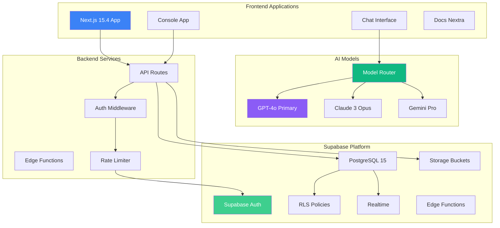

import { Tabs } from 'nextra/components'

# REFLEKT Documentation

**REFLEKT** is an advanced multi-model AI chat platform powered by GPT-4o as the primary model, with support for Claude, Gemini and other leading AI providers. Built with Next.js 15.4 (canary), Supabase backend, and featuring real-time messaging, file attachments, and flexible user authentication including anonymous access.

## Platform Overview

### What is REFLEKT?

REFLEKT is a sophisticated conversational AI platform that combines:
- **GPT-4o Primary Model**: OpenAI's GPT-4o and GPT-4o-mini as default models
- **Multi-Model Support**: Switch between Claude 3 Opus, Gemini Pro, and other providers
- **Supabase Backend**: PostgreSQL database with Row Level Security (RLS)
- **Real-time Features**: Live message streaming and updates via Supabase Realtime
- **Flexible Authentication**: Support for registered and anonymous users
- **Daily Usage Limits**: Free tier (10 messages/day) and Pro tier (100 messages/day)

### Core Capabilities

- **GPT-4o Powered**: Primary model with GPT-4o and GPT-4o-mini
- **Multi-Model Support**: Switch between Claude 3 Opus, Gemini Pro, and more
- **Supabase Storage**: File attachments with secure storage buckets
- **Flexible Auth**: Anonymous access or registered accounts via Supabase Auth
- **Row Level Security**: Database-level security with RLS policies
- **Real-time Updates**: Live message streaming and presence tracking
- **Usage Tracking**: Daily message limits with automatic reset
- **Project Management**: Organize chats into projects for multi-model comparisons

## Architecture Overview



## Technology Stack

### AI Models
- **Primary Model**: OpenAI GPT-4o and GPT-4o-mini
- **Alternative Models**:
  - Anthropic Claude 3 Opus
  - Google Gemini Pro
  - Additional providers via API integration
- **Model Router**: Dynamic model selection per chat
- **Streaming**: Real-time token streaming for all models

### Supabase Backend
- **Database**: PostgreSQL 15 with extensions
- **Authentication**: Supabase Auth with anonymous support
- **Row Level Security**: Database-level access control
- **Storage**: File attachments via Storage Buckets
- **Realtime**: WebSocket-based live updates
- **Edge Functions**: Serverless functions for processing

### Frontend
- **Framework**: Next.js 15.4.0-canary.47 with App Router
- **Language**: TypeScript 5.0+
- **UI Components**: shadcn/ui + Radix UI primitives
- **Styling**: Tailwind CSS v4 + CSS variables
- **State Management**: Zustand + React Query
- **Motion**: Motion primitives for animations

### Backend Infrastructure
- **Runtime**: Next.js API Routes + Edge Functions
- **Database**: Supabase (PostgreSQL)
- **Authentication**: Supabase Auth with RLS
- **File Storage**: Supabase Storage buckets
- **Session Management**: Server-side with cookies

## Key Features

### Multi-Model Chat Interface

| Feature | Description | Status |
|---------|-------------|--------|
| Model Switching | Hot-swap between AI models mid-conversation | Live |
| Streaming Responses | Real-time token streaming with markdown | Live |
| File Uploads | Image and document analysis | Live |
| Multi-Chat | Compare responses from multiple models | Live |
| Chat History | Persistent conversations with search | Live |

### Interactive Avatar Features
- **Real-time Rendering**: Smooth avatar animations synced with speech
- **Voice Synthesis**: Natural voice generation for avatar responses
- **Session Control**: Start, pause, resume avatar interactions
- **Custom Avatars**: Selection from multiple avatar options
- **WebRTC Streaming**: Low-latency video delivery

### Voice Mode Capabilities
- **Real-time Conversation**: Natural back-and-forth dialogue
- **Voice Selection**: Multiple voice options and personalities
- **Audio Controls**: Volume, speed, and pitch adjustments
- **Transcription**: Real-time speech-to-text
- **Interruption Handling**: Natural conversation flow

## Quick Start

### Prerequisites

```bash
Node.js >= 22.0.0
pnpm >= 9.14.4
Supabase CLI (optional)
```

### Installation

```bash
# Clone the repository
git clone https://github.com/identity-wael/reflekt-ai.git
cd reflekt-ai

# Install all dependencies (monorepo)
pnpm install

# Set up environment variables
cd console
cp .env.example .env.local

# Run database migrations
pnpm db:migrate

# Start development server (from root)
cd ..
pnpm turbo dev --filter=console

# Or from console directory
# cd console && pnpm dev
```

### Environment Configuration

```env
# Supabase
NEXT_PUBLIC_SUPABASE_URL=your_supabase_url
NEXT_PUBLIC_SUPABASE_ANON_KEY=your_anon_key
SUPABASE_SERVICE_ROLE_KEY=your_service_key

# AI Providers
OPENAI_API_KEY=your_openai_key
ANTHROPIC_API_KEY=your_anthropic_key
GOOGLE_AI_API_KEY=your_google_key
MISTRAL_API_KEY=your_mistral_key
XAI_API_KEY=your_xai_key
PERPLEXITY_API_KEY=your_perplexity_key

# HeyGen Avatar
NEXT_PUBLIC_HEYGEN_API_KEY=your_heygen_key
HEYGEN_SECRET_KEY=your_heygen_secret

# Optional Services
OPENROUTER_API_KEY=your_openrouter_key
DEEPSEEK_API_KEY=your_deepseek_key
```

## Development Workflow

<Tabs items={['Local Setup', 'Docker', 'Cloud Deploy']} defaultIndex={0}>
  <Tabs.Tab>
    **Local Development**

    ```bash
    # Install dependencies
    pnpm install

    # Set up Supabase locally
    supabase start

    # Run migrations
    pnpm db:migrate

    # Start dev server
    pnpm turbo dev --filter=console
    ```

    Access at http://localhost:3000
  </Tabs.Tab>

  <Tabs.Tab>
    **Docker Setup**

    ```bash
    # Build and run with Docker Compose
    docker-compose up -d

    # With Ollama support
    docker-compose -f docker-compose.ollama.yml up -d
    ```

    Includes Supabase, PostgreSQL, and app containers
  </Tabs.Tab>

  <Tabs.Tab>
    **Production Deploy**

    ```bash
    # Deploy to Vercel
    vercel --prod

    # Set environment variables
    vercel env add OPENAI_API_KEY
    vercel env add SUPABASE_URL
    # ... add all required keys
    ```

    Automatic deployments on push to main
  </Tabs.Tab>
</Tabs>

## Documentation Sections

### Core Concepts
- [Getting Started](/docs/get-started) - Quick setup and first chat
- [Architecture](/docs/architecture) - System design and components
- [AI Integration](/docs/ai-integration) - Vercel AI SDK v5 implementation

### Interactive Features
- [Interactive Avatars](/docs/interactive-avatars) - HeyGen integration guide
- [Voice Mode](/docs/voice-audio) - Real-time voice conversations
- [WebRTC Streaming](/docs/webrtc) - Low-latency media delivery

### Development
- [API Reference](/docs/api) - REST and WebSocket endpoints
- [Component Library](/docs/components) - UI component documentation
- [Configuration](/docs/configuration) - Environment and settings

### Backend Services
- [Supabase Integration](/docs/supabase) - Auth, database, and storage
- [Security](/docs/security) - Authentication and RLS policies
- [Deployment](/docs/deployment) - Production deployment guide

## Performance Metrics

| Metric | Target | Current |
|--------|--------|----------|
| First Token (Chat) | &lt;500ms | ~400ms |
| Avatar Load Time | &lt;3s | ~2.5s |
| Voice Latency | &lt;200ms | ~150ms |
| WebRTC Connection | &lt;1s | ~800ms |
| Concurrent Users | 1000+ | Scalable |

## Community & Support

- **GitHub**: [github.com/identity-wael/reflekt-ai](https://github.com/identity-wael/reflekt-ai)
- **Discord**: Join our developer community
- **Issues**: Report bugs and request features
- **Contributing**: See [CONTRIBUTING.md](https://github.com/identity-wael/reflekt-ai/blob/main/CONTRIBUTING.md)

## License

REFLEKT Console is based on the open-source Zola project and enhanced with proprietary features. See [LICENSE](https://github.com/identity-wael/reflekt-ai/blob/main/LICENSE) for details.

---

**Built with cutting-edge AI technologies for the next generation of conversational interfaces**

_Last updated: December 19, 2024_
