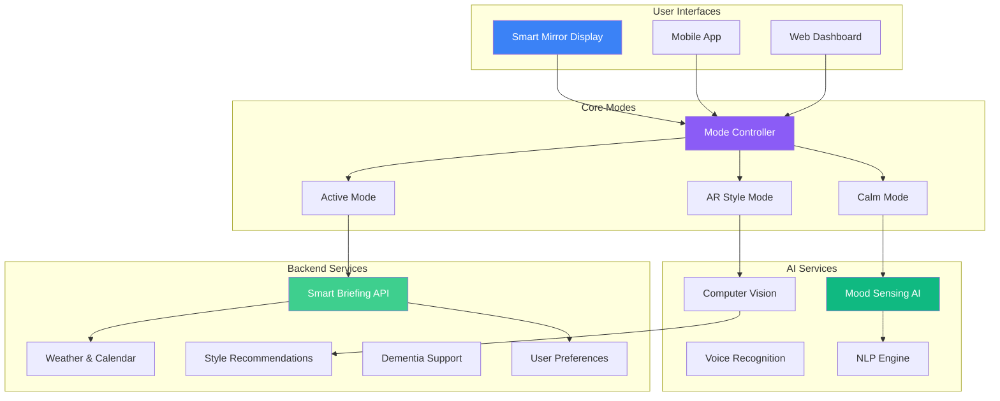

import { Tabs } from 'nextra/components'

# REFLEKT Documentation

**REFLEKT** is an AI-powered smart mirror that transforms your daily routine into a mindful wellness ritual. Built with cutting-edge technology, REFLEKT features dual-mode interfaces, mood sensing, and AR style guidance to help you start each day centered, confident, and prepared.

## Product Overview

### What is REFLEKT?

REFLEKT is an intelligent wellness technology that combines:
- **Dual-Mode Interface**: Calm Mode for mindfulness and Active Mode for daily preparation
- **AI-Powered Mood Sensing**: Emotional awareness with personalized responses
- **AR Style Guidance**: Virtual try-on experiences and style recommendations
- **Smart Briefings**: Context-aware daily information and scheduling
- **Dementia Support**: Specialized features for cognitive assistance and memory support
- **Morning Wellness**: Guided breathing, anxiety reduction, and mindful moments

### Core Capabilities

- **Calm Mode**: Guided breathing exercises and mindfulness moments to center your morning
- **Active Mode**: Personalized dashboard with smart scheduling, daily briefings, and curated content
- **Mood Sensing**: AI-powered emotional awareness that adapts to how you feel
- **AR Style**: Virtual try-on experiences with computer vision technology
- **Smart Assistant**: Daily briefings, weather, calendar, and personalized recommendations
- **Dementia Care**: Memory prompts, routine assistance, and cognitive support features
- **Wellness Tracking**: Monitor stress reduction and mindful minutes
- **Multi-Platform**: Physical mirror, mobile app, and cloud sync

## Architecture Overview



## Technology Stack

### Hardware
- **Display**: Smart mirror with touch interface
- **Sensors**: Camera, microphone, ambient light sensor
- **Connectivity**: Wi-Fi, Bluetooth 5.0
- **Processing**: Edge computing for real-time AI
- **Audio**: High-quality speakers for voice feedback

### Software Platform
- **Framework**: Next.js 15.5.3 with App Router
- **Language**: TypeScript 5.9.3
- **UI Library**: React 19.2.0 with Server Components
- **Styling**: Tailwind CSS v4 + Framer Motion
- **State Management**: React hooks + Context API
- **i18n**: next-intl (English & Japanese)

### AI & ML
- **Mood Detection**: Computer vision and facial analysis
- **Voice Processing**: Speech recognition and synthesis
- **NLP**: Natural language understanding for commands
- **AR Technology**: Real-time style overlay and virtual try-on
- **Personalization**: Machine learning for user preferences

### Backend Services
- **API**: RESTful endpoints for data sync
- **Cloud Storage**: User preferences and history
- **Analytics**: Wellness tracking and usage metrics
- **Third-party Integrations**: Weather, calendar, news APIs

## Key Features

### Dual-Mode Interface

| Feature | Description | Status |
|---------|-------------|--------|
| Calm Mode | Guided breathing exercises and mindfulness moments | Beta |
| Active Mode | Smart briefings, scheduling, and daily preparation | Beta |
| Mode Switching | Seamless transition between modes based on user preference | Beta |
| Personalization | Learns from usage patterns to optimize experience | In Development |
| Voice Control | Hands-free mode switching and interaction | Beta |

### AI-Powered Wellness
- **Mood Sensing**: Facial analysis to detect emotional state
- **Adaptive Responses**: Interface adapts to your mood and needs
- **Breathing Guidance**: Real-time coaching for anxiety reduction
- **Stress Tracking**: Monitor wellness metrics over time
- **Personalized Tips**: AI-generated wellness recommendations

### Smart Daily Assistant
- **Morning Briefings**: Weather, calendar, news, and reminders
- **Smart Scheduling**: Optimize your day based on priorities
- **Style Recommendations**: Outfit suggestions based on weather and calendar
- **AR Try-On**: Virtual preview of clothing and accessories
- **Voice Assistant**: Natural language commands and queries

## Quick Start

### Prerequisites

```bash
Node.js >= 18.17
npm >= 9 or pnpm >= 8
Smart Mirror hardware (for physical deployment)
```

### Installation

```bash
# Clone the repository
git clone https://github.com/identity-wael/REFLEKT.git
cd REFLEKT

# Install dependencies
npm install

# Set up environment variables (if needed)
cp .env.local.example .env.local

# Start development server
npm run dev

# Open http://localhost:3000 to view
```

### Environment Configuration

```env
# API Keys (if using external services)
NEXT_PUBLIC_WEATHER_API_KEY=your_weather_key
NEXT_PUBLIC_CALENDAR_API_KEY=your_calendar_key

# AI Services (for mood sensing and NLP)
AI_MOOD_DETECTION_KEY=your_ai_key
AI_VOICE_RECOGNITION_KEY=your_voice_key

# Optional Analytics
NEXT_PUBLIC_ANALYTICS_ID=your_analytics_id
```

## Development Workflow

<Tabs items={['Local Setup', 'Hardware Setup', 'Production Deploy']} defaultIndex={0}>
  <Tabs.Tab>
    **Local Development**

    ```bash
    # Install dependencies
    npm install

    # Start dev server with Turbopack
    npm run dev

    # Run tests
    npm run test

    # Type checking
    npm run type-check
    ```

    Access at http://localhost:3000
  </Tabs.Tab>

  <Tabs.Tab>
    **Smart Mirror Hardware**

    ```bash
    # Deploy to smart mirror device
    npm run build
    npm run start

    # Configure display settings
    # Set up camera and sensors
    # Connect to Wi-Fi network
    # Enable touch interface
    ```

    See Hardware Setup Guide for detailed instructions
  </Tabs.Tab>

  <Tabs.Tab>
    **Production Deploy**

    ```bash
    # Build for production
    npm run build

    # Deploy to Vercel (for web dashboard)
    vercel --prod

    # Or deploy to smart mirror hardware
    # See deployment documentation
    ```

    Optimized for Vercel Edge Network
  </Tabs.Tab>
</Tabs>

## Documentation Sections

### Getting Started
- [Quick Start Guide](/console/get-started) - Initial setup and configuration
- [Prerequisites](/console/prerequisites) - Required hardware and software
- [Architecture Overview](/console/architecture-docs/architecture) - System design

### Product Features
- [Calm Mode](/console/core-features/calm-mode) - Mindfulness and breathing exercises
- [Active Mode](/console/core-features/active-mode) - Daily briefings and smart scheduling
- [Mood Sensing](/console/core-features/mood-sensing) - AI-powered emotional awareness
- [AR Style Guide](/console/core-features/ar-style) - Virtual try-on and style recommendations

### Development
- [Developer Guide](/console/development/developer-guide) - Development workflow
- [Component Library](/console/development/components) - UI component documentation
- [API Reference](/console/development/api) - API endpoints and integrations
- [Configuration](/console/development/configuration) - Environment setup

### Deployment
- [Hardware Setup](/console/operations/hardware-setup) - Physical mirror installation
- [Software Deployment](/console/operations/deployment) - Production deployment
- [Troubleshooting](/console/operations/troubleshooting) - Common issues and solutions

## Performance Metrics

| Metric | Target | Current |
|--------|--------|----------|
| Mirror Boot Time | &lt;5s | ~4s |
| Mood Detection | &lt;200ms | ~180ms |
| Voice Response | &lt;300ms | ~250ms |
| AR Overlay Rendering | 60fps | 60fps |
| Daily Active Users | 10,000+ | Beta Testing |

## Target Customers

### Individual Consumers
- **Busy Professionals**: Morning optimization and stress management
- **Wellness Enthusiasts**: Mindfulness practice and habit tracking
- **Fashion-Forward Users**: Style guidance and virtual try-on

### Healthcare
- **Dementia Care Facilities**: Memory support and routine assistance
- **Mental Health Clinics**: Anxiety reduction and mood tracking
- **Rehabilitation Centers**: Daily structure and cognitive support

### Commercial Spaces
- **Luxury Hotels**: Premium guest experience enhancement
- **Fitness Centers**: Wellness integration and member engagement
- **Corporate Offices**: Employee wellness programs

## Community & Support

- **Website**: [reflekt.app](https://reflekt.app)
- **GitHub**: [github.com/identity-wael/REFLEKT](https://github.com/identity-wael/REFLEKT)
- **Documentation**: [docs.reflekt.app](https://docs.reflekt.app)
- **Issues**: Report bugs and request features on GitHub
- **Beta Program**: Join the waitlist for early access

## License

REFLEKT Smart Mirror - Proprietary wellness technology. All rights reserved.

---

**Transform your daily routine with mindful technology**

_Last updated: November 16, 2025_
