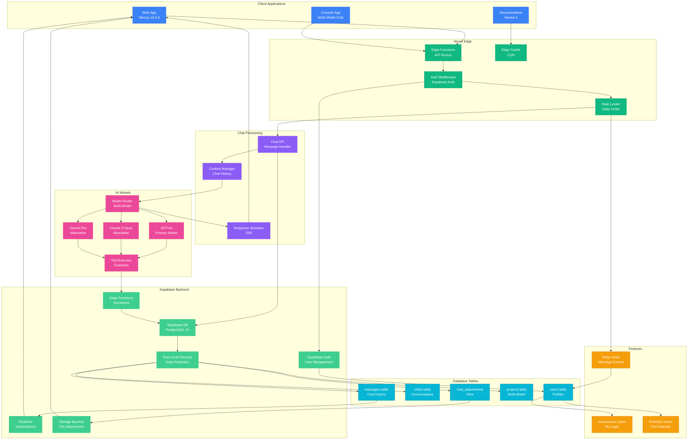

import { Tabs } from 'nextra/components'

# Component Interaction Diagram

This diagram shows the actual Earna AI system architecture with Supabase as the backend, featuring GPT-4o as the primary AI model with alternatives like Claude and Gemini, real-time messaging, and file attachments.



<Tabs items={['Communication Patterns', 'Service Details', 'Integration Points']}>
  <Tabs.Tab>
    **Communication Types:**

    | Pattern | Use Case | Technology | Latency |
    |---------|----------|------------|---------|
    | **REST API** | Web/mobile requests | Next.js API Routes | 50-200ms |
    | **WebSocket** | Real-time updates | Dashboard sync | < 100ms |
    | **Server Actions** | Form submissions | Next.js 15 | 100-500ms |
    | **Streaming** | AI responses | Server-Sent Events | 50-300ms |
    | **Edge Functions** | Authentication | Vercel Edge Runtime | 10-50ms |
    | **Database** | Persistent storage | PostgreSQL + Redis | 5-20ms |
    | **Vector Search** | Semantic queries | pgvector | 10-50ms |

    **Service Integration:**
    - Edge Functions for API endpoints
    - Environment variables for secure configuration
    - Webhook integration for credit bureau updates
    - Health checks via monitoring endpoints
    - Rate limiting for API protection
  </Tabs.Tab>

  <Tabs.Tab>
    **Service Responsibilities:**

    ```yaml
    Chat Processing:
      - Message validation and sanitization
      - Context loading and management
      - Response streaming via SSE
      - Conversation history tracking
      - Error recovery and fallbacks

    AI Orchestration:
      - Claude 3 Opus integration (alternative model)
      - Tool calling and execution
      - Prompt template management
      - Context window optimization
      - Performance monitoring

    Credit Analysis:
      - Canadian credit score interpretation
      - Equifax/TransUnion integration
      - Factor analysis (5 key factors)
      - Personalized recommendations
      - Improvement plan generation

    Banking Integration:
      - Plaid account connectivity
      - Transaction categorization
      - Spending pattern analysis
      - Bill payment tracking
      - Financial health scoring

    Data Services:
      - User data management (NeonDB)
      - Session caching (Redis)
      - Semantic search (pgvector)
      - Document storage (Blob)
      - PIPEDA compliance

    Edge Functions:
      - Firebase Authentication
      - Rate limiting per tier
      - Request routing
      - Response caching
      - Global distribution
    ```
  </Tabs.Tab>

  <Tabs.Tab>
    **Integration Points:**

    | Component | Inbound | Outbound | Protocol |
    |-----------|---------|----------|----------|
    | **Edge Functions** | Client requests | All services | HTTP/HTTPS |
    | **Chat Processor** | User messages | AI Model APIs | REST |
    | **AI Service** | Text prompts | Tool executor | Internal |
    | **Credit Analyzer** | User data | Bureau APIs | REST/SOAP |
    | **Plaid Connect** | Bank auth | Account data | REST |
    | **Context Manager** | Chat history | Redis cache | Redis Protocol |
    | **Database** | SQL queries | Persistent data | PostgreSQL |
    | **Vector Store** | Embeddings | Similarity search | SQL |
    | **External APIs** | Service requests | API responses | REST |
  </Tabs.Tab>
</Tabs>
