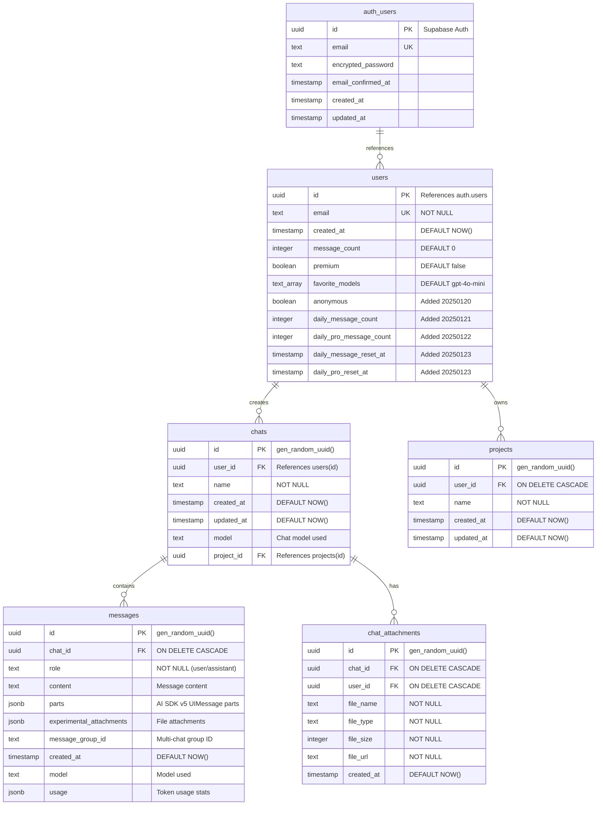
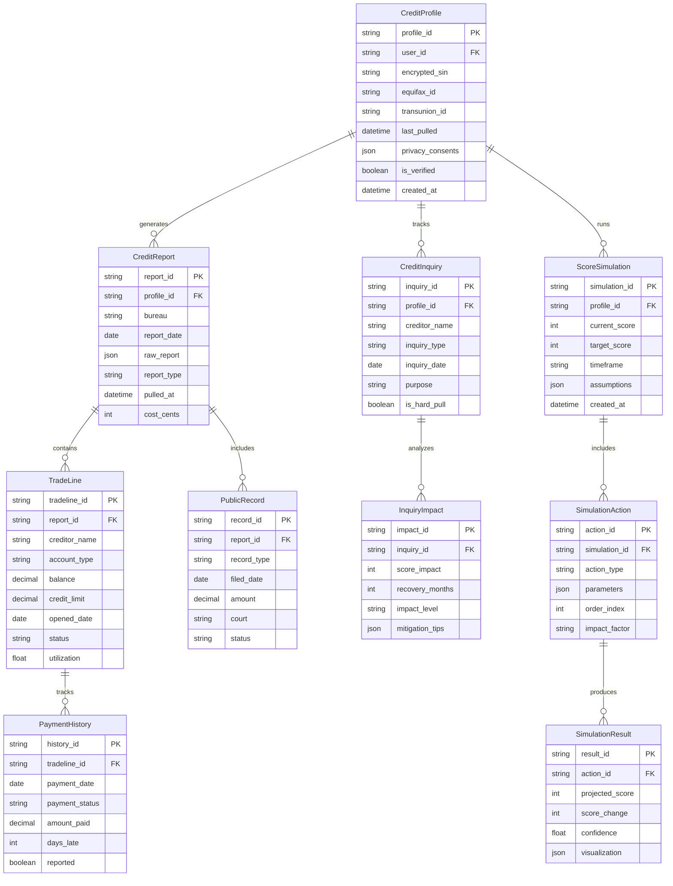
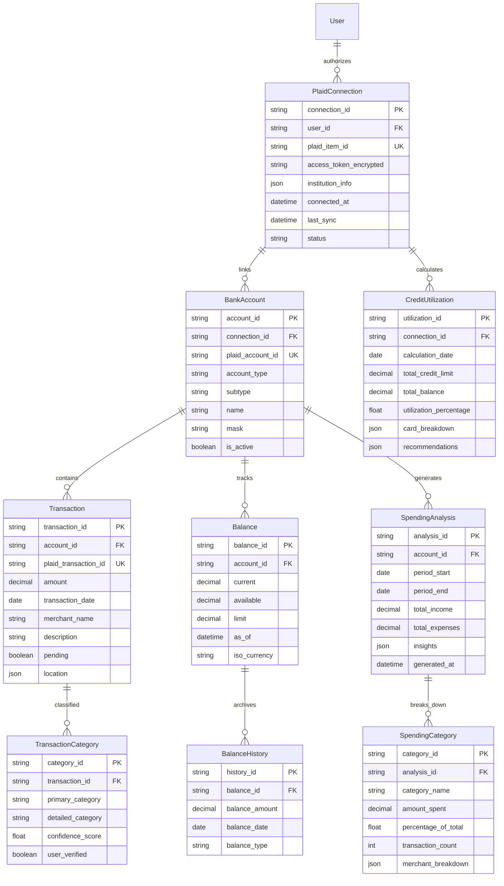
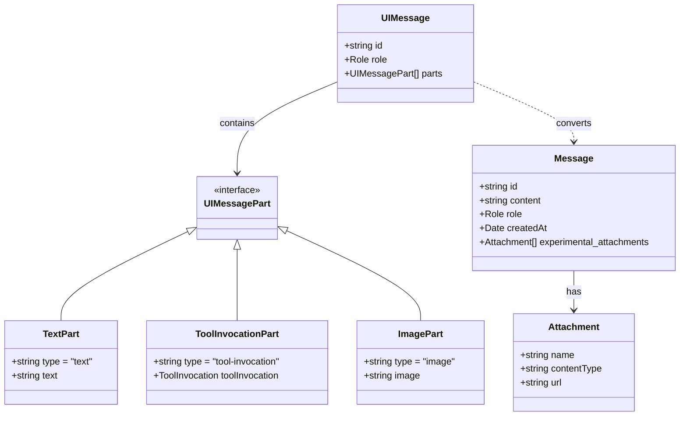

import { Tabs } from 'nextra/components'

# Data Models

## Actual Supabase Database Schema

This ER diagram shows the ACTUAL tables and relationships currently implemented in the Earna AI Supabase database with Row Level Security (RLS).



<Tabs items={['Entity Details', 'Relationships', 'Database Schema']}>
  <Tabs.Tab>
    **Core Entities:**

    | Entity | Description | Primary Storage |
    |--------|-------------|-----------------|
    | **auth.users** | Supabase Auth users | Supabase Auth Schema |
    | **users** | Platform user profiles | Supabase Public Schema |
    | **chats** | AI chat conversations | Supabase with RLS |
    | **messages** | Chat messages | Supabase with RLS |
    | **projects** | Multi-model projects | Supabase with RLS |
    | **chat_attachments** | File attachments | Supabase Storage |

    **Data Volume Estimates:**
    - Users: ~100,000 (target)
    - Chat Sessions: ~500,000/month
    - Messages: ~5,000,000/month
    - Tool Calls: ~2,000,000/month
    - Credit Profiles: ~100,000
    - Credit Scores: ~200,000/month
    - Improvement Plans: ~50,000/month
  </Tabs.Tab>

  <Tabs.Tab>
    **Relationship Cardinalities:**

    ```sql
    -- One-to-Many Relationships
    User (1) ----< (N) ChatSession
    User (1) ----< (N) CreditProfile
    ChatSession (1) ----< (N) Message
    ChatSession (1) ----< (N) ToolCall
    Message (1) ----< (N) ToolCall
    ToolCall (1) ----< (N) ToolResult
    CreditProfile (1) ----< (N) CreditScore
    CreditProfile (1) ----< (N) ImprovementPlan
    CreditScore (1) ----< (N) CreditFactor
    ImprovementPlan (1) ----< (N) ActionItem

    -- One-to-One Relationships
    User (1) ----= (1) CreditProfile (primary)
    ```

    **Referential Integrity Rules:**
    - CASCADE DELETE: ChatSession → Message → ToolCall → ToolResult
    - CASCADE DELETE: ImprovementPlan → ActionItem
    - RESTRICT DELETE: User with active ChatSessions
    - SET NULL: CreditProfile deletion anonymizes user data
    - NO ACTION: CreditScore preserves historical data
  </Tabs.Tab>

  <Tabs.Tab>
    **Physical Database Schema:**

    ```sql
    -- Actual Supabase Tables from Migrations

    -- Users table (public schema)
    CREATE TABLE public.users (
        id UUID PRIMARY KEY REFERENCES auth.users(id) ON DELETE CASCADE,
        email TEXT NOT NULL UNIQUE,
        created_at TIMESTAMP WITH TIME ZONE DEFAULT NOW(),
        message_count INTEGER DEFAULT 0,
        premium BOOLEAN DEFAULT false,
        favorite_models TEXT[] DEFAULT ARRAY['gpt-4o-mini']::TEXT[],
        anonymous BOOLEAN DEFAULT false,
        daily_message_count INTEGER DEFAULT 0,
        daily_pro_message_count INTEGER DEFAULT 0,
        daily_message_reset_at TIMESTAMP WITH TIME ZONE,
        daily_pro_reset_at TIMESTAMP WITH TIME ZONE
    );

    -- Chats table
    CREATE TABLE public.chats (
        id UUID DEFAULT gen_random_uuid() PRIMARY KEY,
        user_id UUID REFERENCES auth.users(id) ON DELETE CASCADE,
        name TEXT NOT NULL,
        created_at TIMESTAMP WITH TIME ZONE DEFAULT NOW(),
        updated_at TIMESTAMP WITH TIME ZONE DEFAULT NOW(),
        model TEXT,
        project_id UUID REFERENCES public.projects(id)
    );

    -- Messages table (AI SDK v5 compatible)
    CREATE TABLE public.messages (
        id UUID DEFAULT gen_random_uuid() PRIMARY KEY,
        chat_id UUID REFERENCES public.chats(id) ON DELETE CASCADE,
        role TEXT NOT NULL, -- user/assistant/system
        content TEXT, -- Text content (can be extracted from parts)
        parts JSONB, -- AI SDK v5 UIMessage parts array
        experimental_attachments JSONB, -- File attachments
        message_group_id TEXT, -- For multi-chat grouping
        created_at TIMESTAMP WITH TIME ZONE DEFAULT NOW(),
        model TEXT, -- Model used for this message
        usage JSONB -- Token usage statistics
    );

    -- Projects table (multi-model conversations)
    CREATE TABLE public.projects (
        id UUID DEFAULT gen_random_uuid() PRIMARY KEY,
        user_id UUID REFERENCES auth.users(id) ON DELETE CASCADE,
        name TEXT NOT NULL,
        created_at TIMESTAMP WITH TIME ZONE DEFAULT NOW(),
        updated_at TIMESTAMP WITH TIME ZONE DEFAULT NOW()
    );

    -- Chat attachments table
    CREATE TABLE public.chat_attachments (
        id UUID DEFAULT gen_random_uuid() PRIMARY KEY,
        chat_id UUID REFERENCES public.chats(id) ON DELETE CASCADE,
        user_id UUID REFERENCES auth.users(id) ON DELETE CASCADE,
        file_name TEXT NOT NULL,
        file_type TEXT NOT NULL,
        file_size INTEGER NOT NULL,
        file_url TEXT NOT NULL,
        created_at TIMESTAMP WITH TIME ZONE DEFAULT NOW()
    );

    -- Redis Schema (Session Cache)
    Key Pattern: session:{session_id}
    Data Structure: Hash
    Fields:
      - user_id: UUID
      - context: JSON
      - last_activity: timestamp
      - expires_at: timestamp

    -- pgvector Schema (Embeddings)
    CREATE EXTENSION IF NOT EXISTS vector;

    CREATE TABLE message_embeddings (
        embedding_id UUID PRIMARY KEY DEFAULT gen_random_uuid(),
        message_id UUID REFERENCES messages(message_id),
        embedding vector(1536),
        created_at TIMESTAMP WITH TIME ZONE DEFAULT NOW()
    );

    -- Supabase Auth Integration
    CREATE TABLE auth.users (
        id UUID PRIMARY KEY DEFAULT gen_random_uuid(),
        email VARCHAR(255) UNIQUE,
        encrypted_password VARCHAR(255),
        email_confirmed_at TIMESTAMP WITH TIME ZONE,
        created_at TIMESTAMP WITH TIME ZONE DEFAULT NOW(),
        updated_at TIMESTAMP WITH TIME ZONE DEFAULT NOW()
    );

    -- Supabase RLS Policies
    ALTER TABLE users ENABLE ROW LEVEL SECURITY;
    ALTER TABLE chat_sessions ENABLE ROW LEVEL SECURITY;
    ALTER TABLE messages ENABLE ROW LEVEL SECURITY;

    -- User can only access their own data
    CREATE POLICY "Users can view own profile" ON users
        FOR SELECT USING (auth.uid() = user_id);

    CREATE POLICY "Users can update own profile" ON users
        FOR UPDATE USING (auth.uid() = user_id);

    CREATE POLICY "Users can view own sessions" ON chat_sessions
        FOR SELECT USING (auth.uid() = user_id);

    CREATE POLICY "Users can view own messages" ON messages
        FOR SELECT USING (
            session_id IN (
                SELECT session_id FROM chat_sessions
                WHERE user_id = auth.uid()
            )
        );
    ```
  </Tabs.Tab>
</Tabs>

## Supabase Database Architecture

This section details the Supabase-specific implementation and features used in the Earna AI platform.

<Tabs items={['Supabase Features', 'Real-time Subscriptions', 'Edge Functions']}>
  <Tabs.Tab>
    **Supabase Services Used:**

    | Service | Purpose | Implementation |
    |---------|---------|----------------|
    | **Database** | PostgreSQL 15 | Core data storage with RLS |
    | **Auth** | User authentication | Email/password, OAuth providers |
    | **Storage** | File storage | Document uploads, reports |
    | **Realtime** | Live updates | Chat messages, notifications |
    | **Edge Functions** | Serverless compute | AI processing, webhooks |
    | **Vector** | Embeddings | pgvector for semantic search |

    **Supabase Configuration:**
    ```typescript
    // Supabase Client Configuration
    import { createClient } from '@supabase/supabase-js'

    const supabaseUrl = process.env.NEXT_PUBLIC_SUPABASE_URL
    const supabaseAnonKey = process.env.NEXT_PUBLIC_SUPABASE_ANON_KEY

    export const supabase = createClient(supabaseUrl, supabaseAnonKey, {
      auth: {
        autoRefreshToken: true,
        persistSession: true,
        detectSessionInUrl: true
      },
      realtime: {
        params: {
          eventsPerSecond: 10
        }
      },
      db: {
        schema: 'public'
      }
    })

    // Supabase Admin Client (Server-side)
    const supabaseAdmin = createClient(
      supabaseUrl,
      process.env.SUPABASE_SERVICE_ROLE_KEY,
      {
        auth: {
          autoRefreshToken: false,
          persistSession: false
        }
      }
    )
    ```

    **Database Extensions:**
    - `uuid-ossp`: UUID generation
    - `pgcrypto`: Encryption functions
    - `pg_stat_statements`: Query performance
    - `pgvector`: Vector similarity search
    - `pg_trgm`: Text similarity search
  </Tabs.Tab>

  <Tabs.Tab>
    **Real-time Subscriptions:**

    ```typescript
    // Chat Message Subscription
    const messageSubscription = supabase
      .channel('chat-messages')
      .on(
        'postgres_changes',
        {
          event: 'INSERT',
          schema: 'public',
          table: 'messages',
          filter: `session_id=eq.${sessionId}`
        },
        (payload) => {
          handleNewMessage(payload.new)
        }
      )
      .on(
        'postgres_changes',
        {
          event: 'UPDATE',
          schema: 'public',
          table: 'messages',
          filter: `session_id=eq.${sessionId}`
        },
        (payload) => {
          handleMessageUpdate(payload.new)
        }
      )
      .subscribe()

    // Credit Score Updates
    const scoreSubscription = supabase
      .channel('credit-scores')
      .on(
        'postgres_changes',
        {
          event: '*',
          schema: 'public',
          table: 'credit_scores',
          filter: `user_id=eq.${userId}`
        },
        (payload) => {
          if (payload.eventType === 'INSERT') {
            notifyScoreUpdate(payload.new)
          }
        }
      )
      .subscribe()

    // Presence Tracking
    const presenceChannel = supabase.channel('online-users')

    presenceChannel
      .on('presence', { event: 'sync' }, () => {
        const state = presenceChannel.presenceState()
        updateOnlineUsers(state)
      })
      .on('presence', { event: 'join' }, ({ key, newPresences }) => {
        handleUserJoin(newPresences)
      })
      .on('presence', { event: 'leave' }, ({ key, leftPresences }) => {
        handleUserLeave(leftPresences)
      })
      .subscribe(async (status) => {
        if (status === 'SUBSCRIBED') {
          await presenceChannel.track({
            user_id: userId,
            online_at: new Date().toISOString()
          })
        }
      })
    ```

    **Broadcast Channels:**
    - System notifications
    - Credit alert broadcasts
    - Admin announcements
    - Live support chat
  </Tabs.Tab>

  <Tabs.Tab>
    **Supabase Edge Functions:**

    ```typescript
    // AI Processing Edge Function
    // supabase/functions/process-ai-request/index.ts
    import { serve } from 'https://deno.land/std@0.168.0/http/server.ts'
    import { createClient } from 'https://esm.sh/@supabase/supabase-js@2'

    serve(async (req) => {
      const { message, sessionId, userId } = await req.json()

      // Initialize Supabase client
      const supabase = createClient(
        Deno.env.get('SUPABASE_URL')!,
        Deno.env.get('SUPABASE_SERVICE_ROLE_KEY')!
      )

      // Process with Claude AI
      const aiResponse = await processWithClaude(message)

      // Store in database
      const { data, error } = await supabase
        .from('messages')
        .insert({
          session_id: sessionId,
          user_id: userId,
          role: 'assistant',
          content: aiResponse,
          metadata: { model: 'claude-3-opus' }
        })

      return new Response(
        JSON.stringify({ success: true, data }),
        { headers: { 'Content-Type': 'application/json' } }
      )
    })

    // Credit Score Calculation Function
    // supabase/functions/calculate-credit-score/index.ts
    serve(async (req) => {
      const { userId, creditData } = await req.json()

      // Calculate score based on Canadian model
      const score = calculateCanadianCreditScore(creditData)

      // Store result
      await supabase
        .from('credit_scores')
        .insert({
          user_id: userId,
          score_value: score,
          bureau: 'calculated',
          score_date: new Date().toISOString()
        })

      // Trigger real-time update
      await supabase
        .channel('credit-updates')
        .send({
          type: 'broadcast',
          event: 'score-calculated',
          payload: { userId, score }
        })

      return new Response(JSON.stringify({ score }))
    })
    ```

    **Edge Function Triggers:**
    - Webhook processing
    - Scheduled jobs (cron)
    - Database triggers
    - HTTP API endpoints
    - Event-driven processing
  </Tabs.Tab>
</Tabs>

## Credit Analysis Data Model

This ER diagram shows the Canadian credit analysis data model for credit score tracking and improvement planning.



<Tabs items={['Credit Entities', 'Privacy Compliance', 'Data Security']}>
  <Tabs.Tab>
    **Credit Data Entities:**

    | Entity | Description | Encryption |
    |--------|-------------|------------|
    | **CreditProfile** | User credit identity | PII encrypted |
    | **CreditReport** | Bureau credit reports | Encrypted at rest |
    | **TradeLine** | Credit accounts | Encrypted |
    | **PaymentHistory** | Payment records | Encrypted |
    | **PublicRecord** | Bankruptcies, liens | Encrypted |
    | **CreditInquiry** | Credit checks | Audit trail |
    | **InquiryImpact** | Inquiry effects | Encrypted |
    | **ScoreSimulation** | What-if scenarios | Encrypted |
    | **SimulationAction** | Simulated actions | Encrypted |
    | **SimulationResult** | Projected outcomes | Encrypted |

    **Credit Score Factors (Canadian):**
    - Payment History: 35%
    - Credit Utilization: 30%
    - Length of Credit History: 15%
    - Types of Credit: 10%
    - New Credit Inquiries: 10%
  </Tabs.Tab>

  <Tabs.Tab>
    **PIPEDA Compliance Features:**

    ```yaml
    privacy_compliance:
      - consent_management:
          explicit_consent: required
          withdrawal: immediate
          granular_control: true

      - data_minimization:
          collection: purpose_limited
          retention: time_bounded
          deletion: on_request

      - encryption:
          at_rest: "AES-256-GCM"
          in_transit: "TLS 1.3"
          key_management: "Vercel KMS"

      - access_control:
          authentication: "Firebase Auth"
          authorization: "role_based"
          audit_logging: comprehensive

    data_subject_rights:
      - access:
          format: "structured_json"
          timeframe: "30_days"

      - portability:
          format: "machine_readable"
          transfer: "direct_to_controller"

      - rectification:
          process: "verified_update"
          notification: "automated"

      - erasure:
          right_to_be_forgotten: true
          exceptions: "legal_obligations"
    ```

    **Audit Trail:**
    - All data access logged
    - Immutable audit records
    - Real-time monitoring
    - Automated compliance reports
  </Tabs.Tab>

  <Tabs.Tab>
    **Access Control Matrix:**

    | Role | Own Data | Credit Reports | Simulations | Admin Functions |
    |------|----------|----------------|-------------|-----------------|
    | **User** | Full access | Own only | Create/view own | None |
    | **Advisor** | View assigned | View assigned | Create for assigned | Limited |
    | **Admin** | Audit only | Metadata only | Statistics only | Full system |
    | **System** | As needed | Processing only | Execution only | Automated |

    **Data Security Implementation:**

    ```typescript
    class CreditDataSecurity {
      private encryption = new AES256GCM();

      async encryptPII(data: any): Promise<string> {
        const key = await this.getEncryptionKey();
        return this.encryption.encrypt(
          JSON.stringify(data),
          key
        );
      }

      async decryptPII(encrypted: string): Promise<any> {
        const key = await this.getDecryptionKey();
        const decrypted = this.encryption.decrypt(
          encrypted,
          key
        );
        return JSON.parse(decrypted);
      }

      async auditAccess(
        userId: string,
        resource: string,
        action: string
      ): Promise<void> {
        await this.auditLog.record({
          userId,
          resource,
          action,
          timestamp: new Date(),
          ip: this.getClientIP(),
          sessionId: this.getSessionId()
        });
      }
    }
    ```
  </Tabs.Tab>
</Tabs>

## Banking Integration Data Model

This section details the data model for Plaid banking integration and financial analysis.



<Tabs items={['Banking Entities', 'Integration Details', 'Financial Analytics']}>
  <Tabs.Tab>
    **Banking Data Entities:**

    | Entity | Description | Update Frequency |
    |--------|-------------|------------------|
    | **PlaidConnection** | User's Plaid link | On demand |
    | **BankAccount** | Linked bank accounts | Daily sync |
    | **Transaction** | Account transactions | Real-time webhook |
    | **TransactionCategory** | Spending categories | Per transaction |
    | **Balance** | Current balances | Daily |
    | **BalanceHistory** | Historical balances | Daily snapshot |
    | **SpendingAnalysis** | Spending patterns | Weekly/Monthly |
    | **SpendingCategory** | Category breakdown | Per analysis |
    | **CreditUtilization** | Credit card usage | Daily |

    **Plaid Data Scope:**
    - Transactions: 2 years history
    - Balances: Real-time
    - Account details: On connection
    - Identity: Optional verification
    - Liabilities: Credit cards, loans
  </Tabs.Tab>

  <Tabs.Tab>
    **Plaid Integration Configuration:**

    ```typescript
    // Plaid Client Configuration
    const plaidConfig = {
      clientId: process.env.PLAID_CLIENT_ID,
      secret: process.env.PLAID_SECRET,
      env: plaid.environments.production,
      products: [
        'transactions',
        'accounts',
        'balance',
        'liabilities',
        'identity'
      ],
      countryCodes: ['CA'],
      webhook: 'https://api.earna.ai/webhooks/plaid'
    };

    // Webhook Event Handlers
    const webhookHandlers = {
      'TRANSACTIONS': {
        'INITIAL_UPDATE': handleInitialUpdate,
        'HISTORICAL_UPDATE': handleHistoricalUpdate,
        'DEFAULT_UPDATE': handleDefaultUpdate,
        'TRANSACTIONS_REMOVED': handleTransactionsRemoved
      },
      'ITEM': {
        'ERROR': handleItemError,
        'PENDING_EXPIRATION': handlePendingExpiration,
        'USER_PERMISSION_REVOKED': handlePermissionRevoked
      },
      'ACCOUNTS': {
        'ACCOUNT_ADDED': handleAccountAdded,
        'ACCOUNT_REMOVED': handleAccountRemoved
      }
    };

    // Data Sync Strategy
    const syncStrategy = {
      transactions: {
        initial_days: 730,    // 2 years
        update_frequency: 'daily',
        batch_size: 500
      },
      balances: {
        update_frequency: 'twice_daily',
        alert_thresholds: {
          low_balance: 100,
          high_utilization: 0.7
        }
      }
    };
    ```
  </Tabs.Tab>

  <Tabs.Tab>
    **Financial Analytics Queries:**

    ```sql
    -- Monthly Spending Trend
    WITH monthly_spending AS (
      SELECT
        DATE_TRUNC('month', transaction_date) as month,
        SUM(CASE WHEN amount > 0 THEN amount ELSE 0 END) as income,
        SUM(CASE WHEN amount < 0 THEN ABS(amount) ELSE 0 END) as expenses
      FROM transactions
      WHERE account_id = $1
        AND transaction_date >= NOW() - INTERVAL '12 months'
      GROUP BY month
    )
    SELECT
      month,
      income,
      expenses,
      income - expenses as net_savings,
      AVG(expenses) OVER (ORDER BY month ROWS BETWEEN 2 PRECEDING AND CURRENT ROW) as rolling_avg
    FROM monthly_spending
    ORDER BY month;

    -- Credit Utilization Analysis
    SELECT
      ba.name as account_name,
      b.current as current_balance,
      b.limit as credit_limit,
      ROUND((b.current::numeric / NULLIF(b.limit, 0)) * 100, 2) as utilization_percent,
      CASE
        WHEN (b.current::numeric / NULLIF(b.limit, 0)) > 0.7 THEN 'HIGH'
        WHEN (b.current::numeric / NULLIF(b.limit, 0)) > 0.3 THEN 'MODERATE'
        ELSE 'LOW'
      END as utilization_level
    FROM bank_accounts ba
    JOIN balances b ON ba.account_id = b.account_id
    WHERE ba.account_type = 'credit'
      AND ba.connection_id = $1
      AND b.as_of = (SELECT MAX(as_of) FROM balances WHERE account_id = ba.account_id);

    -- Spending Category Breakdown
    SELECT
      tc.primary_category,
      COUNT(*) as transaction_count,
      SUM(ABS(t.amount)) as total_spent,
      ROUND(AVG(ABS(t.amount)), 2) as avg_transaction,
      ROUND((SUM(ABS(t.amount)) / total.total_expenses) * 100, 2) as percent_of_total
    FROM transactions t
    JOIN transaction_categories tc ON t.transaction_id = tc.transaction_id
    CROSS JOIN (
      SELECT SUM(ABS(amount)) as total_expenses
      FROM transactions
      WHERE amount < 0
        AND account_id = $1
        AND transaction_date >= $2
    ) total
    WHERE t.amount < 0
      AND t.account_id = $1
      AND t.transaction_date >= $2
    GROUP BY tc.primary_category, total.total_expenses
    ORDER BY total_spent DESC;
    ```

    **Analytics Insights:**
    - Spending patterns and trends
    - Bill payment reliability
    - Income stability assessment
    - Credit utilization optimization
    - Savings opportunities identification
  </Tabs.Tab>
</Tabs>

## AI SDK v5 Message Types

This section documents the AI SDK v5 message type system used throughout the application.



<Tabs items={['Type Definitions', 'Conversion Functions', 'Database Storage']}>
  <Tabs.Tab>
    **AI SDK v5 Type Definitions:**

    ```typescript
    // From @ai-sdk/react
    export interface UIMessage {
      id: string;
      role: 'user' | 'assistant' | 'system';
      parts: UIMessagePart[];
    }

    export type UIMessagePart =
      | TextUIPart
      | ToolInvocationUIPart
      | ImageUIPart
      | FileUIPart
      | ReasoningUIPart;

    export interface TextUIPart {
      type: 'text';
      text: string;
    }

    export interface ToolInvocationUIPart {
      type: 'tool-invocation';
      toolInvocation: ToolInvocation;
    }

    // From @ai-sdk/ui-utils
    export interface Message {
      id: string;
      content: string;
      role: 'user' | 'assistant' | 'system' | 'data';
      createdAt?: Date;
      experimental_attachments?: Attachment[];
      parts?: UIMessagePart[];
      toolInvocations?: ToolInvocation[];
    }

    export interface Attachment {
      name: string;
      contentType: string;
      url: string;
    }
    ```

    **Role Types:**
    - `user`: Messages from the user
    - `assistant`: AI model responses
    - `system`: System prompts and instructions
    - `data`: Data-only messages (Message type only)
  </Tabs.Tab>

  <Tabs.Tab>
    **Type Conversion Utilities:**

    ```typescript
    // Convert Message to UIMessage
    export function convertToUIMessage(message: Message): UIMessage {
      // If message already has parts, use them
      if (message.parts && message.parts.length > 0) {
        return {
          id: message.id,
          role: message.role as 'user' | 'assistant' | 'system',
          parts: message.parts
        };
      }

      // Otherwise, create text part from content
      return {
        id: message.id,
        role: message.role as 'user' | 'assistant' | 'system',
        parts: [{ type: 'text', text: message.content }]
      };
    }

    // Extract text content from UIMessage
    export function extractTextContent(message: UIMessage): string {
      return message.parts
        .filter((part): part is TextUIPart => part.type === 'text')
        .map(part => part.text)
        .join('');
    }

    // Convert UIMessage to Message for database storage
    export function convertToMessage(
      uiMessage: UIMessage,
      attachments?: Attachment[]
    ): Message {
      const content = extractTextContent(uiMessage);

      return {
        id: uiMessage.id,
        role: uiMessage.role as 'user' | 'assistant' | 'system' | 'data',
        content,
        createdAt: new Date(),
        experimental_attachments: attachments,
        parts: uiMessage.parts,
        toolInvocations: uiMessage.parts
          .filter((part): part is ToolInvocationUIPart =>
            part.type === 'tool-invocation'
          )
          .map(part => part.toolInvocation)
      };
    }

    // Type guard for text parts
    export function isTextPart(
      part: UIMessagePart
    ): part is TextUIPart {
      return part.type === 'text';
    }
    ```
  </Tabs.Tab>

  <Tabs.Tab>
    **Database Storage Schema:**

    ```sql
    -- Messages table with AI SDK v5 support
    CREATE TABLE messages (
      id UUID PRIMARY KEY DEFAULT gen_random_uuid(),
      chat_id UUID REFERENCES chats(id) ON DELETE CASCADE,

      -- Core message fields
      role TEXT NOT NULL CHECK (role IN ('user', 'assistant', 'system')),
      content TEXT, -- Extracted text content for search/display

      -- AI SDK v5 specific fields
      parts JSONB, -- Stores UIMessagePart[] array
      experimental_attachments JSONB, -- Stores Attachment[] array

      -- Multi-chat support
      message_group_id TEXT, -- Groups messages in multi-chat mode

      -- Metadata
      model TEXT, -- AI model used (e.g., 'gpt-4o', 'claude-3-opus')
      usage JSONB, -- Token usage statistics
      created_at TIMESTAMP WITH TIME ZONE DEFAULT NOW(),

      -- Indexes
      INDEX idx_messages_chat_id (chat_id),
      INDEX idx_messages_created_at (created_at),
      INDEX idx_messages_group_id (message_group_id)
    );
    ```

    **Storage Strategy:**

    ```typescript
    // Storing messages in database
    async function storeMessage(
      chatId: string,
      uiMessage: UIMessage,
      attachments?: Attachment[]
    ) {
      const { data, error } = await supabase
        .from('messages')
        .insert({
          chat_id: chatId,
          role: uiMessage.role,
          content: extractTextContent(uiMessage),
          parts: uiMessage.parts,
          experimental_attachments: attachments,
          created_at: new Date().toISOString()
        });

      return data;
    }

    // Retrieving and converting messages
    async function getMessages(chatId: string): Promise<UIMessage[]> {
      const { data, error } = await supabase
        .from('messages')
        .select('*')
        .eq('chat_id', chatId)
        .order('created_at', { ascending: true });

      if (!data) return [];

      return data.map(msg => {
        // Use stored parts if available
        if (msg.parts && Array.isArray(msg.parts)) {
          return {
            id: msg.id,
            role: msg.role,
            parts: msg.parts
          };
        }

        // Fallback to creating text part from content
        return {
          id: msg.id,
          role: msg.role,
          parts: [{ type: 'text', text: msg.content || '' }]
        };
      });
    }
    ```
  </Tabs.Tab>
</Tabs>
