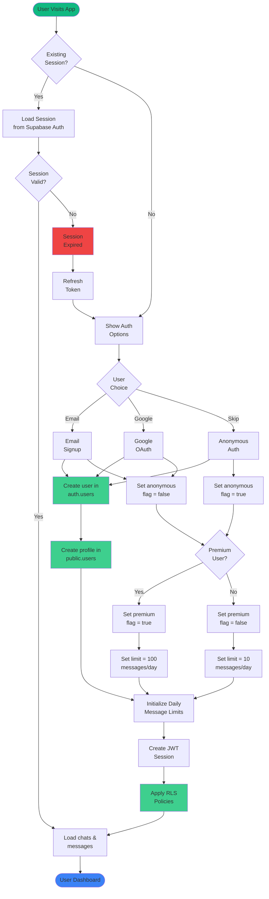
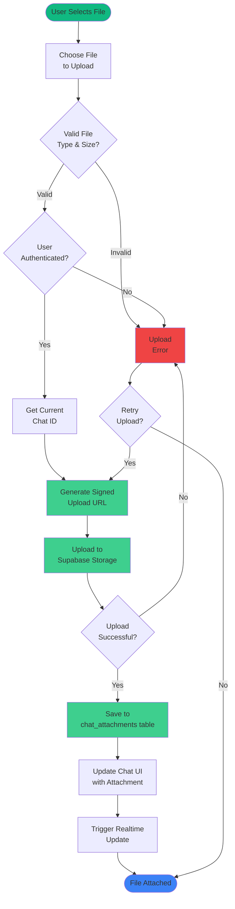
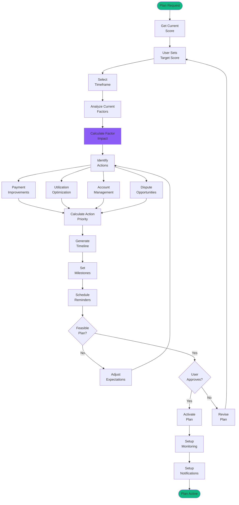
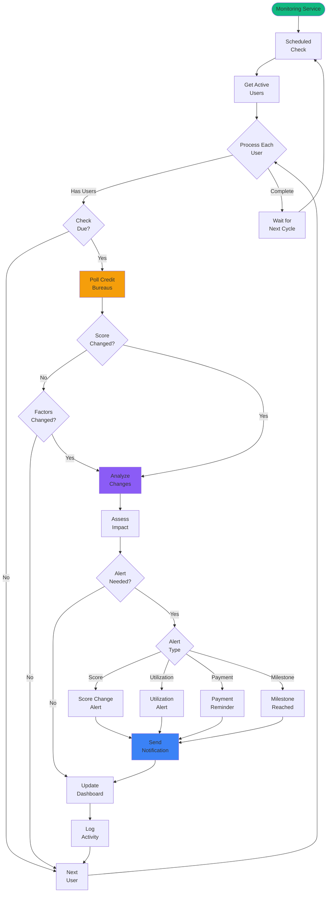
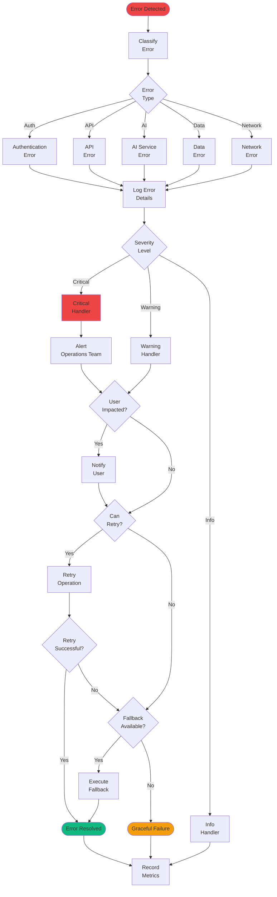

import { Tabs } from 'nextra/components'

# Process Flowcharts

## Chat Conversation Flow with Supabase

This flowchart illustrates the actual chat flow using Supabase backend, multi-model AI support, and real-time messaging.

```mermaid
flowchart TB
    Start([User Opens App])

    AuthCheck{User<br/>Authenticated?}
    
    AnonUser[Create Anonymous<br/>Session]
    AuthUser[Load User<br/>Profile]
    
    LoadChats[Load Chats<br/>from Supabase]
    
    SelectChat{Select or<br/>Create Chat?}
    
    CreateChat[Create New Chat<br/>in Supabase]
    SelectExisting[Select Existing<br/>Chat]
    
    MessageInput[User Types<br/>Message]
    
    DailyLimit{Daily Limit<br/>Reached?}
    
    SelectModel[Select AI Model<br/>GPT-4o - Default]
    
    SaveUserMsg[Save to messages<br/>table]
    
    ModelRouter[Route to<br/>Selected Model]
    
    GPT4API[GPT-4o<br/>Primary API]
    ClaudeAPI[Claude 3 Opus<br/>Alternative]
    GeminiAPI[Gemini Pro<br/>Alternative]
    
    ToolExecution{Tools<br/>Required?}
    
    ExecuteTools[Execute<br/>Tool Functions]
    
    GenerateResponse[Generate AI<br/>Response]
    
    SaveAIMsg[Save to messages<br/>table with usage]
    
    RealtimeUpdate[Trigger Realtime<br/>Subscription]
    
    StreamToClient[Stream Response<br/>via SSE]
    
    UserReads([User Reads Response])
    
    AttachFile{Attach<br/>File?}
    
    UploadToStorage[Upload to<br/>Supabase Storage]
    SaveAttachment[Save to<br/>chat_attachments]
    
    ContinueChat{Continue<br/>Chat?}
    
    UpdateCounts[Update message<br/>counts]
    
    EndSession[End Session]
    
    Start --> AuthCheck
    
    AuthCheck -->|No| AnonUser
    AuthCheck -->|Yes| AuthUser
    
    AnonUser --> LoadChats
    AuthUser --> LoadChats
    
    LoadChats --> SelectChat
    
    SelectChat -->|Create| CreateChat
    SelectChat -->|Select| SelectExisting
    
    CreateChat --> MessageInput
    SelectExisting --> MessageInput
    
    MessageInput --> DailyLimit
    
    DailyLimit -->|Yes| EndSession
    DailyLimit -->|No| SelectModel
    
    SelectModel --> SaveUserMsg
    
    SaveUserMsg --> ModelRouter
    
    ModelRouter -->|Default| GPT4API
    ModelRouter -->|Alternative| ClaudeAPI
    ModelRouter -->|Alternative| GeminiAPI
    
    GPT4API --> ToolExecution
    ClaudeAPI --> ToolExecution
    GeminiAPI --> ToolExecution
    
    ToolExecution -->|Yes| ExecuteTools
    ToolExecution -->|No| GenerateResponse
    
    ExecuteTools --> GenerateResponse
    
    GenerateResponse --> SaveAIMsg
    
    SaveAIMsg --> RealtimeUpdate
    
    RealtimeUpdate --> StreamToClient
    
    StreamToClient --> UserReads
    
    UserReads --> AttachFile
    
    AttachFile -->|Yes| UploadToStorage
    AttachFile -->|No| ContinueChat
    
    UploadToStorage --> SaveAttachment
    SaveAttachment --> ContinueChat
    
    ContinueChat -->|Yes| MessageInput
    ContinueChat -->|No| UpdateCounts
    
    UpdateCounts --> EndSession

    style Start fill:#10B981
    style GPT4API fill:#8B5CF6
    style ClaudeAPI fill:#EC4899
    style GeminiAPI fill:#F59E0B
    style SaveUserMsg fill:#3ECF8E
    style SaveAIMsg fill:#3ECF8E
    style RealtimeUpdate fill:#3ECF8E
```

## User Authentication Flow with Supabase

This flowchart shows the actual authentication process using Supabase Auth, including anonymous users and premium features.

## File Attachment Flow with Supabase Storage

This flowchart shows how file attachments are handled using Supabase Storage buckets.

## Improvement Plan Execution Flow

This flowchart shows how credit improvement plans are generated and executed.

## Real-time Monitoring Flow

This flowchart illustrates the continuous credit monitoring and alert system.

## Error Handling Flow

This flowchart shows the comprehensive error handling and recovery mechanisms.

