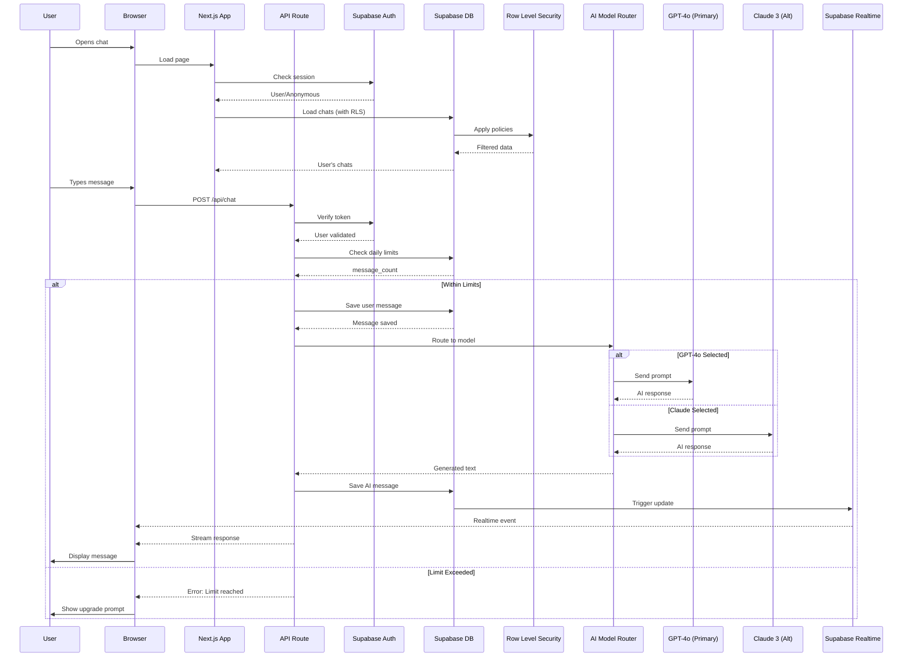
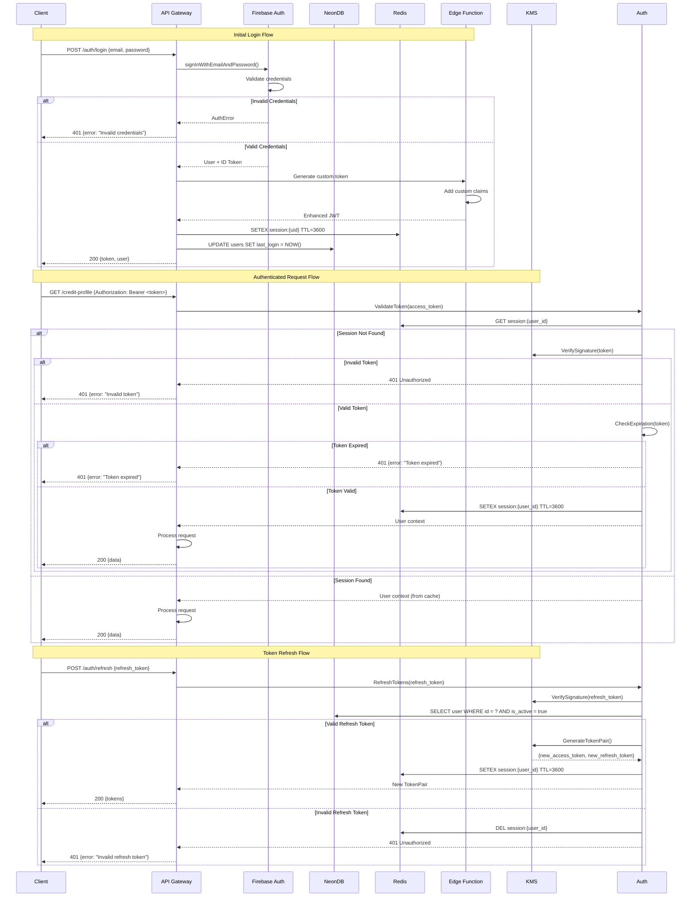
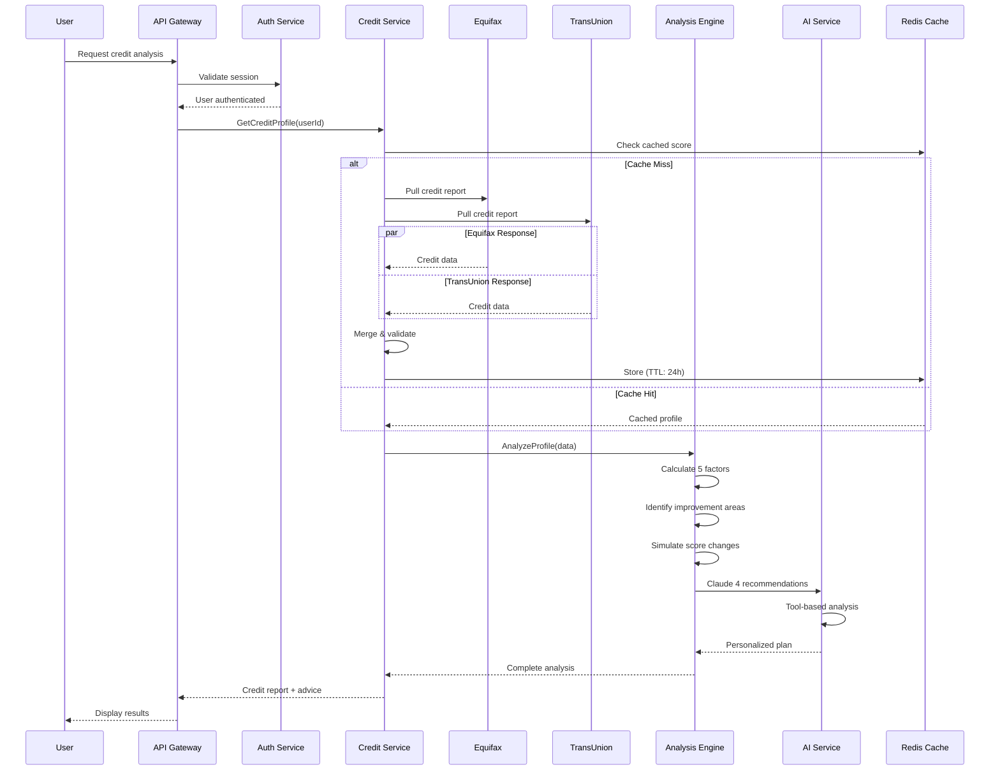
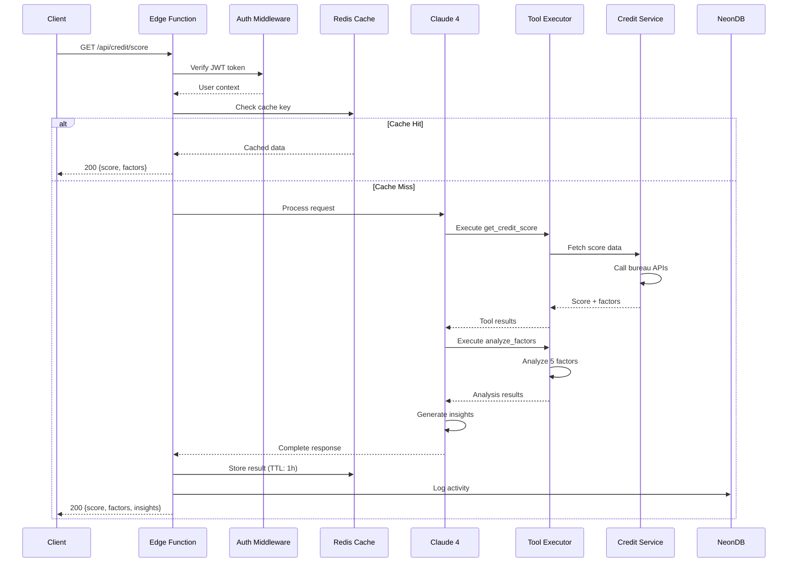

import { Tabs } from 'nextra/components'

# Sequence Diagrams

## Chat Conversation Flow with Supabase

This sequence diagram shows the actual chat flow using Supabase backend with multi-model AI support.



<Tabs items={['Timing Details', 'Message Formats', 'Error Scenarios']}>
  <Tabs.Tab>
    **Performance Specifications:**

    | Operation | Target Latency | Max Latency | Notes |
    |-----------|----------------|-------------|--------|
    | Message Submit | 10ms | 20ms | Browser to Edge |
    | Input Validation | 5-10ms | 20ms | Edge Function |
    | Context Load | 10-20ms | 50ms | Redis + DB |
    | Claude 3 Opus | 200-400ms | 800ms | First token |
    | Tool Execution | 100-300ms | 500ms | Credit operations |
    | Response Stream | 50-100ms | 200ms | SSE streaming |
    | Total E2E | 400-600ms | 1200ms | Message to response |

    **Optimization Strategies:**
    - Stream responses as generated
    - Cache frequent queries
    - Preload user context
    - Batch tool executions
    - Use connection pooling
  </Tabs.Tab>

  <Tabs.Tab>
    **AI SDK v5 Message Formats:**

    **UIMessage Structure (Frontend):**
    ```typescript
    {
      id: "msg-123",
      role: "user",
      parts: [
        {
          type: "text",
          text: "What's my credit score?"
        }
      ]
    }
    ```

    **Message Structure (Database):**
    ```json
    {
      "id": "msg-123",
      "chat_id": "chat-456",
      "role": "user",
      "content": "What's my credit score?",
      "parts": [{
        "type": "text",
        "text": "What's my credit score?"
      }],
      "experimental_attachments": null,
      "message_group_id": null,
      "model": "gpt-4o",
      "created_at": "2024-01-15T10:30:00Z"
    }
    ```

    **Chat Message Request:**
    ```json
    {
        "messages": [{
          "id": "msg-123",
          "role": "user",
          "parts": [{
            "type": "text",
            "text": "What's my credit score and how can I improve it?"
          }]
        }],
        "model": "gpt-4o",
        "chatId": "chat-456",
        "metadata": {
            "timestamp": "2024-01-15T10:30:00Z",
            "source": "web_chat"
        }
    }
    ```

    **Claude 3 Opus Tool Call (Alternative):**
    ```json
    {
        "tool_calls": [
            {
                "id": "call_123",
                "type": "function",
                "function": {
                    "name": "get_credit_score",
                    "arguments": {
                        "bureau": "equifax",
                        "userId": "user_456"
                    }
                }
            }
        ]
    }
    ```

    **AI Response Format:**
    ```json
    {
        "response": "Your Equifax credit score is 720, which is in the 'Good' range.",
        "intent": "credit_score_inquiry",
        "tools_used": ["get_credit_score", "analyze_factors"],
        "context": {
            "score": 720,
            "rating": "good",
            "factors": {
                "payment_history": {"impact": "positive", "weight": 35},
                "utilization": {"impact": "negative", "weight": 30}
            }
        },
        "recommendations": [
            {
                "action": "Reduce credit card utilization",
                "impact": "high",
                "timeframe": "1-2 months"
            },
            {
                "action": "Continue on-time payments",
                "impact": "medium",
                "timeframe": "ongoing"
            }
        ]
    }
    ```
  </Tabs.Tab>

  <Tabs.Tab>
    **Error Handling Sequences:**

    ```mermaid
    sequenceDiagram
        participant User
        participant System
        participant Fallback

        Note over User,Fallback: Claude 3 Failure
        User->>System: Send message
        System--xSystem: Claude 3 timeout
        System->>System: Retry with exponential backoff

        alt Retry Success
            System->>User: Display response
        else Retry Failed
            System->>Fallback: Use cached similar response
            Fallback-->>System: Generic advice
            System->>User: "I'm having trouble accessing your data..."
        end

        Note over User,Fallback: Tool Execution Failure
        System->>System: Credit API error
        System->>System: Check cache for recent data
        alt Cache Hit
            System->>User: Use cached credit data
            System->>User: "Using your most recent data..."
        else Cache Miss
            System->>User: Request manual input
            System->>User: "Please enter your current score"
        end

        Note over User,Fallback: Rate Limit
        User->>System: Too many requests
        System->>User: "Please wait before sending another message"
        System->>System: Queue for retry
    ```
  </Tabs.Tab>
</Tabs>

## Authentication Sequence

This sequence diagram shows the complete authentication and authorization flow using Firebase Auth with JWT tokens.



<Tabs items={['Token Details', 'Security Features', 'Implementation']}>
  <Tabs.Tab>
    **JWT Token Structure:**

    ```json
    {
      "header": {
        "alg": "RS256",
        "typ": "JWT",
        "kid": "key_id_2024"
      },
      "payload": {
        "sub": "user_uuid",
        "email": "user@example.com",
        "role": "user",
        "permissions": ["read:credit", "write:preferences"],
        "iat": 1705320000,
        "exp": 1705323600,
        "iss": "reflekt.ai",
        "aud": "reflekt-api"
      },
      "signature": "..."
    }
    ```

    **Token Lifetimes:**
    - Access Token: 1 hour
    - Refresh Token: 30 days
    - Session Cache: 1 hour (sliding window)

    **Token Storage:**
    - Client: Secure storage (HttpOnly cookies or secure local storage)
    - Server: Redis for session caching
    - Keys: Cloud KMS for signing keys
  </Tabs.Tab>

  <Tabs.Tab>
    **Security Measures:**

    1. **Password Security**
       - Argon2id hashing (memory-hard)
       - Salt per password
       - Configurable work factors

    2. **Token Security**
       - RS256 asymmetric signing
       - Key rotation every 90 days
       - Token binding to IP/device

    3. **Rate Limiting**
       - Login: 5 attempts per 15 minutes
       - Token refresh: 10 per hour
       - API calls: 1000 per hour

    4. **Additional Protection**
       - CSRF tokens for web clients
       - Secure headers (HSTS, CSP)
       - Request signing for sensitive operations

    ```python
    # Rate limiting implementation
    @rate_limit(
        key=lambda: f"login:{request.remote_addr}",
        rate="5/15m",
        method="sliding_window"
    )
    async def login(credentials: LoginRequest):
        # Login logic
        pass
    ```
  </Tabs.Tab>

  <Tabs.Tab>
    **Authentication Service Implementation:**

    ```python
    from datetime import datetime, timedelta
    from typing import Optional, Tuple
    import jwt
    from argon2 import PasswordHasher
    from redis import Redis

    class AuthService:
        def __init__(self, kms_client, db, redis: Redis):
            self.kms = kms_client
            self.db = db
            self.redis = redis
            self.ph = PasswordHasher()

        async def authenticate(
            self,
            email: str,
            password: str
        ) -> Tuple[str, str]:
            # Fetch user
            user = await self.db.fetch_one(
                "SELECT * FROM users WHERE email = ?",
                email
            )

            if not user:
                raise AuthenticationError("Invalid credentials")

            # Verify password
            try:
                self.ph.verify(user.password_hash, password)
            except:
                raise AuthenticationError("Invalid credentials")

            # Generate tokens
            access_token = await self._generate_access_token(user)
            refresh_token = await self._generate_refresh_token(user)

            # Cache session
            await self._cache_session(user.id, {
                "user_id": user.id,
                "email": user.email,
                "role": user.role,
                "permissions": user.permissions
            })

            return access_token, refresh_token

        async def _generate_access_token(self, user) -> str:
            payload = {
                "sub": str(user.id),
                "email": user.email,
                "role": user.role,
                "permissions": user.permissions,
                "iat": datetime.utcnow(),
                "exp": datetime.utcnow() + timedelta(hours=1)
            }

            # Sign with KMS
            return await self.kms.sign_jwt(payload)
    ```
  </Tabs.Tab>
</Tabs>

## Credit Analysis Flow

This sequence shows how credit score analysis and AI-powered recommendations are generated using Claude 4.



<Tabs items={['Analysis Steps', 'Data Sources', 'Recommendations']}>
  <Tabs.Tab>
    **Credit Analysis Steps:**

    | Step | Duration | Description | Output |
    |------|----------|-------------|--------|
    | **Authentication** | 50ms | Verify user session | User context |
    | **Cache Check** | 10ms | Check for recent data | Cached score or miss |
    | **Bureau Pull** | 2-3s | Equifax/TransUnion API | Raw credit data |
    | **Data Merge** | 100ms | Combine bureau reports | Unified profile |
    | **Factor Analysis** | 200ms | Calculate score factors | Factor breakdown |
    | **Issue Detection** | 150ms | Identify problems | Issue list |
    | **Score Simulation** | 300ms | What-if scenarios | Simulated scores |
    | **AI Recommendations** | 500ms | Generate advice | Personalized tips |

    **Analysis Types:**
    - Full credit report review
    - Quick score check
    - Simulation analysis
    - Improvement planning
    - Dispute assistance
  </Tabs.Tab>

  <Tabs.Tab>
    **Data Sources:**

    **Credit Bureaus:**
    - **Equifax Canada**: Primary credit data source
    - **TransUnion Canada**: Secondary verification
    - **Score Range**: 300-900 (Canadian scale)
    - **Update Frequency**: Monthly reporting
    - **API Latency**: 2-3 seconds average

    **Data Points Retrieved:**
    ```json
    {
        "creditScore": 720,
        "scoreFactors": {
            "paymentHistory": 35,
            "creditUtilization": 30,
            "creditHistory": 15,
            "creditMix": 10,
            "newCredit": 10
        },
        "accounts": [
            {
                "type": "credit_card",
                "balance": 2500,
                "limit": 10000,
                "paymentStatus": "current"
            }
        ],
        "inquiries": {
            "hard": 2,
            "soft": 5
        },
        "publicRecords": [],
        "collections": []
    }
    ```

    **Cache Strategy:**
    - TTL: 24 hours for full reports
    - TTL: 1 hour for score checks
    - Invalidation on user updates
    - Encrypted Redis storage
  </Tabs.Tab>

  <Tabs.Tab>
    **AI-Generated Recommendations:**

    | Recommendation Type | Data Used | Priority | Timeframe |
    |-------------------|-----------|----------|-----------|
    | **Payment Optimization** | Payment history | High | Immediate |
    | **Credit Utilization** | Card balances | High | 1-2 months |
    | **Credit Mix** | Account types | Medium | 3-6 months |
    | **Hard Inquiry Management** | Recent pulls | Medium | 2-3 months |
    | **Account Age Strategy** | Credit history | Low | 6-12 months |
    | **Dispute Opportunities** | Error detection | Variable | 1-3 months |

    **Personalized Action Plans:**
    ```yaml
    recommendation_categories:
      immediate_actions:
        - Pay down high-utilization cards
        - Set up automatic payments
        - Request credit limit increases
        - Dispute errors on report

      short_term_goals:
        - Reduce utilization below 30%
        - Establish payment consistency
        - Avoid new hard inquiries
        - Build emergency fund

      long_term_strategies:
        - Diversify credit mix
        - Maintain aged accounts
        - Strategic credit applications
        - Credit score monitoring

    success_metrics:
      - Score improvement projection
      - Timeline to reach target
      - Risk assessment
      - Confidence level
    ```

    **Canadian-Specific Advice:**
    - Provincial credit regulations
    - Canadian banking products
    - PIPEDA compliance
    - Bilingual support (EN/FR)
  </Tabs.Tab>
</Tabs>

## REST API Sequence

This sequence diagram shows how REST API requests are handled for credit operations, including caching and tool execution.



<Tabs items={['Query Processing', 'Performance Optimization', 'Federation']}>
  <Tabs.Tab>
    **REST API Processing:**

    1. **Request Validation**
       - JWT token verification
       - Rate limit checking
       - Input sanitization
       - Permission validation

    2. **Claude 4 Integration**
       - Tool selection based on endpoint
       - Context preparation
       - Tool execution orchestration
       - Response formatting

    3. **Caching Strategy**
       - Key generation by user + endpoint
       - TTL based on data type
       - Cache invalidation on updates
       - Stale-while-revalidate pattern

    4. **Response Handling**
       - Consistent error format
       - Partial success support
       - Metadata inclusion
       - CORS headers

    ```typescript
    // Example API endpoint with Claude 4
    export async function GET(request: Request) {
      const session = await getSession(request);

      const claude = new Anthropic({
        apiKey: process.env.ANTHROPIC_API_KEY
      });

      const response = await claude.messages.create({
        model: 'claude-4-1-20250805',
        max_tokens: 1024,
        tools: creditTools,
        messages: [{
          role: 'user',
          content: `Get credit score for user ${session.userId}`
        }]
      });

      // Process tool calls
      const results = await executeToolCalls(response.tool_calls);

      return NextResponse.json({
        score: results.score,
        factors: results.factors,
        recommendations: results.recommendations
      });
    }
    ```
  </Tabs.Tab>

  <Tabs.Tab>
    **Performance Optimizations:**

    ```typescript
    // Connection pooling for NeonDB
    const pool = new Pool({
      connectionString: process.env.DATABASE_URL,
      max: 20,
      idleTimeoutMillis: 30000,
      connectionTimeoutMillis: 2000,
    });

    // Redis caching with tags
    class CreditCache {
      async get(key: string): Promise<any> {
        const cached = await redis.get(key);
        if (cached) {
          await redis.expire(key, 3600); // Sliding window
          return JSON.parse(cached);
        }
        return null;
      }

      async set(key: string, value: any, ttl: number) {
        await redis.setex(
          key,
          ttl,
          JSON.stringify(value)
        );
      }

      async invalidate(pattern: string) {
        const keys = await redis.keys(pattern);
        if (keys.length) {
          await redis.del(...keys);
        }
      }
    }

    // Tool execution optimization
    const toolExecutor = {
      async executeBatch(tools: ToolCall[]) {
        return Promise.all(
          tools.map(tool => this.execute(tool))
        );
      },

      async execute(tool: ToolCall) {
        // Check cache first
        const cached = await cache.get(tool.cacheKey);
        if (cached) return cached;

        // Execute tool
        const result = await handlers[tool.name](tool.args);

        // Cache result
        await cache.set(tool.cacheKey, result, tool.ttl);
        return result;
      }
    };
    ```

    **Performance Metrics:**
    - API latency p50: < 100ms
    - API latency p99: < 500ms
    - Cache hit rate: > 75%
    - Tool execution efficiency: > 85%
  </Tabs.Tab>

  <Tabs.Tab>
    **API Endpoint Structure:**

    ```typescript
    // Credit API endpoints
    const creditEndpoints = {
      // Score operations
      'GET /api/credit/score': getCreditScore,
      'GET /api/credit/history': getScoreHistory,
      'POST /api/credit/simulate': simulateScore,

      // Factor analysis
      'GET /api/credit/factors': getFactors,
      'POST /api/credit/analyze': analyzeProfile,

      // Recommendations
      'GET /api/credit/recommendations': getRecommendations,
      'POST /api/credit/plan': createImprovementPlan,

      // Chat operations
      'POST /api/chat': processChat,
      'GET /api/chat/history': getChatHistory,
      'POST /api/chat/feedback': submitFeedback
    };

    // Tool definitions for Claude 4
    const creditTools = [
      {
        name: 'get_credit_score',
        description: 'Fetch current credit scores',
        parameters: {
          bureau: { type: 'string', enum: ['equifax', 'transunion'] }
        }
      },
      {
        name: 'analyze_factors',
        description: 'Analyze credit score factors',
        parameters: {
          scoreData: { type: 'object' }
        }
      },
      {
        name: 'create_improvement_plan',
        description: 'Generate personalized improvement plan',
        parameters: {
          targetScore: { type: 'number' },
          timeframe: { type: 'string' }
        }
      }
    ];
    ```

    **API Benefits:**
    - Simple REST interface
    - Tool-based AI integration
    - Efficient caching
    - Clear endpoint structure
  </Tabs.Tab>
</Tabs>
