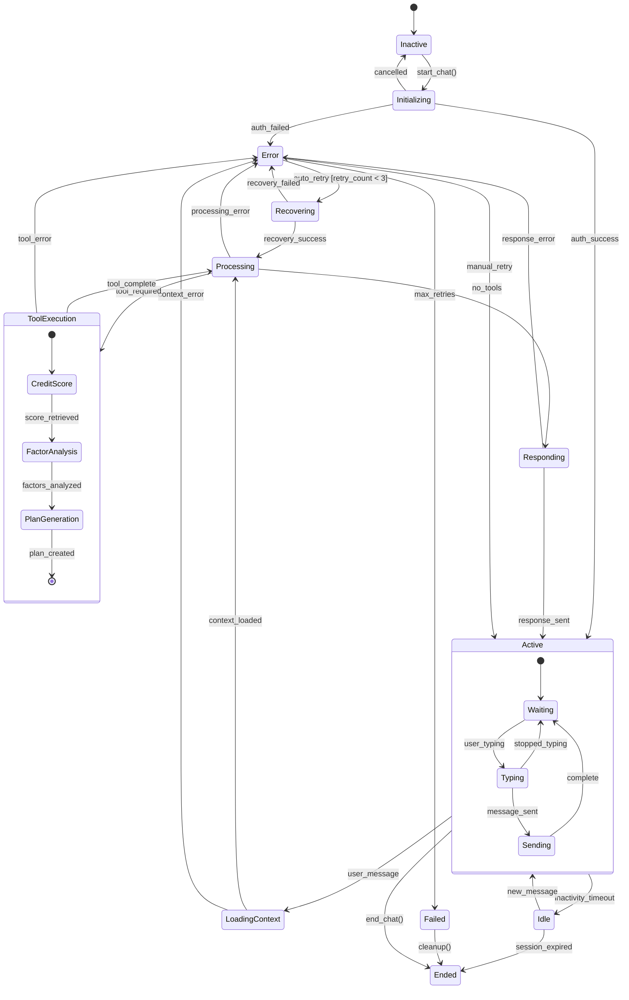
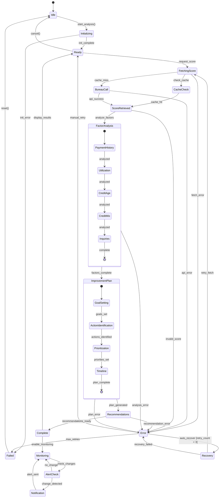
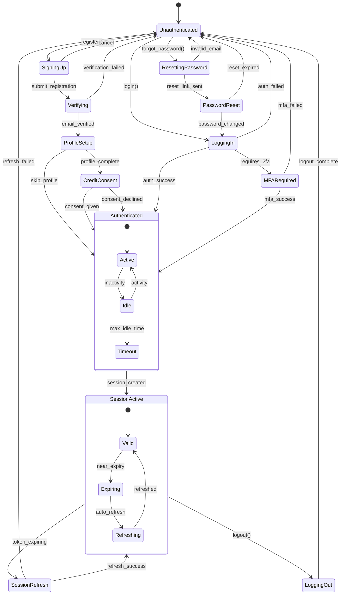

import { Tabs } from 'nextra/components'

# State Diagrams

## Chat Session State Machine

This state diagram shows all possible states in a credit advisory chat session with Claude 4 and the transitions between them.



<Tabs items={['State Descriptions', 'Transition Events', 'Implementation']}>
  <Tabs.Tab>
    **Chat Session States:**

    | State | Description | Allowed Actions |
    |-------|-------------|-----------------|
    | **Inactive** | No active session | Start Chat |
    | **Initializing** | Setting up session | Cancel |
    | **Active** | Chat session active | Send Message, End Chat |
    | **LoadingContext** | Fetching user data | Wait |
    | **Processing** | Claude 4 processing | Wait |
    | **ToolExecution** | Running credit tools | Wait |
    | **Responding** | Streaming response | Wait |
    | **Idle** | Inactive timeout | Resume, End |
    | **Error** | Recoverable error | Retry, End |
    | **Recovering** | Auto-recovery attempt | Wait |
    | **Failed** | Unrecoverable error | End Session |
    | **Ended** | Session terminated | Start New |

    **Composite States:**
    - **Active**: Contains sub-states for user interaction
    - **ToolExecution**: Credit score, analysis, and planning tools
  </Tabs.Tab>

  <Tabs.Tab>
    **State Transitions:**

    ```typescript
    // Transition Guards
    class TransitionGuards {
      static canRetry(session: ChatSession): boolean {
        return session.retryCount < MAX_RETRIES;
      }

      static hasValidAuth(session: ChatSession): boolean {
        return session.user?.isAuthenticated === true;
      }

      static hasContext(session: ChatSession): boolean {
        return session.context !== null;
      }

      static toolsRequired(message: Message): boolean {
        return message.intent.requiresTools;
      }
    }

    // Transition Actions
    class TransitionActions {
      static async onSessionStart(session: ChatSession) {
        session.retryCount = 0;
        await session.loadUserProfile();
        await session.initializeClaude();
      }

      static async onMessageReceived(session: ChatSession, message: string) {
        await session.addToHistory(message);
        await session.updateContext();
      }

      static async onError(session: ChatSession, error: Error) {
        await session.logError(error);
        await session.notifyUser(error.message);
        session.retryCount++;
      }
    }
    ```

    **Event Triggers:**
    - User actions: `start_chat()`, `send_message()`, `end_chat()`
    - System events: `context_loaded`, `tool_complete`, `timeout`
    - Error events: `auth_failed`, `claude_error`, `tool_error`
  </Tabs.Tab>

  <Tabs.Tab>
    **State Machine Implementation:**

    ```typescript
    enum ChatState {
      INACTIVE = 'inactive',
      INITIALIZING = 'initializing',
      ACTIVE = 'active',
      LOADING_CONTEXT = 'loading_context',
      PROCESSING = 'processing',
      TOOL_EXECUTION = 'tool_execution',
      RESPONDING = 'responding',
      IDLE = 'idle',
      ERROR = 'error',
      RECOVERING = 'recovering',
      FAILED = 'failed',
      ENDED = 'ended'
    }

    class ChatSessionStateMachine {
      private state: ChatState = ChatState.INACTIVE;
      private retryCount: number = 0;
      private stateHandlers: Map<ChatState, Function> = new Map();
      private transitionCallbacks: Function[] = [];

      constructor(private sessionId: string) {}

      registerStateHandler(state: ChatState, handler: Function): void {
        this.stateHandlers.set(state, handler);
      }

      async transitionTo(newState: ChatState, event?: string): Promise<void> {
        const oldState = this.state;

        // Validate transition
        if (!this.isValidTransition(oldState, newState)) {
          throw new Error(
            `Invalid transition from ${oldState} to ${newState}`
          );
        }

        // Execute exit actions
        await this.executeExitActions(oldState);

        // Update state
        this.state = newState;

        // Execute entry actions
        await this.executeEntryActions(newState);

        // Notify callbacks
        for (const callback of this.transitionCallbacks) {
          await callback(oldState, newState, event);
        }
      }

      private isValidTransition(from: ChatState, to: ChatState): boolean {
        const validTransitions: Record<ChatState, ChatState[]> = {
          [ChatState.INACTIVE]: [ChatState.INITIALIZING],
          [ChatState.INITIALIZING]: [ChatState.ACTIVE, ChatState.ERROR],
          [ChatState.ACTIVE]: [ChatState.LOADING_CONTEXT, ChatState.IDLE, ChatState.ENDED],
          // ... more transitions
        };
        return validTransitions[from]?.includes(to) ?? false;
      }
    }
    ```

    **Usage Example:**
    ```typescript
    // app/api/chat/session.ts
    const chatSession = new ChatSessionStateMachine('sess_123');
    chatSession.registerStateHandler(
      ChatState.PROCESSING,
      handleClaudeProcessing
    );

    await chatSession.transitionTo(ChatState.INITIALIZING)
    ```
  </Tabs.Tab>
</Tabs>

## Credit Analysis State Machine

This state diagram shows the states and transitions for credit score analysis and improvement plan generation.



<Tabs items={['Pipeline States', 'Processing Details', 'Implementation']}>
  <Tabs.Tab>
    **Analysis States:**

    | State | Description | Processing Time |
    |-------|-------------|-----------------|
    | **Idle** | No active analysis | N/A |
    | **Initializing** | Loading services | ~100ms |
    | **Ready** | Awaiting requests | N/A |
    | **FetchingScore** | Retrieving credit data | 1-3s |
    | **CacheCheck** | Checking cached data | ~10ms |
    | **BureauCall** | API call to bureaus | 2-3s |
    | **ScoreRetrieved** | Score data ready | N/A |
    | **FactorAnalysis** | Analyzing 5 factors | ~200ms |
    | **ImprovementPlan** | Generating plan | ~500ms |
    | **Recommendations** | Creating advice | ~300ms |
    | **Complete** | Analysis done | N/A |
    | **Monitoring** | Watching for changes | Continuous |
    | **Error** | Recoverable error | N/A |
    | **Failed** | Unrecoverable error | N/A |

    **Composite State Details:**
    - **FactorAnalysis**: Payment History → Utilization → Credit Age → Mix → Inquiries
    - **ImprovementPlan**: Goal Setting → Action ID → Prioritization → Timeline
  </Tabs.Tab>

  <Tabs.Tab>
    **Credit Analysis Configuration:**

    ```typescript
    // Analysis Configuration
    const ANALYSIS_CONFIG = {
      cache_ttl: 86400,           // 24 hours
      api_timeout: 5000,          // 5 seconds
      retry_attempts: 3,          // max retries
      retry_delay: 1000,          // 1 second
      score_range: { min: 300, max: 900 },
      bureau_priority: ['equifax', 'transunion'],
      monitoring_interval: 86400000, // 24 hours
    };

    // Credit Factors
    enum CreditFactor {
      PAYMENT_HISTORY = 'payment_history',      // 35%
      UTILIZATION = 'credit_utilization',       // 30%
      CREDIT_AGE = 'credit_age',               // 15%
      CREDIT_MIX = 'credit_mix',               // 10%
      NEW_INQUIRIES = 'new_inquiries'          // 10%
    }

    // Improvement Actions
    interface ImprovementAction {
      id: string;
      factor: CreditFactor;
      action: string;
      impact: 'high' | 'medium' | 'low';
      timeframe: string;
      difficulty: 'easy' | 'moderate' | 'hard';
    }
    ```

    **Performance Metrics:**
    - Cache hit rate: > 70%
    - Bureau API latency: 2-3s
    - Factor analysis: ~200ms
    - Plan generation: ~500ms
    - Total analysis time: < 5s
  </Tabs.Tab>

  <Tabs.Tab>
    **Credit Analysis State Machine Implementation:**

    ```typescript
    enum AnalysisState {
      IDLE = 'idle',
      INITIALIZING = 'initializing',
      READY = 'ready',
      FETCHING_SCORE = 'fetching_score',
      CACHE_CHECK = 'cache_check',
      BUREAU_CALL = 'bureau_call',
      SCORE_RETRIEVED = 'score_retrieved',
      FACTOR_ANALYSIS = 'factor_analysis',
      IMPROVEMENT_PLAN = 'improvement_plan',
      RECOMMENDATIONS = 'recommendations',
      COMPLETE = 'complete',
      MONITORING = 'monitoring',
      ERROR = 'error',
      RECOVERY = 'recovery',
      FAILED = 'failed'
    }

    interface AnalysisContext {
      userId: string;
      creditScore?: number;
      factors?: CreditFactorAnalysis;
      plan?: ImprovementPlan;
      recommendations?: Recommendation[];
      errorCount: number;
      cache?: CreditCache;
    }

    class CreditAnalysisStateMachine {
      private state: AnalysisState = AnalysisState.IDLE;
      private context: AnalysisContext;
      private stateHandlers: Map<AnalysisState, Function>;

      constructor(userId: string) {
        this.context = {
          userId,
          errorCount: 0
        };
        this.stateHandlers = this.setupHandlers();
      }

      async start(): Promise<void> {
        await this.transitionTo(AnalysisState.INITIALIZING);
      }

      async analyzeCredit(): Promise<void> {
        if (this.state !== AnalysisState.READY) {
          throw new Error(
            `Cannot analyze in state ${this.state}`
          );
        }

        await this.transitionTo(AnalysisState.FETCHING_SCORE);
      }

      async transitionTo(newState: AnalysisState): Promise<void> {
        const oldState = this.state;
        this.state = newState;

        const handler = this.stateHandlers.get(newState);
        if (handler) {
          try {
            await handler.call(this);
          } catch (error) {
            await this.handleError(error);
          }
        }
      }

      private async handleFetchingScore(): Promise<void> {
        // Check cache first
        const cached = await this.context.cache?.get(
          `score:${this.context.userId}`
        );

        if (cached) {
          this.context.creditScore = cached.score;
          await this.transitionTo(AnalysisState.SCORE_RETRIEVED);
        } else {
          await this.transitionTo(AnalysisState.BUREAU_CALL);
        }
      }

      private async handleFactorAnalysis(): Promise<void> {
        const factors = await analyzeFactors(this.context.creditScore!);
        this.context.factors = factors;
        await this.transitionTo(AnalysisState.IMPROVEMENT_PLAN);
      }
    }
    ```
  </Tabs.Tab>
</Tabs>

## User Authentication State Machine

This state diagram shows the user authentication flow with Firebase Auth and session management.



<Tabs items={['Error Categories', 'Recovery Strategies', 'Implementation']}>
  <Tabs.Tab>
    **Authentication States:**

    | State | Description | User Actions | System Actions |
    |-------|-------------|-------------|----------------|
    | **Unauthenticated** | No active session | Login, Register | None |
    | **SigningUp** | Registration flow | Submit form | Validate data |
    | **Verifying** | Email verification | Click link | Send email |
    | **ProfileSetup** | Initial profile | Complete form | Store data |
    | **CreditConsent** | Bureau consent | Accept/Decline | Record consent |
    | **LoggingIn** | Authentication | Enter credentials | Verify user |
    | **MFARequired** | 2FA needed | Enter code | Validate MFA |
    | **Authenticated** | Valid session | Use app | Track activity |
    | **SessionActive** | Active use | Actions | Monitor |
    | **SessionRefresh** | Token refresh | None | Refresh JWT |
    | **LoggingOut** | Ending session | Confirm | Clear session |

    **Session Timeouts:**
    - Access token: 1 hour
    - Refresh token: 30 days
    - Idle timeout: 30 minutes
    - Absolute timeout: 24 hours
  </Tabs.Tab>

  <Tabs.Tab>
    **Authentication Flow Details:**

    ```typescript
    // Authentication Configuration
    const AUTH_CONFIG = {
      providers: ['email', 'google', 'apple'],
      mfa: {
        enabled: true,
        methods: ['sms', 'totp', 'email']
      },
      session: {
        accessTokenTTL: 3600,      // 1 hour
        refreshTokenTTL: 2592000,  // 30 days
        idleTimeout: 1800,         // 30 minutes
        absoluteTimeout: 86400     // 24 hours
      },
      passwordPolicy: {
        minLength: 12,
        requireUppercase: true,
        requireLowercase: true,
        requireNumbers: true,
        requireSpecialChars: true,
        preventReuse: 5
      }
    };

    // Firebase Auth Integration
    interface AuthHandlers {
      async signUp(email: string, password: string): Promise<User> {
        const userCredential = await createUserWithEmailAndPassword(
          auth,
          email,
          password
        );
        await sendEmailVerification(userCredential.user);
        return userCredential.user;
      }

      async signIn(email: string, password: string): Promise<User> {
        const userCredential = await signInWithEmailAndPassword(
          auth,
          email,
          password
        );
        
        // Check if MFA is required
        if (userCredential.user.multiFactor.enrolledFactors.length > 0) {
          // Trigger MFA flow
          return this.requireMFA(userCredential.user);
        }
        
        return userCredential.user;
      }

      async refreshSession(refreshToken: string): Promise<string> {
        const response = await fetch('/api/auth/refresh', {
          method: 'POST',
          headers: { 'Content-Type': 'application/json' },
          body: JSON.stringify({ refreshToken })
        });
        
        if (!response.ok) {
          throw new Error('Session refresh failed');
        }
        
        const { accessToken } = await response.json();
        return accessToken;
      }
    }
    ```

    **Security Features:**
    - Password hashing with bcrypt
    - JWT token signing with RS256
    - Session fingerprinting
    - Device tracking
    - Suspicious activity detection
  </Tabs.Tab>

  <Tabs.Tab>
    **Authentication State Machine Implementation:**

    ```typescript
    enum AuthState {
      UNAUTHENTICATED = 'unauthenticated',
      SIGNING_UP = 'signing_up',
      VERIFYING = 'verifying',
      PROFILE_SETUP = 'profile_setup',
      CREDIT_CONSENT = 'credit_consent',
      LOGGING_IN = 'logging_in',
      MFA_REQUIRED = 'mfa_required',
      AUTHENTICATED = 'authenticated',
      SESSION_ACTIVE = 'session_active',
      SESSION_REFRESH = 'session_refresh',
      LOGGING_OUT = 'logging_out'
    }

    interface AuthContext {
      user?: User;
      session?: Session;
      mfaChallenge?: MFAChallenge;
      errorCount: number;
      lastActivity: Date;
    }

    class AuthenticationStateMachine {
      private state: AuthState = AuthState.UNAUTHENTICATED;
      private context: AuthContext = { errorCount: 0, lastActivity: new Date() };
      private stateHandlers: Map<AuthState, Function>;
      private firebase: Auth;

      constructor() {
        this.firebase = getAuth();
        this.stateHandlers = this.setupHandlers();
        this.monitorSession();
      }

      async signUp(email: string, password: string): Promise<void> {
        if (this.state !== AuthState.UNAUTHENTICATED) {
          throw new Error('Already authenticated');
        }

        await this.transitionTo(AuthState.SIGNING_UP);
        
        try {
          const userCredential = await createUserWithEmailAndPassword(
            this.firebase,
            email,
            password
          );
          
          this.context.user = userCredential.user;
          await sendEmailVerification(userCredential.user);
          await this.transitionTo(AuthState.VERIFYING);
        } catch (error) {
          await this.handleAuthError(error);
        }
      }

      async signIn(email: string, password: string): Promise<void> {
        await this.transitionTo(AuthState.LOGGING_IN);
        
        try {
          const userCredential = await signInWithEmailAndPassword(
            this.firebase,
            email,
            password
          );
          
          if (userCredential.user.multiFactor.enrolledFactors.length > 0) {
            await this.transitionTo(AuthState.MFA_REQUIRED);
          } else {
            await this.createSession(userCredential.user);
          }
        } catch (error) {
          await this.handleAuthError(error);
        }
      }

      private async createSession(user: User): Promise<void> {
        const idToken = await user.getIdToken();
        
        const response = await fetch('/api/auth/session', {
          method: 'POST',
          headers: { 'Content-Type': 'application/json' },
          body: JSON.stringify({ idToken })
        });
        
        if (response.ok) {
          const session = await response.json();
          this.context.session = session;
          await this.transitionTo(AuthState.AUTHENTICATED);
          await this.transitionTo(AuthState.SESSION_ACTIVE);
        } else {
          throw new Error('Session creation failed');
        }
      }

      private monitorSession(): void {
        setInterval(async () => {
          if (this.state === AuthState.SESSION_ACTIVE) {
            const now = Date.now();
            const sessionAge = now - this.context.session!.createdAt;
            const idleTime = now - this.context.lastActivity.getTime();
            
            if (idleTime > AUTH_CONFIG.session.idleTimeout * 1000) {
              await this.signOut();
            } else if (sessionAge > AUTH_CONFIG.session.accessTokenTTL * 900) {
              await this.transitionTo(AuthState.SESSION_REFRESH);
            }
          }
        }, 60000); // Check every minute
      }
    }
    ```
  </Tabs.Tab>
</Tabs>