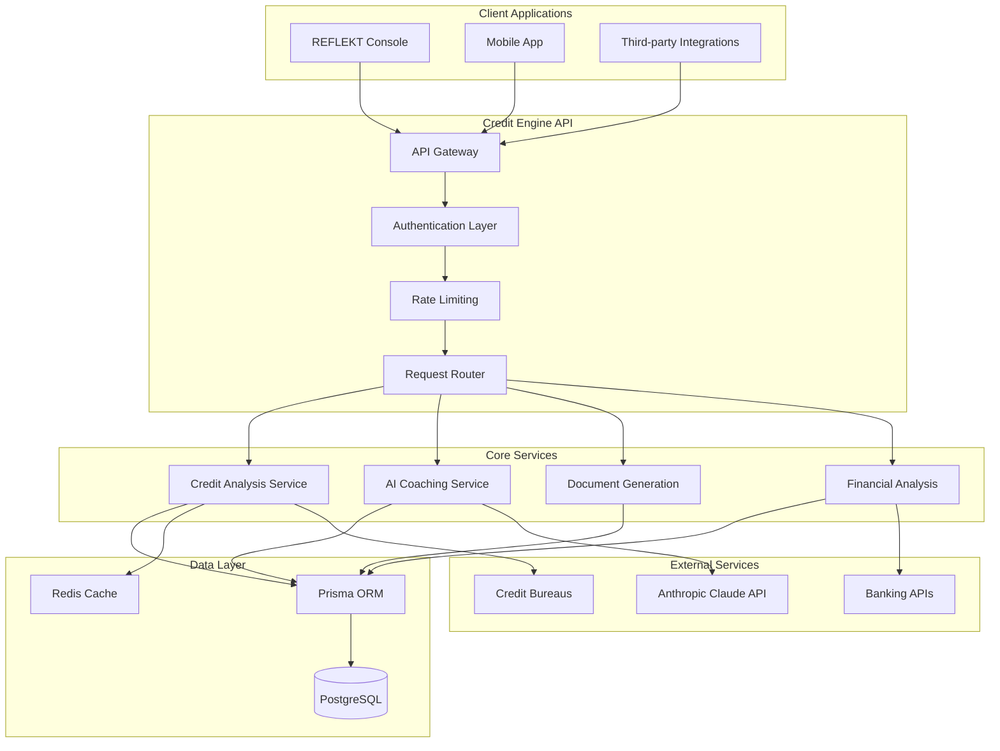
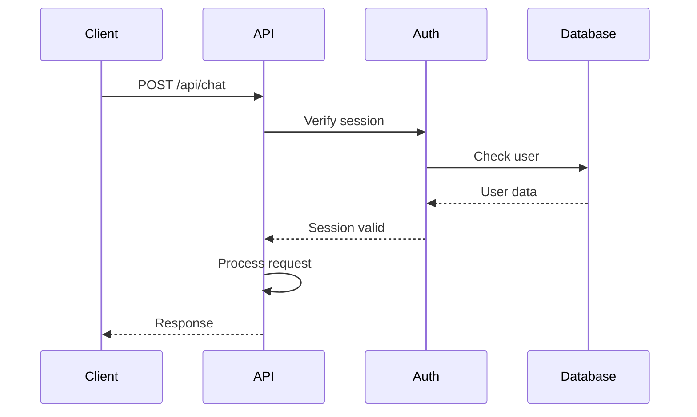

# Architecture

Comprehensive overview of the Credit Engine's system architecture, design patterns, and technical implementation.

## System Overview

The Credit Engine is built as a microservice architecture using Next.js 15.4 in API-only mode, designed for scalability, security, and maintainability.



## Architecture Principles

### 1. Microservice Design
- **Single Responsibility**: Each service handles one domain
- **Loose Coupling**: Services communicate via well-defined APIs
- **High Cohesion**: Related functionality grouped together
- **Independent Deployment**: Services can be updated independently

### 2. API-First Approach
- **RESTful Design**: Standard HTTP methods and status codes
- **Consistent Interfaces**: Predictable request/response formats
- **Versioning Strategy**: Backward compatibility maintained
- **OpenAPI Documentation**: Auto-generated API docs

### 3. Security by Design
- **Zero Trust Model**: Every request authenticated and authorized
- **Defense in Depth**: Multiple security layers
- **Data Encryption**: At rest and in transit
- **Audit Logging**: Comprehensive activity tracking

## Component Architecture

### API Layer

```typescript
// app/api/chat/route.ts
export async function POST(request: Request) {
  // Authentication
  const session = await auth();
  if (!session) {
    return NextResponse.json({ error: "Unauthorized" }, { status: 401 });
  }

  // Rate limiting
  const rateLimitResult = await checkRateLimit(session.user.id);
  if (!rateLimitResult.allowed) {
    return NextResponse.json({ error: "Rate limit exceeded" }, { status: 429 });
  }

  // Request processing
  const body = await request.json();
  const validated = creditChatSchema.parse(body);

  // Service invocation
  const response = await creditService.processChat(validated, session.user);

  return NextResponse.json(response);
}
```

### Service Layer

```typescript
// lib/services/credit-service.ts
export class CreditService {
  constructor(
    private aiProvider: AIProvider,
    private database: PrismaClient,
    private cache: RedisClient
  ) {}

  async processChat(input: ChatInput, user: User) {
    // Check cache
    const cached = await this.cache.get(cacheKey);
    if (cached) return cached;

    // Process with AI
    const response = await this.aiProvider.generateResponse({
      messages: input.messages,
      context: await this.buildContext(user),
      systemPrompt: CREDIT_COACH_PROMPT
    });

    // Store in database
    await this.database.chatHistory.create({
      data: {
        userId: user.id,
        messages: input.messages,
        response: response
      }
    });

    // Cache result
    await this.cache.set(cacheKey, response, { ttl: 300 });

    return response;
  }
}
```

### Data Layer

```prisma
// prisma/schema.prisma
model User {
  id            String    @id @default(cuid())
  email         String    @unique
  creditScore   Int?
  creditGoal    Int?
  createdAt     DateTime  @default(now())
  updatedAt     DateTime  @updatedAt

  chatHistory   ChatHistory[]
  creditReports CreditReport[]
  documents     Document[]
}

model ChatHistory {
  id        String   @id @default(cuid())
  userId    String
  messages  Json
  response  Json
  createdAt DateTime @default(now())

  user      User     @relation(fields: [userId], references: [id])

  @@index([userId, createdAt])
}

model CreditReport {
  id          String   @id @default(cuid())
  userId      String
  bureau      String   // EXPERIAN | EQUIFAX | TRANSUNION
  score       Int
  reportData  Json
  createdAt   DateTime @default(now())

  user        User     @relation(fields: [userId], references: [id])

  @@index([userId, bureau, createdAt])
}
```

## AI Integration Architecture

### Claude Provider Implementation

```typescript
// lib/ai/claude-provider.ts
import Anthropic from '@anthropic-ai/sdk';

export class ClaudeProvider implements AIProvider {
  private client: Anthropic;

  constructor(apiKey: string) {
    this.client = new Anthropic({ apiKey });
  }

  async generateResponse(params: GenerateParams): Promise<AIResponse> {
    const response = await this.client.messages.create({
      model: 'claude-3-5-sonnet-20241022',
      max_tokens: 4096,
      system: params.systemPrompt,
      messages: params.messages,
      temperature: 0.7,
    });

    return {
      content: response.content[0].text,
      usage: {
        promptTokens: response.usage.input_tokens,
        completionTokens: response.usage.output_tokens,
      }
    };
  }
}
```

### Prompt Engineering

```typescript
// lib/ai/credit-prompts.ts
export const CREDIT_COACH_PROMPT = `
You are a certified credit counselor with expertise in Canadian credit systems.
Your role is to provide actionable, personalized credit improvement advice.

Key responsibilities:
1. Analyze credit situations comprehensively
2. Provide specific, actionable recommendations
3. Create realistic timelines for credit improvement
4. Explain complex credit concepts in simple terms
5. Consider Canadian-specific credit regulations

Always:
- Be encouraging but realistic
- Provide concrete next steps
- Reference specific credit factors
- Consider individual circumstances
- Maintain professional boundaries
`;
```

## Security Architecture

### Authentication Flow



### Security Layers

1. **Network Security**
   - HTTPS only
   - CORS configuration
   - Rate limiting
   - DDoS protection

2. **Application Security**
   - Input validation
   - SQL injection prevention
   - XSS protection
   - CSRF tokens

3. **Data Security**
   - Encryption at rest
   - Encryption in transit
   - PII anonymization
   - Secure key management

## Scalability Architecture

### Horizontal Scaling

```yaml
# vercel.json
{
  "functions": {
    "app/api/chat/route.ts": {
      "maxDuration": 60,
      "memory": 1024
    },
    "app/api/analyze/route.ts": {
      "maxDuration": 30,
      "memory": 512
    }
  },
  "regions": ["iad1", "sfo1"]
}
```

### Caching Strategy

1. **Response Caching**
   - Redis for frequently accessed data
   - 5-minute TTL for chat responses
   - 1-hour TTL for credit reports

2. **Database Caching**
   - Prisma query caching
   - Connection pooling
   - Read replicas for scaling

3. **CDN Caching**
   - Static assets on Vercel Edge
   - API responses with cache headers

## Performance Optimization

### Database Optimization

```sql
-- Indexes for common queries
CREATE INDEX idx_chat_history_user_created
ON chat_history(user_id, created_at DESC);

CREATE INDEX idx_credit_reports_user_bureau
ON credit_reports(user_id, bureau, created_at DESC);

-- Partitioning for large tables
CREATE TABLE chat_history_2025 PARTITION OF chat_history
FOR VALUES FROM ('2025-01-01') TO ('2026-01-01');
```

### API Response Optimization

```typescript
// Streaming responses for large data
export async function GET(request: Request) {
  const stream = new ReadableStream({
    async start(controller) {
      const data = await fetchLargeDataset();

      for (const chunk of data) {
        controller.enqueue(JSON.stringify(chunk));
      }

      controller.close();
    }
  });

  return new Response(stream, {
    headers: {
      'Content-Type': 'application/json',
      'Transfer-Encoding': 'chunked'
    }
  });
}
```

## Monitoring & Observability

### Logging Architecture

```typescript
// lib/logging/logger.ts
import winston from 'winston';

export const logger = winston.createLogger({
  level: process.env.LOG_LEVEL || 'info',
  format: winston.format.json(),
  transports: [
    new winston.transports.Console(),
    new winston.transports.File({ filename: 'error.log', level: 'error' }),
    new winston.transports.File({ filename: 'combined.log' })
  ]
});

// Usage
logger.info('Credit analysis started', {
  userId: user.id,
  requestId: req.id
});
```

### Metrics Collection

```typescript
// lib/metrics/collector.ts
export class MetricsCollector {
  async recordApiCall(endpoint: string, duration: number, status: number) {
    await this.prometheus.histogram('api_duration', duration, {
      endpoint,
      status
    });
  }

  async recordCreditAnalysis(userId: string, score: number) {
    await this.prometheus.gauge('credit_score', score, {
      userId
    });
  }
}
```

## Error Handling

### Global Error Handler

```typescript
// lib/errors/handler.ts
export class ErrorHandler {
  static handle(error: unknown): Response {
    if (error instanceof ValidationError) {
      return NextResponse.json(
        { error: 'Invalid input', details: error.errors },
        { status: 400 }
      );
    }

    if (error instanceof AuthenticationError) {
      return NextResponse.json(
        { error: 'Authentication required' },
        { status: 401 }
      );
    }

    // Log unexpected errors
    logger.error('Unexpected error', { error });

    return NextResponse.json(
      { error: 'Internal server error' },
      { status: 500 }
    );
  }
}
```

## Future Architecture Considerations

### Planned Enhancements

1. **Event-Driven Architecture**
   - Message queue integration
   - Event sourcing for audit trail
   - CQRS pattern implementation

2. **Microservices Expansion**
   - Separate scoring service
   - Independent document service
   - Dedicated notification service

3. **Machine Learning Pipeline**
   - Model training infrastructure
   - Feature engineering pipeline
   - A/B testing framework

4. **Multi-Region Deployment**
   - Geographic distribution
   - Data residency compliance
   - Edge computing capabilities
