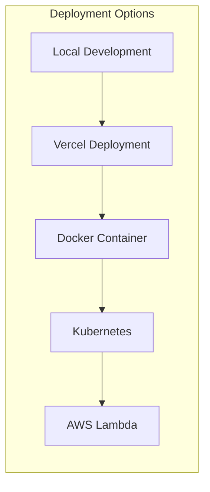

# Deployment

Complete deployment guide for the Credit Engine, covering various deployment strategies and environments.

## Deployment Overview

The Credit Engine supports multiple deployment options optimized for different scales and requirements.



## Vercel Deployment

### Prerequisites

- Vercel account
- GitHub repository connected
- Environment variables configured

### Deployment Configuration

```json
// vercel.json
{
  "buildCommand": "pnpm build",
  "outputDirectory": ".next",
  "framework": "nextjs",
  "regions": ["iad1", "sfo1"],
  "functions": {
    "app/api/chat/route.ts": {
      "maxDuration": 60,
      "memory": 1024
    },
    "app/api/analyze/route.ts": {
      "maxDuration": 30,
      "memory": 512
    },
    "app/api/generate/route.ts": {
      "maxDuration": 20,
      "memory": 512
    }
  },
  "env": {
    "DATABASE_URL": "@database_url",
    "ANTHROPIC_API_KEY": "@anthropic_api_key",
    "NEXTAUTH_SECRET": "@nextauth_secret"
  },
  "crons": [
    {
      "path": "/api/cron/daily-monitoring",
      "schedule": "0 10 * * *"
    }
  ]
}
```

### Deployment Steps

```bash
# Install Vercel CLI
pnpm add -g vercel

# Login to Vercel
vercel login

# Deploy to preview
vercel

# Deploy to production
vercel --prod

# Set environment variables
vercel env add DATABASE_URL
vercel env add ANTHROPIC_API_KEY
vercel env add NEXTAUTH_SECRET
```

### Environment Configuration

```bash
# Production environment variables
vercel env add DATABASE_URL production
vercel env add ANTHROPIC_API_KEY production
vercel env add NEXTAUTH_SECRET production
vercel env add SENTRY_DSN production

# Preview environment variables
vercel env add DATABASE_URL preview
vercel env add ANTHROPIC_API_KEY preview
vercel env add NEXTAUTH_SECRET preview
```

## Docker Deployment

### Dockerfile

```dockerfile
# Multi-stage build for production
FROM node:20-alpine AS deps
RUN apk add --no-cache libc6-compat
WORKDIR /app

# Install dependencies
COPY package.json pnpm-lock.yaml ./
RUN pnpm install --prod --frozen-lockfile

# Build stage
FROM node:20-alpine AS builder
WORKDIR /app
COPY package.json pnpm-lock.yaml ./
RUN pnpm install --frozen-lockfile
COPY . .

# Generate Prisma client
RUN npx prisma generate

# Build application
ENV NEXT_TELEMETRY_DISABLED 1
RUN pnpm build

# Production stage
FROM node:20-alpine AS runner
WORKDIR /app

ENV NODE_ENV production
ENV NEXT_TELEMETRY_DISABLED 1

RUN addgroup --system --gid 1001 nodejs
RUN adduser --system --uid 1001 nextjs

# Copy built application
COPY --from=builder /app/.next/standalone ./
COPY --from=builder /app/.next/static ./.next/static
COPY --from=builder /app/public ./public
COPY --from=builder /app/prisma ./prisma

# Copy Prisma client
COPY --from=builder /app/node_modules/.prisma ./node_modules/.prisma
COPY --from=builder /app/node_modules/@prisma ./node_modules/@prisma

USER nextjs

EXPOSE 3000

ENV PORT 3000

CMD ["node", "server.js"]
```

### Docker Compose

```yaml
# docker-compose.yml
version: '3.8'

services:
  credit-engine:
    build:
      context: .
      dockerfile: Dockerfile
    ports:
      - "3004:3000"
    environment:
      - DATABASE_URL=${DATABASE_URL}
      - ANTHROPIC_API_KEY=${ANTHROPIC_API_KEY}
      - NEXTAUTH_SECRET=${NEXTAUTH_SECRET}
      - NEXTAUTH_URL=http://localhost:3004
    depends_on:
      - postgres
      - redis
    restart: unless-stopped

  postgres:
    image: postgres:15-alpine
    environment:
      - POSTGRES_USER=creditengine
      - POSTGRES_PASSWORD=${DB_PASSWORD}
      - POSTGRES_DB=credit_engine
    volumes:
      - postgres_data:/var/lib/postgresql/data
    ports:
      - "5432:5432"

  redis:
    image: redis:7-alpine
    command: redis-server --appendonly yes
    volumes:
      - redis_data:/data
    ports:
      - "6379:6379"

volumes:
  postgres_data:
  redis_data:
```

### Building and Running

```bash
# Build Docker image
docker build -t credit-engine:latest .

# Run with Docker Compose
docker-compose up -d

# View logs
docker-compose logs -f credit-engine

# Stop services
docker-compose down
```

## Kubernetes Deployment

### Deployment Manifest

```yaml
# k8s/deployment.yaml
apiVersion: apps/v1
kind: Deployment
metadata:
  name: credit-engine
  namespace: production
spec:
  replicas: 3
  selector:
    matchLabels:
      app: credit-engine
  template:
    metadata:
      labels:
        app: credit-engine
    spec:
      containers:
      - name: credit-engine
        image: credit-engine:latest
        ports:
        - containerPort: 3000
        env:
        - name: DATABASE_URL
          valueFrom:
            secretKeyRef:
              name: credit-engine-secrets
              key: database-url
        - name: ANTHROPIC_API_KEY
          valueFrom:
            secretKeyRef:
              name: credit-engine-secrets
              key: anthropic-api-key
        resources:
          requests:
            memory: "512Mi"
            cpu: "500m"
          limits:
            memory: "1Gi"
            cpu: "1000m"
        livenessProbe:
          httpGet:
            path: /api/health
            port: 3000
          initialDelaySeconds: 30
          periodSeconds: 10
        readinessProbe:
          httpGet:
            path: /api/health
            port: 3000
          initialDelaySeconds: 5
          periodSeconds: 5
```

### Service Configuration

```yaml
# k8s/service.yaml
apiVersion: v1
kind: Service
metadata:
  name: credit-engine-service
  namespace: production
spec:
  selector:
    app: credit-engine
  ports:
    - protocol: TCP
      port: 80
      targetPort: 3000
  type: LoadBalancer
```

### Horizontal Pod Autoscaler

```yaml
# k8s/hpa.yaml
apiVersion: autoscaling/v2
kind: HorizontalPodAutoscaler
metadata:
  name: credit-engine-hpa
  namespace: production
spec:
  scaleTargetRef:
    apiVersion: apps/v1
    kind: Deployment
    name: credit-engine
  minReplicas: 2
  maxReplicas: 10
  metrics:
  - type: Resource
    resource:
      name: cpu
      target:
        type: Utilization
        averageUtilization: 70
  - type: Resource
    resource:
      name: memory
      target:
        type: Utilization
        averageUtilization: 80
```

### Deployment Commands

```bash
# Create namespace
kubectl create namespace production

# Create secrets
kubectl create secret generic credit-engine-secrets \
  --from-literal=database-url=$DATABASE_URL \
  --from-literal=anthropic-api-key=$ANTHROPIC_API_KEY \
  -n production

# Apply configurations
kubectl apply -f k8s/deployment.yaml
kubectl apply -f k8s/service.yaml
kubectl apply -f k8s/hpa.yaml

# Check deployment status
kubectl get pods -n production
kubectl get svc -n production

# View logs
kubectl logs -f deployment/credit-engine -n production
```

## AWS Lambda Deployment

### Serverless Configuration

```yaml
# serverless.yml
service: credit-engine

provider:
  name: aws
  runtime: nodejs20.x
  region: us-east-1
  stage: ${opt:stage, 'production'}
  environment:
    DATABASE_URL: ${env:DATABASE_URL}
    ANTHROPIC_API_KEY: ${env:ANTHROPIC_API_KEY}
    NEXTAUTH_SECRET: ${env:NEXTAUTH_SECRET}

functions:
  api:
    handler: server.handler
    events:
      - http:
          path: /{proxy+}
          method: ANY
          cors: true
    timeout: 30
    memorySize: 1024

  creditAnalysis:
    handler: handlers/analysis.handler
    events:
      - http:
          path: /api/analyze
          method: POST
    timeout: 60
    memorySize: 512

  monitoring:
    handler: handlers/monitoring.handler
    events:
      - schedule: rate(1 day)
    timeout: 300
    memorySize: 256

plugins:
  - serverless-nextjs-plugin
  - serverless-offline

custom:
  serverless-nextjs:
    buildDir: .serverless_nextjs
```

### Lambda Handler

```typescript
// handlers/api.ts
import { APIGatewayProxyHandler } from 'aws-lambda';
import { createServer } from 'http';
import { parse } from 'url';
import next from 'next';

const app = next({ dev: false });
const handle = app.getRequestHandler();

export const handler: APIGatewayProxyHandler = async (event, context) => {
  await app.prepare();

  const { pathname, query } = parse(event.path, true);

  const req = {
    ...event,
    url: event.path,
    query,
    headers: event.headers
  };

  const res = {
    statusCode: 200,
    headers: {},
    body: ''
  };

  await handle(req, res);

  return {
    statusCode: res.statusCode,
    headers: res.headers,
    body: res.body
  };
};
```

## Database Migration

### Production Migration Strategy

```bash
# Generate migration
pnpm db:migrate:dev -- --name add_credit_features

# Deploy migration to production
DATABASE_URL=$PROD_DATABASE_URL pnpm db:migrate:deploy

# Rollback if needed
DATABASE_URL=$PROD_DATABASE_URL pnpm db:migrate:rollback
```

### Zero-Downtime Migration

```typescript
// scripts/migrate-prod.ts
import { PrismaClient } from '@prisma/client';

async function migrateWithZeroDowntime() {
  const prisma = new PrismaClient();

  try {
    // 1. Add new columns (backward compatible)
    await prisma.$executeRaw`
      ALTER TABLE users
      ADD COLUMN IF NOT EXISTS credit_goal INT;
    `;

    // 2. Backfill data
    await prisma.$executeRaw`
      UPDATE users
      SET credit_goal = 750
      WHERE credit_goal IS NULL;
    `;

    // 3. Add constraints
    await prisma.$executeRaw`
      ALTER TABLE users
      ALTER COLUMN credit_goal SET NOT NULL;
    `;

    console.log('Migration completed successfully');
  } catch (error) {
    console.error('Migration failed:', error);
    process.exit(1);
  } finally {
    await prisma.$disconnect();
  }
}

migrateWithZeroDowntime();
```

## Monitoring & Observability

### Health Check Endpoint

```typescript
// app/api/health/route.ts
export async function GET() {
  const health = {
    status: 'ok',
    timestamp: new Date().toISOString(),
    version: process.env.npm_package_version,
    services: {
      database: await checkDatabase(),
      redis: await checkRedis(),
      ai: await checkAIService()
    }
  };

  const isHealthy = Object.values(health.services).every(s => s === 'healthy');

  return NextResponse.json(health, {
    status: isHealthy ? 200 : 503
  });
}

async function checkDatabase(): Promise<string> {
  try {
    await prisma.$queryRaw`SELECT 1`;
    return 'healthy';
  } catch {
    return 'unhealthy';
  }
}
```

### Logging Configuration

```typescript
// lib/logger.ts
import pino from 'pino';

const logger = pino({
  level: process.env.LOG_LEVEL || 'info',
  transport: {
    target: 'pino-pretty',
    options: {
      colorize: true
    }
  },
  redact: ['req.headers.authorization', 'req.body.ssn']
});

export default logger;
```

## CI/CD Pipeline

### GitHub Actions Workflow

```yaml
# .github/workflows/deploy.yml
name: Deploy Credit Engine

on:
  push:
    branches: [main]
    paths:
      - 'credit-engine/**'

jobs:
  test:
    runs-on: ubuntu-latest
    steps:
      - uses: actions/checkout@v3
      - uses: actions/setup-node@v3
        with:
          node-version: '20'

      - name: Install dependencies
        run: pnpm install --frozen-lockfile
        working-directory: ./credit-engine

      - name: Run tests
        run: pnpm test
        working-directory: ./credit-engine

      - name: Run security audit
        run: pnpm audit --audit-level=moderate
        working-directory: ./credit-engine

  deploy:
    needs: test
    runs-on: ubuntu-latest
    if: github.ref == 'refs/heads/main'

    steps:
      - uses: actions/checkout@v3

      - name: Deploy to Vercel
        run: |
          pnpm add -g vercel
          vercel --prod --token=${{ secrets.VERCEL_TOKEN }}
        working-directory: ./credit-engine
        env:
          VERCEL_ORG_ID: ${{ secrets.VERCEL_ORG_ID }}
          VERCEL_PROJECT_ID: ${{ secrets.VERCEL_PROJECT_ID }}
```

## Performance Optimization

### Build Optimization

```javascript
// next.config.js
module.exports = {
  output: 'standalone',
  compress: true,
  poweredByHeader: false,

  images: {
    domains: ['credit-api.earna.sh'],
    formats: ['image/avif', 'image/webp']
  },

  experimental: {
    optimizeCss: true,
    optimizePackageImports: ['@prisma/client']
  },

  webpack: (config, { isServer }) => {
    if (!isServer) {
      config.resolve.fallback = {
        fs: false,
        net: false,
        tls: false
      };
    }
    return config;
  }
};
```

### Caching Strategy

```typescript
// Cache configuration
const cacheConfig = {
  // Static assets
  '/_next/static': {
    maxAge: 31536000, // 1 year
    immutable: true
  },

  // API responses
  '/api/health': {
    maxAge: 60, // 1 minute
    swr: 30 // Stale-while-revalidate
  },

  '/api/analyze': {
    maxAge: 300, // 5 minutes
    swr: 60
  }
};
```

## Rollback Strategy

### Automated Rollback

```bash
#!/bin/bash
# scripts/rollback.sh

# Get previous deployment
PREVIOUS_DEPLOYMENT=$(vercel ls --token=$VERCEL_TOKEN | grep "Ready" | head -2 | tail -1 | awk '{print $1}')

# Promote previous deployment
vercel promote $PREVIOUS_DEPLOYMENT --token=$VERCEL_TOKEN

# Notify team
curl -X POST $SLACK_WEBHOOK_URL \
  -H 'Content-Type: application/json' \
  -d '{"text":"Credit Engine rollback completed to '$PREVIOUS_DEPLOYMENT'"}'
```

## Post-Deployment Checklist

- [ ] Verify health check endpoint
- [ ] Test critical API endpoints
- [ ] Check error tracking (Sentry)
- [ ] Verify database connections
- [ ] Test authentication flow
- [ ] Monitor performance metrics
- [ ] Check rate limiting
- [ ] Verify webhook functionality
- [ ] Test credit analysis endpoints
- [ ] Confirm AI integration working
- [ ] Review security headers
- [ ] Check SSL certificate
