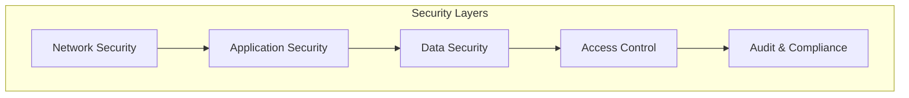

# Security

Comprehensive security documentation for the Credit Engine, covering data protection, compliance, and best practices.

## Security Overview

The Credit Engine implements defense-in-depth security with multiple layers of protection for sensitive financial and personal data.



## Data Protection

### Encryption at Rest

All sensitive data is encrypted using AES-256-GCM:

```typescript
// Database encryption configuration
datasource db {
  provider = "postgresql"
  url      = env("DATABASE_URL")
  // Transparent Data Encryption (TDE) enabled
  extensions = ["pgcrypto"]
}

// Encrypted fields in schema
model CreditReport {
  id          String   @id @default(cuid())
  userId      String
  // Sensitive data encrypted
  ssn         String   @db.Text // Encrypted
  reportData  Json     @db.JsonB // Encrypted
  score       Int      // Not PII, stored plainly

  @@map("credit_reports")
}
```

### Encryption in Transit

All data transmission uses TLS 1.3:

```typescript
// HTTPS configuration
const server = https.createServer({
  cert: fs.readFileSync('cert.pem'),
  key: fs.readFileSync('key.pem'),
  minVersion: 'TLSv1.3',
  ciphers: [
    'TLS_AES_256_GCM_SHA384',
    'TLS_CHACHA20_POLY1305_SHA256',
    'TLS_AES_128_GCM_SHA256'
  ].join(':')
}, app);
```

### PII Data Handling

Personal Identifiable Information (PII) protection:

```typescript
// PII masking utility
export class PIIMasker {
  static maskSSN(ssn: string): string {
    // Show only last 4 digits
    return ssn.replace(/^\d{5}/, '*****');
  }

  static maskCreditCard(number: string): string {
    // Show only last 4 digits
    return number.replace(/^\d{12}/, '************');
  }

  static maskEmail(email: string): string {
    const [local, domain] = email.split('@');
    const maskedLocal = local[0] + '*'.repeat(local.length - 2) + local[local.length - 1];
    return `${maskedLocal}@${domain}`;
  }

  static sanitizeForLogging(data: any): any {
    const sensitive = ['ssn', 'creditCard', 'accountNumber', 'password'];
    const sanitized = { ...data };

    for (const field of sensitive) {
      if (sanitized[field]) {
        sanitized[field] = '[REDACTED]';
      }
    }

    return sanitized;
  }
}
```

## Authentication & Authorization

### Authentication Flow

Multi-factor authentication implementation:

```typescript
// NextAuth configuration
export const authOptions: NextAuthOptions = {
  providers: [
    CredentialsProvider({
      async authorize(credentials) {
        // Verify password
        const user = await verifyUser(credentials);

        // Check MFA if enabled
        if (user.mfaEnabled) {
          const mfaValid = await verifyMFA(user.id, credentials.mfaCode);
          if (!mfaValid) {
            throw new Error('Invalid MFA code');
          }
        }

        return user;
      }
    })
  ],
  session: {
    strategy: 'jwt',
    maxAge: 30 * 60, // 30 minutes
  },
  callbacks: {
    async jwt({ token, user }) {
      if (user) {
        token.permissions = await getUserPermissions(user.id);
      }
      return token;
    }
  }
};
```

### Role-Based Access Control (RBAC)

Permission system implementation:

```typescript
// Permission definitions
enum Permission {
  READ_OWN_DATA = 'read:own',
  READ_ALL_DATA = 'read:all',
  WRITE_OWN_DATA = 'write:own',
  WRITE_ALL_DATA = 'write:all',
  GENERATE_DOCUMENTS = 'generate:documents',
  ADMIN = 'admin:all'
}

// Role definitions
const roles = {
  user: [
    Permission.READ_OWN_DATA,
    Permission.WRITE_OWN_DATA,
    Permission.GENERATE_DOCUMENTS
  ],
  advisor: [
    Permission.READ_ALL_DATA,
    Permission.GENERATE_DOCUMENTS
  ],
  admin: [
    Permission.ADMIN
  ]
};

// Authorization middleware
export function authorize(requiredPermission: Permission) {
  return async (req: Request, res: Response, next: NextFunction) => {
    const session = await getSession({ req });

    if (!session) {
      return res.status(401).json({ error: 'Unauthorized' });
    }

    const userPermissions = session.user.permissions;

    if (!userPermissions.includes(requiredPermission)) {
      return res.status(403).json({ error: 'Forbidden' });
    }

    next();
  };
}
```

### API Key Management

Secure API key generation and validation:

```typescript
// API key generation
import crypto from 'crypto';

export class APIKeyManager {
  static generateKey(): string {
    const prefix = 'cea_'; // Credit Engine API
    const key = crypto.randomBytes(32).toString('base64url');
    return `${prefix}${key}`;
  }

  static async hashKey(key: string): Promise<string> {
    return crypto
      .createHash('sha256')
      .update(key)
      .digest('hex');
  }

  static async validateKey(providedKey: string): Promise<boolean> {
    const hashedKey = await this.hashKey(providedKey);

    const storedKey = await db.apiKey.findFirst({
      where: {
        hashedKey,
        active: true,
        expiresAt: {
          gt: new Date()
        }
      }
    });

    if (storedKey) {
      // Update last used
      await db.apiKey.update({
        where: { id: storedKey.id },
        data: { lastUsedAt: new Date() }
      });

      return true;
    }

    return false;
  }
}
```

## Compliance

### PIPEDA Compliance

Personal Information Protection and Electronic Documents Act compliance:

```typescript
// PIPEDA compliance utilities
export class PIPEDACompliance {
  // Obtain consent
  static async obtainConsent(userId: string, purpose: string): Promise<boolean> {
    const consent = await db.consent.create({
      data: {
        userId,
        purpose,
        consentedAt: new Date(),
        ipAddress: getClientIP(),
        userAgent: getUserAgent()
      }
    });

    return !!consent;
  }

  // Right to access
  static async exportUserData(userId: string): Promise<UserDataExport> {
    const data = await db.user.findUnique({
      where: { id: userId },
      include: {
        creditReports: true,
        chatHistory: true,
        documents: true
      }
    });

    return {
      personalInfo: this.sanitizePersonalInfo(data),
      creditData: data.creditReports,
      interactions: data.chatHistory,
      generatedDocuments: data.documents,
      exportedAt: new Date()
    };
  }

  // Right to erasure
  static async deleteUserData(userId: string): Promise<void> {
    // Soft delete with anonymization
    await db.user.update({
      where: { id: userId },
      data: {
        email: `deleted_${userId}@anonymized.com`,
        name: 'DELETED USER',
        ssn: null,
        deletedAt: new Date()
      }
    });

    // Hard delete sensitive data
    await db.creditReport.deleteMany({ where: { userId } });
    await db.chatHistory.deleteMany({ where: { userId } });
  }
}
```

### PCI DSS Compliance

Payment Card Industry Data Security Standard compliance:

```typescript
// PCI DSS compliant card handling
export class PCICompliance {
  // Never store full card numbers
  static tokenizeCard(cardNumber: string): string {
    // Use payment processor tokenization
    return paymentProcessor.tokenize(cardNumber);
  }

  // Card data validation
  static validateCard(token: string): boolean {
    // Validate without exposing card data
    return paymentProcessor.validateToken(token);
  }

  // Secure card display
  static displayCard(token: string): string {
    const lastFour = paymentProcessor.getLastFour(token);
    return `**** **** **** ${lastFour}`;
  }
}
```

## Security Headers

Implementation of security headers:

```typescript
// Security headers middleware
export function securityHeaders(req: Request, res: Response, next: NextFunction) {
  // Prevent clickjacking
  res.setHeader('X-Frame-Options', 'DENY');

  // XSS protection
  res.setHeader('X-Content-Type-Options', 'nosniff');
  res.setHeader('X-XSS-Protection', '1; mode=block');

  // HTTPS enforcement
  res.setHeader('Strict-Transport-Security', 'max-age=31536000; includeSubDomains');

  // Content Security Policy
  res.setHeader('Content-Security-Policy', [
    "default-src 'self'",
    "script-src 'self' 'unsafe-inline'",
    "style-src 'self' 'unsafe-inline'",
    "img-src 'self' data: https:",
    "font-src 'self'",
    "connect-src 'self' https://api.anthropic.com",
    "frame-ancestors 'none'"
  ].join('; '));

  // Referrer policy
  res.setHeader('Referrer-Policy', 'strict-origin-when-cross-origin');

  // Permissions policy
  res.setHeader('Permissions-Policy', 'camera=(), microphone=(), geolocation=()');

  next();
}
```

## Input Validation

Comprehensive input validation and sanitization:

```typescript
// Input validation schemas
import { z } from 'zod';

export const creditScoreSchema = z.object({
  score: z.number().min(300).max(900),
  bureau: z.enum(['experian', 'equifax', 'transunion']),
  date: z.date()
});

export const chatMessageSchema = z.object({
  role: z.enum(['user', 'assistant', 'system']),
  content: z.string().min(1).max(10000),
  metadata: z.record(z.any()).optional()
});

// SQL injection prevention
export class SQLSanitizer {
  static sanitize(input: string): string {
    // Use parameterized queries instead
    return input
      .replace(/['";\\]/g, '')
      .replace(/--/g, '')
      .replace(/\/\*/g, '')
      .replace(/\*\//g, '');
  }
}

// XSS prevention
export class XSSSanitizer {
  static sanitize(input: string): string {
    return input
      .replace(/</g, '&lt;')
      .replace(/>/g, '&gt;')
      .replace(/"/g, '&quot;')
      .replace(/'/g, '&#x27;')
      .replace(/\//g, '&#x2F;');
  }
}
```

## Audit Logging

Comprehensive audit trail for compliance:

```typescript
// Audit logger
export class AuditLogger {
  static async log(event: AuditEvent): Promise<void> {
    await db.auditLog.create({
      data: {
        userId: event.userId,
        action: event.action,
        resource: event.resource,
        ip: event.ip,
        userAgent: event.userAgent,
        timestamp: new Date(),
        metadata: event.metadata
      }
    });

    // Also send to SIEM
    await siem.send({
      severity: event.severity || 'info',
      ...event
    });
  }

  static async logDataAccess(userId: string, dataType: string, recordId: string) {
    await this.log({
      userId,
      action: 'DATA_ACCESS',
      resource: `${dataType}:${recordId}`,
      ip: getClientIP(),
      userAgent: getUserAgent(),
      metadata: {
        dataType,
        recordId,
        timestamp: new Date()
      }
    });
  }

  static async logSecurityEvent(event: SecurityEvent) {
    await this.log({
      userId: event.userId,
      action: event.type,
      resource: event.resource,
      severity: 'warning',
      ip: event.ip,
      userAgent: event.userAgent,
      metadata: event.details
    });
  }
}
```

## Rate Limiting

DDoS protection and rate limiting:

```typescript
// Rate limiter implementation
import rateLimit from 'express-rate-limit';
import RedisStore from 'rate-limit-redis';

export const apiLimiter = rateLimit({
  store: new RedisStore({
    client: redis,
    prefix: 'rl:api:'
  }),
  windowMs: 60 * 1000, // 1 minute
  max: 60, // 60 requests per minute
  message: 'Too many requests, please try again later',
  standardHeaders: true,
  legacyHeaders: false,
  handler: (req, res) => {
    AuditLogger.logSecurityEvent({
      type: 'RATE_LIMIT_EXCEEDED',
      userId: req.session?.userId,
      ip: req.ip,
      userAgent: req.headers['user-agent'],
      resource: req.path,
      details: {
        limit: 60,
        window: '1 minute'
      }
    });

    res.status(429).json({
      error: 'Rate limit exceeded',
      retryAfter: req.rateLimit.resetTime
    });
  }
});

// Stricter limits for sensitive endpoints
export const authLimiter = rateLimit({
  windowMs: 15 * 60 * 1000, // 15 minutes
  max: 5, // 5 attempts per 15 minutes
  skipSuccessfulRequests: true
});
```

## Vulnerability Management

Security scanning and dependency management:

```json
// package.json security scripts
{
  "scripts": {
    "security:audit": "npm audit --audit-level=moderate",
    "security:scan": "snyk test",
    "security:deps": "npm-check-updates -u",
    "security:secrets": "trufflehog --regex --entropy=True ."
  }
}
```

## Incident Response

Security incident response procedures:

```typescript
// Incident response handler
export class IncidentResponse {
  static async handleBreach(incident: SecurityIncident) {
    // 1. Contain
    await this.containIncident(incident);

    // 2. Assess
    const impact = await this.assessImpact(incident);

    // 3. Notify
    if (impact.severity === 'high') {
      await this.notifyAuthorities(incident);
      await this.notifyAffectedUsers(impact.affectedUsers);
    }

    // 4. Remediate
    await this.remediateVulnerability(incident);

    // 5. Document
    await this.documentIncident(incident);
  }

  static async containIncident(incident: SecurityIncident) {
    // Isolate affected systems
    if (incident.type === 'DATA_BREACH') {
      // Revoke all active sessions
      await db.session.deleteMany({});

      // Force password reset
      await db.user.updateMany({
        data: { passwordResetRequired: true }
      });
    }
  }
}
```

## Security Best Practices

### Development Guidelines

1. **Never commit secrets**: Use environment variables
2. **Validate all inputs**: Use schema validation
3. **Sanitize outputs**: Prevent XSS attacks
4. **Use parameterized queries**: Prevent SQL injection
5. **Implement least privilege**: Minimal permissions
6. **Regular security updates**: Keep dependencies current
7. **Security testing**: Include in CI/CD pipeline

### Deployment Security

1. **Use secrets management**: AWS Secrets Manager, Vault
2. **Enable WAF**: Web Application Firewall
3. **Configure security groups**: Minimal port exposure
4. **Enable monitoring**: CloudWatch, Datadog
5. **Regular backups**: Automated encrypted backups
6. **Disaster recovery**: Documented DR procedures
7. **Security audits**: Regular third-party audits
