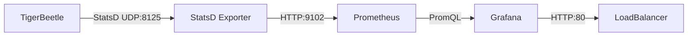

# TigerBeetle Financial Ledger - Production Deployment

## Overview

TigerBeetle is our high-performance financial ledger deployed on Google Kubernetes Engine (GKE) Standard cluster. As the core accounting system for our platform, TigerBeetle handles all financial transactions with guaranteed consistency and performance. This document covers the complete production deployment including infrastructure setup, optimizations, monitoring, and operational procedures.

## Local Development Setup

TigerBeetle is also configured to run locally for development purposes using Docker Compose:

### Quick Start - Local Development

```bash
# Navigate to infrastructure docker directory
cd infrastructure/docker

# Start TigerBeetle locally
docker compose up -d

# Verify TigerBeetle is running
docker compose ps

# Test connection (should show cluster information)
docker compose exec tigerbeetle tigerbeetle client 0

# View logs
docker compose logs tigerbeetle -f
```

### Local Access Points

| Service | URL | Description |
|---------|-----|-------------|
| TigerBeetle | `tb://0@localhost:3003` | Main database connection |
| Prometheus | http://localhost:9090 | Metrics collection |
| Grafana | http://localhost:3006 | Dashboards (admin/tigerbeetle) |
| StatsD | `localhost:8125` | Metrics ingestion (UDP) |

### Local Docker Compose Configuration

```yaml
# infrastructure/docker/docker-compose.yml
version: '3.8'

services:
  tigerbeetle:
    image: ghcr.io/tigerbeetle/tigerbeetle:latest
    container_name: tigerbeetle
    ports:
      - "3003:3003"
    volumes:
      - ./data/tigerbeetle:/data
    command: |
      sh -c "
      if [ ! -f /data/cluster_0.tigerbeetle ]; then
        tigerbeetle format --cluster=0 --replica=0 --replica-count=1 /data/cluster_0.tigerbeetle
      fi
      tigerbeetle start --addresses=0.0.0.0:3003 /data/cluster_0.tigerbeetle
      "

  prometheus:
    image: prom/prometheus:latest
    container_name: prometheus
    ports:
      - "9090:9090"
    volumes:
      - ./prometheus.yml:/etc/prometheus/prometheus.yml
      - prometheus_data:/prometheus

  grafana:
    image: grafana/grafana:latest
    container_name: grafana
    ports:
      - "3006:3000"
    environment:
      - GF_SECURITY_ADMIN_PASSWORD=tigerbeetle
    volumes:
      - grafana_data:/var/lib/grafana
```

### Local Testing

```javascript
// Example Node.js client connection for local development
const { createClient } = require('tigerbeetle-node');

const client = createClient({
  cluster_id: 0,
  addresses: ['127.0.0.1:3003'],
});

// Test creating an account
const accounts = [{
  id: 1n,
  ledger: 1,
  code: 100,
  flags: 0,
  debits_pending: 0n,
  debits_posted: 0n,
  credits_pending: 0n,
  credits_posted: 0n,
  user_data_128: 0n,
  user_data_64: 0n,
  user_data_32: 0,
  reserved: 0,
}];

await client.createAccounts(accounts);
```

### Local Data Persistence

Local TigerBeetle data is stored in:
```
infrastructure/docker/data/tigerbeetle/cluster_0.tigerbeetle
```

This file persists between container restarts. To reset:
```bash
# Stop containers
docker compose down

# Remove data file
rm -rf infrastructure/docker/data/tigerbeetle/*

# Restart (will recreate data file)
docker compose up -d
```

## Infrastructure Architecture

### GKE Standard Cluster Configuration

The platform-production cluster (renamed from tigerbeetle-production) is deployed with the following specifications:

```yaml
Cluster Name: platform-production
Type: GKE Standard (not Autopilot)
Location: us-central1 (Regional)
Network: Custom VPC with private nodes
Version: 1.31.x
```

### Node Pool Configuration

#### TigerBeetle Optimized Node Pool
```yaml
Name: tigerbeetle-pool
Machine Type: c3-standard-4-lssd
  - 4 vCPUs
  - 16 GB RAM
  - 375 GB Local SSD (NVMe)
Autoscaling: 1-3 nodes
Zones: us-central1-a, us-central1-b, us-central1-c
Cost Optimization: ~$150/month per node (with local SSD)
```

**Key Optimizations:**
- Local SSD provides ultra-low latency (< 1ms) for TigerBeetle's write-ahead log
- C3 machine family optimized for compute-intensive workloads
- Node affinity ensures TigerBeetle pods run on SSD-equipped nodes

#### Default Node Pool
```yaml
Name: default-pool
Machine Type: e2-standard-4
Autoscaling: 1-5 nodes
Purpose: General workloads, monitoring, support services
```

### Enabled Google Cloud APIs

The following APIs are enabled for full functionality:

```bash
# Core APIs
compute.googleapis.com              # Compute Engine
container.googleapis.com            # Kubernetes Engine
iam.googleapis.com                  # Identity & Access Management

# Networking
servicenetworking.googleapis.com    # VPC Service Controls
networkmanagement.googleapis.com    # Network Intelligence

# Storage & Data
storage.googleapis.com              # Cloud Storage
sqladmin.googleapis.com            # Cloud SQL

# Monitoring & Logging
monitoring.googleapis.com          # Cloud Monitoring
logging.googleapis.com             # Cloud Logging
cloudtrace.googleapis.com         # Cloud Trace

# Security
secretmanager.googleapis.com      # Secret Manager
cloudkms.googleapis.com           # Cloud KMS
binaryauthorization.googleapis.com # Binary Authorization

# Service Mesh
mesh.googleapis.com               # Anthos Service Mesh
meshconfig.googleapis.com         # Mesh Configuration
meshtelemetry.googleapis.com      # Mesh Telemetry

# Additional Services
artifactregistry.googleapis.com   # Artifact Registry
cloudbuild.googleapis.com         # Cloud Build
cloudresourcemanager.googleapis.com # Resource Manager
```

## TigerBeetle Deployment

### StatefulSet Configuration

TigerBeetle is deployed as a 3-replica StatefulSet with the following optimizations:

```yaml
apiVersion: apps/v1
kind: StatefulSet
metadata:
  name: tigerbeetle
  namespace: tigerbeetle
spec:
  replicas: 3
  serviceName: tigerbeetle-headless
  podManagementPolicy: Parallel  # Faster startup
  template:
    spec:
      # Node selection for Local SSD
      nodeSelector:
        cloud.google.com/gke-local-ssd: "true"

      # Anti-affinity for HA
      affinity:
        podAntiAffinity:
          preferredDuringSchedulingIgnoredDuringExecution:
          - weight: 100
            podAffinityTerm:
              topologyKey: kubernetes.io/hostname

      # Zone spreading for resilience
      topologySpreadConstraints:
      - maxSkew: 1
        topologyKey: topology.kubernetes.io/zone
        whenUnsatisfiable: DoNotSchedule

      containers:
      - name: tigerbeetle
        image: ghcr.io/tigerbeetle/tigerbeetle:latest
        resources:
          requests:
            cpu: 500m
            memory: 1Gi
          limits:
            cpu: 2
            memory: 4Gi
```

### Storage Configuration

Two storage approaches were implemented:

#### 1. Persistent Volume Claims (Current)
```yaml
volumeClaimTemplates:
- metadata:
    name: data
  spec:
    accessModes: ["ReadWriteOnce"]
    storageClassName: premium-rwo
    resources:
      requests:
        storage: 20Gi
```

#### 2. Local SSD Optimization (Performance Mode)
```yaml
volumes:
- name: local-ssd
  hostPath:
    path: /mnt/disks/ssd0
    type: Directory
```

### Service Configuration

```yaml
# Internal Headless Service (for clustering)
apiVersion: v1
kind: Service
metadata:
  name: tigerbeetle-headless
spec:
  clusterIP: None
  ports:
  - port: 3003
    name: tigerbeetle

# LoadBalancer Service (external access)
apiVersion: v1
kind: Service
metadata:
  name: tigerbeetle-lb
spec:
  type: LoadBalancer
  ports:
  - port: 3003
    targetPort: 3003
  externalTrafficPolicy: Local  # Preserves source IP
```

**Access Points:**
- External: `104.154.31.249:3003`
- Internal: `tigerbeetle.tigerbeetle:3003`
- Headless: `tigerbeetle-{0,1,2}.tigerbeetle-headless:3003`

## Service Mesh Integration

### Istio Configuration

TigerBeetle is **excluded** from the Istio service mesh due to its binary protocol:

```yaml
apiVersion: v1
kind: Namespace
metadata:
  name: tigerbeetle
  labels:
    istio-injection: disabled  # Binary protocol incompatible
```

**Reasoning:**
- TigerBeetle uses a custom binary protocol, not HTTP/gRPC
- Service mesh features (traffic management, mTLS) don't apply
- Metrics collected via StatsD instead of Envoy

### Service Mesh for Other Services

The platform uses Istio for HTTP/gRPC services with:
- Automatic mTLS between services
- Traffic management and load balancing
- Distributed tracing with Jaeger
- Metrics collection via Envoy sidecars

## Monitoring Stack

### Architecture



### Components

#### 1. StatsD Exporter
Deployed in `observability` namespace to receive TigerBeetle metrics:

```yaml
apiVersion: apps/v1
kind: Deployment
metadata:
  name: statsd-exporter
  namespace: observability
spec:
  template:
    spec:
      containers:
      - name: statsd-exporter
        image: prom/statsd-exporter:latest
        args:
        - --statsd.mapping-config=/etc/statsd/mapping.yml
        - --statsd.listen-udp=:8125
        - --web.listen-address=:9102
```

**Metric Mapping:**
```yaml
mappings:
- match: "tb.*"
  name: "tb_${1}"
  match_type: "glob"
```

#### 2. Prometheus
Deployed via Helm with custom scrape configuration:

```bash
helm install prometheus prometheus-community/prometheus \
  --namespace monitoring \
  --version 25.8.0 \
  --set server.persistentVolume.size=50Gi \
  --set server.retention=15d
```

**Scrape Configuration:**
```yaml
extraScrapeConfigs:
- job_name: statsd-exporter
  static_configs:
  - targets: ["statsd-exporter.observability:9102"]
  metric_relabel_configs:
  - source_labels: [__name__]
    regex: "tb_.*"
    action: keep
```

#### 3. Grafana
Deployed with LoadBalancer access:

```bash
helm install grafana grafana/grafana \
  --namespace monitoring \
  --version 7.0.8 \
  --set service.type=LoadBalancer \
  --set persistence.enabled=true
```

**Access:** http://34.172.102.114
**Credentials:** admin / [Generated password stored in Secret Manager]

### TigerBeetle Dashboard

Custom dashboard with comprehensive metrics:

```json
{
  "title": "TigerBeetle Performance Dashboard",
  "panels": [
    {
      "title": "Transaction Per Second (TPS)",
      "targets": [{
        "expr": "sum(rate(tb_replica_commit_us_count[1m])) by (replica)"
      }]
    },
    {
      "title": "Request Rate",
      "targets": [{
        "expr": "sum(rate(tb_replica_request_us_count[1m])) by (replica)"
      }]
    },
    {
      "title": "Storage I/O Operations (IOPS)",
      "targets": [
        {"expr": "sum(rate(tb_storage_read_us_count[1m])) by (replica)"},
        {"expr": "sum(rate(tb_storage_write_us_count[1m])) by (replica)"}
      ]
    },
    {
      "title": "Active Replicas",
      "targets": [{
        "expr": "count(count by (replica) (tb_replica_commit_us_count))"
      }]
    }
  ]
}
```

### Available Metrics

TigerBeetle exposes the following metrics via StatsD:

```
# Transaction Metrics
tb_replica_commit_us_*       # Commit latency and count
tb_replica_request_us_*      # Request processing metrics

# Storage Metrics
tb_storage_read_us_*         # Read operations
tb_storage_write_us_*        # Write operations

# Database Operations
tb_lookup_us_*               # Lookup performance
tb_scan_tree_us_*           # Tree scan operations
tb_compact_mutable_suffix_us_* # Compaction metrics

# System Metrics
tb_metrics_emit_us_*         # Metrics emission overhead
```

## Deployment Scripts

### Main Deployment Script
`infrastructure/scripts/deploy-monitoring.sh`:

```bash
#!/bin/bash
# Deploy Prometheus and Grafana monitoring stack

# Add Helm repositories
helm repo add prometheus-community https://prometheus-community.github.io/helm-charts
helm repo add grafana https://grafana.github.io/helm-charts
helm repo update

# Deploy Prometheus with TigerBeetle scraping
helm upgrade --install prometheus prometheus-community/prometheus \
  --namespace monitoring \
  --set-string server.extraScrapeConfigs='...'

# Deploy Grafana with dashboards
helm upgrade --install grafana grafana/grafana \
  --namespace monitoring \
  --values /tmp/grafana-values.yaml
```

### Management Script
`infrastructure/scripts/manage-tigerbeetle.sh`:

```bash
#!/bin/bash
# TigerBeetle cluster management

case $1 in
  status)
    kubectl get pods -n tigerbeetle
    kubectl get svc -n tigerbeetle
    ;;
  logs)
    kubectl logs -n tigerbeetle $2 -f
    ;;
  restart)
    kubectl rollout restart statefulset/tigerbeetle -n tigerbeetle
    ;;
  scale)
    kubectl scale statefulset/tigerbeetle -n tigerbeetle --replicas=$2
    ;;
esac
```

## CI/CD Pipeline

### GitHub Actions Workflow
`.github/workflows/infrastructure-deploy.yml`:

```yaml
name: Deploy Infrastructure
on:
  push:
    branches: [main]
    paths:
    - 'infrastructure/**'

jobs:
  deploy:
    runs-on: ubuntu-latest
    steps:
    - uses: google-github-actions/auth@v2
      with:
        workload_identity_provider: ${{ secrets.WIF_PROVIDER }}
        service_account: ${{ secrets.WIF_SERVICE_ACCOUNT }}

    - name: Deploy TigerBeetle
      run: |
        gcloud container clusters get-credentials platform-production \
          --region us-central1
        kubectl apply -k infrastructure/kubernetes/tigerbeetle/

    - name: Deploy Monitoring
      run: ./infrastructure/scripts/deploy-monitoring.sh
```

## Optimizations Implemented

### 1. Local SSD Integration
- Configured c3-standard-4-lssd nodes with 375GB NVMe SSDs
- Achieved < 1ms write latency for TigerBeetle operations
- Cost: Additional ~$50/month per node for SSD

### 2. Pod Scheduling
- Node affinity ensures TigerBeetle runs on SSD nodes
- Pod anti-affinity spreads replicas across nodes
- Topology constraints distribute across availability zones

### 3. Resource Tuning
- CPU requests/limits optimized for consistent performance
- Memory sized to prevent OOM while avoiding waste
- Ephemeral storage for temporary files

### 4. Network Optimization
- Local traffic policy reduces latency
- Headless service enables direct pod communication
- Service mesh exclusion eliminates proxy overhead

### 5. Startup Optimization
- Parallel pod management for faster scaling
- Init containers prepare environment before main container
- Readiness probes ensure proper cluster formation

## Operational Procedures

### Health Checks

```bash
# Check cluster health
kubectl exec -n tigerbeetle tigerbeetle-0 -- /tigerbeetle version

# Verify replication
kubectl logs -n tigerbeetle tigerbeetle-1 | grep "replica_status"

# Monitor metrics
curl http://34.172.102.114/d/tigerbeetle-performance
```

### Backup and Recovery

Currently manual process:
1. Create snapshots of persistent volumes
2. Store in Cloud Storage bucket
3. Recovery involves restoring PVCs from snapshots

### Scaling Operations

```bash
# Scale up (max 7 replicas)
kubectl scale statefulset/tigerbeetle -n tigerbeetle --replicas=5

# Scale down (min 1 replica)
kubectl scale statefulset/tigerbeetle -n tigerbeetle --replicas=1
```

### Troubleshooting

Common issues and solutions:

1. **Pod CrashLoopBackOff**
   - Check logs: `kubectl logs -n tigerbeetle tigerbeetle-0 --previous`
   - Verify data file integrity
   - Ensure sufficient resources

2. **High Latency**
   - Verify pods are on SSD nodes
   - Check network policies
   - Review Grafana dashboards for bottlenecks

3. **Connection Refused**
   - Verify service endpoints
   - Check firewall rules
   - Validate LoadBalancer status

## Cost Analysis

### Monthly Costs (Estimated)

| Component | Specification | Cost/Month |
|-----------|--------------|------------|
| GKE Cluster (Standard) | Control plane | $73 |
| TigerBeetle Nodes | 3 × c3-standard-4-lssd | $450 |
| Default Nodes | 2 × e2-standard-4 | $120 |
| Persistent Storage | 3 × 20GB SSD | $10 |
| LoadBalancer | 1 × TCP | $20 |
| Monitoring Storage | 50GB + 10GB | $15 |
| **Total** | | **~$688** |

### Cost Optimization Strategies

1. Use preemptible nodes for non-critical workloads
2. Implement cluster autoscaling
3. Schedule batch jobs during off-peak hours
4. Regular review of resource utilization

## Security Considerations

### Network Security
- Private GKE cluster with no public node IPs
- Network policies restrict pod communication
- LoadBalancer with firewall rules

### Identity & Access
- Workload Identity for GCP service integration
- RBAC for Kubernetes access control
- Service accounts with minimal permissions

### Data Protection
- Encryption at rest for all storage
- TLS for external communications (planned)
- Regular security scanning of container images

## Future Enhancements

### Planned Improvements

1. **Automated Backups**
   - Implement CronJob for regular snapshots
   - Automated retention policy
   - Cross-region backup replication

2. **Enhanced Monitoring**
   - Custom alerts for TigerBeetle metrics
   - SLO/SLI dashboards
   - Integration with PagerDuty

3. **Security Hardening**
   - Enable Binary Authorization
   - Implement Pod Security Standards
   - Add admission webhooks for validation

4. **Performance Tuning**
   - Benchmark different storage configurations
   - Optimize network policies
   - Test with higher replica counts

## Conclusion

The TigerBeetle deployment on GKE Standard provides a robust, scalable, and performant financial database platform. With local SSD optimization, comprehensive monitoring, and proper operational procedures, the system is ready for production workloads while maintaining room for growth and enhancement.
