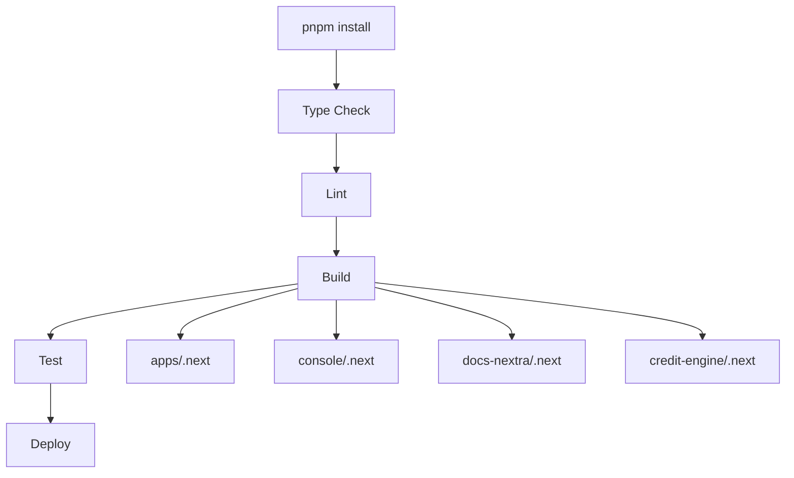

# Build Pipeline Configuration

## Overview

The REFLEKT build pipeline leverages Turborepo for orchestration and PNPM for dependency management, providing fast, reliable builds across all workspaces.

## Pipeline Architecture

### Build Graph



## Turborepo Configuration

### Core Configuration (`turbo.json`)

```json
{
  "$schema": "https://turbo.build/schema.json",
  "tasks": {
    "build": {
      "dependsOn": ["^build"],
      "outputs": [
        ".next/**",
        "!.next/cache/**",
        "dist/**",
        "build/**"
      ],
      "env": [
        "NODE_ENV",
        "NEXT_PUBLIC_*",
        "DATABASE_URL",
        "NEXT_TELEMETRY_DISABLED",
        "PNPM_VERSION",
        "VERCEL_DEEP_CLONE"
      ]
    },
    "dev": {
      "cache": false,
      "persistent": true,
      "dependsOn": ["^build"]
    },
    "lint": {
      "dependsOn": ["^build"],
      "outputs": []
    },
    "typecheck": {
      "dependsOn": ["^build"],
      "outputs": ["tsconfig.tsbuildinfo"]
    },
    "test": {
      "dependsOn": ["build"],
      "outputs": ["coverage/**"]
    },
    "clean": {
      "cache": false
    }
  }
}
```

### Task Dependencies

#### Build Task
- **dependsOn**: `["^build"]` - Build dependencies first
- **outputs**: Next.js build artifacts
- **env**: Required environment variables

#### Development Task
- **cache**: Disabled for hot reload
- **persistent**: Keeps running
- **dependsOn**: Ensures deps are built

#### Lint & Type Check
- Run after dependency builds
- Cache results for speed

## Build Stages

### 1. Installation Stage

```bash
# Production install (CI/CD)
pnpm install --frozen-lockfile

# Development install
pnpm install

# Workspace-specific install
pnpm --filter console install
```

### 2. Type Checking Stage

```bash
# Check all workspaces
pnpm turbo typecheck

# Check specific workspace
pnpm turbo typecheck --filter=console

# TypeScript configuration
{
  "compilerOptions": {
    "incremental": true,
    "tsBuildInfoFile": "./tsconfig.tsbuildinfo"
  }
}
```

### 3. Linting Stage

```bash
# Lint all workspaces
pnpm turbo lint

# Lint with autofix
pnpm turbo lint -- --fix

# ESLint configuration
{
  "extends": ["next/core-web-vitals"],
  "rules": {
    "@typescript-eslint/no-unused-vars": "error"
  }
}
```

### 4. Build Stage

```bash
# Build all applications
pnpm turbo build

# Build specific app
pnpm turbo build --filter=apps

# Build with dependencies
pnpm turbo build --filter=console...
```

### 5. Test Stage

```bash
# Run all tests
pnpm turbo test

# Run with coverage
pnpm turbo test -- --coverage

# Watch mode
pnpm turbo test -- --watch
```

## Caching Strategy

### Local Caching

#### Cache Location
```
.turbo/
├── cache/
│   ├── build/
│   ├── lint/
│   └── typecheck/
└── turbo-build.log
```

#### Cache Configuration
```json
{
  "pipeline": {
    "build": {
      "outputs": [".next/**", "!.next/cache/**"],
      "cache": true
    }
  }
}
```

#### Cache Management
```bash
# Clear all caches
rm -rf .turbo

# Force rebuild (ignore cache)
pnpm turbo build --force

# Selective cache clear
pnpm turbo build --filter=console --force
```

### Remote Caching (Future)

```json
{
  "remoteCache": {
    "enabled": true,
    "url": "https://cache.reflekt.ai",
    "token": "$TURBO_TOKEN"
  }
}
```

## Environment Variables

### Required Variables

```bash
# Build Environment
NODE_ENV=production
NEXT_TELEMETRY_DISABLED=1

# Package Manager
PNPM_VERSION=9.14.4

# Vercel Specific
VERCEL_DEEP_CLONE=true
VERCEL_URL=$VERCEL_URL

# Application Variables
NEXT_PUBLIC_API_URL=https://api.reflekt.ai
DATABASE_URL=postgresql://...
```

### Variable Inheritance

```javascript
// turbo.json
{
  "globalEnv": [
    "NODE_ENV",
    "CI"
  ],
  "env": [
    "NEXT_PUBLIC_*",
    "DATABASE_URL",
    "API_KEY"
  ]
}
```

## CI/CD Integration

### GitHub Actions

```yaml
name: Build and Test

on:
  push:
    branches: [main, develop]
  pull_request:

jobs:
  build:
    runs-on: ubuntu-latest

    steps:
      - uses: actions/checkout@v3

      - uses: pnpm/action-setup@v2
        with:
          version: 9.14.4

      - uses: actions/setup-node@v3
        with:
          node-version: '20'
          cache: 'pnpm'

      - name: Install dependencies
        run: pnpm install --frozen-lockfile

      - name: Type check
        run: pnpm turbo typecheck

      - name: Lint
        run: pnpm turbo lint

      - name: Build
        run: pnpm turbo build

      - name: Test
        run: pnpm turbo test
```

### Vercel Deployment

#### Project Settings
```json
{
  "framework": "nextjs",
  "buildCommand": "pnpm turbo build --filter=PROJECT_NAME",
  "installCommand": "pnpm install",
  "outputDirectory": ".next"
}
```

#### Environment Configuration
1. Set `PNPM_VERSION=9.14.4`
2. Enable `VERCEL_DEEP_CLONE=true`
3. Configure app-specific variables

## Optimization Techniques

### 1. Parallel Execution

```bash
# Turborepo runs tasks in parallel by default
pnpm turbo build lint typecheck

# Control concurrency
pnpm turbo build --concurrency=2
```

### 2. Incremental Builds

```typescript
// next.config.js
module.exports = {
  experimental: {
    incrementalCacheHandlerPath: './.next/cache'
  }
}
```

### 3. Selective Builds

```bash
# Only build changed packages
pnpm turbo build --filter='[HEAD^1]'

# Build affected by branch changes
pnpm turbo build --filter='...[origin/main]'
```

### 4. Build Output Optimization

```javascript
// next.config.js
module.exports = {
  output: 'standalone',
  compress: true,
  poweredByHeader: false,
  generateBuildId: async () => {
    return process.env.GIT_COMMIT_SHA || 'development'
  }
}
```

## Monitoring & Debugging

### Build Logs

```bash
# Verbose output
pnpm turbo build --log-level=debug

# Save logs
pnpm turbo build 2>&1 | tee build.log

# Analyze build times
pnpm turbo build --profile
```

### Performance Metrics

```bash
# Measure build time
time pnpm turbo build

# Analyze bundle size
pnpm --filter console analyze

# Check cache hits
pnpm turbo build --dry-run
```

## Common Issues & Solutions

### Issue: Out of Memory

```bash
# Increase Node memory
NODE_OPTIONS='--max-old-space-size=8192' pnpm turbo build
```

### Issue: Cache Corruption

```bash
# Clear and rebuild
rm -rf .turbo node_modules/.cache
pnpm turbo build --force
```

### Issue: Dependency Conflicts

```bash
# Deduplicate dependencies
pnpm dedupe

# Clean install
rm -rf node_modules pnpm-lock.yaml
pnpm install
```

### Issue: Slow Builds

```bash
# Profile build
pnpm turbo build --profile > profile.json

# Analyze dependencies
pnpm why [package-name]
```

## Build Pipeline Checklist

### Pre-Build
- [ ] Dependencies installed with `--frozen-lockfile`
- [ ] Environment variables configured
- [ ] Cache directory accessible
- [ ] Node version correct

### Build Process
- [ ] Type checking passes
- [ ] Linting passes
- [ ] Tests pass
- [ ] Build artifacts generated
- [ ] Bundle size acceptable

### Post-Build
- [ ] Artifacts uploaded
- [ ] Cache updated
- [ ] Logs archived
- [ ] Metrics recorded

## Best Practices

1. **Always use Turborepo commands** for multi-workspace operations
2. **Cache aggressively** but know when to clear
3. **Monitor build times** and optimize bottlenecks
4. **Keep dependencies minimal** and up-to-date
5. **Use incremental builds** where possible
6. **Parallelize independent tasks**
7. **Document environment requirements**
8. **Version lock critical dependencies**

## Resources

- [Turborepo Build Pipeline](https://turbo.build/repo/docs/core-concepts/pipelines)
- [Next.js Build Optimization](https://nextjs.org/docs/advanced-features/compiler)
- [PNPM Performance](https://pnpm.io/benchmarks)
- [Vercel Build Configuration](https://vercel.com/docs/concepts/projects/project-configuration)
