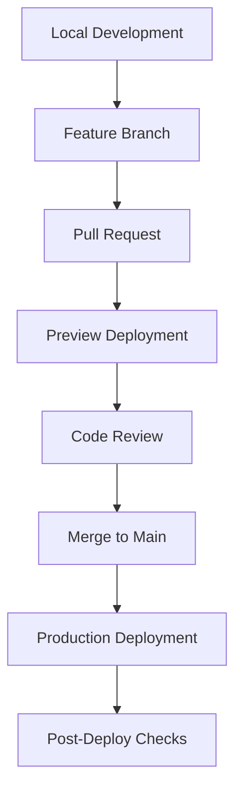

# Deployment Guide

Step-by-step guide for deploying Earna AI projects from development to production.

## Deployment Overview

The Earna AI platform uses a multi-stage deployment pipeline with automatic deployments via Vercel's GitHub integration.



## Pre-Deployment Checklist

### Local Testing

```bash
# 1. Run type checking
pnpm turbo typecheck

# 2. Run linting
pnpm turbo lint

# 3. Build all projects
pnpm turbo build

# 4. Test production build locally
pnpm turbo start
```

### Environment Variables

Ensure all required variables are set in Vercel:

```bash
# Pull current production variables
vercel env pull .env.production

# Verify all required variables exist
cat .env.production | grep -E "^[A-Z]"
```

## Deployment Workflows

### Feature Development Workflow

#### 1. Create Feature Branch

```bash
# Create and switch to feature branch
git checkout -b feature/your-feature-name

# Make changes
# ... edit files ...

# Test locally
pnpm turbo dev --filter=affected
```

#### 2. Commit Changes

```bash
# Stage changes
git add .

# Commit with conventional commit message
git commit -m "feat(console): add new dashboard widget"

# Push to GitHub
git push -u origin feature/your-feature-name
```

#### 3. Create Pull Request

```bash
# Using GitHub CLI
gh pr create --title "feat: Add dashboard widget" \
  --body "## Summary
  - Added new dashboard widget
  - Updated API endpoints

  ## Test Plan
  - [ ] Widget renders correctly
  - [ ] API returns expected data"
```

#### 4. Preview Deployment

Vercel automatically creates a preview deployment:

```
https://console-[hash]-earna-ai.vercel.app
```

Test the preview URL thoroughly before merging.

### Production Deployment Workflow

#### 1. Merge to Main

After PR approval and all checks pass:

```bash
# Merge via GitHub UI or CLI
gh pr merge --squash

# Or merge locally
git checkout main
git pull origin main
git merge --squash feature/your-feature-name
git push origin main
```

#### 2. Automatic Production Deploy

Vercel automatically deploys to production when main is updated.

#### 3. Verify Deployment

```bash
# Check deployment status
vercel ls --prod

# Monitor logs
vercel logs --prod

# Check production site
curl -I https://console.earna.sh
```

## Project-Specific Deployments

### Console Deployment

```bash
# Environment variables required
NEXT_PUBLIC_SUPABASE_URL
NEXT_PUBLIC_SUPABASE_ANON_KEY
OPENAI_API_KEY
ANTHROPIC_API_KEY

# Build command
pnpm turbo build --filter=console

# Start command
pnpm --filter console start
```

### Apps Deployment

```bash
# Environment variables required
DATABASE_URL
NEXT_PUBLIC_FIREBASE_API_KEY
ANTHROPIC_API_KEY

# Build command
pnpm turbo build --filter=apps

# Start command
pnpm --filter apps start
```

### Docs Deployment

```bash
# No special environment variables required

# Build command
pnpm turbo build --filter=docs-nextra

# Start command
pnpm --filter docs-nextra start
```

### Credit Engine Deployment

```bash
# Environment variables required
DATABASE_URL
ANTHROPIC_API_KEY
NEXTAUTH_SECRET

# Build command
pnpm turbo build --filter=credit-engine

# Start command
pnpm --filter credit-engine start
```

## Manual Deployment

### Using Vercel CLI

```bash
# Install Vercel CLI
pnpm add -g vercel

# Login to Vercel
vercel login

# Deploy to preview
vercel

# Deploy to production
vercel --prod

# Deploy specific project
cd apps && vercel --prod
```

### Force Deployment

```bash
# Bypass cache and redeploy
vercel --prod --force

# With specific environment
vercel --prod --env NODE_ENV=production
```

## Rollback Procedures

### Quick Rollback

```bash
# Via Vercel Dashboard
1. Go to project deployments
2. Find last working deployment
3. Click "..." → "Promote to Production"

# Via CLI
vercel rollback
vercel rollback [deployment-url]
```

### Emergency Rollback

```bash
# 1. Immediate revert via Git
git revert HEAD
git push origin main

# 2. Or reset to previous commit
git reset --hard HEAD~1
git push --force origin main  # Use with caution!
```

## Post-Deployment Verification

### Health Checks

```bash
# Console health check
curl https://console.earna.sh/api/health

# Apps health check
curl https://earna.sh/api/health

# Credit Engine health check
curl https://credit.earna.sh/api/health
```

### Monitoring Checklist

- [ ] All pages load correctly
- [ ] API endpoints respond
- [ ] Database connections work
- [ ] Authentication flows work
- [ ] No console errors
- [ ] Performance metrics normal
- [ ] Error tracking active

### Performance Testing

```bash
# Lighthouse CI
pnpm add -D @lhci/cli
lhci autorun --collect.url=https://console.earna.sh

# Load testing
pnpm add -D autocannon
autocannon -c 10 -d 30 https://console.earna.sh/api/health
```

## Deployment Environments

### Development

```bash
# Local development
pnpm turbo dev

# Environment: .env.local
# URL: http://localhost:3000
```

### Preview

```bash
# Automatic on PR/branch push
# Environment: Preview env vars in Vercel
# URL: https://[project]-[hash].vercel.app
```

### Production

```bash
# Automatic on main branch push
# Environment: Production env vars in Vercel
# URLs:
# - https://earna.sh
# - https://console.earna.sh
# - https://docs.earna.sh
# - https://credit.earna.sh
```

## Secrets Management

### Adding Secrets

```bash
# Via Vercel Dashboard
Settings → Environment Variables → Add

# Via CLI
vercel env add SECRET_NAME

# Specify environment
vercel env add SECRET_NAME production
```

### Rotating Secrets

```bash
# 1. Add new secret with temporary name
vercel env add NEW_API_KEY production

# 2. Update code to use new secret
# 3. Deploy and verify
# 4. Remove old secret
vercel env rm OLD_API_KEY production

# 5. Rename new secret
vercel env add API_KEY production
vercel env rm NEW_API_KEY production
```

## Database Migrations

### Production Migration

```bash
# 1. Backup database
pg_dump $DATABASE_URL > backup.sql

# 2. Run migration
DATABASE_URL=$PROD_DATABASE_URL pnpm db:migrate

# 3. Verify migration
DATABASE_URL=$PROD_DATABASE_URL pnpm db:studio
```

### Rollback Migration

```bash
# Rollback last migration
DATABASE_URL=$PROD_DATABASE_URL pnpm db:migrate:rollback

# Restore from backup if needed
psql $DATABASE_URL < backup.sql
```

## Troubleshooting Deployments

### Build Failures

```bash
# Check build logs
vercel logs --since 1h

# Common fixes:
# 1. Clear cache
rm -rf .turbo .next

# 2. Update dependencies
pnpm update

# 3. Check environment variables
vercel env ls
```

### Runtime Errors

```bash
# Check function logs
vercel logs --prod --since 1h

# Common issues:
# - Missing environment variables
# - Database connection errors
# - API rate limits
# - Memory/timeout limits
```

### Performance Issues

```bash
# Check function metrics
vercel inspect [deployment-url]

# Optimize:
# - Reduce bundle size
# - Enable caching
# - Optimize images
# - Use ISR/SSG where possible
```

## Deployment Notifications

### Slack Integration

```javascript
// api/deploy-webhook.ts
export async function POST(req: Request) {
  const { deployment, project } = await req.json()

  await fetch(process.env.SLACK_WEBHOOK_URL, {
    method: 'POST',
    body: JSON.stringify({
      text: `🚀 ${project} deployed to ${deployment.environment}`,
      attachments: [{
        color: deployment.ready ? 'good' : 'danger',
        fields: [
          { title: 'URL', value: deployment.url },
          { title: 'Commit', value: deployment.meta.githubCommitSha }
        ]
      }]
    })
  })
}
```

### Email Notifications

Configure in Vercel Dashboard:
Settings → Notifications → Add email

## Best Practices

### 1. Always Test Locally First

```bash
pnpm turbo build
pnpm turbo start
```

### 2. Use Preview Deployments

Test every change in preview before production.

### 3. Monitor After Deployment

```bash
# Watch logs for 5 minutes post-deploy
vercel logs --prod --follow
```

### 4. Document Changes

Update CHANGELOG.md with deployment notes.

### 5. Tag Releases

```bash
git tag -a v1.0.0 -m "Release version 1.0.0"
git push origin v1.0.0
```

## Deployment Schedule

### Recommended Times

- **Major updates**: Tuesday-Thursday, 10 AM - 2 PM
- **Hotfixes**: Anytime, with immediate monitoring
- **Avoid**: Fridays, weekends, holidays

### Deployment Freeze

During high-traffic periods:
- Black Friday/Cyber Monday
- Major marketing campaigns
- System maintenance windows

## Support & Recovery

### Support Channels

- GitHub Issues: Bug reports
- Vercel Support: Infrastructure issues
- Team Slack: Urgent issues

### Recovery Procedures

1. **Identify issue**: Check logs and monitoring
2. **Rollback if needed**: Use quick rollback
3. **Communicate**: Update status page
4. **Fix forward**: Deploy patch
5. **Post-mortem**: Document lessons learned
