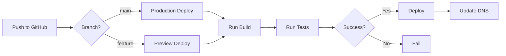

# Vercel Deployment & Configuration

Complete guide to deploying the Earna AI monorepo projects on Vercel with GitHub integration.

## Overview

All Earna AI projects are deployed on Vercel with automatic deployments triggered by GitHub commits. Each project in the monorepo has its own Vercel project with specific configurations.

## Projects Structure

| Project | URL | Vercel Project | Root Directory |
|---------|-----|---------------|----------------|
| Apps (Main) | [earna.sh](https://earna.sh) | `earna-ai` | `/` |
| Console | [console.earna.sh](https://console.earna.sh) | `console` | `/` |
| Docs | [docs.earna.sh](https://docs.earna.sh) | `docs-nextra` | `/` |
| Credit Engine | [credit.earna.sh](https://credit.earna.sh) | `credit-engine` | `/` |

## GitHub Integration

### Automatic Deployments

Vercel is connected to the GitHub repository with the following triggers:

```yaml
Production Deployments:
  - Branch: main
  - Trigger: Push to main
  - URL: Production domain

Preview Deployments:
  - Branches: All feature branches
  - Trigger: Pull requests and pushes
  - URL: Unique preview URL per deployment
```

### Branch Protection

The `main` branch has protection rules:
- Requires pull request reviews
- Requires status checks to pass
- Vercel deployment must succeed
- No direct pushes allowed

## Vercel Project Configuration

### Build & Development Settings

Each project has specific build settings in Vercel:

```json
{
  "framework": "nextjs",
  "buildCommand": "pnpm turbo build --filter=[project-name]",
  "installCommand": "pnpm install",
  "outputDirectory": ".next",
  "nodeVersion": "20.x",
  "rootDirectory": "./"
}
```

### Environment Variables

#### Required for All Projects

```bash
# Node Environment
NODE_ENV=production

# Package Manager
PNPM_VERSION=9.14.4

# Vercel Specific
VERCEL_DEEP_CLONE=true  # Required for monorepo
NEXT_TELEMETRY_DISABLED=1
```

#### Console Project Variables

```bash
# Supabase (Required)
NEXT_PUBLIC_SUPABASE_URL=https://[project].supabase.co
NEXT_PUBLIC_SUPABASE_ANON_KEY=[anon-key]
SUPABASE_SERVICE_ROLE_KEY=[service-role-key]

# AI Providers
OPENAI_API_KEY=sk-...  # Required for GPT-4o
ANTHROPIC_API_KEY=sk-ant-...  # Claude 3 Opus
GOOGLE_AI_API_KEY=AIza...  # Gemini Pro
MISTRAL_API_KEY=...
XAI_API_KEY=xai-...
PERPLEXITY_API_KEY=pplx-...
DEEPSEEK_API_KEY=...

# Interactive Avatars
NEXT_PUBLIC_HEYGEN_API_KEY=...
HEYGEN_SECRET_KEY=...

# Voice Mode
NEXT_PUBLIC_OPENAI_API_KEY=sk-...

# Optional Services
OPENROUTER_API_KEY=...
OLLAMA_BASE_URL=http://localhost:11434
```

#### Apps Project Variables

```bash
# Database
DATABASE_URL=postgresql://...

# Firebase
NEXT_PUBLIC_FIREBASE_API_KEY=...
NEXT_PUBLIC_FIREBASE_AUTH_DOMAIN=...
NEXT_PUBLIC_FIREBASE_PROJECT_ID=...
NEXT_PUBLIC_FIREBASE_STORAGE_BUCKET=...
NEXT_PUBLIC_FIREBASE_MESSAGING_SENDER_ID=...
NEXT_PUBLIC_FIREBASE_APP_ID=...

# Sanity CMS
NEXT_PUBLIC_SANITY_PROJECT_ID=...
NEXT_PUBLIC_SANITY_DATASET=production
SANITY_API_TOKEN=...

# Google Maps
NEXT_PUBLIC_GOOGLE_MAPS_API_KEY=...

# AI Services
ANTHROPIC_API_KEY=sk-ant-...
```

#### Credit Engine Variables

```bash
# Database
DATABASE_URL=postgresql://...
DIRECT_URL=postgresql://...  # For migrations

# AI Provider
ANTHROPIC_API_KEY=sk-ant-...

# Authentication
NEXTAUTH_URL=https://credit.earna.sh
NEXTAUTH_SECRET=[generated-secret]

# Monitoring
SENTRY_DSN=https://...@sentry.io/...
```

## Setting Environment Variables

### Via Vercel Dashboard

1. Navigate to Project Settings → Environment Variables
2. Add each variable with appropriate scope:
   - **Production**: Live site
   - **Preview**: Pull request previews
   - **Development**: Local development (vercel dev)

### Via Vercel CLI

```bash
# Install Vercel CLI
pnpm add -g vercel

# Login
vercel login

# Link project
vercel link

# Add environment variable
vercel env add VARIABLE_NAME

# Add to specific environment
vercel env add VARIABLE_NAME production
vercel env add VARIABLE_NAME preview
vercel env add VARIABLE_NAME development

# Pull environment variables locally
vercel env pull .env.local
```

## Deployment Configuration Files

### vercel.json (Per Project)

```json
{
  "$schema": "https://openapi.vercel.sh/vercel.json",
  "framework": "nextjs",
  "buildCommand": "pnpm turbo build --filter=project-name",
  "installCommand": "pnpm install",
  "outputDirectory": ".next",
  "git": {
    "deploymentEnabled": {
      "main": true
    }
  }
}
```

### turbo.json (Root)

```json
{
  "$schema": "https://turbo.build/schema.json",
  "tasks": {
    "build": {
      "dependsOn": ["^build"],
      "outputs": [".next/**", "!.next/cache/**"],
      "env": [
        "NODE_ENV",
        "NEXT_PUBLIC_*",
        "DATABASE_URL",
        "PNPM_VERSION",
        "VERCEL_DEEP_CLONE"
      ]
    }
  }
}
```

## Deployment Process

### Manual Deployment

```bash
# Deploy to preview
vercel

# Deploy to production
vercel --prod

# Deploy specific project
cd apps
vercel --prod
```

### Automatic Deployment Flow



## Domain Configuration

### Production Domains

```bash
# Apps
earna.sh → earna-ai.vercel.app

# Console
console.earna.sh → console.vercel.app

# Docs
docs.earna.sh → docs-nextra.vercel.app

# Credit Engine
credit.earna.sh → credit-engine.vercel.app
```

### DNS Settings

```bash
# A Records (Apex Domain)
@ → 76.76.21.21

# CNAME Records (Subdomains)
console → cname.vercel-dns.com
docs → cname.vercel-dns.com
credit → cname.vercel-dns.com
```

## Build Optimization

### Caching Strategy

```javascript
// next.config.js
module.exports = {
  // Enable ISR
  experimental: {
    isrMemoryCacheSize: 0 // Disable in-memory caching
  },

  // Image optimization
  images: {
    domains: ['earna.sh'],
    formats: ['image/avif', 'image/webp']
  }
}
```

### Function Configuration

```json
{
  "functions": {
    "app/api/chat/route.ts": {
      "maxDuration": 60,
      "memory": 1024
    },
    "app/api/analyze/route.ts": {
      "maxDuration": 30,
      "memory": 512
    }
  }
}
```

## Monitoring & Analytics

### Vercel Analytics

```typescript
// app/layout.tsx
import { Analytics } from '@vercel/analytics/react'
import { SpeedInsights } from '@vercel/speed-insights/next'

export default function RootLayout({ children }) {
  return (
    <html>
      <body>
        {children}
        <Analytics />
        <SpeedInsights />
      </body>
    </html>
  )
}
```

### Build Logs

Access build logs via:
1. Vercel Dashboard → Project → Deployments
2. CLI: `vercel logs`
3. API: `GET https://api.vercel.com/v2/deployments/{id}/events`

## Troubleshooting

### Common Issues

#### 1. Monorepo Build Failures

**Problem**: "Cannot find package" errors
**Solution**: Ensure `VERCEL_DEEP_CLONE=true` is set

```bash
vercel env add VERCEL_DEEP_CLONE true
```

#### 2. PNPM Version Mismatch

**Problem**: Different PNPM versions locally vs Vercel
**Solution**: Set explicit PNPM version

```bash
vercel env add PNPM_VERSION 9.14.4
```

#### 3. Environment Variable Not Available

**Problem**: Variable undefined in production
**Solution**: Check scope and naming

```bash
# For client-side variables, use NEXT_PUBLIC_ prefix
NEXT_PUBLIC_API_URL=https://api.earna.sh

# Verify variables
vercel env ls
```

#### 4. Preview Deployment 404

**Problem**: Preview branches show 404
**Solution**: Check root directory and build command

```json
{
  "rootDirectory": "./",
  "buildCommand": "cd .. && pnpm turbo build --filter=project"
}
```

## Security Best Practices

### Secret Management

1. **Never commit secrets**: Use environment variables
2. **Rotate keys regularly**: Update via Vercel dashboard
3. **Use different keys**: Separate production/preview keys
4. **Limit scope**: Only add variables where needed

### Access Control

```bash
# Team settings
- Owner: Full access
- Member: Deploy + view logs
- Viewer: Read-only access

# Project settings
- Environment variable access
- Deployment protection rules
- Domain management
```

## Rollback Strategy

### Via Dashboard

1. Go to Deployments
2. Find previous working deployment
3. Click "..." → "Promote to Production"

### Via CLI

```bash
# List deployments
vercel ls

# Rollback to specific deployment
vercel rollback [deployment-url]

# Rollback to previous
vercel rollback
```

## Cost Optimization

### Recommended Settings

```json
{
  "regions": ["iad1"],  // Single region for cost
  "functions": {
    "*.ts": {
      "maxDuration": 10  // Default 10s timeout
    }
  }
}
```

### Usage Monitoring

- Check Vercel Dashboard → Usage tab
- Set spending limits
- Monitor function invocations
- Optimize image delivery

## CI/CD Integration

### GitHub Actions

```yaml
name: Deploy to Vercel
on:
  push:
    branches: [main]

jobs:
  deploy:
    runs-on: ubuntu-latest
    steps:
      - uses: actions/checkout@v3

      - uses: pnpm/action-setup@v2
        with:
          version: 9.14.4

      - name: Deploy to Vercel
        run: |
          pnpm add -g vercel
          vercel --prod --token=${{ secrets.VERCEL_TOKEN }}
        env:
          VERCEL_ORG_ID: ${{ secrets.VERCEL_ORG_ID }}
          VERCEL_PROJECT_ID: ${{ secrets.VERCEL_PROJECT_ID }}
```

## Deployment Checklist

- [ ] Environment variables configured
- [ ] PNPM_VERSION set to 9.14.4
- [ ] VERCEL_DEEP_CLONE=true for monorepo
- [ ] Build command uses Turborepo
- [ ] Install command is `pnpm install`
- [ ] Root directory correctly set
- [ ] Domains configured and verified
- [ ] Preview deployments working
- [ ] Production deployment successful
- [ ] Analytics and monitoring enabled

## Support Resources

- [Vercel Documentation](https://vercel.com/docs)
- [Turborepo with Vercel](https://turbo.build/repo/docs/handbook/deploying-with-vercel)
- [Next.js on Vercel](https://vercel.com/docs/frameworks/nextjs)
- [Vercel Support](https://vercel.com/support)
