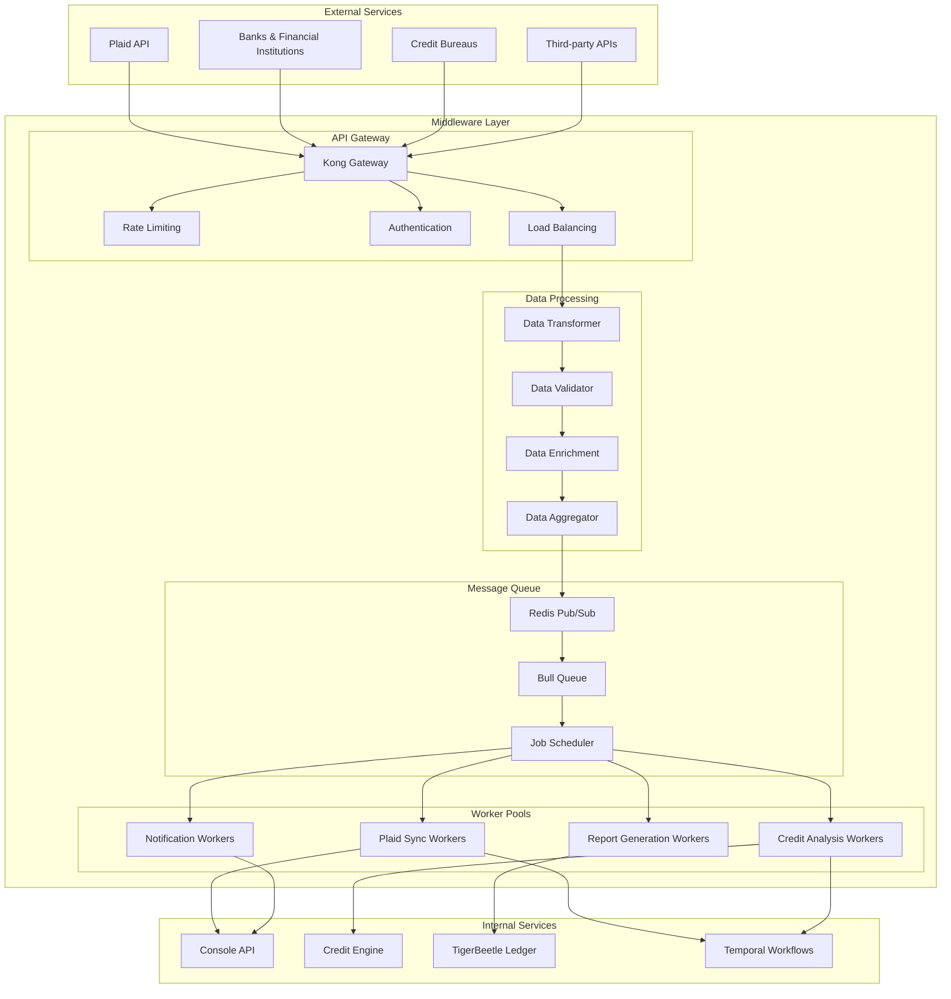

# Middleware Services

## Overview

REFLEKT's middleware layer provides the critical integration backbone between external services, internal APIs, and our financial platform. Our middleware architecture ensures reliable data processing, workflow orchestration, and seamless service communication across the entire platform.

## Architecture



## Core Components

### 1. Message Processing Pipeline

```typescript
// lib/middleware/message-processor.ts
interface MessageProcessor<T> {
  validate(data: T): Promise<ValidationResult>
  transform(data: T): Promise<TransformedData>
  enrich(data: TransformedData): Promise<EnrichedData>
  route(data: EnrichedData): Promise<RoutingDecision>
  process(data: EnrichedData): Promise<ProcessingResult>
}

class PlaidMessageProcessor implements MessageProcessor<PlaidWebhook> {
  async validate(webhook: PlaidWebhook): Promise<ValidationResult> {
    // Verify webhook signature
    const signatureValid = await this.verifySignature(webhook)
    if (!signatureValid) {
      return { valid: false, error: 'Invalid webhook signature' }
    }

    // Validate webhook structure
    const structureValid = this.validateWebhookStructure(webhook)
    if (!structureValid.valid) {
      return structureValid
    }

    return { valid: true }
  }

  async transform(webhook: PlaidWebhook): Promise<TransformedData> {
    return {
      eventId: this.generateEventId(),
      timestamp: new Date(),
      source: 'plaid',
      type: webhook.webhook_type,
      data: {
        itemId: webhook.item_id,
        webhookCode: webhook.webhook_code,
        error: webhook.error,
        newTransactions: webhook.new_transactions,
        removedTransactions: webhook.removed_transactions
      }
    }
  }

  async enrich(data: TransformedData): Promise<EnrichedData> {
    // Add user context
    const userContext = await this.getUserContext(data.data.itemId)

    // Add institution information
    const institutionInfo = await this.getInstitutionInfo(data.data.itemId)

    // Add risk scoring
    const riskScore = await this.calculateRiskScore(data)

    return {
      ...data,
      userContext,
      institutionInfo,
      riskScore,
      priority: this.determinePriority(data, riskScore)
    }
  }

  async route(data: EnrichedData): Promise<RoutingDecision> {
    const routes: string[] = []

    // Determine processing routes based on webhook type
    switch (data.type) {
      case 'TRANSACTIONS':
        routes.push('transaction-sync-queue')
        if (data.priority === 'high') {
          routes.push('real-time-processing-queue')
        }
        break

      case 'ACCOUNTS':
        routes.push('account-update-queue')
        break

      case 'ITEM':
        routes.push('item-management-queue')
        if (data.data.error) {
          routes.push('error-handling-queue')
        }
        break
    }

    return { routes, priority: data.priority }
  }

  async process(data: EnrichedData): Promise<ProcessingResult> {
    const results: ProcessingResult = {
      success: true,
      processedAt: new Date(),
      jobIds: []
    }

    // Queue background jobs
    for (const route of data.routes) {
      const jobId = await this.queueJob(route, data)
      results.jobIds.push(jobId)
    }

    // Update metrics
    await this.updateProcessingMetrics(data.type, results)

    return results
  }
}
```

### 2. Job Queue Management

```typescript
// lib/middleware/job-queue.ts
import Bull from 'bull'
import Redis from 'ioredis'

class JobQueueManager {
  private redis: Redis
  private queues: Map<string, Bull.Queue>

  constructor() {
    this.redis = new Redis(process.env.REDIS_URL!)
    this.queues = new Map()
    this.initializeQueues()
  }

  private initializeQueues() {
    const queueConfigs = [
      { name: 'transaction-sync', concurrency: 5, priority: 'high' },
      { name: 'account-update', concurrency: 3, priority: 'medium' },
      { name: 'credit-analysis', concurrency: 2, priority: 'high' },
      { name: 'notification-send', concurrency: 10, priority: 'medium' },
      { name: 'report-generation', concurrency: 1, priority: 'low' },
      { name: 'data-cleanup', concurrency: 1, priority: 'low' }
    ]

    queueConfigs.forEach(config => {
      const queue = new Bull(config.name, process.env.REDIS_URL!, {
        defaultJobOptions: {
          removeOnComplete: 100,
          removeOnFail: 50,
          attempts: 3,
          backoff: {
            type: 'exponential',
            delay: 2000
          }
        }
      })

      // Add job processors
      queue.process(config.concurrency, this.getProcessor(config.name))

      // Add event handlers
      this.setupQueueEventHandlers(queue)

      this.queues.set(config.name, queue)
    })
  }

  async addJob(queueName: string, data: any, options?: Bull.JobOptions) {
    const queue = this.queues.get(queueName)
    if (!queue) {
      throw new Error(`Queue ${queueName} not found`)
    }

    const job = await queue.add(data, options)

    // Log job creation
    console.log(`Job ${job.id} added to queue ${queueName}`)

    return job.id
  }

  private getProcessor(queueName: string): Bull.ProcessCallbackFunction<any> {
    const processors = {
      'transaction-sync': this.processTransactionSync.bind(this),
      'account-update': this.processAccountUpdate.bind(this),
      'credit-analysis': this.processCreditAnalysis.bind(this),
      'notification-send': this.processNotificationSend.bind(this),
      'report-generation': this.processReportGeneration.bind(this),
      'data-cleanup': this.processDataCleanup.bind(this)
    }

    return processors[queueName] || this.processDefault.bind(this)
  }

  private async processTransactionSync(job: Bull.Job): Promise<any> {
    const { itemId, webhookData } = job.data

    try {
      // Fetch latest transactions from Plaid
      const transactions = await this.fetchTransactions(itemId)

      // Transform and validate
      const validatedTransactions = await this.validateTransactions(transactions)

      // Store in database
      await this.storeTransactions(validatedTransactions)

      // Update TigerBeetle ledger
      await this.updateLedger(validatedTransactions)

      // Trigger credit analysis if needed
      if (this.shouldTriggerCreditAnalysis(validatedTransactions)) {
        await this.addJob('credit-analysis', {
          userId: webhookData.userId,
          transactions: validatedTransactions
        })
      }

      return { success: true, processedCount: validatedTransactions.length }
    } catch (error) {
      console.error('Transaction sync failed:', error)
      throw error
    }
  }
}
```

### 3. Data Transformation Engine

```typescript
// lib/middleware/data-transformer.ts
interface DataTransformer<TInput, TOutput> {
  transform(input: TInput): Promise<TOutput>
  validate(output: TOutput): Promise<ValidationResult>
  rollback?(input: TInput): Promise<void>
}

class PlaidTransactionTransformer implements DataTransformer<PlaidTransaction, StandardTransaction> {
  async transform(plaidTransaction: PlaidTransaction): Promise<StandardTransaction> {
    return {
      id: this.generateTransactionId(),
      externalId: plaidTransaction.transaction_id,
      userId: await this.getUserIdFromAccount(plaidTransaction.account_id),
      accountId: await this.getInternalAccountId(plaidTransaction.account_id),
      amount: Math.abs(plaidTransaction.amount),
      direction: plaidTransaction.amount > 0 ? 'debit' : 'credit',
      currency: plaidTransaction.iso_currency_code || 'USD',
      date: new Date(plaidTransaction.date),
      description: plaidTransaction.name,
      merchantName: plaidTransaction.merchant_name,
      category: this.mapCategory(plaidTransaction.category),
      subcategory: plaidTransaction.category?.[1] || null,
      pending: plaidTransaction.pending,
      confidence: this.calculateConfidence(plaidTransaction),
      metadata: {
        plaidTransactionId: plaidTransaction.transaction_id,
        plaidAccountId: plaidTransaction.account_id,
        originalAmount: plaidTransaction.amount,
        location: plaidTransaction.location,
        paymentChannel: plaidTransaction.payment_channel
      },
      createdAt: new Date(),
      updatedAt: new Date()
    }
  }

  async validate(transaction: StandardTransaction): Promise<ValidationResult> {
    const errors: string[] = []

    // Required field validation
    if (!transaction.userId) errors.push('userId is required')
    if (!transaction.accountId) errors.push('accountId is required')
    if (transaction.amount <= 0) errors.push('amount must be positive')
    if (!transaction.currency) errors.push('currency is required')
    if (!transaction.date) errors.push('date is required')

    // Business logic validation
    if (transaction.amount > 1000000) {
      errors.push('amount exceeds maximum allowed')
    }

    if (transaction.date > new Date()) {
      errors.push('transaction date cannot be in the future')
    }

    // Duplicate detection
    const isDuplicate = await this.checkDuplicate(transaction)
    if (isDuplicate) {
      errors.push('transaction already exists')
    }

    return {
      valid: errors.length === 0,
      errors
    }
  }

  private mapCategory(plaidCategories: string[]): string {
    const categoryMapping = {
      'Food and Drink': 'dining',
      'Transportation': 'transport',
      'Shops': 'shopping',
      'Recreation': 'entertainment',
      'Service': 'services',
      'Healthcare': 'medical',
      'Government and Non-Profit': 'government',
      'Travel': 'travel'
    }

    const primaryCategory = plaidCategories?.[0]
    return categoryMapping[primaryCategory] || 'other'
  }
}
```

## Worker Pool Architecture

### Background Workers

```yaml
# docker-compose.middleware.yml
version: '3.8'
services:
  plaid-sync-worker:
    image: reflekt/middleware-worker:latest
    environment:
      - WORKER_TYPE=plaid-sync
      - CONCURRENCY=5
      - QUEUE_NAME=transaction-sync
      - REDIS_URL=${REDIS_URL}
    deploy:
      replicas: 3
      resources:
        limits:
          memory: 512M
          cpus: '0.5'
    depends_on:
      - redis
      - postgres

  credit-analysis-worker:
    image: reflekt/middleware-worker:latest
    environment:
      - WORKER_TYPE=credit-analysis
      - CONCURRENCY=2
      - QUEUE_NAME=credit-analysis
      - REDIS_URL=${REDIS_URL}
    deploy:
      replicas: 2
      resources:
        limits:
          memory: 1G
          cpus: '1.0'
    depends_on:
      - redis
      - postgres
      - tigerbeetle

  notification-worker:
    image: reflekt/middleware-worker:latest
    environment:
      - WORKER_TYPE=notification
      - CONCURRENCY=10
      - QUEUE_NAME=notification-send
      - REDIS_URL=${REDIS_URL}
    deploy:
      replicas: 2
      resources:
        limits:
          memory: 256M
          cpus: '0.3'
    depends_on:
      - redis
```

### Kubernetes Deployment

```yaml
# k8s/middleware-workers.yaml
apiVersion: apps/v1
kind: Deployment
metadata:
  name: plaid-sync-worker
  namespace: platform-services
spec:
  replicas: 3
  selector:
    matchLabels:
      app: plaid-sync-worker
  template:
    metadata:
      labels:
        app: plaid-sync-worker
    spec:
      containers:
      - name: worker
        image: reflekt/middleware-worker:latest
        env:
        - name: WORKER_TYPE
          value: "plaid-sync"
        - name: CONCURRENCY
          value: "5"
        - name: REDIS_URL
          valueFrom:
            secretKeyRef:
              name: redis-credentials
              key: url
        - name: DATABASE_URL
          valueFrom:
            secretKeyRef:
              name: database-credentials
              key: url
        resources:
          requests:
            memory: "256Mi"
            cpu: "250m"
          limits:
            memory: "512Mi"
            cpu: "500m"
        livenessProbe:
          httpGet:
            path: /health
            port: 3000
          initialDelaySeconds: 30
          periodSeconds: 10
        readinessProbe:
          httpGet:
            path: /ready
            port: 3000
          initialDelaySeconds: 5
          periodSeconds: 5
---
apiVersion: v1
kind: Service
metadata:
  name: plaid-sync-worker-service
  namespace: platform-services
spec:
  selector:
    app: plaid-sync-worker
  ports:
  - port: 3000
    targetPort: 3000
```

## Error Handling and Resilience

### Circuit Breaker Pattern

```typescript
// lib/middleware/circuit-breaker.ts
class CircuitBreaker {
  private state: 'CLOSED' | 'OPEN' | 'HALF_OPEN' = 'CLOSED'
  private failureCount = 0
  private lastFailureTime = 0
  private nextAttemptTime = 0

  constructor(
    private threshold: number = 5,
    private timeout: number = 60000,
    private monitoringPeriod: number = 10000
  ) {}

  async execute<T>(operation: () => Promise<T>): Promise<T> {
    if (this.state === 'OPEN') {
      if (Date.now() < this.nextAttemptTime) {
        throw new Error('Circuit breaker is OPEN')
      }
      this.state = 'HALF_OPEN'
    }

    try {
      const result = await operation()
      this.onSuccess()
      return result
    } catch (error) {
      this.onFailure()
      throw error
    }
  }

  private onSuccess() {
    this.failureCount = 0
    this.state = 'CLOSED'
  }

  private onFailure() {
    this.failureCount++
    this.lastFailureTime = Date.now()

    if (this.failureCount >= this.threshold) {
      this.state = 'OPEN'
      this.nextAttemptTime = Date.now() + this.timeout
    }
  }
}
```

### Retry Logic with Exponential Backoff

```typescript
// lib/middleware/retry-handler.ts
interface RetryOptions {
  maxRetries: number
  baseDelay: number
  maxDelay: number
  exponentialBase: number
  jitter: boolean
}

class RetryHandler {
  async executeWithRetry<T>(
    operation: () => Promise<T>,
    options: RetryOptions = {
      maxRetries: 3,
      baseDelay: 1000,
      maxDelay: 30000,
      exponentialBase: 2,
      jitter: true
    }
  ): Promise<T> {
    let lastError: Error

    for (let attempt = 0; attempt <= options.maxRetries; attempt++) {
      try {
        return await operation()
      } catch (error) {
        lastError = error as Error

        if (attempt === options.maxRetries) {
          break
        }

        // Calculate delay for next attempt
        const delay = this.calculateDelay(attempt, options)
        await this.sleep(delay)

        console.log(`Retry attempt ${attempt + 1} after ${delay}ms delay`)
      }
    }

    throw new Error(`Operation failed after ${options.maxRetries + 1} attempts: ${lastError.message}`)
  }

  private calculateDelay(attempt: number, options: RetryOptions): number {
    let delay = options.baseDelay * Math.pow(options.exponentialBase, attempt)
    delay = Math.min(delay, options.maxDelay)

    if (options.jitter) {
      delay += Math.random() * 1000
    }

    return Math.floor(delay)
  }

  private sleep(ms: number): Promise<void> {
    return new Promise(resolve => setTimeout(resolve, ms))
  }
}
```

## Monitoring and Observability

### Metrics Collection

```typescript
// lib/middleware/metrics.ts
import { createPrometheusMetrics } from 'prom-client'

class MiddlewareMetrics {
  private jobsProcessed = new Counter({
    name: 'middleware_jobs_processed_total',
    help: 'Total number of jobs processed',
    labelNames: ['queue', 'status']
  })

  private jobDuration = new Histogram({
    name: 'middleware_job_duration_seconds',
    help: 'Job processing duration in seconds',
    labelNames: ['queue', 'type'],
    buckets: [0.1, 0.5, 1, 2, 5, 10, 30, 60]
  })

  private queueDepth = new Gauge({
    name: 'middleware_queue_depth',
    help: 'Current queue depth',
    labelNames: ['queue']
  })

  private errorRate = new Counter({
    name: 'middleware_errors_total',
    help: 'Total number of errors',
    labelNames: ['queue', 'error_type']
  })

  recordJobCompleted(queue: string, status: 'success' | 'failed', duration: number) {
    this.jobsProcessed.inc({ queue, status })
    this.jobDuration.observe({ queue, type: 'processing' }, duration)
  }

  recordError(queue: string, errorType: string) {
    this.errorRate.inc({ queue, error_type: errorType })
  }

  updateQueueDepth(queue: string, depth: number) {
    this.queueDepth.set({ queue }, depth)
  }
}
```

### Health Checks

```typescript
// lib/middleware/health-check.ts
class MiddlewareHealthCheck {
  async checkHealth(): Promise<HealthStatus> {
    const checks = await Promise.all([
      this.checkRedisConnection(),
      this.checkDatabaseConnection(),
      this.checkExternalServices(),
      this.checkQueueHealth()
    ])

    const overallStatus = checks.every(check => check.status === 'healthy')
      ? 'healthy'
      : 'unhealthy'

    return {
      status: overallStatus,
      timestamp: new Date(),
      checks: checks.reduce((acc, check) => {
        acc[check.name] = {
          status: check.status,
          message: check.message,
          responseTime: check.responseTime
        }
        return acc
      }, {} as Record<string, any>)
    }
  }

  private async checkRedisConnection(): Promise<HealthCheckResult> {
    const startTime = Date.now()
    try {
      await this.redis.ping()
      return {
        name: 'redis',
        status: 'healthy',
        message: 'Redis connection is healthy',
        responseTime: Date.now() - startTime
      }
    } catch (error) {
      return {
        name: 'redis',
        status: 'unhealthy',
        message: `Redis connection failed: ${error.message}`,
        responseTime: Date.now() - startTime
      }
    }
  }
}
```

## Security

### API Security

```typescript
// lib/middleware/security.ts
class MiddlewareSecurity {
  async authenticateRequest(request: Request): Promise<AuthResult> {
    const token = this.extractToken(request)
    if (!token) {
      return { authenticated: false, error: 'No token provided' }
    }

    try {
      const decoded = jwt.verify(token, process.env.JWT_SECRET!)
      const user = await this.validateUser(decoded)

      return {
        authenticated: true,
        user,
        permissions: await this.getUserPermissions(user.id)
      }
    } catch (error) {
      return {
        authenticated: false,
        error: 'Invalid token'
      }
    }
  }

  async authorizeRequest(user: User, resource: string, action: string): Promise<boolean> {
    const permissions = await this.getUserPermissions(user.id)
    return permissions.some(permission =>
      permission.resource === resource &&
      permission.actions.includes(action)
    )
  }

  async validateWebhookSignature(body: string, signature: string): Promise<boolean> {
    const expectedSignature = crypto
      .createHmac('sha256', process.env.WEBHOOK_SECRET!)
      .update(body)
      .digest('hex')

    return crypto.timingSafeEqual(
      Buffer.from(signature),
      Buffer.from(expectedSignature)
    )
  }
}
```

## Performance Optimization

### Caching Strategy

```typescript
// lib/middleware/cache-manager.ts
class MiddlewareCacheManager {
  private redis: Redis
  private localCache: NodeCache

  constructor() {
    this.redis = new Redis(process.env.REDIS_URL!)
    this.localCache = new NodeCache({
      stdTTL: 300, // 5 minutes
      checkperiod: 60 // cleanup every minute
    })
  }

  async get<T>(key: string, fallback?: () => Promise<T>, ttl: number = 3600): Promise<T | null> {
    // Try local cache first
    let cached = this.localCache.get<T>(key)
    if (cached) return cached

    // Try Redis cache
    const redisValue = await this.redis.get(key)
    if (redisValue) {
      cached = JSON.parse(redisValue)
      this.localCache.set(key, cached, ttl)
      return cached
    }

    // Execute fallback if provided
    if (fallback) {
      const fresh = await fallback()
      await this.set(key, fresh, ttl)
      return fresh
    }

    return null
  }

  async set<T>(key: string, value: T, ttl: number = 3600): Promise<void> {
    this.localCache.set(key, value, ttl)
    await this.redis.setex(key, ttl, JSON.stringify(value))
  }

  async invalidate(pattern: string): Promise<void> {
    // Clear local cache
    this.localCache.flushAll()

    // Clear Redis cache by pattern
    const keys = await this.redis.keys(pattern)
    if (keys.length > 0) {
      await this.redis.del(...keys)
    }
  }
}
```

## Contact Information

For middleware services inquiries:
- **Email**: middleware@reflekt.ai
- **Slack**: #platform-middleware
- **Emergency**: platform-emergency@reflekt.ai

## Next Steps

1. [Kong Gateway](/platform-services/kong-gateway) - API Gateway configuration
2. [Monitoring](/platform-services/monitoring) - Grafana and Prometheus setup
3. [TigerBeetle](/platform-services/tigerbeetle) - Financial ledger integration
4. [Temporal](/platform-services/temporal) - Workflow orchestration
