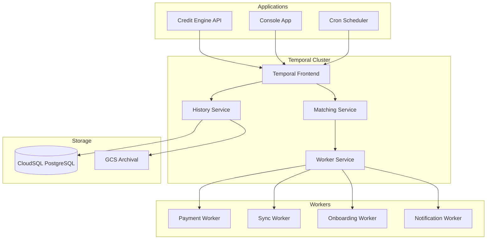

# Temporal Workflows

## Overview

Temporal provides durable workflow execution for the Earna AI platform, ensuring reliable processing of financial operations, data synchronization, and complex business logic. Our Temporal deployment handles mission-critical workflows with guaranteed completion and full observability.

## Architecture



## Deployment Configuration

### Kubernetes Resources

```yaml
# Temporal Server Deployment
apiVersion: apps/v1
kind: Deployment
metadata:
  name: temporal-server
  namespace: temporal
spec:
  replicas: 3
  selector:
    matchLabels:
      app: temporal-server
  template:
    spec:
      containers:
      - name: temporal
        image: temporalio/server:1.22.0
        env:
        - name: DB
          value: postgresql
        - name: DB_PORT
          value: "5432"
        - name: POSTGRES_HOST
          value: cloudsql-proxy.temporal.svc.cluster.local
        - name: POSTGRES_USER
          valueFrom:
            secretKeyRef:
              name: temporal-db
              key: username
        - name: POSTGRES_PWD
          valueFrom:
            secretKeyRef:
              name: temporal-db
              key: password
        resources:
          requests:
            memory: "512Mi"
            cpu: "500m"
          limits:
            memory: "1Gi"
            cpu: "1"
```

### CloudSQL Configuration

```yaml
# CloudSQL Instance
resource "google_sql_database_instance" "temporal" {
  name             = "temporal-${var.environment}"
  database_version = "POSTGRES_14"
  region          = var.region

  settings {
    tier = "db-g1-small"
    disk_size = 100
    disk_autoresize = true

    backup_configuration {
      enabled = true
      start_time = "02:00"
      point_in_time_recovery_enabled = true
      transaction_log_retention_days = 7
    }

    database_flags {
      name  = "max_connections"
      value = "200"
    }
  }
}
```

## Workflow Catalog

### 1. User Onboarding Workflow

```typescript
@workflow()
export async function userOnboardingWorkflow(userId: string): Promise<void> {
  // Step 1: Create user profile
  await activities.createUserProfile(userId)

  // Step 2: KYC verification
  const kycResult = await activities.performKYC(userId)
  if (!kycResult.approved) {
    await activities.sendKYCFailureNotification(userId)
    throw new Error("KYC verification failed")
  }

  // Step 3: Create TigerBeetle accounts
  await activities.createLedgerAccounts(userId)

  // Step 4: Initialize Plaid connection (optional)
  const plaidToken = await activities.createPlaidLinkToken(userId)

  // Step 5: Send welcome email
  await activities.sendWelcomeEmail(userId)

  // Step 6: Schedule follow-up
  await workflow.sleep(24 * 60 * 60 * 1000) // 24 hours
  await activities.sendOnboardingFollowUp(userId)
}
```

### 2. Transaction Sync Workflow

```typescript
@workflow()
export async function transactionSyncWorkflow(
  itemId: string
): Promise<SyncResult> {
  const syncState = {
    cursor: undefined as string | undefined,
    totalSynced: 0,
    hasMore: true
  }

  while (syncState.hasMore) {
    // Fetch batch of transactions
    const batch = await activities.fetchTransactionBatch(
      itemId,
      syncState.cursor
    )

    // Process transactions in parallel
    await Promise.all([
      activities.enrichTransactions(batch.transactions),
      activities.categorizeTransactions(batch.transactions),
      activities.detectAnomalies(batch.transactions)
    ])

    // Record in ledger
    await activities.recordTransactionsInLedger(batch.transactions)

    // Update state
    syncState.cursor = batch.nextCursor
    syncState.totalSynced += batch.transactions.length
    syncState.hasMore = batch.hasMore

    // Send progress update
    await activities.updateSyncProgress(itemId, syncState.totalSynced)
  }

  return { totalSynced: syncState.totalSynced }
}
```

### 3. Payment Processing Workflow

```typescript
@workflow()
export async function paymentProcessingWorkflow(
  payment: PaymentRequest
): Promise<PaymentResult> {
  // Step 1: Validate payment
  await activities.validatePayment(payment)

  // Step 2: Check balance
  const balance = await activities.checkBalance(payment.fromAccount)
  if (balance < payment.amount) {
    throw new ApplicationError("Insufficient funds")
  }

  // Step 3: Create pending transaction
  const pendingTx = await activities.createPendingTransaction(payment)

  try {
    // Step 4: Process payment
    const result = await activities.processPayment(payment)

    // Step 5: Finalize transaction
    await activities.finalizeTransaction(pendingTx.id, result)

    // Step 6: Send notifications
    await Promise.all([
      activities.sendPaymentConfirmation(payment.fromUser),
      activities.sendPaymentReceived(payment.toUser)
    ])

    return result
  } catch (error) {
    // Compensate on failure
    await activities.reverseTransaction(pendingTx.id)
    throw error
  }
}
```

### 4. Scheduled Reconciliation Workflow

```typescript
@workflow()
export async function dailyReconciliationWorkflow(): Promise<void> {
  const accounts = await activities.getAllActiveAccounts()

  // Process accounts in batches
  const batchSize = 100
  for (let i = 0; i < accounts.length; i += batchSize) {
    const batch = accounts.slice(i, i + batchSize)

    // Reconcile each batch in parallel
    await Promise.all(
      batch.map(account =>
        activities.reconcileAccount(account.id)
      )
    )

    // Rate limiting
    await workflow.sleep(1000)
  }

  // Generate reconciliation report
  const report = await activities.generateReconciliationReport()

  // Send to compliance team
  await activities.sendComplianceReport(report)
}
```

## Worker Configuration

### Worker Deployment

```typescript
// worker.ts
import { Worker } from '@temporalio/worker'
import * as activities from './activities'

async function run() {
  const worker = await Worker.create({
    workflowsPath: require.resolve('./workflows'),
    activities,
    taskQueue: 'payment-queue',
    maxConcurrentActivityTaskExecutions: 100,
    maxConcurrentWorkflowTaskExecutions: 50,
  })

  await worker.run()
}

run().catch(err => {
  console.error(err)
  process.exit(1)
})
```

### Kubernetes Worker Deployment

```yaml
apiVersion: apps/v1
kind: Deployment
metadata:
  name: temporal-worker
  namespace: temporal
spec:
  replicas: 5
  selector:
    matchLabels:
      app: temporal-worker
  template:
    spec:
      containers:
      - name: worker
        image: gcr.io/production-earna-ai/temporal-worker:latest
        env:
        - name: TEMPORAL_HOST
          value: temporal-frontend.temporal.svc.cluster.local:7233
        - name: TEMPORAL_NAMESPACE
          value: default
        - name: TASK_QUEUE
          value: payment-queue
        resources:
          requests:
            memory: "1Gi"
            cpu: "1"
          limits:
            memory: "2Gi"
            cpu: "2"
```

## Activity Implementation

### Database Activities

```typescript
export async function createUserProfile(userId: string): Promise<void> {
  const { data, error } = await supabase
    .from('user_profiles')
    .insert({
      id: userId,
      created_at: new Date().toISOString(),
      status: 'active'
    })

  if (error) throw error
}
```

### External API Activities

```typescript
export async function performKYC(userId: string): Promise<KYCResult> {
  // Implement retry logic
  return await retry(
    async () => {
      const response = await kycProvider.verify(userId)
      return response
    },
    {
      retries: 3,
      minTimeout: 1000,
      maxTimeout: 5000
    }
  )
}
```

## Error Handling

### Retry Policies

```typescript
const retryPolicy = {
  initialInterval: '1s',
  backoffCoefficient: 2,
  maximumInterval: '1m',
  maximumAttempts: 5,
  nonRetryableErrorTypes: ['ValidationError', 'InsufficientFunds']
}
```

### Compensation Logic

```typescript
@workflow()
export async function transferWorkflow(transfer: Transfer) {
  const saga = new Saga()

  try {
    // Debit source account
    saga.addCompensation(
      activities.creditAccount,
      transfer.source,
      transfer.amount
    )
    await activities.debitAccount(transfer.source, transfer.amount)

    // Credit destination account
    saga.addCompensation(
      activities.debitAccount,
      transfer.destination,
      transfer.amount
    )
    await activities.creditAccount(transfer.destination, transfer.amount)

  } catch (error) {
    // Run compensations in reverse order
    await saga.compensate()
    throw error
  }
}
```

## Monitoring & Observability

### Metrics

```yaml
# Prometheus metrics
temporal_workflow_completed_total
temporal_workflow_failed_total
temporal_workflow_execution_time_seconds
temporal_activity_execution_time_seconds
temporal_worker_task_slots_available
```

### Grafana Dashboards

- Workflow execution rates
- Activity failure rates
- Worker utilization
- Queue depths
- Execution latencies

### Temporal Web UI

Access at: `http://temporal-ui.temporal.svc.cluster.local:8080`

- Workflow execution history
- Activity details
- Error traces
- Replay debugging

## Best Practices

### 1. Idempotency
Always implement idempotent activities:
```typescript
export async function processPayment(
  payment: Payment
): Promise<Result> {
  // Check if already processed
  const existing = await getPaymentByIdempotencyKey(payment.idempotencyKey)
  if (existing) return existing

  // Process payment
  const result = await doProcessPayment(payment)

  // Store result with idempotency key
  await storePaymentResult(payment.idempotencyKey, result)

  return result
}
```

### 2. Workflow Versioning
Use workflow versioning for zero-downtime deployments:
```typescript
@workflow()
export async function versionedWorkflow() {
  const version = workflow.getVersion('payment-v2', 1, 2)

  if (version === 1) {
    // Old workflow logic
  } else {
    // New workflow logic
  }
}
```

### 3. Activity Timeouts
Always set appropriate timeouts:
```typescript
await activities.externalAPICall(data, {
  startToCloseTimeout: '30s',
  heartbeatTimeout: '5s',
  retry: retryPolicy
})
```

## Next Steps

1. [TigerBeetle Integration](/platform-services/tigerbeetle) - Financial ledger
2. [Integration Patterns](/platform-services/integration-patterns) - Best practices
3. [Monitoring](/platform-services/monitoring) - Observability setup
