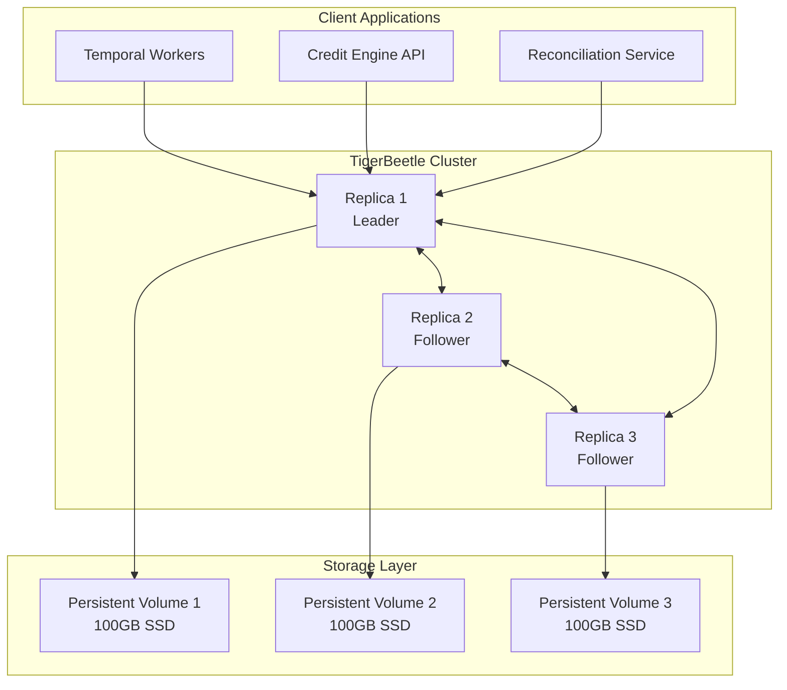

# TigerBeetle Financial Ledger

## Overview

TigerBeetle is our high-performance financial database designed specifically for accounting systems. It provides ACID-compliant double-entry bookkeeping with microsecond latency and throughput exceeding 1 million transactions per second.

## Architecture



## Deployment on GKE

### StatefulSet Configuration

```yaml
apiVersion: apps/v1
kind: StatefulSet
metadata:
  name: tigerbeetle
  namespace: tigerbeetle
spec:
  serviceName: tigerbeetle
  replicas: 3
  selector:
    matchLabels:
      app: tigerbeetle
  template:
    metadata:
      labels:
        app: tigerbeetle
    spec:
      containers:
      - name: tigerbeetle
        image: ghcr.io/tigerbeetle/tigerbeetle:0.14.0
        command: ["tigerbeetle"]
        args: ["start", "--addresses=0.0.0.0:3003", "--replica=0", "/data/cluster_0.tigerbeetle"]
        ports:
        - containerPort: 3003
          name: tb-port
        volumeMounts:
        - name: data
          mountPath: /data
        resources:
          requests:
            memory: "4Gi"
            cpu: "2"
          limits:
            memory: "8Gi"
            cpu: "4"
        livenessProbe:
          tcpSocket:
            port: 3003
          initialDelaySeconds: 30
          periodSeconds: 10
        readinessProbe:
          tcpSocket:
            port: 3003
          initialDelaySeconds: 5
          periodSeconds: 5
  volumeClaimTemplates:
  - metadata:
      name: data
    spec:
      accessModes: ["ReadWriteOnce"]
      storageClassName: "fast-ssd"
      resources:
        requests:
          storage: 100Gi
```

### Service Configuration

```yaml
apiVersion: v1
kind: Service
metadata:
  name: tigerbeetle
  namespace: tigerbeetle
spec:
  clusterIP: None
  selector:
    app: tigerbeetle
  ports:
  - port: 3003
    targetPort: 3003
```

## Account Structure

### Account Types

```typescript
enum AccountType {
  // Asset Accounts (Debit Normal)
  CASH = 1000,
  BANK_ACCOUNT = 1001,
  ACCOUNTS_RECEIVABLE = 1002,
  INVENTORY = 1003,

  // Liability Accounts (Credit Normal)
  ACCOUNTS_PAYABLE = 2000,
  LOANS_PAYABLE = 2001,
  CREDIT_CARD = 2002,

  // Equity Accounts (Credit Normal)
  OWNER_EQUITY = 3000,
  RETAINED_EARNINGS = 3001,

  // Revenue Accounts (Credit Normal)
  SALES_REVENUE = 4000,
  INTEREST_INCOME = 4001,
  FEE_INCOME = 4002,

  // Expense Accounts (Debit Normal)
  OPERATING_EXPENSES = 5000,
  INTEREST_EXPENSE = 5001,
  FEE_EXPENSE = 5002
}
```

### Account Creation

```typescript
interface Account {
  id: bigint                    // 128-bit unique identifier
  debits_pending: bigint         // Pending debit amount
  debits_posted: bigint          // Posted debit amount
  credits_pending: bigint        // Pending credit amount
  credits_posted: bigint         // Posted credit amount
  user_data_128: bigint          // User-defined data (e.g., user_id)
  user_data_64: bigint           // User-defined data (e.g., account_type)
  user_data_32: number           // User-defined data (e.g., currency)
  reserved: number               // Reserved for future use
  ledger: number                 // Ledger number (for multi-ledger)
  code: number                   // Account code/type
  flags: number                  // Account flags
  timestamp: bigint              // Nanoseconds since epoch
}

// Create user cash account
const account: Account = {
  id: generateAccountId(userId, AccountType.CASH),
  debits_pending: 0n,
  debits_posted: 0n,
  credits_pending: 0n,
  credits_posted: 0n,
  user_data_128: BigInt(userId),
  user_data_64: BigInt(AccountType.CASH),
  user_data_32: Currency.USD,
  reserved: 0,
  ledger: 1,
  code: AccountType.CASH,
  flags: AccountFlags.HISTORY,
  timestamp: BigInt(Date.now() * 1_000_000)
}

await tigerbeetle.createAccounts([account])
```

## Transaction Processing

### Transfer Structure

```typescript
interface Transfer {
  id: bigint                    // 128-bit unique identifier
  debit_account_id: bigint      // Source account
  credit_account_id: bigint     // Destination account
  amount: bigint                // Transfer amount (smallest unit)
  pending_id: bigint            // Link to pending transfer (0 if none)
  user_data_128: bigint         // Transaction reference
  user_data_64: bigint          // Category or type
  user_data_32: number          // Additional metadata
  timeout: number               // Timeout in seconds (0 = no timeout)
  ledger: number                // Ledger number
  code: number                  // Transfer type code
  flags: number                 // Transfer flags
  timestamp: bigint             // Nanoseconds since epoch
}
```

### Transaction Examples

#### 1. Simple Payment

```typescript
async function processPayment(
  fromUserId: string,
  toUserId: string,
  amount: number,
  currency: Currency
): Promise<void> {
  const transfer: Transfer = {
    id: generateTransferId(),
    debit_account_id: getAccountId(fromUserId, AccountType.CASH),
    credit_account_id: getAccountId(toUserId, AccountType.CASH),
    amount: BigInt(Math.round(amount * 100)), // Convert to cents
    pending_id: 0n,
    user_data_128: BigInt(generateReference()),
    user_data_64: BigInt(TransferType.PAYMENT),
    user_data_32: currency,
    timeout: 0,
    ledger: 1,
    code: TransferCode.PAYMENT,
    flags: 0,
    timestamp: BigInt(Date.now() * 1_000_000)
  }

  const result = await tigerbeetle.createTransfers([transfer])

  if (result[0]?.error) {
    throw new Error(`Transfer failed: ${result[0].error}`)
  }
}
```

#### 2. Two-Phase Commit (Pending)

```typescript
async function createPendingTransfer(
  fromAccount: bigint,
  toAccount: bigint,
  amount: bigint
): Promise<bigint> {
  const pendingId = generateTransferId()

  // Create pending transfer
  const pending: Transfer = {
    id: pendingId,
    debit_account_id: fromAccount,
    credit_account_id: toAccount,
    amount: amount,
    pending_id: 0n,
    user_data_128: 0n,
    user_data_64: 0n,
    user_data_32: 0,
    timeout: 300, // 5 minute timeout
    ledger: 1,
    code: TransferCode.PENDING,
    flags: TransferFlags.PENDING,
    timestamp: BigInt(Date.now() * 1_000_000)
  }

  await tigerbeetle.createTransfers([pending])
  return pendingId
}

async function commitPendingTransfer(pendingId: bigint): Promise<void> {
  // Post the pending transfer
  const commit: Transfer = {
    id: generateTransferId(),
    debit_account_id: 0n, // Not used for posting
    credit_account_id: 0n, // Not used for posting
    amount: 0n, // Not used for posting
    pending_id: pendingId, // Reference to pending transfer
    user_data_128: 0n,
    user_data_64: 0n,
    user_data_32: 0,
    timeout: 0,
    ledger: 1,
    code: TransferCode.COMMIT,
    flags: TransferFlags.POST_PENDING_TRANSFER,
    timestamp: BigInt(Date.now() * 1_000_000)
  }

  await tigerbeetle.createTransfers([commit])
}

async function voidPendingTransfer(pendingId: bigint): Promise<void> {
  // Void the pending transfer
  const void_transfer: Transfer = {
    id: generateTransferId(),
    debit_account_id: 0n,
    credit_account_id: 0n,
    amount: 0n,
    pending_id: pendingId,
    user_data_128: 0n,
    user_data_64: 0n,
    user_data_32: 0,
    timeout: 0,
    ledger: 1,
    code: TransferCode.VOID,
    flags: TransferFlags.VOID_PENDING_TRANSFER,
    timestamp: BigInt(Date.now() * 1_000_000)
  }

  await tigerbeetle.createTransfers([void_transfer])
}
```

#### 3. Batch Processing

```typescript
async function processBatchTransfers(
  transfers: TransferRequest[]
): Promise<void> {
  // Convert to TigerBeetle transfers
  const tbTransfers: Transfer[] = transfers.map(t => ({
    id: generateTransferId(),
    debit_account_id: t.fromAccount,
    credit_account_id: t.toAccount,
    amount: BigInt(t.amount),
    pending_id: 0n,
    user_data_128: BigInt(t.reference),
    user_data_64: BigInt(t.category),
    user_data_32: t.currency,
    timeout: 0,
    ledger: 1,
    code: t.type,
    flags: 0,
    timestamp: BigInt(Date.now() * 1_000_000)
  }))

  // Process in batches of 8000 (TigerBeetle limit)
  const batchSize = 8000
  for (let i = 0; i < tbTransfers.length; i += batchSize) {
    const batch = tbTransfers.slice(i, i + batchSize)
    const results = await tigerbeetle.createTransfers(batch)

    // Check for errors
    results.forEach((result, index) => {
      if (result.error) {
        console.error(`Transfer ${i + index} failed:`, result.error)
      }
    })
  }
}
```

## Querying & Reporting

### Account Balances

```typescript
async function getAccountBalance(accountId: bigint): Promise<Balance> {
  const accounts = await tigerbeetle.lookupAccounts([accountId])

  if (!accounts[0]) {
    throw new Error('Account not found')
  }

  const account = accounts[0]

  return {
    available: Number(account.credits_posted - account.debits_posted) / 100,
    pending: Number(account.credits_pending - account.debits_pending) / 100,
    total: Number(
      (account.credits_posted + account.credits_pending) -
      (account.debits_posted + account.debits_pending)
    ) / 100
  }
}
```

### Transaction History

```typescript
async function getTransactionHistory(
  accountId: bigint,
  limit: number = 100
): Promise<Transaction[]> {
  // Note: TigerBeetle doesn't have built-in history queries
  // You need to maintain a separate index or use event sourcing

  // Option 1: Query from event log
  const events = await queryEventLog(accountId, limit)

  // Option 2: Query from indexed database
  const transactions = await db.query(
    'SELECT * FROM transactions WHERE account_id = $1 ORDER BY timestamp DESC LIMIT $2',
    [accountId, limit]
  )

  return transactions
}
```

## Performance Optimization

### Connection Pooling

```typescript
class TigerBeetlePool {
  private clients: TigerBeetleClient[] = []
  private currentIndex = 0

  constructor(
    private config: Config,
    private poolSize: number = 10
  ) {
    for (let i = 0; i < poolSize; i++) {
      this.clients.push(
        createClient({
          cluster_id: config.clusterId,
          addresses: config.addresses
        })
      )
    }
  }

  getClient(): TigerBeetleClient {
    const client = this.clients[this.currentIndex]
    this.currentIndex = (this.currentIndex + 1) % this.poolSize
    return client
  }

  async close(): Promise<void> {
    await Promise.all(this.clients.map(c => c.close()))
  }
}
```

### Batch Optimization

```typescript
class TransferBatcher {
  private queue: Transfer[] = []
  private timer: NodeJS.Timeout | null = null

  constructor(
    private client: TigerBeetleClient,
    private batchSize: number = 1000,
    private flushInterval: number = 100 // ms
  ) {}

  async add(transfer: Transfer): Promise<void> {
    this.queue.push(transfer)

    if (this.queue.length >= this.batchSize) {
      await this.flush()
    } else if (!this.timer) {
      this.timer = setTimeout(() => this.flush(), this.flushInterval)
    }
  }

  private async flush(): Promise<void> {
    if (this.timer) {
      clearTimeout(this.timer)
      this.timer = null
    }

    if (this.queue.length === 0) return

    const batch = this.queue.splice(0, this.batchSize)
    await this.client.createTransfers(batch)
  }
}
```

## Monitoring & Maintenance

### Health Checks

```typescript
async function healthCheck(): Promise<HealthStatus> {
  try {
    // Try to lookup a known system account
    const systemAccountId = 0n
    const accounts = await tigerbeetle.lookupAccounts([systemAccountId])

    return {
      status: 'healthy',
      latency: Date.now() - start,
      replicas: 3,
      version: '0.14.0'
    }
  } catch (error) {
    return {
      status: 'unhealthy',
      error: error.message
    }
  }
}
```

### Metrics

```yaml
# Prometheus metrics
tigerbeetle_transfers_total
tigerbeetle_accounts_total
tigerbeetle_transfer_latency_seconds
tigerbeetle_batch_size
tigerbeetle_replica_status
```

## Best Practices

### 1. ID Generation
Use deterministic IDs for idempotency:
```typescript
function generateTransferId(
  userId: string,
  timestamp: number,
  nonce: number
): bigint {
  const hash = crypto.createHash('sha256')
  hash.update(`${userId}-${timestamp}-${nonce}`)
  const buffer = hash.digest()
  return BigInt('0x' + buffer.subarray(0, 16).toString('hex'))
}
```

### 2. Error Handling
Always check batch results:
```typescript
const results = await tigerbeetle.createTransfers(transfers)
results.forEach((result, index) => {
  if (result.error) {
    switch (result.error) {
      case 'account_not_found':
        // Handle missing account
        break
      case 'insufficient_funds':
        // Handle insufficient balance
        break
      default:
        // Log unexpected error
        console.error(`Transfer ${index} failed:`, result.error)
    }
  }
})
```

### 3. Reconciliation
Implement daily reconciliation:
```typescript
async function reconcile(): Promise<void> {
  // Sum all account balances
  const tbTotal = await sumAllAccountBalances()

  // Compare with external system
  const externalTotal = await getExternalSystemTotal()

  if (tbTotal !== externalTotal) {
    await alertFinanceTeam({
      tigerbeetleTotal: tbTotal,
      externalTotal: externalTotal,
      difference: tbTotal - externalTotal
    })
  }
}
```

## Next Steps

1. [Integration Patterns](/platform-services/integration-patterns) - Best practices
2. [Real-Time Sync](/platform-services/real-time-sync) - Event processing
3. [Monitoring](/platform-services/monitoring) - Observability setup
