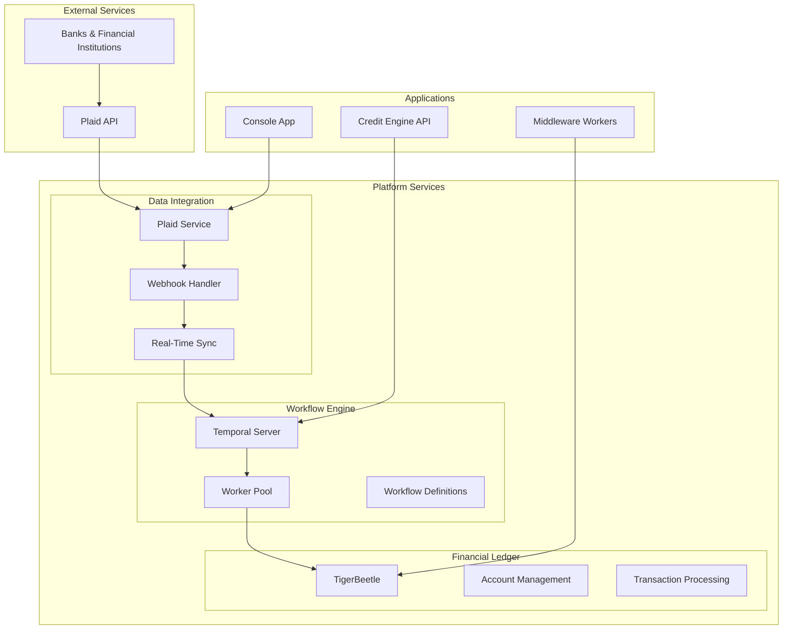

# Platform Services

## Overview

The Platform Services layer provides the core financial infrastructure and workflow orchestration capabilities for the REFLEKT platform. This architecture enables real-time financial data processing, transaction management, and scalable workflow automation.

## Architecture

## Key Components

### 1. Plaid Integration
- **Bank Connectivity**: Connect to 12,000+ financial institutions
- **Real-Time Updates**: Webhook-based transaction syncing
- **Account Aggregation**: Unified view of all connected accounts
- **Transaction Enrichment**: Categorized and enriched transaction data

### 2. Temporal Workflows
- **Workflow Orchestration**: Reliable distributed workflow execution
- **Activity Management**: Scalable worker pools for parallel processing
- **Error Handling**: Built-in retry logic and compensation
- **Event Sourcing**: Complete audit trail of all operations

### 3. TigerBeetle Ledger
- **Double-Entry Accounting**: ACID-compliant financial transactions
- **High Performance**: 1M+ TPS with microsecond latency
- **Multi-Currency**: Native support for multiple currencies
- **Audit Trail**: Immutable transaction history

## Service Dependencies

| Service | Depends On | Purpose |
|---------|-----------|---------|
| Plaid Service | Supabase, Encryption Keys | Bank connectivity & data fetching |
| Temporal Workers | Temporal Server, CloudSQL | Workflow execution |
| TigerBeetle | GKE Cluster, Persistent Storage | Financial ledger |
| Webhook Handler | Plaid, Temporal | Real-time data updates |

## Deployment Architecture

### Kubernetes (GKE)
- **Cluster**: platform-production (Autopilot)
- **Namespaces**:
  - `temporal` - Workflow orchestration
  - `tigerbeetle` - Financial ledger
  - `plaid-workers` - Data sync workers
- **Network**: 10.10.0.0/24 subnet

### Data Storage
- **CloudSQL**: Temporal persistence (PostgreSQL)
- **Supabase**: Application data & encrypted tokens
- **TigerBeetle**: Financial transactions
- **GCS**: Backups and audit logs

## Integration Points

### Console Application
- Plaid Link integration for bank connections
- Real-time balance and transaction updates
- Account management interface

### Credit Engine API
- Transaction data analysis
- Credit scoring workflows
- Risk assessment pipelines

### Middleware Workers
- Background data synchronization
- Scheduled reconciliation
- Notification processing

## Monitoring & Operations

### Health Checks
- Service availability monitoring
- Database connection pools
- API rate limit tracking

### Metrics
- Transaction processing latency
- Workflow execution times
- API call success rates
- Data sync freshness

### Alerts
- Failed bank connections
- Sync delays > 5 minutes
- Workflow failures
- Ledger imbalances

## Security Considerations

### Data Encryption
- AES-256-CBC for token encryption
- TLS 1.3 for all API communications
- Encrypted at-rest storage

### Access Control
- Service account authentication
- Row-level security in Supabase
- Kubernetes RBAC policies

### Compliance
- PCI DSS for payment data
- SOC 2 Type II certification
- PIPEDA compliance (Canada)

## Next Steps

Explore the detailed documentation for each component:

1. [Plaid Integration](/platform-services/plaid) - Bank connectivity and real-time sync
2. [Temporal Workflows](/platform-services/temporal) - Workflow orchestration
3. [TigerBeetle Ledger](/platform-services/tigerbeetle) - Financial transaction processing
4. [Integration Patterns](/platform-services/integration-patterns) - Best practices
5. [Real-Time Data Sync](/platform-services/real-time-sync) - Webhook processing
6. [Monitoring & Operations](/platform-services/monitoring) - Observability
