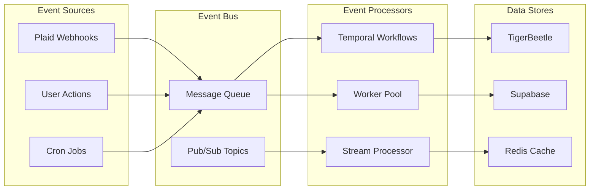

# Integration Patterns

## Overview

This guide outlines best practices and patterns for integrating the various platform services to build reliable, scalable financial applications.

## Service Communication Patterns

### 1. Event-Driven Architecture



### Implementation Example

```typescript
// Event publisher
class EventPublisher {
  async publish(event: DomainEvent): Promise<void> {
    // Add to queue for processing
    await queue.send({
      type: event.type,
      payload: event.payload,
      metadata: {
        timestamp: Date.now(),
        correlationId: generateId(),
        source: event.source
      }
    })

    // Also publish to topic for subscribers
    await pubsub.publish(event.type, event)
  }
}

// Event handler
class TransactionEventHandler {
  @subscribe('transaction.created')
  async handleTransactionCreated(event: TransactionCreatedEvent) {
    // Start Temporal workflow
    await temporalClient.start(processTransactionWorkflow, {
      args: [event.payload],
      taskQueue: 'transaction-processing',
      workflowId: `transaction-${event.payload.id}`
    })
  }

  @subscribe('transaction.updated')
  async handleTransactionUpdated(event: TransactionUpdatedEvent) {
    // Update cache
    await cache.set(`transaction:${event.payload.id}`, event.payload)

    // Update search index
    await searchIndex.update(event.payload)
  }
}
```

## Data Consistency Patterns

### 1. Saga Pattern for Distributed Transactions

```typescript
@workflow()
export async function paymentSaga(payment: PaymentRequest) {
  const saga = new SagaBuilder()

  // Step 1: Reserve funds
  const reservation = await saga.step(
    'reserve-funds',
    async () => activities.reserveFunds(payment.from, payment.amount),
    async () => activities.releaseFunds(payment.from, payment.amount)
  )

  // Step 2: Create pending transfer in TigerBeetle
  const pendingTransfer = await saga.step(
    'create-pending',
    async () => activities.createPendingTransfer(payment),
    async (transferId) => activities.voidTransfer(transferId)
  )

  // Step 3: Process external payment
  const externalResult = await saga.step(
    'process-external',
    async () => activities.processExternalPayment(payment),
    async (paymentId) => activities.reverseExternalPayment(paymentId)
  )

  // Step 4: Commit transfer
  await saga.step(
    'commit-transfer',
    async () => activities.commitTransfer(pendingTransfer.id),
    async () => activities.voidTransfer(pendingTransfer.id)
  )

  // Step 5: Update user balance
  await saga.step(
    'update-balance',
    async () => activities.updateUserBalance(payment.from),
    async () => activities.revertUserBalance(payment.from)
  )

  return { success: true, transactionId: pendingTransfer.id }
}
```

### 2. Event Sourcing with TigerBeetle

```typescript
class LedgerEventStore {
  async append(event: LedgerEvent): Promise<void> {
    // Store event in TigerBeetle as a transfer
    const transfer: Transfer = {
      id: generateEventId(event),
      debit_account_id: EVENT_LOG_ACCOUNT,
      credit_account_id: EVENT_LOG_ACCOUNT,
      amount: 0n, // Events don't affect balance
      pending_id: 0n,
      user_data_128: BigInt(event.aggregateId),
      user_data_64: BigInt(event.eventType),
      user_data_32: event.version,
      timeout: 0,
      ledger: EVENT_LEDGER,
      code: event.eventType,
      flags: EVENT_FLAG,
      timestamp: BigInt(event.timestamp)
    }

    await tigerbeetle.createTransfers([transfer])

    // Also store in queryable database
    await supabase.from('ledger_events').insert({
      aggregate_id: event.aggregateId,
      event_type: event.eventType,
      payload: event.payload,
      version: event.version,
      timestamp: event.timestamp
    })
  }

  async getEvents(aggregateId: string): Promise<LedgerEvent[]> {
    const { data } = await supabase
      .from('ledger_events')
      .select('*')
      .eq('aggregate_id', aggregateId)
      .order('version', { ascending: true })

    return data
  }
}
```

## API Gateway Patterns

### 1. Rate Limiting and Throttling

```typescript
class RateLimiter {
  private limits = new Map<string, TokenBucket>()

  async checkLimit(userId: string, operation: string): Promise<boolean> {
    const key = `${userId}:${operation}`

    if (!this.limits.has(key)) {
      this.limits.set(key, new TokenBucket({
        capacity: 100,
        refillRate: 10,
        refillInterval: 1000
      }))
    }

    const bucket = this.limits.get(key)!
    return bucket.tryConsume(1)
  }
}

// API endpoint with rate limiting
app.post('/api/transfer', async (req, res) => {
  const userId = req.user.id

  // Check rate limit
  if (!await rateLimiter.checkLimit(userId, 'transfer')) {
    return res.status(429).json({
      error: 'Rate limit exceeded',
      retryAfter: 60
    })
  }

  // Process transfer
  const result = await processTransfer(req.body)
  res.json(result)
})
```

### 2. Circuit Breaker Pattern

```typescript
class CircuitBreaker {
  private state: 'closed' | 'open' | 'half-open' = 'closed'
  private failures = 0
  private successCount = 0
  private lastFailureTime?: number

  constructor(
    private threshold = 5,
    private timeout = 60000,
    private halfOpenRequests = 3
  ) {}

  async execute<T>(fn: () => Promise<T>): Promise<T> {
    if (this.state === 'open') {
      if (Date.now() - this.lastFailureTime! > this.timeout) {
        this.state = 'half-open'
        this.successCount = 0
      } else {
        throw new Error('Circuit breaker is open')
      }
    }

    try {
      const result = await fn()

      if (this.state === 'half-open') {
        this.successCount++
        if (this.successCount >= this.halfOpenRequests) {
          this.state = 'closed'
          this.failures = 0
        }
      }

      return result
    } catch (error) {
      this.failures++
      this.lastFailureTime = Date.now()

      if (this.failures >= this.threshold) {
        this.state = 'open'
      }

      throw error
    }
  }
}

// Usage with Plaid API
const plaidBreaker = new CircuitBreaker()

async function fetchAccounts(accessToken: string) {
  return plaidBreaker.execute(async () => {
    return await plaidClient.accountsGet({
      access_token: accessToken
    })
  })
}
```

## Caching Strategies

### 1. Multi-Layer Caching

```typescript
class MultiLayerCache {
  constructor(
    private l1: MemoryCache,  // In-memory cache
    private l2: RedisCache,    // Redis cache
    private l3: CDNCache       // CDN edge cache
  ) {}

  async get<T>(key: string): Promise<T | null> {
    // Check L1 (memory)
    let value = await this.l1.get<T>(key)
    if (value) return value

    // Check L2 (Redis)
    value = await this.l2.get<T>(key)
    if (value) {
      await this.l1.set(key, value, 60) // Populate L1
      return value
    }

    // Check L3 (CDN)
    value = await this.l3.get<T>(key)
    if (value) {
      await this.l2.set(key, value, 300) // Populate L2
      await this.l1.set(key, value, 60)  // Populate L1
      return value
    }

    return null
  }

  async set<T>(key: string, value: T, ttl?: number): Promise<void> {
    // Write through all layers
    await Promise.all([
      this.l1.set(key, value, ttl || 60),
      this.l2.set(key, value, ttl || 300),
      this.l3.set(key, value, ttl || 3600)
    ])
  }

  async invalidate(pattern: string): Promise<void> {
    // Invalidate across all layers
    await Promise.all([
      this.l1.invalidate(pattern),
      this.l2.invalidate(pattern),
      this.l3.invalidate(pattern)
    ])
  }
}
```

### 2. Cache-Aside Pattern with Refresh

```typescript
class AccountBalanceCache {
  constructor(
    private cache: RedisCache,
    private ttl = 30 // seconds
  ) {}

  async getBalance(accountId: string): Promise<Balance> {
    const cacheKey = `balance:${accountId}`

    // Try cache first
    const cached = await this.cache.get<Balance>(cacheKey)
    if (cached) {
      // Async refresh if close to expiry
      const ttl = await this.cache.ttl(cacheKey)
      if (ttl < 10) {
        this.refreshBalance(accountId) // Don't await
      }
      return cached
    }

    // Cache miss - fetch from source
    const balance = await this.fetchBalance(accountId)
    await this.cache.set(cacheKey, balance, this.ttl)

    return balance
  }

  private async fetchBalance(accountId: string): Promise<Balance> {
    // Fetch from TigerBeetle
    const account = await tigerbeetle.lookupAccounts([BigInt(accountId)])
    return calculateBalance(account[0])
  }

  private async refreshBalance(accountId: string): Promise<void> {
    try {
      const balance = await this.fetchBalance(accountId)
      await this.cache.set(`balance:${accountId}`, balance, this.ttl)
    } catch (error) {
      console.error('Failed to refresh balance:', error)
    }
  }
}
```

## Security Patterns

### 1. Secure Token Storage

```typescript
class TokenVault {
  private encryptionKey: Buffer

  constructor() {
    this.encryptionKey = Buffer.from(
      process.env.TOKEN_ENCRYPTION_KEY!,
      'hex'
    )
  }

  async store(userId: string, token: string): Promise<void> {
    // Encrypt token
    const iv = crypto.randomBytes(16)
    const cipher = crypto.createCipheriv(
      'aes-256-cbc',
      this.encryptionKey,
      iv
    )

    let encrypted = cipher.update(token, 'utf8', 'hex')
    encrypted += cipher.final('hex')

    // Store encrypted token with IV
    await supabase.from('secure_tokens').upsert({
      user_id: userId,
      encrypted_token: encrypted,
      iv: iv.toString('hex'),
      created_at: new Date().toISOString()
    })
  }

  async retrieve(userId: string): Promise<string | null> {
    // Fetch encrypted token
    const { data } = await supabase
      .from('secure_tokens')
      .select('encrypted_token, iv')
      .eq('user_id', userId)
      .single()

    if (!data) return null

    // Decrypt token
    const decipher = crypto.createDecipheriv(
      'aes-256-cbc',
      this.encryptionKey,
      Buffer.from(data.iv, 'hex')
    )

    let decrypted = decipher.update(data.encrypted_token, 'hex', 'utf8')
    decrypted += decipher.final('utf8')

    return decrypted
  }
}
```

### 2. API Authentication Middleware

```typescript
class AuthMiddleware {
  async authenticate(req: Request): Promise<User> {
    // Check multiple auth methods
    const token = this.extractToken(req)

    if (!token) {
      throw new UnauthorizedError('No authentication token')
    }

    // Verify JWT
    const payload = await this.verifyJWT(token)

    // Check token blacklist
    if (await this.isBlacklisted(token)) {
      throw new UnauthorizedError('Token has been revoked')
    }

    // Load user with permissions
    const user = await this.loadUser(payload.userId)

    // Check rate limits
    if (!await this.checkRateLimit(user.id)) {
      throw new TooManyRequestsError()
    }

    return user
  }

  private extractToken(req: Request): string | null {
    // Check Authorization header
    const authHeader = req.headers.authorization
    if (authHeader?.startsWith('Bearer ')) {
      return authHeader.substring(7)
    }

    // Check cookie
    if (req.cookies?.token) {
      return req.cookies.token
    }

    // Check query parameter (for WebSocket)
    if (req.query?.token) {
      return req.query.token as string
    }

    return null
  }
}
```

## Monitoring Integration

### 1. Distributed Tracing

```typescript
class TracingService {
  private tracer: Tracer

  constructor() {
    this.tracer = new Tracer({
      serviceName: 'platform-services',
      agentHost: process.env.JAEGER_AGENT_HOST
    })
  }

  async traceWorkflow<T>(
    name: string,
    fn: (span: Span) => Promise<T>
  ): Promise<T> {
    const span = this.tracer.startSpan(name)

    try {
      // Add context
      span.setTag('service', 'temporal')
      span.setTag('workflow', name)

      // Execute with tracing
      const result = await fn(span)

      span.setTag('success', true)
      return result
    } catch (error) {
      span.setTag('error', true)
      span.log({ event: 'error', message: error.message })
      throw error
    } finally {
      span.finish()
    }
  }
}

// Usage in workflow
await tracing.traceWorkflow('payment-processing', async (span) => {
  span.log({ event: 'validating-payment' })
  await activities.validatePayment(payment)

  span.log({ event: 'processing-payment' })
  const result = await activities.processPayment(payment)

  span.log({ event: 'updating-ledger' })
  await activities.updateLedger(result)

  return result
})
```

### 2. Metrics Aggregation

```typescript
class MetricsCollector {
  private metrics: Map<string, Metric> = new Map()

  increment(name: string, labels?: Record<string, string>): void {
    const key = this.getKey(name, labels)
    const metric = this.metrics.get(key) || new Counter(name, labels)
    metric.increment()
    this.metrics.set(key, metric)
  }

  timing(name: string, duration: number, labels?: Record<string, string>): void {
    const key = this.getKey(name, labels)
    const metric = this.metrics.get(key) || new Histogram(name, labels)
    metric.observe(duration)
    this.metrics.set(key, metric)
  }

  async flush(): Promise<void> {
    const batch = Array.from(this.metrics.values()).map(m => m.toJSON())

    await fetch(process.env.METRICS_ENDPOINT!, {
      method: 'POST',
      headers: { 'Content-Type': 'application/json' },
      body: JSON.stringify(batch)
    })

    this.metrics.clear()
  }
}

// Usage
const metrics = new MetricsCollector()

// Track API calls
metrics.increment('api_calls_total', { endpoint: '/transfer', method: 'POST' })

// Track timing
const start = Date.now()
await processTransfer()
metrics.timing('transfer_duration_ms', Date.now() - start, { type: 'payment' })
```

## Next Steps

1. [Real-Time Data Sync](/platform-services/real-time-sync) - Webhook processing
2. [Monitoring & Operations](/platform-services/monitoring) - Observability
3. [Security Best Practices](/security) - Security patterns
