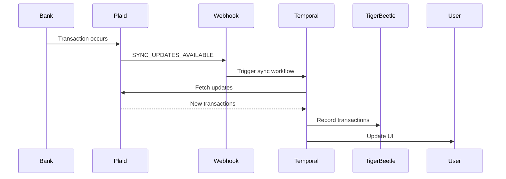

# Plaid Integration

## Overview

Plaid provides secure bank connectivity and real-time financial data synchronization for the REFLEKT platform. Our integration supports connections to over 12,000 financial institutions across the US and Canada, enabling real-time balance updates, transaction syncing, and account verification.

## Core Capabilities

### Bank Connectivity
- **Coverage**: 12,000+ financial institutions
- **Regions**: United States and Canada
- **Account Types**: Checking, Savings, Credit Cards, Loans, Investments
- **Authentication**: OAuth, MFA support, biometric authentication

### Real-Time Data Synchronization

#### Webhook-Based Updates


#### Sync Frequency
- **Real-time**: Webhooks fire within seconds of bank updates
- **Automatic Refresh**: 1-4 times daily (varies by institution)
- **Manual Refresh**: On-demand via API
- **Initial Sync**: Up to 2 years of historical data

### Data Types

#### Accounts
- Account balances (available, current, limit)
- Account metadata (name, type, subtype)
- Account numbers and routing (with Auth product)
- Real-time balance updates

#### Transactions
- Transaction details (amount, date, description)
- Merchant information
- Category classification
- Location data
- Pending vs posted status

## Supported Financial Institutions

### Major US Banks
- **Bank of America**: Full support, real-time updates
- **Chase**: Full support, OAuth authentication
- **Wells Fargo**: Full support, enhanced security
- **Citibank**: Full support, instant verification
- **US Bank**: Full support, real-time sync
- **PNC Bank**: Full support
- **Capital One**: OAuth, real-time updates
- **TD Bank**: Full US account support

### Major Canadian Banks
- **Royal Bank of Canada (RBC)**: Full support
- **Toronto-Dominion (TD)**: Canadian accounts
- **Bank of Nova Scotia (Scotiabank)**: Full support
- **Bank of Montreal (BMO)**: Full support
- **Canadian Imperial Bank (CIBC)**: Full support
- **National Bank of Canada**: Full support
- **Desjardins**: Quebec credit unions
- **Tangerine**: Digital banking support

### Credit Card Providers
- **American Express**: Direct integration
- **Discover**: Full transaction history
- **Mastercard**: Via issuing banks
- **Visa**: Via issuing banks

### Digital Banks & Fintechs
- **Chime**: Full support
- **Ally Bank**: Online banking
- **Marcus by Goldman Sachs**: Savings/CDs
- **SoFi**: Banking and investments
- **Varo**: Digital banking
- **Current**: Teen banking

### Investment Platforms
- **Robinhood**: Trading accounts
- **Fidelity**: Investment accounts
- **Charles Schwab**: Brokerage
- **Vanguard**: Retirement accounts
- **E*TRADE**: Trading platform

## Implementation Architecture

### Environment Configuration

```typescript
// Environment Variables
PLAID_CLIENT_ID=                    // Your Plaid client ID
PLAID_SECRET=                        // Your Plaid secret key
NEXT_PUBLIC_PLAID_ENV=production    // sandbox/development/production
PLAID_PRODUCTS=accounts,transactions,auth
PLAID_COUNTRY_CODES=US,CA
TOKEN_ENCRYPTION_KEY=               // 32-byte hex for token encryption
```

### Token Management

```typescript
// Secure token storage with AES-256-CBC encryption
interface PlaidConnection {
  id: string
  user_id: string
  institution_name: string
  access_token: string  // Encrypted
  item_id: string
  cursor?: string       // For transaction sync
  last_sync: Date
}
```

### API Endpoints

| Endpoint | Method | Purpose |
|----------|--------|---------|
| `/api/plaid/create-link-token` | POST | Initialize Plaid Link |
| `/api/plaid/exchange-token` | POST | Exchange public token |
| `/api/plaid/accounts` | GET | Fetch user accounts |
| `/api/plaid/transactions` | GET | Retrieve transactions |
| `/api/plaid/webhook` | POST | Handle Plaid webhooks |
| `/api/plaid/refresh` | POST | Manual balance refresh |
| `/api/plaid/sync` | POST | Incremental transaction sync |

## Real-Time Synchronization

### Webhook Events

#### Transaction Updates
```typescript
// SYNC_UPDATES_AVAILABLE webhook
{
  webhook_type: "TRANSACTIONS",
  webhook_code: "SYNC_UPDATES_AVAILABLE",
  item_id: "item_xxxx",
  initial_update_complete: true,
  historical_update_complete: true
}
```

#### Error Handling
```typescript
// ITEM_ERROR webhook
{
  webhook_type: "ITEM",
  webhook_code: "ERROR",
  item_id: "item_xxxx",
  error: {
    error_code: "ITEM_LOGIN_REQUIRED",
    error_message: "User needs to re-authenticate"
  }
}
```

### Incremental Sync Process

```typescript
async function syncTransactions(itemId: string) {
  const connection = await getPlaidConnection(itemId)

  // Use cursor for incremental updates
  const response = await plaidClient.transactionsSync({
    access_token: decrypt(connection.access_token),
    cursor: connection.cursor || undefined,
    count: 500
  })

  // Process new, modified, and removed transactions
  for (const transaction of response.added) {
    await processNewTransaction(transaction)
  }

  for (const transaction of response.modified) {
    await updateTransaction(transaction)
  }

  for (const transactionId of response.removed) {
    await removeTransaction(transactionId)
  }

  // Update cursor for next sync
  await updateCursor(itemId, response.next_cursor)

  // Check if more data available
  if (response.has_more) {
    await syncTransactions(itemId) // Recursive call
  }
}
```

## Middleware Integration

### Temporal Workflows

```typescript
// Transaction sync workflow
@workflow()
export async function transactionSyncWorkflow(itemId: string) {
  // Fetch latest transactions
  const transactions = await activities.fetchTransactions(itemId)

  // Enrich transaction data
  const enriched = await activities.enrichTransactions(transactions)

  // Record in TigerBeetle
  await activities.recordInLedger(enriched)

  // Update user balance
  await activities.updateUserBalance(itemId)

  // Send notifications if needed
  await activities.notifyUser(itemId, transactions)
}
```

### TigerBeetle Integration

```typescript
// Record transaction in ledger
async function recordTransaction(transaction: PlaidTransaction) {
  const transfer = {
    id: generateId(),
    debit_account_id: getAccountId(transaction.account_id),
    credit_account_id: getMerchantAccount(transaction.merchant_name),
    amount: Math.abs(transaction.amount * 100), // Convert to cents
    pending_id: transaction.pending ? generatePendingId() : 0,
    user_data_128: transaction.transaction_id,
    user_data_64: transaction.category_id,
    user_data_32: transaction.date,
    timeout: 0,
    ledger: 1,
    code: getTransactionCode(transaction.category),
    flags: transaction.pending ? PENDING_FLAG : 0,
    timestamp: Date.now()
  }

  await tigerbeetle.createTransfers([transfer])
}
```

## Security & Compliance

### Token Encryption
- AES-256-CBC encryption for all access tokens
- Secure key storage in environment variables
- Regular key rotation procedures

### Data Privacy
- No storage of banking credentials
- Encrypted token storage
- Row-level security in database
- PCI DSS compliance

### Error Recovery
- Automatic retry with exponential backoff
- Item re-authentication flow
- Webhook signature verification
- Idempotent request handling

## Production Considerations

### Rate Limits
- **Development**: 8,000 requests/day
- **Production**: Varies by plan (typically 100,000+/day)
- **Webhook**: No limits
- **Sync API**: Optimized for incremental updates

### Best Practices

1. **Use Incremental Sync**
   - Reduces API calls
   - Faster updates
   - Lower latency

2. **Implement Webhook Handlers**
   - Real-time updates
   - Reduced polling
   - Better user experience

3. **Handle Errors Gracefully**
   - Item re-authentication
   - Temporary failures
   - Rate limit handling

4. **Optimize Data Storage**
   - Store only needed fields
   - Archive old transactions
   - Index for query performance

## Monitoring & Debugging

### Key Metrics
- Webhook delivery success rate
- Average sync latency
- Token refresh frequency
- API error rates

### Common Issues

| Issue | Cause | Solution |
|-------|-------|----------|
| Token decryption failed | Key mismatch | Verify encryption keys match |
| Webhook not received | URL not accessible | Check firewall/security groups |
| Sync delays | Rate limiting | Implement backoff strategy |
| Missing transactions | Cursor not updated | Ensure cursor persistence |

## Next Steps

1. [Real-Time Data Sync](/platform-services/real-time-sync) - Deep dive into webhook processing
2. [Integration Patterns](/platform-services/integration-patterns) - Best practices
3. [Console Implementation](/console/plaid-integration) - Frontend integration
4. [Security Best Practices](/security/plaid-security) - Token management
