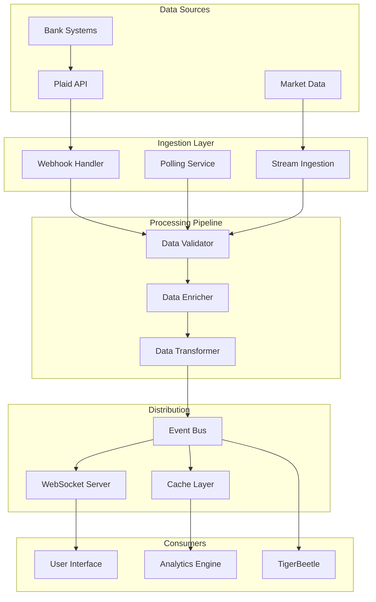

# Real-Time Data Synchronization

## Overview

Real-time data synchronization ensures that financial data remains consistent and up-to-date across all platform services. This system handles webhook processing, incremental updates, and event streaming with sub-second latency.

## Architecture



## Webhook Processing

### Plaid Webhook Handler

```typescript
// Webhook endpoint implementation
export async function POST(request: Request) {
  const body = await request.json()

  // Verify webhook signature
  const signature = request.headers.get('plaid-verification')
  if (!verifyWebhookSignature(body, signature)) {
    return new Response('Invalid signature', { status: 401 })
  }

  // Process based on webhook type
  switch (body.webhook_type) {
    case 'TRANSACTIONS':
      await handleTransactionWebhook(body)
      break
    case 'ITEM':
      await handleItemWebhook(body)
      break
    case 'ACCOUNTS':
      await handleAccountWebhook(body)
      break
    default:
      console.log('Unhandled webhook type:', body.webhook_type)
  }

  return new Response('OK', { status: 200 })
}

async function handleTransactionWebhook(webhook: TransactionWebhook) {
  switch (webhook.webhook_code) {
    case 'SYNC_UPDATES_AVAILABLE':
      // Trigger incremental sync
      await temporalClient.start(transactionSyncWorkflow, {
        args: [webhook.item_id],
        taskQueue: 'sync-queue',
        workflowId: `sync-${webhook.item_id}-${Date.now()}`
      })
      break

    case 'INITIAL_UPDATE':
      // Handle initial transaction pull
      await processInitialTransactions(webhook.item_id)
      break

    case 'HISTORICAL_UPDATE':
      // Handle historical data availability
      await processHistoricalTransactions(webhook.item_id)
      break

    case 'DEFAULT_UPDATE':
      // Handle regular updates
      await processTransactionUpdate(webhook.item_id)
      break
  }
}
```

### Webhook Reliability

```typescript
class ReliableWebhookProcessor {
  private queue: Queue
  private deadLetterQueue: Queue

  async process(webhook: Webhook): Promise<void> {
    // Add to processing queue with retry logic
    await this.queue.add('process-webhook', webhook, {
      attempts: 5,
      backoff: {
        type: 'exponential',
        delay: 1000
      },
      removeOnComplete: true,
      removeOnFail: false
    })
  }

  // Background processor
  async processWebhookJob(job: Job): Promise<void> {
    const webhook = job.data as Webhook

    try {
      // Idempotency check
      const processed = await this.checkIfProcessed(webhook.id)
      if (processed) {
        console.log(`Webhook ${webhook.id} already processed`)
        return
      }

      // Process webhook
      await this.handleWebhook(webhook)

      // Mark as processed
      await this.markAsProcessed(webhook.id)

    } catch (error) {
      console.error(`Failed to process webhook ${webhook.id}:`, error)

      // Check if max attempts reached
      if (job.attemptsMade >= job.opts.attempts!) {
        // Move to dead letter queue
        await this.deadLetterQueue.add('failed-webhook', {
          webhook,
          error: error.message,
          attempts: job.attemptsMade
        })
      }

      throw error // Trigger retry
    }
  }

  private async checkIfProcessed(webhookId: string): Promise<boolean> {
    const result = await redis.get(`webhook:processed:${webhookId}`)
    return result !== null
  }

  private async markAsProcessed(webhookId: string): Promise<void> {
    await redis.set(
      `webhook:processed:${webhookId}`,
      '1',
      'EX',
      86400 // 24 hour TTL
    )
  }
}
```

## Incremental Sync

### Transaction Sync Implementation

```typescript
class TransactionSyncService {
  async syncTransactions(itemId: string): Promise<SyncResult> {
    // Get stored cursor for incremental sync
    const connection = await this.getConnection(itemId)
    let cursor = connection.sync_cursor
    let hasMore = true
    let added = 0
    let modified = 0
    let removed = 0

    while (hasMore) {
      // Fetch incremental updates
      const response = await plaidClient.transactionsSync({
        access_token: decrypt(connection.access_token),
        cursor: cursor,
        count: 500 // Max batch size
      })

      // Process additions
      if (response.added.length > 0) {
        await this.processAddedTransactions(response.added)
        added += response.added.length
      }

      // Process modifications
      if (response.modified.length > 0) {
        await this.processModifiedTransactions(response.modified)
        modified += response.modified.length
      }

      // Process removals
      if (response.removed.length > 0) {
        await this.processRemovedTransactions(response.removed)
        removed += response.removed.length
      }

      // Update cursor and check for more data
      cursor = response.next_cursor
      hasMore = response.has_more

      // Save cursor for next sync
      await this.updateCursor(itemId, cursor)
    }

    return { added, modified, removed }
  }

  private async processAddedTransactions(transactions: Transaction[]) {
    // Batch insert new transactions
    const enriched = await this.enrichTransactions(transactions)

    // Store in database
    await supabase
      .from('transactions')
      .insert(enriched)
      .onConflict('transaction_id')
      .ignore()

    // Record in ledger
    await this.recordInLedger(enriched)

    // Emit events
    for (const transaction of enriched) {
      await this.eventBus.emit('transaction.added', transaction)
    }
  }

  private async enrichTransactions(transactions: Transaction[]) {
    return Promise.all(transactions.map(async (tx) => ({
      ...tx,
      category_confidence: await this.getCategoryConfidence(tx),
      merchant_logo: await this.getMerchantLogo(tx.merchant_name),
      enriched_at: new Date().toISOString()
    })))
  }
}
```

### Account Balance Sync

```typescript
class BalanceSyncService {
  private balanceCache: Map<string, Balance> = new Map()

  async syncBalances(itemId: string): Promise<void> {
    const connection = await this.getConnection(itemId)

    // Fetch latest balances
    const response = await plaidClient.accountsBalanceGet({
      access_token: decrypt(connection.access_token)
    })

    for (const account of response.accounts) {
      const previousBalance = this.balanceCache.get(account.account_id)
      const currentBalance = account.balances

      // Check for changes
      if (this.hasBalanceChanged(previousBalance, currentBalance)) {
        // Update cache
        this.balanceCache.set(account.account_id, currentBalance)

        // Update database
        await this.updateBalance(account.account_id, currentBalance)

        // Emit real-time update
        await this.emitBalanceUpdate(account.account_id, {
          previous: previousBalance,
          current: currentBalance,
          timestamp: Date.now()
        })
      }
    }
  }

  private hasBalanceChanged(
    previous: Balance | undefined,
    current: Balance
  ): boolean {
    if (!previous) return true

    return (
      previous.available !== current.available ||
      previous.current !== current.current ||
      previous.limit !== current.limit
    )
  }

  private async emitBalanceUpdate(
    accountId: string,
    update: BalanceUpdate
  ): Promise<void> {
    // Send to WebSocket clients
    await this.websocket.broadcast(`balance:${accountId}`, update)

    // Update cache for API responses
    await redis.set(
      `balance:${accountId}`,
      JSON.stringify(update.current),
      'EX',
      30 // 30 second TTL
    )

    // Emit event for other services
    await this.eventBus.emit('balance.updated', {
      accountId,
      ...update
    })
  }
}
```

## Real-Time Event Streaming

### WebSocket Server

```typescript
class WebSocketManager {
  private wss: WebSocketServer
  private connections: Map<string, Set<WebSocket>> = new Map()

  constructor() {
    this.wss = new WebSocketServer({ port: 8080 })
    this.setupHandlers()
  }

  private setupHandlers(): void {
    this.wss.on('connection', (ws, req) => {
      const userId = this.authenticateConnection(req)
      if (!userId) {
        ws.close(1008, 'Unauthorized')
        return
      }

      // Add to user's connections
      if (!this.connections.has(userId)) {
        this.connections.set(userId, new Set())
      }
      this.connections.get(userId)!.add(ws)

      // Setup message handlers
      ws.on('message', (data) => this.handleMessage(userId, data))

      ws.on('close', () => {
        this.connections.get(userId)?.delete(ws)
      })

      ws.on('error', (error) => {
        console.error(`WebSocket error for user ${userId}:`, error)
      })

      // Send initial state
      this.sendInitialState(userId, ws)
    })
  }

  async broadcast(userId: string, event: string, data: any): Promise<void> {
    const connections = this.connections.get(userId)
    if (!connections) return

    const message = JSON.stringify({ event, data, timestamp: Date.now() })

    for (const ws of connections) {
      if (ws.readyState === WebSocket.OPEN) {
        ws.send(message)
      }
    }
  }

  private async sendInitialState(userId: string, ws: WebSocket): Promise<void> {
    // Send current balances
    const balances = await this.getAccountBalances(userId)
    ws.send(JSON.stringify({
      event: 'initial.balances',
      data: balances
    }))

    // Send recent transactions
    const transactions = await this.getRecentTransactions(userId)
    ws.send(JSON.stringify({
      event: 'initial.transactions',
      data: transactions
    }))
  }
}
```

### Server-Sent Events (SSE)

```typescript
// SSE endpoint for clients that don't support WebSocket
export async function GET(request: Request) {
  const userId = await authenticate(request)
  if (!userId) {
    return new Response('Unauthorized', { status: 401 })
  }

  const stream = new ReadableStream({
    async start(controller) {
      // Send initial ping
      controller.enqueue(`data: ${JSON.stringify({ type: 'ping' })}\n\n`)

      // Subscribe to user events
      const subscription = eventBus.subscribe(
        `user.${userId}.*`,
        (event) => {
          controller.enqueue(
            `data: ${JSON.stringify(event)}\n\n`
          )
        }
      )

      // Keep alive with periodic pings
      const pingInterval = setInterval(() => {
        controller.enqueue(`: ping\n\n`)
      }, 30000)

      // Cleanup on close
      request.signal.addEventListener('abort', () => {
        clearInterval(pingInterval)
        subscription.unsubscribe()
      })
    }
  })

  return new Response(stream, {
    headers: {
      'Content-Type': 'text/event-stream',
      'Cache-Control': 'no-cache',
      'Connection': 'keep-alive'
    }
  })
}
```

## Data Consistency

### Conflict Resolution

```typescript
class ConflictResolver {
  async resolveTransactionConflict(
    local: Transaction,
    remote: Transaction
  ): Promise<Transaction> {
    // Use timestamp-based resolution
    if (remote.updated_at > local.updated_at) {
      return remote
    }

    // If timestamps are equal, use deterministic merge
    return {
      ...local,
      ...remote,
      amount: remote.amount, // Always use remote amount
      pending: remote.pending, // Remote pending status wins
      category: local.user_category || remote.category, // Prefer user override
      notes: this.mergeNotes(local.notes, remote.notes),
      updated_at: new Date().toISOString()
    }
  }

  private mergeNotes(local: string, remote: string): string {
    if (!local) return remote
    if (!remote) return local
    if (local === remote) return local

    // Combine both notes
    return `${local}\n---\n${remote}`
  }
}
```

### Eventual Consistency

```typescript
class EventualConsistencyManager {
  async ensureConsistency(): Promise<void> {
    // Run periodic reconciliation
    const accounts = await this.getAllAccounts()

    for (const account of accounts) {
      // Compare ledger balance with calculated balance
      const ledgerBalance = await this.getLedgerBalance(account.id)
      const calculatedBalance = await this.calculateBalance(account.id)

      if (Math.abs(ledgerBalance - calculatedBalance) > 0.01) {
        // Log discrepancy
        await this.logDiscrepancy({
          accountId: account.id,
          ledgerBalance,
          calculatedBalance,
          difference: ledgerBalance - calculatedBalance,
          timestamp: new Date()
        })

        // Trigger reconciliation workflow
        await temporalClient.start(reconciliationWorkflow, {
          args: [account.id],
          taskQueue: 'reconciliation-queue',
          workflowId: `reconcile-${account.id}-${Date.now()}`
        })
      }
    }
  }

  private async calculateBalance(accountId: string): Promise<number> {
    // Sum all transactions
    const { data } = await supabase
      .from('transactions')
      .select('amount, type')
      .eq('account_id', accountId)

    return data.reduce((balance, tx) => {
      return tx.type === 'credit'
        ? balance + tx.amount
        : balance - tx.amount
    }, 0)
  }
}
```

## Performance Optimization

### Batch Processing

```typescript
class BatchProcessor {
  private batch: any[] = []
  private timer: NodeJS.Timeout | null = null

  constructor(
    private batchSize = 100,
    private flushInterval = 1000,
    private processor: (batch: any[]) => Promise<void>
  ) {}

  async add(item: any): Promise<void> {
    this.batch.push(item)

    if (this.batch.length >= this.batchSize) {
      await this.flush()
    } else if (!this.timer) {
      this.timer = setTimeout(() => this.flush(), this.flushInterval)
    }
  }

  private async flush(): Promise<void> {
    if (this.timer) {
      clearTimeout(this.timer)
      this.timer = null
    }

    if (this.batch.length === 0) return

    const items = this.batch.splice(0, this.batchSize)
    await this.processor(items)

    // Process remaining items
    if (this.batch.length > 0) {
      await this.flush()
    }
  }
}

// Usage
const transactionBatcher = new BatchProcessor(
  100, // batch size
  1000, // flush interval
  async (transactions) => {
    // Bulk insert
    await supabase
      .from('transactions')
      .insert(transactions)
  }
)
```

### Stream Processing

```typescript
class StreamProcessor {
  async processTransactionStream(
    stream: ReadableStream<Transaction>
  ): Promise<void> {
    const reader = stream.getReader()
    const buffer: Transaction[] = []

    try {
      while (true) {
        const { done, value } = await reader.read()

        if (done) {
          // Process remaining buffer
          if (buffer.length > 0) {
            await this.processBatch(buffer)
          }
          break
        }

        buffer.push(value)

        // Process when buffer is full
        if (buffer.length >= 100) {
          await this.processBatch(buffer.splice(0, 100))
        }
      }
    } finally {
      reader.releaseLock()
    }
  }

  private async processBatch(transactions: Transaction[]): Promise<void> {
    // Parallel processing
    await Promise.all([
      this.storeTransactions(transactions),
      this.updateBalances(transactions),
      this.detectAnomalies(transactions),
      this.emitEvents(transactions)
    ])
  }
}
```

## Monitoring

### Sync Metrics

```typescript
interface SyncMetrics {
  itemId: string
  lastSyncTime: Date
  syncDuration: number
  transactionsAdded: number
  transactionsModified: number
  transactionsRemoved: number
  errors: string[]
  success: boolean
}

class SyncMonitor {
  async recordSync(metrics: SyncMetrics): Promise<void> {
    // Store metrics
    await supabase.from('sync_metrics').insert(metrics)

    // Update Prometheus metrics
    syncDurationHistogram.observe(
      { item_id: metrics.itemId },
      metrics.syncDuration
    )

    syncTransactionsCounter.inc(
      { item_id: metrics.itemId, type: 'added' },
      metrics.transactionsAdded
    )

    if (!metrics.success) {
      syncErrorsCounter.inc({ item_id: metrics.itemId })
    }

    // Alert on failures
    if (!metrics.success) {
      await this.alertOnSyncFailure(metrics)
    }
  }

  private async alertOnSyncFailure(metrics: SyncMetrics): Promise<void> {
    await notificationService.send({
      channel: 'ops-alerts',
      level: 'error',
      title: 'Sync Failed',
      message: `Sync failed for item ${metrics.itemId}: ${metrics.errors.join(', ')}`,
      metadata: metrics
    })
  }
}
```

## Next Steps

1. [Monitoring & Operations](/platform-services/monitoring) - Full observability
2. [Security Best Practices](/security) - Security implementation
3. [API Reference](/console/api-reference) - API documentation
