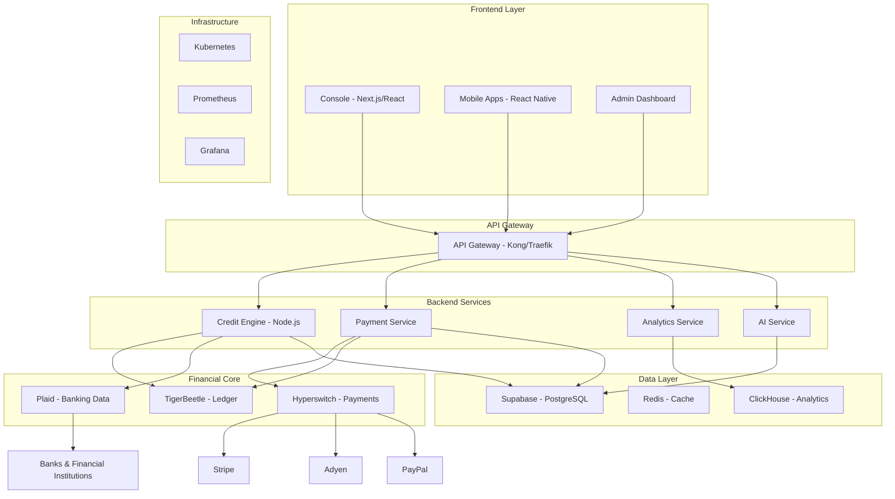
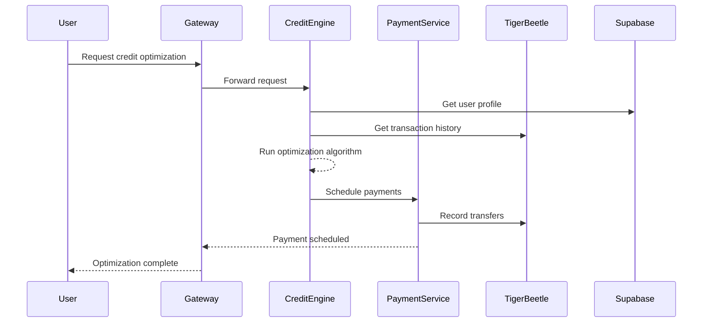
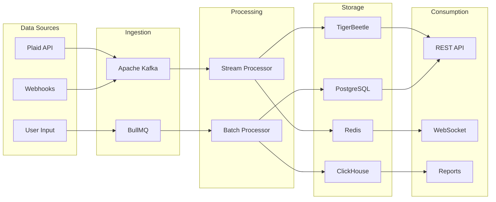
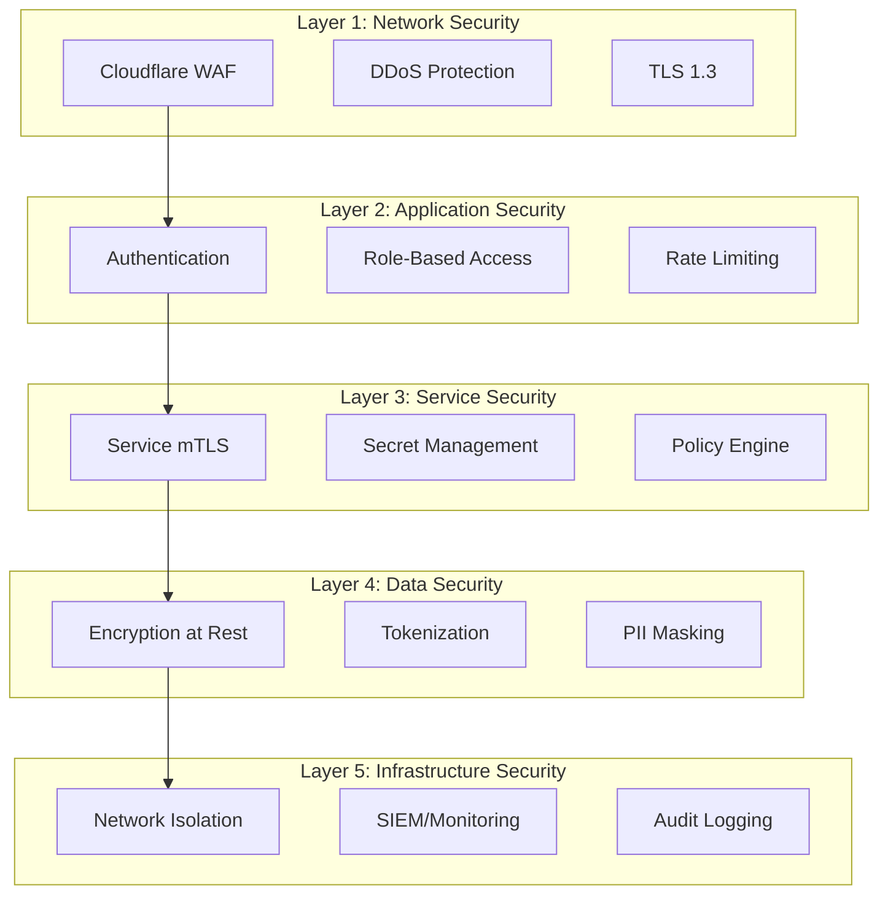
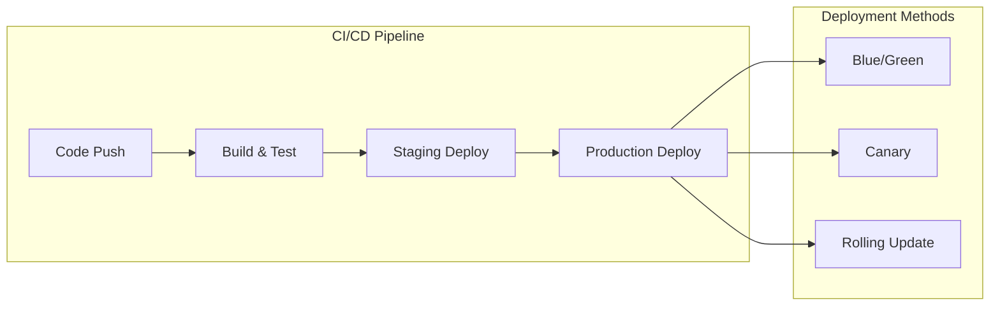

import { Tabs, Callout, Steps } from 'nextra/components'

# Architecture Overview

Earna AI's architecture is designed as a modern, microservices-based financial platform that prioritizes security, scalability, and real-time processing while leveraging open-source technologies.

## Architecture Principles

<Callout>
  **Core Principles**
  1. **Microservices Architecture** - Modular, independently scalable services
  2. **Event-Driven Design** - Real-time data processing and updates
  3. **Open Source First** - Leverage best-in-class OSS solutions
  4. **Security by Design** - Zero-trust architecture with defense in depth
  5. **API-First Development** - Everything accessible via standardized APIs
</Callout>

## High-Level Architecture



## Service Architecture

<Tabs items={['Microservices', 'Data Flow', 'Security Layers', 'Infrastructure']}>
  <Tabs.Tab>

## Microservices Design

### Service Decomposition

Each service is designed with single responsibility principle and clear domain boundaries:

#### Credit Engine Service
```yaml
Service: Credit Engine
Language: Node.js/TypeScript
Responsibilities:
  - Credit score monitoring
  - Credit optimization algorithms
  - Dispute management
  - Credit simulation

Dependencies:
  - TigerBeetle (ledger)
  - Plaid (data source)
  - Supabase (metadata)
  - Redis (caching)

APIs:
  - /api/credit/score - Get credit scores
  - /api/credit/optimize - Optimization recommendations
  - /api/credit/simulate - What-if analysis
  - /api/credit/dispute - Dispute management
```

#### Payment Service
```yaml
Service: Payment Service
Language: Node.js/TypeScript
Responsibilities:
  - Payment processing
  - Bill payments
  - Subscription management
  - Transfer operations

Dependencies:
  - Hyperswitch (payment orchestration)
  - TigerBeetle (ledger recording)
  - Redis (idempotency)

APIs:
  - /api/payments/* - Payment operations
  - /api/transfers/* - Money transfers
  - /api/bills/* - Bill payments
  - /api/subscriptions/* - Recurring payments
```

#### Analytics Service
```yaml
Service: Analytics Service
Language: Python/TypeScript
Responsibilities:
  - Data aggregation
  - ML model serving
  - Report generation
  - Real-time analytics

Dependencies:
  - ClickHouse (analytics DB)
  - TensorFlow/PyTorch (ML)
  - Apache Kafka (streaming)

APIs:
  - /api/analytics/* - Analytics queries
  - /api/insights/* - AI insights
  - /api/reports/* - Report generation
```

#### AI Service
```yaml
Service: AI Service
Language: Python
Responsibilities:
  - Natural language processing
  - Predictive modeling
  - Recommendation engine
  - Anomaly detection

Dependencies:
  - OpenAI/Anthropic APIs
  - Custom ML models
  - Vector database (Pinecone)

APIs:
  - /api/ai/chat - Conversational AI
  - /api/ai/predict - Predictions
  - /api/ai/recommend - Recommendations
```

### Service Communication



  </Tabs.Tab>

  <Tabs.Tab>

## Data Architecture

### Data Flow Patterns

#### Real-time Data Pipeline



### Data Storage Strategy

| Data Type | Primary Store | Secondary | Purpose |
|-----------|--------------|-----------|---------|
| **Financial Transactions** | TigerBeetle | ClickHouse | Immutable ledger, analytics |
| **User Profiles** | PostgreSQL | Redis | User data, cache |
| **Account Metadata** | PostgreSQL | - | Account details |
| **Session Data** | Redis | - | Active sessions |
| **Analytics** | ClickHouse | - | Time-series data |
| **Documents** | S3 | - | Tax docs, statements |
| **ML Models** | S3 | Redis | Model storage, cache |
| **Vectors** | Pinecone | - | Semantic search |

### Event Streaming Architecture

```typescript
// Event Schema
interface FinancialEvent {
  id: string
  type: 'transaction' | 'balance_update' | 'credit_change'
  timestamp: Date
  userId: string
  accountId: string
  data: Record<string, any>
  metadata: {
    source: string
    version: string
    correlation_id: string
  }
}

// Event Processing
class EventProcessor {
  async processEvent(event: FinancialEvent) {
    // Record in ledger
    await this.recordInLedger(event)

    // Update cache
    await this.updateCache(event)

    // Trigger analytics
    await this.triggerAnalytics(event)

    // Send notifications
    await this.notifySubscribers(event)
  }
}
```

### Data Consistency Model

<Steps>
### Write Path
1. Client request → API Gateway
2. Service validation → Business logic
3. TigerBeetle transaction → Immutable record
4. PostgreSQL update → Metadata
5. Cache invalidation → Redis
6. Event emission → Kafka

### Read Path
1. Check Redis cache → Fast path
2. If miss, query PostgreSQL → User data
3. Query TigerBeetle → Financial data
4. Aggregate results → Response
5. Update cache → Future reads
6. Return to client → API response
</Steps>

  </Tabs.Tab>

  <Tabs.Tab>

## Security Architecture

### Defense in Depth



### Authentication & Authorization

#### Multi-Layer Authentication
```typescript
// Authentication Flow
class AuthenticationService {
  async authenticate(request: AuthRequest): Promise<AuthResult> {
    // 1. Verify JWT token
    const token = await this.verifyJWT(request.token)

    // 2. Check session validity
    const session = await this.validateSession(token.sessionId)

    // 3. Verify MFA if required
    if (this.requiresMFA(request.resource)) {
      await this.verifyMFA(request.mfaCode)
    }

    // 4. Check permissions
    const permissions = await this.checkPermissions(
      token.userId,
      request.resource,
      request.action
    )

    // 5. Rate limit check
    await this.checkRateLimit(token.userId, request.resource)

    return {
      authorized: true,
      permissions,
      sessionId: session.id
    }
  }
}
```

#### Zero-Trust Service Mesh
```yaml
Service Communication:
  - mTLS between all services
  - Service identity verification
  - Encrypted service-to-service communication
  - Policy-based access control

Implementation:
  - Istio service mesh
  - Automatic certificate rotation
  - Traffic encryption
  - Observability and tracing
```

### Compliance & Regulations

| Compliance | Scope | Implementation |
|------------|-------|----------------|
| **PCI DSS Level 1** | Payment processing | Hyperswitch compliance |
| **SOC 2 Type II** | Security controls | Annual audit |
| **GDPR** | EU user data | Data privacy controls |
| **CCPA** | California users | Privacy rights |
| **Open Banking** | Financial data | Plaid compliance |
| **KYC/AML** | User verification | Identity verification |

### Security Monitoring

```yaml
Monitoring Stack:
  SIEM:
    - Centralized logging (ELK stack)
    - Real-time threat detection
    - Anomaly detection
    - Compliance reporting

  Threat Detection:
    - Failed authentication attempts
    - Unusual transaction patterns
    - API abuse detection
    - Data exfiltration attempts

  Incident Response:
    - Automated alerting
    - Playbook execution
    - Evidence collection
    - Post-mortem analysis
```

  </Tabs.Tab>

  <Tabs.Tab>

## Infrastructure Design

### Kubernetes Architecture

```yaml
Production Cluster:
  Control Plane:
    - 3 master nodes (HA configuration)
    - etcd cluster (distributed state)
    - API server with HA proxy

  Worker Nodes:
    - 10 nodes minimum (auto-scaling 10-50)
    - Node specifications:
      - 16 vCPUs
      - 64GB RAM
      - 500GB SSD

  Namespaces:
    - production (main services)
    - financial-core (TigerBeetle, Hyperswitch)
    - monitoring (Prometheus, Grafana)
    - ingress (API Gateway)
```

### Deployment Strategy



### Resource Allocation

```yaml
Service Resources:
  Credit Engine:
    replicas: 3-10 (HPA)
    cpu: 2000m request, 4000m limit
    memory: 4Gi request, 8Gi limit

  Payment Service:
    replicas: 3-10 (HPA)
    cpu: 2000m request, 4000m limit
    memory: 4Gi request, 8Gi limit

  Analytics Service:
    replicas: 2-5 (HPA)
    cpu: 4000m request, 8000m limit
    memory: 8Gi request, 16Gi limit

  AI Service:
    replicas: 2-5 (HPA)
    cpu: 4000m request, 8000m limit
    memory: 8Gi request, 16Gi limit
    gpu: 1 (for ML inference)
```

### High Availability Design

#### Multi-Region Architecture
```
Region: US-East-1 (Primary)
├── AZ-1
│   ├── K8s Master
│   ├── Worker Nodes
│   └── TigerBeetle Node
├── AZ-2
│   ├── K8s Master
│   ├── Worker Nodes
│   └── TigerBeetle Node
└── AZ-3
    ├── K8s Master
    ├── Worker Nodes
    └── TigerBeetle Node

Region: US-West-2 (DR)
├── Standby cluster
├── Replicated data
└── Ready for failover
```

### Monitoring & Observability

```yaml
Metrics Collection:
  Prometheus:
    - Service metrics
    - Custom business metrics
    - Infrastructure metrics
    - Alert rules

  Grafana Dashboards:
    - Service health
    - Business KPIs
    - Infrastructure status
    - Cost monitoring

Logging Architecture:
  Fluentd:
    - Log collection
    - Log parsing
    - Log forwarding

  Elasticsearch:
    - Log storage
    - Full-text search
    - Log retention (30 days)

  Kibana:
    - Log visualization
    - Dashboard creation
    - Alert configuration

Tracing:
  Jaeger:
    - Distributed tracing
    - Latency analysis
    - Dependency mapping
    - Performance bottlenecks
```

### Disaster Recovery

<Steps>
### Backup Strategy
- TigerBeetle: Continuous replication + hourly snapshots
- PostgreSQL: Daily backups with point-in-time recovery
- Redis: AOF persistence + daily snapshots
- Application state: Stored in TigerBeetle (immutable)

### Failover Process
1. Detect failure (automated monitoring)
2. Verify failure (prevent false positives)
3. Initiate failover (automated or manual)
4. Update DNS (Route53 health checks)
5. Verify services (health checks)
6. Resume operations (< 5 minutes RTO)

### Recovery Testing
- Monthly DR drills
- Chaos engineering (controlled failures)
- Backup restoration tests
- Runbook validation
</Steps>

  </Tabs.Tab>
</Tabs>

## Scalability Strategy

### Horizontal Scaling

| Component | Scaling Trigger | Scale Limit | Method |
|-----------|----------------|-------------|---------|
| API Gateway | CPU > 70% | 20 instances | HPA |
| Credit Engine | Request queue > 100 | 10 instances | HPA |
| Payment Service | CPU > 60% | 10 instances | HPA |
| TigerBeetle | Storage > 70% | 10 nodes | Manual |
| Redis | Memory > 80% | 6 nodes | Manual |
| PostgreSQL | Connections > 80% | 5 replicas | Auto |

### Performance Targets

<Callout type="info">
  **SLA Targets**
  - API Response: p95 < 200ms, p99 < 500ms
  - Transaction Processing: < 100ms
  - Database Queries: p95 < 50ms
  - Cache Hit Rate: > 90%
  - Availability: 99.99% (52 minutes/year)
</Callout>

### Capacity Planning

```yaml
Current Capacity:
  Users: 100,000 active
  Transactions/day: 10 million
  API requests/second: 5,000
  Storage: 10TB active data

Growth Projections:
  6 months: 500,000 users
  12 months: 1 million users
  24 months: 5 million users

Scaling Plan:
  Phase 1 (0-6 months):
    - Current infrastructure
    - Optimize queries
    - Improve caching

  Phase 2 (6-12 months):
    - Add read replicas
    - Implement sharding
    - CDN for static assets

  Phase 3 (12-24 months):
    - Multi-region deployment
    - Global load balancing
    - Edge computing
```

## Technology Decisions

### Build vs Buy vs Open Source

| Component | Decision | Rationale |
|-----------|----------|-----------|
| Ledger | Open Source (TigerBeetle) | Performance, reliability, cost |
| Payments | Buy (Hyperswitch) | Compliance, complexity |
| Banking Data | Buy (Plaid) | Bank relationships, compliance |
| Database | Open Source (PostgreSQL) | Flexibility, cost, community |
| Analytics | Open Source (ClickHouse) | Performance, cost |
| ML Platform | Build + Buy | Custom models + OpenAI/Anthropic |
| Monitoring | Open Source (Prometheus) | Customization, cost |

## Cost Optimization

### Infrastructure Costs (Monthly Estimate)

```yaml
Compute:
  Kubernetes Cluster: $5,000
  TigerBeetle Nodes: $2,000
  Database Instances: $3,000
  Redis Cluster: $1,000
  Total: $11,000

Storage:
  Block Storage: $1,000
  Object Storage: $500
  Backups: $500
  Total: $2,000

Network:
  Data Transfer: $1,000
  Load Balancers: $500
  CDN: $500
  Total: $2,000

Services:
  Plaid: $2,000
  Hyperswitch: $1,000
  AI APIs: $1,000
  Monitoring: $500
  Total: $4,500

Total Monthly: ~$20,000
```

### Optimization Strategies
1. **Reserved Instances**: 40% cost reduction
2. **Spot Instances**: For batch processing
3. **Auto-scaling**: Scale down during low usage
4. **Caching**: Reduce database queries
5. **CDN**: Reduce bandwidth costs

## Related Documentation

- [Implementation Phases](/roadmap/implementation-phases) - Development roadmap
- [Core Technologies](/roadmap/core-technologies) - Technology deep dive
- [Design Structure Matrix](/roadmap/design-structure-matrix) - System dependencies
- [Implementation Guide](/roadmap/implementation-guide) - Execution plan
