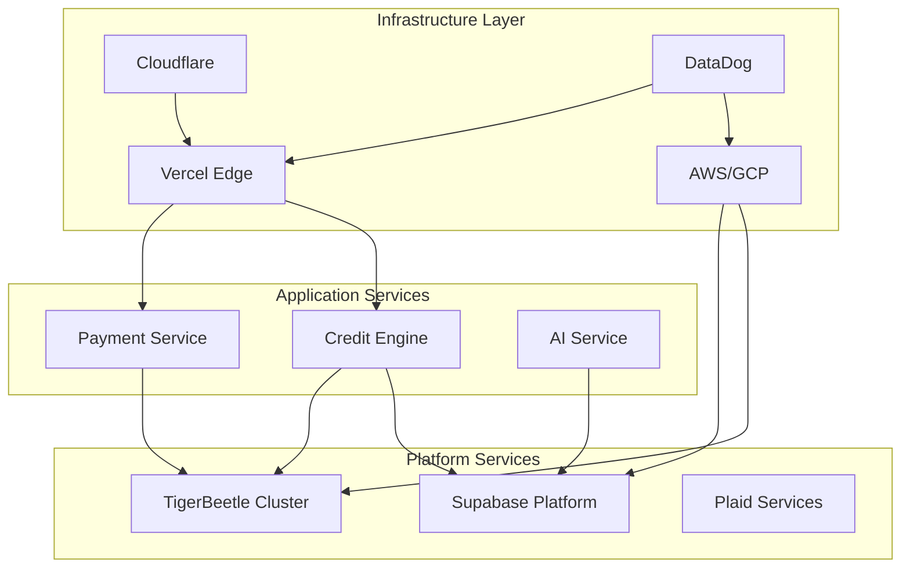
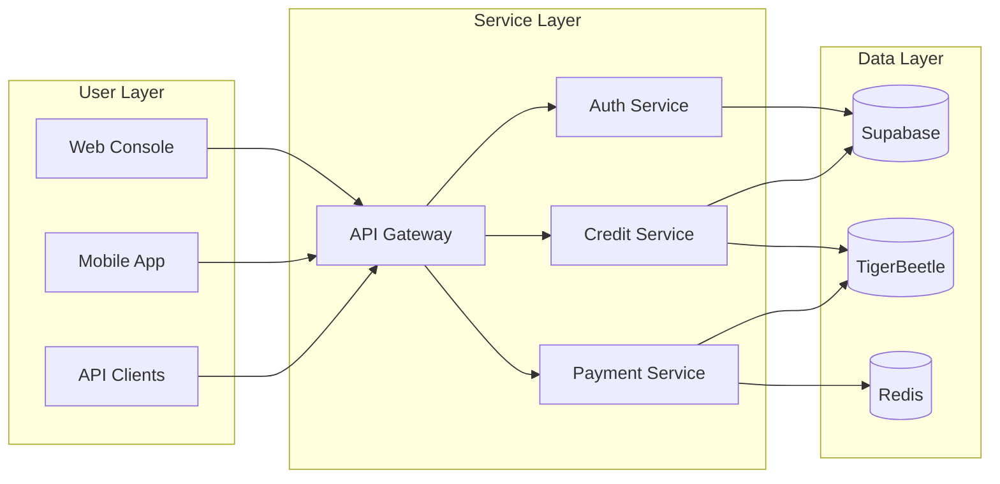
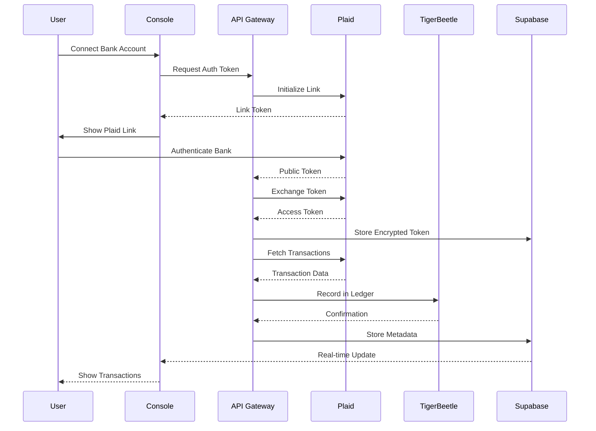
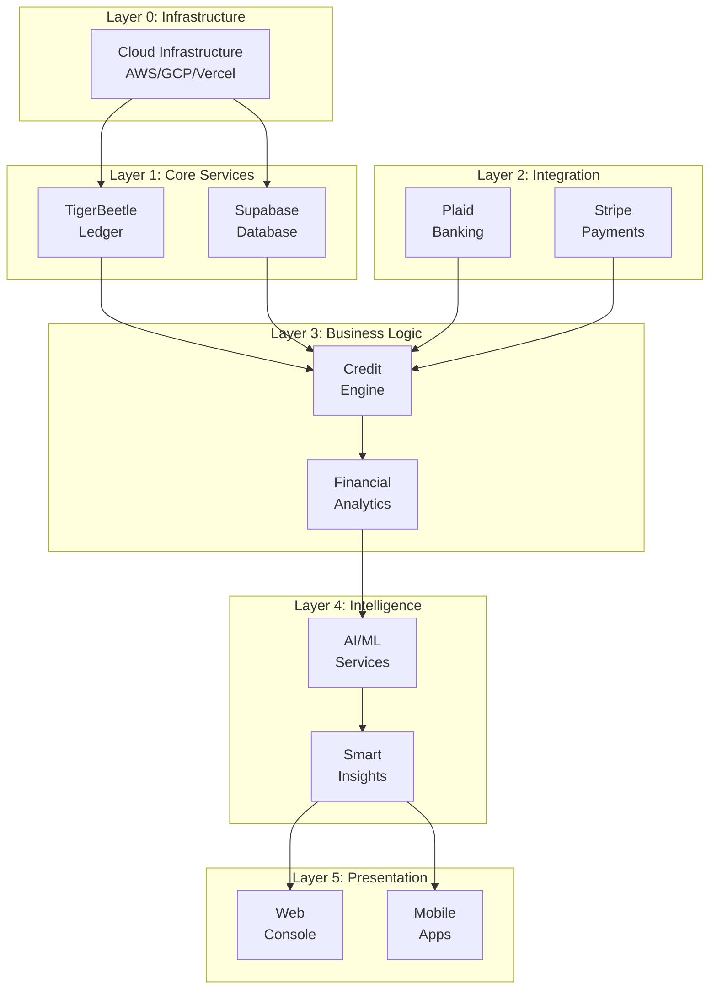

import { Tabs, Steps } from 'nextra/components'
import DSMInteractiveMatrix from '@/components/DSMInteractiveMatrix'
import DSMWithBackground from '@/components/DSMWithBackground'

# Design Structure Matrix (DSM)

The Design Structure Matrix provides a comprehensive view of technology dependencies and system interactions within the Earna AI Financial Platform architecture.

## Architecture Overview

The Earna AI platform consists of multiple interconnected layers, each serving specific functions while maintaining clear dependency relationships. This matrix helps visualize and manage the complexity of our financial technology stack.

## Interactive Dependency Visualization

<DSMWithBackground />

## Technology Stack Layers

### Core System Components

| Layer | Components | Purpose |
|-------|------------|---------|
| **Financial Core** | TigerBeetle, Ledger System, Double-Entry Accounting | Immutable financial record keeping |
| **Banking Integration** | Plaid API, Account Aggregation, Transaction Sync | Real-time banking data access |
| **AI/ML Services** | GPT-4o, Claude 3, Gemini Pro, ML Pipelines | Intelligent insights and automation |
| **Data Platform** | Supabase, PostgreSQL, Redis, ClickHouse | Data persistence and analytics |
| **Payment Processing** | Stripe, ACH, Hyperswitch, Payment Gateway | Transaction processing |
| **Identity & Auth** | Supabase Auth, JWT, OAuth 2.0, MFA | Security and access control |
| **API Gateway** | REST API, GraphQL, Webhooks, WebSockets | Service communication |
| **Frontend Apps** | Next.js Console, React Native Mobile, Admin Portal | User interfaces |

## Dependency Matrix

### Primary Dependencies

The following matrix shows the primary dependencies between system components. Each row depends on the columns marked with ✓.

| Component | TigerBeetle | Plaid | Supabase | AI/ML | Stripe | Redis | API Gateway |
|-----------|-------------|-------|----------|-------|--------|-------|-------------|
| **Credit Engine** | ✓ | ✓ | ✓ | ✓ | - | ✓ | ✓ |
| **Transaction Sync** | ✓ | ✓ | ✓ | - | - | ✓ | ✓ |
| **Payment Processing** | ✓ | - | ✓ | - | ✓ | ✓ | ✓ |
| **Financial Analytics** | ✓ | ✓ | ✓ | ✓ | - | ✓ | ✓ |
| **Budget Management** | ✓ | ✓ | ✓ | ✓ | - | - | ✓ |
| **Investment Tracking** | - | ✓ | ✓ | ✓ | - | ✓ | ✓ |
| **Tax Intelligence** | ✓ | ✓ | ✓ | ✓ | - | - | ✓ |
| **Console Frontend** | - | - | ✓ | - | - | - | ✓ |

### Service Interconnections

<Tabs items={['Infrastructure', 'Application', 'Data Flow']}>
  <Tabs.Tab>

  </Tabs.Tab>

  <Tabs.Tab>

  </Tabs.Tab>

  <Tabs.Tab>

  </Tabs.Tab>
</Tabs>

## Component Categories

### By Technology Domain

| Category | Components | Primary Dependencies | External Services |
|----------|------------|---------------------|-------------------|
| **Financial Ledger** | TigerBeetle, Double-Entry System | Infrastructure, Database | None |
| **Banking Data** | Plaid Integration, Account Sync | API Gateway, Security | Plaid API |
| **AI/ML Platform** | OpenAI, Anthropic, Google AI | API Gateway, Data Platform | OpenAI, Claude, Gemini |
| **Payment Rails** | ACH, Stripe, Wire Transfers | Ledger, Security | Stripe, Banking Networks |
| **Data Storage** | PostgreSQL, Redis, ClickHouse | Infrastructure | Supabase |
| **Security Layer** | Auth, Encryption, Compliance | All Components | Supabase Auth |
| **Monitoring** | Prometheus, Grafana, Sentry | All Services | Open Source Stack |

## Dependency Strength Analysis

### Critical Dependencies (High Impact)

| Dependency | Impact Score | Risk Level | Mitigation Strategy |
|------------|--------------|------------|-------------------|
| TigerBeetle → Infrastructure | 10/10 | Critical | Multi-region deployment, failover |
| Plaid → Banking Data | 10/10 | Critical | Cache strategy, manual entry fallback |
| Supabase → User Data | 9/10 | High | Backup strategy, read replicas |
| API Gateway → All Services | 9/10 | High | Rate limiting, circuit breakers |
| Redis → Performance | 7/10 | Medium | Graceful degradation, memory limits |
| AI Services → Features | 6/10 | Medium | Multiple providers, fallback logic |

### Dependency Layers

## System Interfaces

### API Dependency Matrix

| Service | Consumes | Provides | Protocol | SLA |
|---------|----------|----------|----------|-----|
| Credit Engine | Plaid, TigerBeetle, AI | Credit Scores, Reports | REST/GraphQL | 99.9% |
| Payment Service | Stripe, TigerBeetle | Payment Processing | REST | 99.99% |
| Analytics Engine | TigerBeetle, Supabase | Financial Insights | GraphQL | 99.5% |
| AI Service | OpenAI, Claude, Gemini | Recommendations | REST | 99.0% |
| Auth Service | Supabase Auth | JWT Tokens | REST | 99.9% |
| Notification Service | Twilio, SendGrid | Alerts, Messages | Webhooks | 99.5% |

## Technology Coupling Analysis

### Tight Coupling (Synchronous)
- Console → API Gateway
- API Gateway → Auth Service
- Payment Service → TigerBeetle
- Credit Engine → Plaid API

### Loose Coupling (Asynchronous)
- Analytics → AI Services
- Notifications → External Services
- Batch Processing → Data Warehouse
- Report Generation → Storage

## Risk Mitigation Strategies

### Single Points of Failure

| Component | Risk Level | Mitigation | Recovery Time |
|-----------|------------|------------|---------------|
| TigerBeetle Cluster | High | Multi-region replication | < 1 minute |
| Plaid Connection | High | Cached data, manual entry | < 5 minutes |
| Supabase Database | Medium | Read replicas, backups | < 10 minutes |
| Redis Cache | Low | Graceful degradation | Immediate |
| AI Services | Low | Multiple providers | < 30 seconds |

## Evolution Strategy

### Phase-Based Dependencies

| Phase | New Components | Dependencies Added | Dependencies Removed |
|-------|---------------|-------------------|---------------------|
| Phase 1-2 | Core Platform | TigerBeetle, Plaid, Supabase | None |
| Phase 3-4 | Credit & Payments | Stripe, Credit Bureaus | None |
| Phase 5-6 | Investment & Tax | Market Data APIs, Tax APIs | None |
| Phase 7-8 | Business & AI | Advanced ML, Business Tools | Legacy Systems |

## Monitoring & Observability

### Dependency Health Metrics

| Metric | Component | Threshold | Alert Level |
|--------|-----------|-----------|-------------|
| Latency | TigerBeetle | < 1ms | Critical if > 5ms |
| Availability | Plaid API | > 99.9% | High if < 99.5% |
| Error Rate | API Gateway | < 0.1% | Medium if > 1% |
| Queue Depth | BullMQ | < 1000 | High if > 5000 |
| Cache Hit Rate | Redis | > 90% | Low if < 80% |
| Response Time | Prometheus | < 100ms | Medium if > 500ms |
| Error Tracking | Sentry | < 10/min | High if > 100/min |

## Best Practices

<Steps>
### Minimize Dependencies
Reduce unnecessary dependencies between components to improve maintainability and reduce complexity.

### Use Circuit Breakers
Implement circuit breaker patterns for all external service dependencies to prevent cascade failures.

### Version Management
Maintain strict version control for all dependencies with automated compatibility testing.

### Documentation
Keep dependency documentation up-to-date with automated dependency graph generation.

### Regular Audits
Perform quarterly dependency audits to identify and remove obsolete or redundant dependencies.
</Steps>

## Related Documentation

- [Platform Architecture](/roadmap#platform-architecture)
- [Technology Stack](/roadmap#enterprise-technology-stack)
- [Development Timeline](/roadmap#development-timeline)
- [Risk Mitigation](/roadmap#risk-mitigation-matrix)
