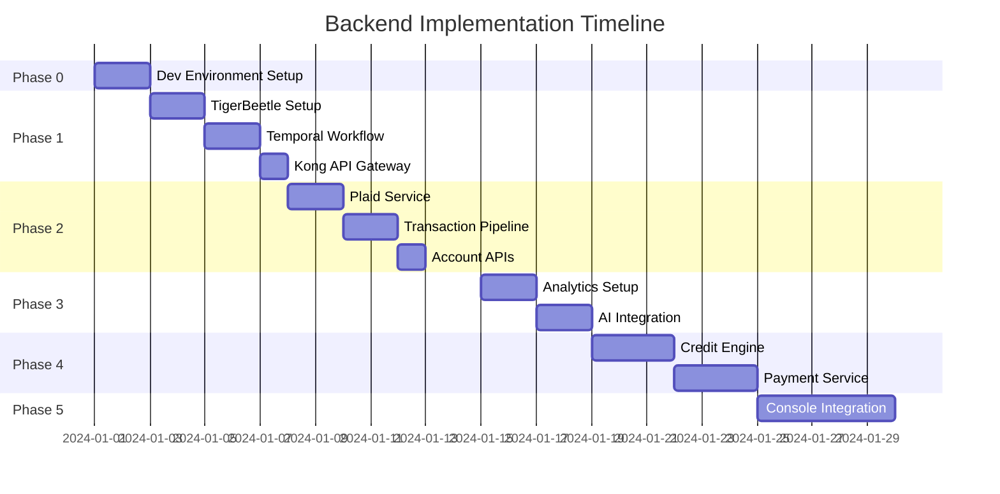

import { Tabs, Steps, Callout, FileTree } from 'nextra/components'

# Implementation Guide

This guide provides a detailed, day-by-day implementation plan for building Earna AI's backend infrastructure without disrupting the existing console application. The strategy focuses on building isolated services that can be gradually integrated.

## Core Implementation Principle

<Callout>
  **Service Isolation Strategy**
  ```
  Console (unchanged) → Kong Gateway (new) → Backend Services (new) → Databases (new)
  ```
  The console continues to work as-is while we build a complete backend infrastructure in parallel.
</Callout>

## Implementation Timeline



## Detailed Implementation Phases

<Tabs items={['Week 1: Foundation', 'Week 2: Data Layer', 'Week 3: Services', 'Week 4: Integration']}>
  <Tabs.Tab>

## Week 1: Core Infrastructure

### Day 0-1: Development Environment Setup

<Steps>
### Local Kubernetes Setup
```bash
# Install Kind for local K8s
curl -Lo ./kind https://kind.sigs.k8s.io/dl/v0.20.0/kind-linux-amd64
chmod +x ./kind
sudo mv ./kind /usr/local/bin/kind

# Create cluster
kind create cluster --config=kind-config.yaml
```

### Docker Development Environment
```yaml
# docker-compose.yml
version: '3.8'
services:
  tigerbeetle:
    image: ghcr.io/tigerbeetledb/tigerbeetle
    ports:
      - "3000:3000"
    volumes:
      - ./data/tigerbeetle:/data

  temporal:
    image: temporalio/auto-setup
    ports:
      - "7233:7233"
    environment:
      - DB=postgresql
      - DB_PORT=5432

  redis:
    image: redis:alpine
    ports:
      - "6379:6379"
```

### Service Templates
```typescript
// service-template/src/index.ts
import express from 'express'
import { logger } from './utils/logger'
import { healthCheck } from './middleware/health'

const app = express()
app.use(express.json())
app.use('/health', healthCheck)

// Service-specific routes
app.use('/api/v1', routes)

const PORT = process.env.PORT || 3000
app.listen(PORT, () => {
  logger.info(`Service running on port ${PORT}`)
})
```

### CI/CD Pipeline
```yaml
# .github/workflows/deploy.yml
name: Deploy Service
on:
  push:
    branches: [main]
jobs:
  deploy:
    runs-on: ubuntu-latest
    steps:
      - uses: actions/checkout@v2
      - name: Build and push Docker image
        run: |
          docker build -t $SERVICE_NAME:$GITHUB_SHA .
          docker push $SERVICE_NAME:$GITHUB_SHA
      - name: Deploy to Kubernetes
        run: |
          kubectl set image deployment/$SERVICE_NAME \
            $SERVICE_NAME=$SERVICE_NAME:$GITHUB_SHA
```
</Steps>

### Day 2-3: TigerBeetle Setup

<Steps>
### Deploy TigerBeetle Cluster
```bash
# Deploy 3-node cluster
kubectl apply -f tigerbeetle-statefulset.yaml

# Initialize cluster
kubectl exec tigerbeetle-0 -- tigerbeetle format \
  --cluster=0 \
  --replica=0 \
  --replica-count=3 \
  /data/0.tigerbeetle

# Start replicas
kubectl scale statefulset tigerbeetle --replicas=3
```

### Configure Ledger Structure
```typescript
// Account Types
enum AccountType {
  USER_WALLET = 1,
  CREDIT_CARD = 2,
  CHECKING = 3,
  SAVINGS = 4,
  INVESTMENT = 5,
  BUSINESS = 6,
  TAX = 7,
  ESCROW = 8
}

// Create accounts
const createAccount = async (userId: string, type: AccountType) => {
  return await client.createAccounts([{
    id: generateId(),
    ledger: 1,
    code: type,
    flags: 0,
    debits_pending: 0n,
    debits_posted: 0n,
    credits_pending: 0n,
    credits_posted: 0n,
    user_data: Buffer.from(userId)
  }])
}
```

### Build REST API Wrapper
```typescript
// tigerbeetle-service/src/api.ts
import { Router } from 'express'
import { TigerBeetleClient } from './client'

const router = Router()
const tb = new TigerBeetleClient()

router.post('/accounts', async (req, res) => {
  const account = await tb.createAccount(req.body)
  res.json(account)
})

router.post('/transfers', async (req, res) => {
  const transfer = await tb.createTransfer(req.body)
  res.json(transfer)
})

router.get('/accounts/:id/balance', async (req, res) => {
  const balance = await tb.getBalance(req.params.id)
  res.json({ balance })
})
```
</Steps>

### Day 4-5: Temporal Workflow Engine

<Steps>
### Deploy Temporal Server
```yaml
# temporal-deployment.yaml
apiVersion: apps/v1
kind: Deployment
metadata:
  name: temporal-server
spec:
  replicas: 1
  selector:
    matchLabels:
      app: temporal
  template:
    spec:
      containers:
      - name: temporal
        image: temporalio/auto-setup:latest
        ports:
        - containerPort: 7233
        env:
        - name: DB
          value: postgresql
        - name: POSTGRES_SEEDS
          value: postgres-service
```

### Create Workflow Templates
```typescript
// workflows/sync-accounts.ts
import { proxyActivities } from '@temporalio/workflow'

const activities = proxyActivities({
  startToCloseTimeout: '5 minutes'
})

export async function syncAccountsWorkflow(userId: string) {
  // Step 1: Fetch from Plaid
  const accounts = await activities.fetchPlaidAccounts(userId)

  // Step 2: Process each account
  for (const account of accounts) {
    await activities.createOrUpdateAccount(account)
    await activities.syncTransactions(account.id)
  }

  // Step 3: Update balances
  await activities.updateBalances(userId)

  // Step 4: Trigger analytics
  await activities.triggerAnalytics(userId)
}
```

### Configure Worker Pools
```typescript
// workers/index.ts
import { Worker } from '@temporalio/worker'
import * as activities from './activities'

async function run() {
  const worker = await Worker.create({
    workflowsPath: require.resolve('./workflows'),
    activities,
    taskQueue: 'financial-operations',
    maxConcurrentActivityTaskExecutions: 100,
  })

  await worker.run()
}
```
</Steps>

### Day 6-7: Kong API Gateway

<Steps>
### Deploy Kong Gateway
```yaml
# kong-deployment.yaml
apiVersion: apps/v1
kind: Deployment
metadata:
  name: kong-gateway
spec:
  replicas: 3
  template:
    spec:
      containers:
      - name: kong
        image: kong:3.4
        env:
        - name: KONG_DATABASE
          value: postgres
        - name: KONG_PROXY_ACCESS_LOG
          value: /dev/stdout
        ports:
        - containerPort: 8000
        - containerPort: 8443
```

### Configure Routes and Services
```bash
# Add TigerBeetle service
curl -X POST http://localhost:8001/services \
  --data name=tigerbeetle \
  --data url=http://tigerbeetle-service:3000

# Add route
curl -X POST http://localhost:8001/services/tigerbeetle/routes \
  --data paths[]=/api/v1/ledger

# Add Plaid service
curl -X POST http://localhost:8001/services \
  --data name=plaid \
  --data url=http://plaid-service:3000

# Add authentication
curl -X POST http://localhost:8001/plugins \
  --data name=jwt \
  --data config.key_claim_name=iss
```

### Set Up Rate Limiting
```lua
-- kong-rate-limit.lua
return {
  name = "rate-limiting",
  config = {
    minute = 100,
    hour = 10000,
    policy = "local",
    fault_tolerant = true,
    redis_host = "redis-service",
    redis_port = 6379
  }
}
```
</Steps>

  </Tabs.Tab>

  <Tabs.Tab>

## Week 2: Data Ingestion Layer

### Day 8-9: Plaid Service

<Steps>
### Create Plaid Microservice
```typescript
// plaid-service/src/index.ts
import { Configuration, PlaidApi, PlaidEnvironments } from 'plaid'

const plaidClient = new PlaidApi(
  new Configuration({
    basePath: PlaidEnvironments[process.env.PLAID_ENV],
    baseOptions: {
      headers: {
        'PLAID-CLIENT-ID': process.env.PLAID_CLIENT_ID,
        'PLAID-SECRET': process.env.PLAID_SECRET,
      }
    }
  })
)

// Link token endpoint
app.post('/api/plaid/link/token', async (req, res) => {
  const response = await plaidClient.linkTokenCreate({
    user: { client_user_id: req.body.userId },
    client_name: 'Earna AI',
    products: ['transactions', 'accounts', 'investments'],
    country_codes: ['US'],
    language: 'en'
  })
  res.json(response.data)
})

// Exchange public token
app.post('/api/plaid/link/exchange', async (req, res) => {
  const response = await plaidClient.itemPublicTokenExchange({
    public_token: req.body.public_token
  })

  // Store access token
  await storeAccessToken(req.body.userId, response.data.access_token)

  // Trigger sync workflow
  await temporal.start('syncAccountsWorkflow', {
    args: [req.body.userId]
  })

  res.json({ success: true })
})
```

### Webhook Handlers
```typescript
// Webhook processing
app.post('/api/plaid/webhooks', async (req, res) => {
  const { webhook_type, webhook_code, item_id } = req.body

  switch(webhook_type) {
    case 'TRANSACTIONS':
      if (webhook_code === 'DEFAULT_UPDATE') {
        await handleTransactionUpdate(item_id)
      }
      break
    case 'ITEM':
      if (webhook_code === 'ERROR') {
        await handleItemError(item_id)
      }
      break
  }

  res.sendStatus(200)
})

async function handleTransactionUpdate(itemId: string) {
  // Get user from item
  const user = await getUserByItemId(itemId)

  // Trigger sync workflow
  await temporal.start('syncTransactionsWorkflow', {
    args: [user.id, itemId],
    taskQueue: 'financial-operations'
  })
}
```

### Sync Workflows
```typescript
// Temporal workflow for syncing
export async function syncTransactionsWorkflow(
  userId: string,
  itemId: string
) {
  let hasMore = true
  let cursor = null

  while (hasMore) {
    const result = await activities.fetchTransactionsBatch({
      itemId,
      cursor,
      count: 500
    })

    // Process transactions
    await activities.processTransactions({
      userId,
      transactions: result.transactions
    })

    // Record in TigerBeetle
    await activities.recordInLedger({
      userId,
      transactions: result.transactions
    })

    hasMore = result.hasMore
    cursor = result.nextCursor
  }

  // Update account balances
  await activities.updateAccountBalances(userId)
}
```
</Steps>

### Day 10-11: Transaction Import Pipeline

<Steps>
### Transaction Categorization
```typescript
// categorization-service/src/categorizer.ts
import { OpenAI } from 'openai'

class TransactionCategorizer {
  private openai: OpenAI
  private cache: Map<string, Category>

  async categorize(transaction: Transaction): Promise<Category> {
    // Check cache first
    const cached = this.cache.get(transaction.merchant_name)
    if (cached) return cached

    // Use ML model
    const category = await this.categorizeWithAI(transaction)

    // Cache result
    this.cache.set(transaction.merchant_name, category)

    return category
  }

  private async categorizeWithAI(transaction: Transaction) {
    const response = await this.openai.chat.completions.create({
      model: 'gpt-4',
      messages: [{
        role: 'system',
        content: 'Categorize this transaction...'
      }, {
        role: 'user',
        content: JSON.stringify(transaction)
      }],
      functions: [{
        name: 'categorize',
        parameters: {
          type: 'object',
          properties: {
            category: { type: 'string' },
            subcategory: { type: 'string' },
            confidence: { type: 'number' }
          }
        }
      }]
    })

    return response.choices[0].message.function_call.arguments
  }
}
```

### Enrichment Pipeline
```typescript
// Data enrichment
class EnrichmentPipeline {
  async enrich(transaction: RawTransaction): Promise<EnrichedTransaction> {
    const enriched = { ...transaction }

    // Merchant enrichment
    enriched.merchant = await this.enrichMerchant(transaction.merchant_name)

    // Location enrichment
    enriched.location = await this.geocodeLocation(transaction.location)

    // Recurring detection
    enriched.isRecurring = await this.detectRecurring(transaction)

    // Subscription detection
    enriched.isSubscription = await this.detectSubscription(transaction)

    return enriched
  }
}
```

### Deduplication Logic
```typescript
// Deduplication service
class DeduplicationService {
  async isDuplicate(transaction: Transaction): Promise<boolean> {
    const hash = this.generateHash(transaction)

    // Check recent transactions
    const exists = await redis.get(`txn:${hash}`)
    if (exists) return true

    // Store with expiry
    await redis.setex(`txn:${hash}`, 86400, '1')

    // Check TigerBeetle
    const similar = await this.checkSimilarInLedger(transaction)
    return similar.length > 0
  }

  private generateHash(txn: Transaction): string {
    return crypto
      .createHash('sha256')
      .update(`${txn.account_id}:${txn.amount}:${txn.date}:${txn.merchant}`)
      .digest('hex')
  }
}
```
</Steps>

### Day 12-13: Account Management APIs

<Steps>
### Account CRUD Operations
```typescript
// account-service/src/api.ts
class AccountService {
  // Create account
  async createAccount(req: Request, res: Response) {
    const account = await db.accounts.create({
      user_id: req.user.id,
      institution_id: req.body.institution_id,
      account_type: req.body.type,
      account_name: req.body.name
    })

    // Create in TigerBeetle
    await tigerbeetle.createAccount({
      id: account.tigerbeetle_id,
      ledger: 1,
      code: AccountType[account.account_type],
      user_data: Buffer.from(account.id)
    })

    res.json(account)
  }

  // List accounts
  async listAccounts(req: Request, res: Response) {
    const accounts = await db.accounts.findAll({
      where: { user_id: req.user.id },
      include: ['institution', 'latest_balance']
    })

    res.json(accounts)
  }

  // Get account with transactions
  async getAccount(req: Request, res: Response) {
    const account = await db.accounts.findOne({
      where: {
        id: req.params.id,
        user_id: req.user.id
      }
    })

    const transactions = await this.getTransactions(account.id)
    const balance = await tigerbeetle.getBalance(account.tigerbeetle_id)

    res.json({
      account,
      transactions,
      balance
    })
  }
}
```

### Balance Tracking
```typescript
// Real-time balance updates
class BalanceTracker {
  async updateBalance(accountId: string) {
    // Get from TigerBeetle
    const balance = await tigerbeetle.getAccount(accountId)

    // Update cache
    await redis.set(
      `balance:${accountId}`,
      JSON.stringify({
        available: balance.credits_posted - balance.debits_posted,
        pending: balance.credits_pending - balance.debits_pending,
        updated_at: new Date()
      }),
      'EX',
      300 // 5 minute cache
    )

    // Send real-time update
    await this.broadcastUpdate(accountId, balance)
  }

  private async broadcastUpdate(accountId: string, balance: Balance) {
    const channel = `account:${accountId}:balance`
    await redis.publish(channel, JSON.stringify(balance))
  }
}
```

### Transaction History
```typescript
// Transaction API
app.get('/api/accounts/:id/transactions', async (req, res) => {
  const { page = 1, limit = 50, from, to, category } = req.query

  const transactions = await db.transactions.findAll({
    where: {
      account_id: req.params.id,
      date: {
        [Op.gte]: from || new Date(Date.now() - 90 * 24 * 60 * 60 * 1000),
        [Op.lte]: to || new Date()
      },
      ...(category && { category })
    },
    order: [['date', 'DESC']],
    limit,
    offset: (page - 1) * limit
  })

  res.json({
    transactions,
    pagination: {
      page,
      limit,
      total: await db.transactions.count({ where: { account_id: req.params.id } })
    }
  })
})
```
</Steps>

  </Tabs.Tab>

  <Tabs.Tab>

## Week 3: Core Services

### Day 14-15: Analytics Infrastructure

<Steps>
### Deploy ClickHouse
```yaml
# clickhouse-deployment.yaml
apiVersion: apps/v1
kind: StatefulSet
metadata:
  name: clickhouse
spec:
  serviceName: clickhouse
  replicas: 3
  template:
    spec:
      containers:
      - name: clickhouse
        image: clickhouse/clickhouse-server:latest
        ports:
        - containerPort: 9000
        - containerPort: 8123
        volumeMounts:
        - name: data
          mountPath: /var/lib/clickhouse
```

### Create Analytics Schema
```sql
-- ClickHouse schema
CREATE TABLE transactions (
  id UUID,
  user_id UUID,
  account_id UUID,
  amount Decimal(19, 4),
  category LowCardinality(String),
  subcategory LowCardinality(String),
  merchant_name String,
  date DateTime,
  is_recurring UInt8,
  is_subscription UInt8
) ENGINE = MergeTree()
PARTITION BY toYYYYMM(date)
ORDER BY (user_id, date, id);

CREATE TABLE daily_aggregates (
  user_id UUID,
  date Date,
  category LowCardinality(String),
  total_spent Decimal(19, 4),
  transaction_count UInt32
) ENGINE = SummingMergeTree()
PARTITION BY toYYYYMM(date)
ORDER BY (user_id, date, category);
```

### Data Pipeline
```typescript
// analytics-pipeline/src/processor.ts
class AnalyticsProcessor {
  async processTransaction(transaction: Transaction) {
    // Write to ClickHouse
    await clickhouse.insert({
      table: 'transactions',
      values: [transaction],
      format: 'JSONEachRow'
    })

    // Update aggregates
    await this.updateAggregates(transaction)

    // Trigger real-time analytics
    await this.triggerRealtimeAnalytics(transaction)
  }

  private async updateAggregates(transaction: Transaction) {
    await clickhouse.query(`
      INSERT INTO daily_aggregates
      SELECT
        user_id,
        toDate(date) as date,
        category,
        sum(amount) as total_spent,
        count() as transaction_count
      FROM transactions
      WHERE user_id = {userId} AND toDate(date) = {date}
      GROUP BY user_id, date, category
    `, {
      userId: transaction.user_id,
      date: transaction.date
    })
  }
}
```
</Steps>

### Day 16-17: AI Integration

<Steps>
### AI Service Setup
```typescript
// ai-service/src/index.ts
import { OpenAI } from 'openai'
import { Anthropic } from '@anthropic-ai/sdk'

class AIService {
  private openai: OpenAI
  private anthropic: Anthropic

  constructor() {
    this.openai = new OpenAI({ apiKey: process.env.OPENAI_API_KEY })
    this.anthropic = new Anthropic({ apiKey: process.env.ANTHROPIC_API_KEY })
  }

  async generateInsights(userId: string): Promise<Insights> {
    const data = await this.getUserFinancialData(userId)

    const response = await this.openai.chat.completions.create({
      model: 'gpt-4',
      messages: [{
        role: 'system',
        content: 'You are a financial advisor...'
      }, {
        role: 'user',
        content: `Analyze this financial data: ${JSON.stringify(data)}`
      }]
    })

    return this.parseInsights(response.choices[0].message.content)
  }

  async detectAnomalies(transactions: Transaction[]): Promise<Anomaly[]> {
    // Use ML model for anomaly detection
    const anomalies = await this.runAnomalyDetection(transactions)

    // Get explanation from AI
    for (const anomaly of anomalies) {
      anomaly.explanation = await this.explainAnomaly(anomaly)
    }

    return anomalies
  }
}
```

### Recommendation Engine
```typescript
// Recommendation system
class RecommendationEngine {
  async generateRecommendations(userId: string): Promise<Recommendation[]> {
    const recommendations: Recommendation[] = []

    // Credit optimization
    const creditRecs = await this.creditOptimization(userId)
    recommendations.push(...creditRecs)

    // Savings opportunities
    const savingsRecs = await this.findSavingsOpportunities(userId)
    recommendations.push(...savingsRecs)

    // Investment suggestions
    const investmentRecs = await this.investmentSuggestions(userId)
    recommendations.push(...investmentRecs)

    // Rank by impact
    return this.rankRecommendations(recommendations)
  }

  private async creditOptimization(userId: string) {
    const creditData = await this.getCreditData(userId)

    return [
      {
        type: 'credit_utilization',
        title: 'Lower Credit Utilization',
        description: 'Pay down Card X to below 30%',
        impact: 'Could improve score by 20-30 points',
        priority: 'high'
      }
    ]
  }
}
```

### Natural Language Interface
```typescript
// Chat interface
app.post('/api/ai/chat', async (req, res) => {
  const { message, context } = req.body

  // Get user financial context
  const financialContext = await getUserFinancialContext(req.user.id)

  const response = await anthropic.messages.create({
    model: 'claude-3-opus-20240229',
    messages: [{
      role: 'user',
      content: message
    }],
    system: `You are a financial assistant with access to:
      ${JSON.stringify(financialContext)}`
  })

  // Execute any actions
  const actions = parseActions(response.content)
  for (const action of actions) {
    await executeAction(action, req.user.id)
  }

  res.json({ response: response.content, actions })
})
```
</Steps>

### Day 18-20: Credit Engine

<Steps>
### Credit Score Monitoring
```typescript
// credit-engine/src/monitoring.ts
class CreditMonitor {
  async fetchCreditScores(userId: string): Promise<CreditScores> {
    const scores = await Promise.all([
      this.fetchExperian(userId),
      this.fetchEquifax(userId),
      this.fetchTransUnion(userId)
    ])

    // Store in database
    await db.creditScores.create({
      user_id: userId,
      experian: scores[0],
      equifax: scores[1],
      transunion: scores[2],
      fetched_at: new Date()
    })

    // Check for changes
    await this.checkForChanges(userId, scores)

    return scores
  }

  async checkForChanges(userId: string, newScores: CreditScores) {
    const lastScores = await this.getLastScores(userId)

    for (const bureau of ['experian', 'equifax', 'transunion']) {
      const change = newScores[bureau] - lastScores[bureau]
      if (Math.abs(change) >= 5) {
        await this.notifyScoreChange(userId, bureau, change)
      }
    }
  }
}
```

### Credit Optimization
```typescript
// Optimization algorithms
class CreditOptimizer {
  async optimize(userId: string): Promise<OptimizationPlan> {
    const profile = await this.getCreditProfile(userId)

    const strategies = [
      this.optimizeUtilization(profile),
      this.optimizePaymentTiming(profile),
      this.optimizeCreditMix(profile),
      this.optimizeHardInquiries(profile)
    ]

    const plan = await Promise.all(strategies)
    return this.createActionPlan(plan.flat())
  }

  private async optimizeUtilization(profile: CreditProfile) {
    const recommendations: Recommendation[] = []

    for (const card of profile.creditCards) {
      if (card.utilization > 30) {
        recommendations.push({
          action: 'pay_down',
          card_id: card.id,
          amount: card.balance - (card.limit * 0.25),
          impact: this.calculateImpact(card)
        })
      }
    }

    return recommendations
  }
}
```

### Simulation Engine
```typescript
// Credit simulation
class CreditSimulator {
  async simulate(userId: string, actions: SimulationAction[]): Promise<SimulationResult> {
    const currentProfile = await this.getCreditProfile(userId)
    let simulatedProfile = { ...currentProfile }

    for (const action of actions) {
      simulatedProfile = await this.applyAction(simulatedProfile, action)
    }

    const scorePrediction = await this.predictScore(simulatedProfile)

    return {
      current_score: currentProfile.score,
      predicted_score: scorePrediction,
      impact: scorePrediction - currentProfile.score,
      timeline: this.estimateTimeline(actions),
      confidence: this.calculateConfidence(actions)
    }
  }
}
```
</Steps>

  </Tabs.Tab>

  <Tabs.Tab>

## Week 4: Integration & Migration

### Day 21-23: Payment Service

<Steps>
### Hyperswitch Integration
```typescript
// payment-service/src/hyperswitch.ts
class PaymentService {
  private hyperswitch: HyperswitchClient

  async processPayment(request: PaymentRequest): Promise<PaymentResult> {
    // Create payment intent
    const intent = await this.hyperswitch.paymentIntents.create({
      amount: request.amount,
      currency: request.currency,
      customer_id: request.customerId,
      routing: {
        type: 'priority',
        data: this.getRoutingRules(request)
      },
      metadata: request.metadata
    })

    // Record in ledger
    await this.recordInLedger(intent)

    // Process payment
    const result = await this.hyperswitch.paymentIntents.confirm(intent.id, {
      payment_method: request.paymentMethod
    })

    // Update ledger
    await this.updateLedgerStatus(result)

    return result
  }

  private getRoutingRules(request: PaymentRequest): RoutingRule[] {
    if (request.amount < 1000) {
      return [
        { processor: 'stripe', priority: 1 },
        { processor: 'square', priority: 2 }
      ]
    } else {
      return [
        { processor: 'adyen', priority: 1 },
        { processor: 'stripe', priority: 2 }
      ]
    }
  }
}
```

### Bill Payment System
```typescript
// Bill payment automation
class BillPaymentService {
  async scheduleBillPayment(bill: Bill): Promise<ScheduledPayment> {
    // Validate bill
    await this.validateBill(bill)

    // Check account balance
    const hasBalance = await this.checkBalance(bill.account_id, bill.amount)
    if (!hasBalance) {
      throw new InsufficientFundsError()
    }

    // Schedule payment
    const scheduled = await temporal.scheduleWorkflow(
      'billPaymentWorkflow',
      {
        args: [bill],
        scheduleId: `bill-${bill.id}`,
        cronSchedule: bill.recurring ? bill.schedule : undefined,
        startTime: bill.due_date
      }
    )

    return scheduled
  }

  async processBillPayment(bill: Bill) {
    // Initiate payment
    const payment = await this.initiatePayment(bill)

    // Record in ledger
    await tigerbeetle.createTransfer({
      id: generateId(),
      debit_account_id: bill.source_account,
      credit_account_id: bill.biller_account,
      amount: bill.amount,
      code: TransferCode.BILL_PAYMENT,
      user_data: Buffer.from(bill.id)
    })

    // Send confirmation
    await this.sendConfirmation(bill, payment)
  }
}
```

### Subscription Management
```typescript
// Subscription tracking
class SubscriptionManager {
  async detectSubscriptions(userId: string): Promise<Subscription[]> {
    const transactions = await this.getRecurringTransactions(userId)

    const subscriptions = transactions.map(group => ({
      merchant: group.merchant,
      amount: group.amount,
      frequency: this.detectFrequency(group.dates),
      next_charge: this.predictNextCharge(group),
      category: group.category,
      active: true
    }))

    return subscriptions
  }

  async cancelSubscription(subscriptionId: string) {
    const subscription = await this.getSubscription(subscriptionId)

    // Attempt cancellation via API if available
    if (subscription.cancellation_api) {
      await this.cancelViaAPI(subscription)
    }

    // Generate cancellation letter
    const letter = await this.generateCancellationLetter(subscription)

    // Schedule reminder
    await this.scheduleFollowUp(subscription)

    return { letter, instructions: this.getCancellationInstructions(subscription) }
  }
}
```
</Steps>

### Day 24-28: Console Integration

<Steps>
### API Client Library
```typescript
// console/lib/api-client.ts
class EarnaAPIClient {
  private baseURL: string
  private token: string

  constructor(token: string) {
    this.baseURL = process.env.NEXT_PUBLIC_API_URL || 'http://localhost:8000'
    this.token = token
  }

  // Accounts
  async getAccounts(): Promise<Account[]> {
    return this.get('/api/v1/accounts')
  }

  async syncAccounts(): Promise<void> {
    return this.post('/api/v1/accounts/sync')
  }

  // Transactions
  async getTransactions(params: TransactionQuery): Promise<Transaction[]> {
    return this.get('/api/v1/transactions', params)
  }

  // Credit
  async getCreditScore(): Promise<CreditScore> {
    return this.get('/api/v1/credit/score')
  }

  async simulateCredit(actions: SimulationAction[]): Promise<SimulationResult> {
    return this.post('/api/v1/credit/simulate', { actions })
  }

  // Payments
  async getBills(): Promise<Bill[]> {
    return this.get('/api/v1/bills')
  }

  async scheduleBillPayment(bill: Bill): Promise<ScheduledPayment> {
    return this.post('/api/v1/bills/schedule', bill)
  }
}
```

### React Hooks
```typescript
// console/hooks/useAccounts.ts
export function useAccounts() {
  const { data, error, isLoading, mutate } = useSWR(
    '/api/v1/accounts',
    fetcher,
    {
      refreshInterval: 30000 // 30 seconds
    }
  )

  const syncAccounts = async () => {
    await api.syncAccounts()
    mutate()
  }

  return {
    accounts: data,
    isLoading,
    error,
    syncAccounts
  }
}

// console/hooks/useTransactions.ts
export function useTransactions(accountId?: string) {
  const { data, error, isLoading } = useSWR(
    accountId ? `/api/v1/accounts/${accountId}/transactions` : null,
    fetcher
  )

  return {
    transactions: data?.transactions || [],
    isLoading,
    error
  }
}
```

### Real-time Updates
```typescript
// console/lib/realtime.ts
class RealtimeClient {
  private ws: WebSocket
  private subscribers: Map<string, Set<Function>>

  connect() {
    this.ws = new WebSocket('ws://localhost:8000/ws')

    this.ws.onmessage = (event) => {
      const message = JSON.parse(event.data)
      this.dispatch(message.channel, message.data)
    }
  }

  subscribe(channel: string, callback: Function) {
    if (!this.subscribers.has(channel)) {
      this.subscribers.set(channel, new Set())
      this.ws.send(JSON.stringify({ action: 'subscribe', channel }))
    }
    this.subscribers.get(channel)!.add(callback)
  }

  private dispatch(channel: string, data: any) {
    const callbacks = this.subscribers.get(channel)
    if (callbacks) {
      callbacks.forEach(cb => cb(data))
    }
  }
}

// Usage in component
useEffect(() => {
  realtime.subscribe(`account:${accountId}:balance`, (balance) => {
    setBalance(balance)
  })
}, [accountId])
```

### Migration Strategy
```typescript
// Gradual migration approach
const FeatureFlags = {
  USE_NEW_ACCOUNTS_API: process.env.NEXT_PUBLIC_USE_NEW_ACCOUNTS === 'true',
  USE_NEW_TRANSACTIONS_API: process.env.NEXT_PUBLIC_USE_NEW_TRANSACTIONS === 'true',
  USE_NEW_CREDIT_ENGINE: process.env.NEXT_PUBLIC_USE_NEW_CREDIT === 'true'
}

// Wrapper that switches between old and new
export async function getAccounts(): Promise<Account[]> {
  if (FeatureFlags.USE_NEW_ACCOUNTS_API) {
    return newAPI.getAccounts()
  } else {
    return oldAPI.getAccounts()
  }
}
```
</Steps>

  </Tabs.Tab>
</Tabs>

## Service Dependencies Matrix

| Service | Depends On | Provides | Critical Path |
|---------|------------|----------|---------------|
| TigerBeetle | Infrastructure | Ledger API | Yes |
| Temporal | Infrastructure | Workflow Engine | Yes |
| Kong Gateway | Infrastructure | API Routing | Yes |
| Plaid Service | TigerBeetle, Temporal | Banking Data | Yes |
| Transaction Pipeline | TigerBeetle, Plaid | Enriched Transactions | Yes |
| Account Service | TigerBeetle, Database | Account Management | Yes |
| Analytics Service | ClickHouse, Kafka | Analytics API | No |
| AI Service | Analytics, OpenAI | AI Features | No |
| Credit Engine | TigerBeetle, Credit Bureaus | Credit Features | No |
| Payment Service | TigerBeetle, Hyperswitch | Payment Processing | No |

## Testing Strategy

### Unit Testing
```typescript
// Example unit test
describe('TransactionCategorizer', () => {
  it('should categorize restaurant transaction', async () => {
    const transaction = {
      merchant_name: 'STARBUCKS',
      amount: 5.50,
      mcc: '5814'
    }

    const category = await categorizer.categorize(transaction)

    expect(category.primary).toBe('Food & Dining')
    expect(category.secondary).toBe('Coffee Shops')
    expect(category.confidence).toBeGreaterThan(0.9)
  })
})
```

### Integration Testing
```typescript
// Integration test example
describe('Account Sync Flow', () => {
  it('should sync accounts from Plaid to TigerBeetle', async () => {
    // Create test user
    const user = await createTestUser()

    // Mock Plaid response
    mockPlaidAccounts(user.id)

    // Trigger sync
    await syncAccountsWorkflow(user.id)

    // Verify in TigerBeetle
    const accounts = await tigerbeetle.getAccounts(user.id)
    expect(accounts).toHaveLength(3)

    // Verify in database
    const dbAccounts = await db.accounts.findAll({ where: { user_id: user.id } })
    expect(dbAccounts).toHaveLength(3)
  })
})
```

### End-to-End Testing
```typescript
// E2E test
describe('Bill Payment Flow', () => {
  it('should schedule and process bill payment', async () => {
    const user = await setupTestUser()
    const bill = await createTestBill(user.id)

    // Schedule payment
    const scheduled = await api.post('/api/v1/bills/schedule', bill)
    expect(scheduled.status).toBe('scheduled')

    // Wait for processing
    await waitForWorkflow(scheduled.workflow_id)

    // Verify payment
    const payment = await api.get(`/api/v1/payments/${scheduled.payment_id}`)
    expect(payment.status).toBe('completed')

    // Verify ledger
    const transfers = await tigerbeetle.getTransfers(bill.id)
    expect(transfers).toHaveLength(1)
  })
})
```

## Monitoring & Observability

### Key Metrics
```yaml
Service Metrics:
  - Request rate (req/s)
  - Error rate (errors/s)
  - Latency (p50, p95, p99)
  - Availability (uptime %)

Business Metrics:
  - Accounts synced/day
  - Transactions processed/day
  - Payments processed/day
  - Credit scores fetched/day

Infrastructure Metrics:
  - CPU utilization
  - Memory usage
  - Disk I/O
  - Network throughput
```

### Alerting Rules
```yaml
Critical Alerts:
  - TigerBeetle down
  - API Gateway down
  - Database connection pool exhausted
  - Payment failure rate > 1%

Warning Alerts:
  - API latency p99 > 1s
  - Error rate > 0.1%
  - Disk usage > 80%
  - Plaid sync failures > 10/hour
```

## Rollback Strategy

<Callout type="warning">
  **Rollback Procedures**
  1. **Service Level**: Each service can be rolled back independently
  2. **Database Migrations**: All migrations must be reversible
  3. **Feature Flags**: Disable features without deployment
  4. **Traffic Shifting**: Gradual rollback using Kong
  5. **Data Recovery**: TigerBeetle provides immutable audit trail
</Callout>

## Success Criteria

<Steps>
### Week 1 Success
- All infrastructure services deployed
- TigerBeetle processing test transactions
- Temporal executing workflows
- Kong routing API requests

### Week 2 Success
- Plaid successfully syncing sandbox data
- Transactions flowing into TigerBeetle
- Account balances updating in real-time
- Transaction categorization working

### Week 3 Success
- Analytics pipeline processing data
- AI generating insights
- Credit scores being fetched
- Payment processing working

### Week 4 Success
- Console connecting to new APIs
- Real-time updates working
- All tests passing
- Ready for production deployment
</Steps>

## Next Steps

After completing this implementation:

1. **Performance Testing**: Load test all services
2. **Security Audit**: Penetration testing and code review
3. **Documentation**: Complete API documentation
4. **Training**: Team training on new infrastructure
5. **Production Deployment**: Gradual rollout with feature flags

## Related Documentation

- [Implementation Phases](/roadmap/implementation-phases) - High-level phases
- [Core Technologies](/roadmap/core-technologies) - Technology specifications
- [Architecture Overview](/roadmap/architecture) - System design
- [Design Structure Matrix](/roadmap/design-structure-matrix) - Dependencies
