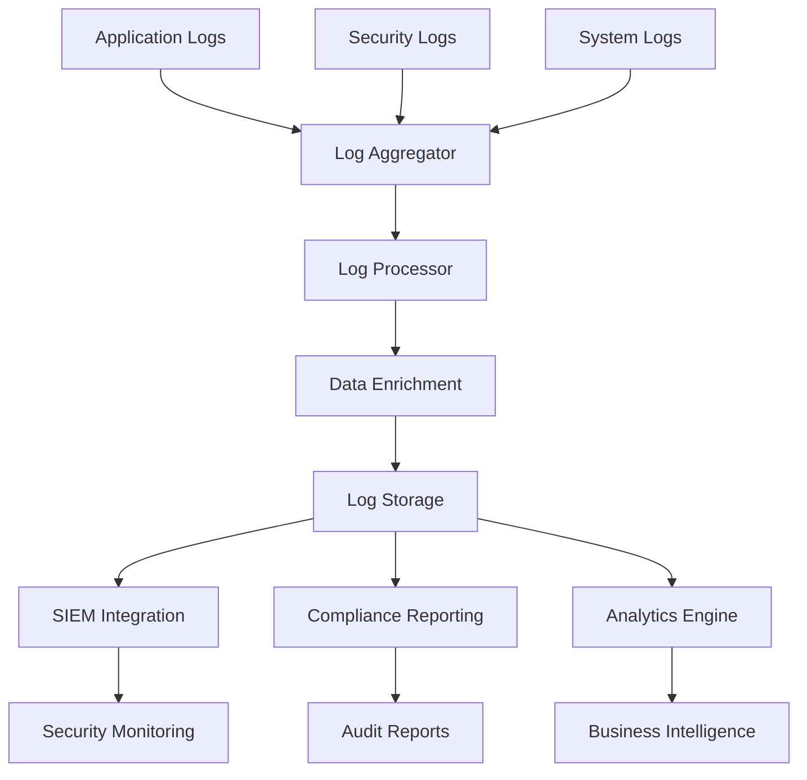
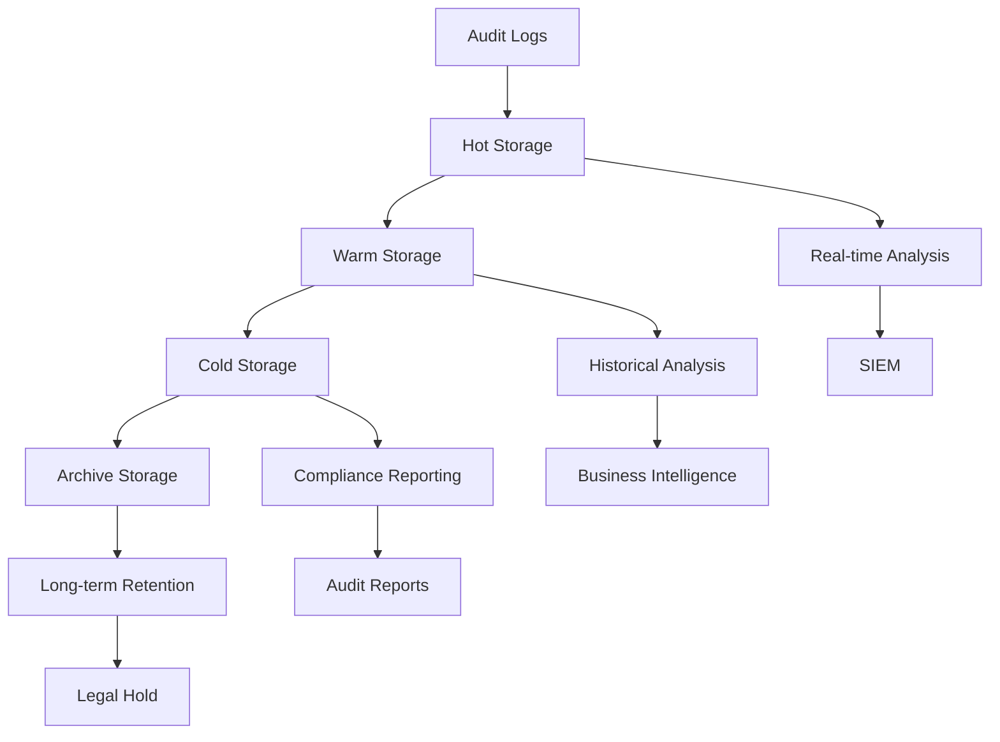
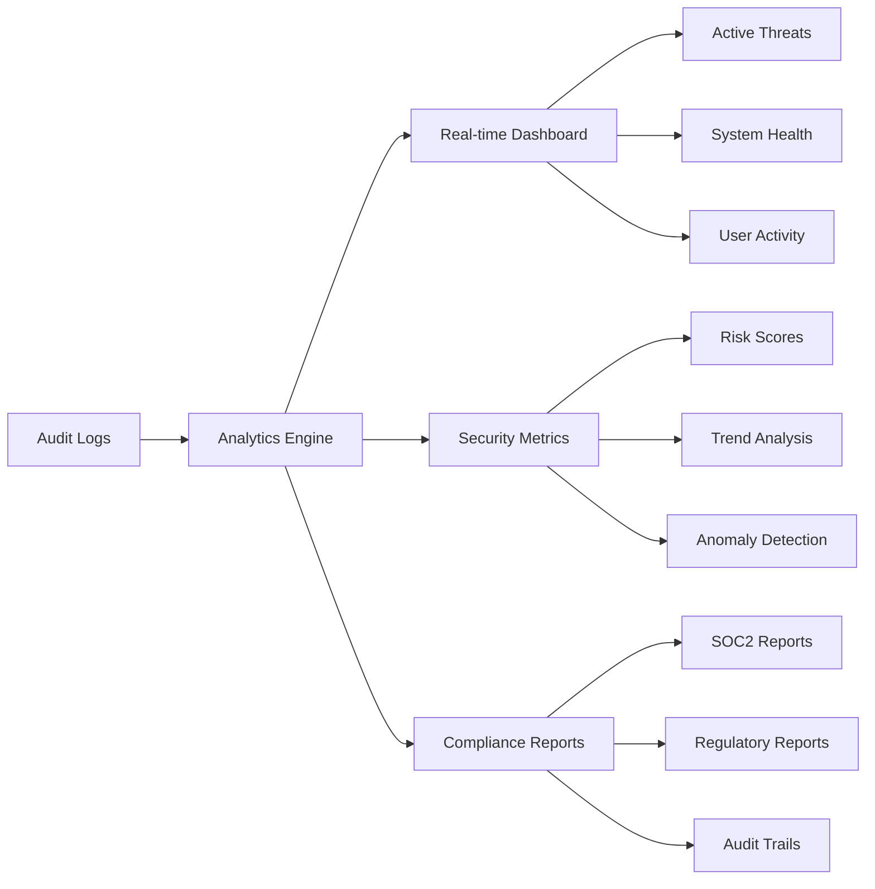

# Audit Logging

## Overview

Earna AI's Audit Logging System provides comprehensive logging, monitoring, and analysis of all system activities to ensure security, compliance, and operational transparency. Our logging framework supports SOC2 Type II requirements and regulatory compliance obligations.

## Audit Log Architecture

### Core Logging Components

```typescript
interface AuditLogEvent {
  eventId: string
  timestamp: Date
  eventType: AuditEventType
  userId?: string
  sessionId?: string
  ipAddress: string
  userAgent?: string
  resource: string
  action: string
  outcome: 'success' | 'failure' | 'pending'
  riskLevel: 'low' | 'medium' | 'high' | 'critical'
  metadata: Record<string, any>
  contextData: ContextualData
}

interface ContextualData {
  geolocation?: GeolocationData
  deviceInfo?: DeviceFingerprint
  applicationContext?: ApplicationContext
  businessContext?: BusinessContext
}

enum AuditEventType {
  AUTHENTICATION = 'authentication',
  AUTHORIZATION = 'authorization',
  DATA_ACCESS = 'data_access',
  CONFIGURATION_CHANGE = 'config_change',
  SYSTEM_EVENT = 'system_event',
  SECURITY_EVENT = 'security_event',
  COMPLIANCE_EVENT = 'compliance_event',
  FINANCIAL_TRANSACTION = 'financial_transaction'
}
```

### Centralized Logging System



## Log Categories and Requirements

### Authentication and Access Logs

```typescript
interface AuthenticationLog extends AuditLogEvent {
  eventType: AuditEventType.AUTHENTICATION
  authMethod: 'password' | 'mfa' | 'sso' | 'api_key' | 'certificate'
  authResult: 'success' | 'failure' | 'locked' | 'expired'
  failureReason?: string
  mfaMethod?: 'totp' | 'sms' | 'email' | 'hardware_token'
  previousLoginTime?: Date
  deviceTrust?: 'trusted' | 'untrusted' | 'new'
}

interface AuthorizationLog extends AuditLogEvent {
  eventType: AuditEventType.AUTHORIZATION
  requestedResource: string
  requestedAction: string
  permissions: string[]
  roleContext: string[]
  authorizationResult: 'granted' | 'denied' | 'escalated'
  policyEvaluated: string[]
}
```

### Data Access and Modification Logs

```typescript
interface DataAccessLog extends AuditLogEvent {
  eventType: AuditEventType.DATA_ACCESS
  dataType: 'customer_data' | 'financial_data' | 'pii' | 'system_config' | 'audit_log'
  dataClassification: 'public' | 'internal' | 'confidential' | 'restricted'
  accessMethod: 'read' | 'write' | 'delete' | 'export' | 'import'
  recordCount?: number
  dataRetentionPolicy?: string
  encryptionStatus: boolean
  backupStatus?: boolean
}

class AuditLogger {
  private logStore: LogStore
  private encryptionService: EncryptionService

  async logDataAccess(event: DataAccessEvent): Promise<void> {
    const auditLog: DataAccessLog = {
      eventId: this.generateEventId(),
      timestamp: new Date(),
      eventType: AuditEventType.DATA_ACCESS,
      userId: event.userId,
      sessionId: event.sessionId,
      ipAddress: event.ipAddress,
      resource: event.resource,
      action: event.action,
      outcome: event.outcome,
      riskLevel: this.calculateRiskLevel(event),
      dataType: event.dataType,
      dataClassification: event.dataClassification,
      accessMethod: event.accessMethod,
      recordCount: event.recordCount,
      encryptionStatus: event.encryptionStatus,
      metadata: this.enrichMetadata(event),
      contextData: await this.gatherContext(event)
    }

    // Encrypt sensitive log data
    const encryptedLog = await this.encryptionService.encryptAuditLog(auditLog)

    // Store with integrity protection
    await this.logStore.storeWithIntegrity(encryptedLog)

    // Real-time security analysis
    if (auditLog.riskLevel === 'critical' || auditLog.riskLevel === 'high') {
      await this.triggerSecurityAlert(auditLog)
    }
  }
}
```

## System and Configuration Logs

### Configuration Change Tracking

```yaml
configuration_logging:
  tracked_changes:
    - system_configurations
    - security_policies
    - user_permissions
    - network_configurations
    - encryption_settings
    - backup_configurations
    - monitoring_rules
    - compliance_settings

  change_attributes:
    - change_type: "create|update|delete|restore"
    - old_value: "previous_configuration"
    - new_value: "updated_configuration"
    - change_reason: "business_justification"
    - approval_reference: "change_request_id"
    - rollback_capability: boolean

  notification_triggers:
    critical_changes:
      - security_policy_modifications
      - admin_privilege_changes
      - encryption_key_rotations
      - compliance_setting_updates

    recipients:
      - security_team
      - compliance_team
      - system_administrators
```

### System Event Logging

```typescript
interface SystemEventLog extends AuditLogEvent {
  eventType: AuditEventType.SYSTEM_EVENT
  systemComponent: string
  eventCategory: 'startup' | 'shutdown' | 'error' | 'warning' | 'performance'
  severity: 'info' | 'warning' | 'error' | 'critical'
  errorCode?: string
  stackTrace?: string
  performanceMetrics?: PerformanceMetrics
  systemHealth: SystemHealthStatus
}

interface PerformanceMetrics {
  cpuUsage: number
  memoryUsage: number
  diskUsage: number
  networkLatency: number
  responseTime: number
  throughput: number
}
```

## Security Event Logging

### Security Incident Tracking

```typescript
interface SecurityEventLog extends AuditLogEvent {
  eventType: AuditEventType.SECURITY_EVENT
  securityEventType: SecurityEventType
  threatIndicators: ThreatIndicator[]
  attackVector?: string
  mitigationActions: MitigationAction[]
  forensicData: ForensicData
  incidentSeverity: 'low' | 'medium' | 'high' | 'critical'
  responseTime: number
}

enum SecurityEventType {
  FAILED_AUTHENTICATION = 'failed_authentication',
  PRIVILEGE_ESCALATION = 'privilege_escalation',
  SUSPICIOUS_ACTIVITY = 'suspicious_activity',
  MALWARE_DETECTION = 'malware_detection',
  DATA_EXFILTRATION = 'data_exfiltration',
  VULNERABILITY_EXPLOITATION = 'vulnerability_exploitation',
  POLICY_VIOLATION = 'policy_violation',
  INTRUSION_ATTEMPT = 'intrusion_attempt'
}

class SecurityEventLogger {
  async logSecurityEvent(event: SecurityEvent): Promise<void> {
    const securityLog: SecurityEventLog = {
      eventId: this.generateSecurityEventId(),
      timestamp: new Date(),
      eventType: AuditEventType.SECURITY_EVENT,
      securityEventType: event.type,
      userId: event.userId,
      ipAddress: event.ipAddress,
      resource: event.resource,
      action: event.action,
      outcome: event.outcome,
      riskLevel: 'critical',
      threatIndicators: event.threatIndicators,
      attackVector: event.attackVector,
      mitigationActions: await this.getActiveMitigations(event),
      forensicData: await this.collectForensicData(event),
      incidentSeverity: this.calculateIncidentSeverity(event),
      responseTime: this.calculateResponseTime(event),
      metadata: event.metadata,
      contextData: await this.gatherSecurityContext(event)
    }

    // Immediate storage with high priority
    await this.storeSecurityLog(securityLog)

    // Trigger automated response
    await this.triggerSecurityResponse(securityLog)

    // Notify security team
    await this.notifySecurityTeam(securityLog)
  }
}
```

## Log Storage and Retention

### Storage Architecture



### Retention Policy Configuration

```yaml
log_retention_policy:
  authentication_logs:
    hot_storage: "30_days"
    warm_storage: "1_year"
    cold_storage: "7_years"
    archive_storage: "indefinite"

  data_access_logs:
    hot_storage: "90_days"
    warm_storage: "2_years"
    cold_storage: "7_years"
    archive_storage: "indefinite"

  security_logs:
    hot_storage: "90_days"
    warm_storage: "3_years"
    cold_storage: "10_years"
    archive_storage: "indefinite"

  system_logs:
    hot_storage: "30_days"
    warm_storage: "1_year"
    cold_storage: "3_years"
    archive_storage: "7_years"

  compliance_logs:
    hot_storage: "1_year"
    warm_storage: "3_years"
    cold_storage: "10_years"
    archive_storage: "indefinite"

  storage_encryption:
    at_rest: true
    in_transit: true
    key_rotation: "quarterly"
    backup_encryption: true
```

## Log Analysis and Monitoring

### Automated Analysis Pipeline

```typescript
class LogAnalysisEngine {
  private mlModels: MachineLearningModels
  private ruleEngine: SecurityRuleEngine
  private correlationEngine: EventCorrelationEngine

  async analyzeLogStream(logs: AuditLogEvent[]): Promise<AnalysisResult[]> {
    const results: AnalysisResult[] = []

    // Real-time rule-based analysis
    for (const log of logs) {
      const ruleResults = await this.ruleEngine.evaluate(log)
      if (ruleResults.triggered) {
        results.push({
          type: 'rule_violation',
          severity: ruleResults.severity,
          description: ruleResults.description,
          recommendations: ruleResults.recommendations
        })
      }
    }

    // Machine learning anomaly detection
    const anomalies = await this.mlModels.detectAnomalies(logs)
    results.push(...anomalies)

    // Event correlation analysis
    const correlations = await this.correlationEngine.correlateLogs(logs)
    results.push(...correlations)

    // Generate alerts for high-priority findings
    await this.generateAlerts(results.filter(r => r.severity === 'high' || r.severity === 'critical'))

    return results
  }

  async generateComplianceReport(period: DateRange): Promise<ComplianceReport> {
    const logs = await this.retrieveLogsByPeriod(period)

    return {
      period,
      totalEvents: logs.length,
      authenticationEvents: logs.filter(l => l.eventType === AuditEventType.AUTHENTICATION).length,
      dataAccessEvents: logs.filter(l => l.eventType === AuditEventType.DATA_ACCESS).length,
      securityEvents: logs.filter(l => l.eventType === AuditEventType.SECURITY_EVENT).length,
      failedAttempts: logs.filter(l => l.outcome === 'failure').length,
      privilegedAccess: this.countPrivilegedAccess(logs),
      policyViolations: this.countPolicyViolations(logs),
      complianceScore: this.calculateComplianceScore(logs)
    }
  }
}
```

### Security Analytics Dashboard



## Log Integrity and Tamper Protection

### Cryptographic Protection

```typescript
class LogIntegrityManager {
  private hashChain: HashChain
  private digitalSignature: DigitalSignatureService
  private timestampService: TimestampService

  async protectLogIntegrity(log: AuditLogEvent): Promise<ProtectedLog> {
    // Generate cryptographic hash
    const logHash = await this.generateLogHash(log)

    // Add to hash chain for tamper detection
    const chainEntry = await this.hashChain.addEntry(logHash)

    // Digital signature for non-repudiation
    const signature = await this.digitalSignature.sign(log, logHash)

    // Trusted timestamp
    const timestamp = await this.timestampService.timestamp(logHash)

    return {
      originalLog: log,
      hash: logHash,
      chainPosition: chainEntry.position,
      previousHash: chainEntry.previousHash,
      signature: signature,
      timestamp: timestamp,
      integrity: 'protected'
    }
  }

  async verifyLogIntegrity(protectedLog: ProtectedLog): Promise<IntegrityResult> {
    // Verify hash
    const computedHash = await this.generateLogHash(protectedLog.originalLog)
    const hashValid = computedHash === protectedLog.hash

    // Verify chain integrity
    const chainValid = await this.hashChain.verifyChain(protectedLog.chainPosition)

    // Verify digital signature
    const signatureValid = await this.digitalSignature.verify(
      protectedLog.originalLog,
      protectedLog.signature
    )

    // Verify timestamp
    const timestampValid = await this.timestampService.verify(protectedLog.timestamp)

    return {
      overall: hashValid && chainValid && signatureValid && timestampValid,
      hashIntegrity: hashValid,
      chainIntegrity: chainValid,
      signatureIntegrity: signatureValid,
      timestampIntegrity: timestampValid
    }
  }
}
```

## Compliance and Reporting

### SOC2 Compliance Logging

```yaml
soc2_logging_requirements:
  security_principle:
    user_authentication: "log_all_attempts"
    authorization_decisions: "log_all_decisions"
    system_access: "log_privileged_access"
    configuration_changes: "log_all_changes"

  availability_principle:
    system_monitoring: "continuous_logging"
    performance_metrics: "log_performance_data"
    capacity_management: "log_resource_usage"
    backup_operations: "log_backup_activities"

  processing_integrity:
    data_validation: "log_validation_results"
    error_handling: "log_all_errors"
    data_transformation: "log_processing_steps"
    transaction_processing: "log_financial_transactions"

  confidentiality_principle:
    data_encryption: "log_encryption_operations"
    data_classification: "log_classification_decisions"
    access_restrictions: "log_confidential_access"
    data_transmission: "log_secure_transmissions"

  privacy_principle:
    personal_data_access: "log_pii_access"
    consent_management: "log_consent_changes"
    data_retention: "log_retention_actions"
    data_deletion: "log_deletion_activities"
```

### Automated Compliance Reporting

```typescript
class ComplianceReportGenerator {
  async generateSOC2Report(period: DateRange): Promise<SOC2ComplianceReport> {
    const logs = await this.getComplianceLogs(period)

    return {
      reportPeriod: period,
      securityControls: {
        userAuthentication: this.analyzeAuthenticationLogs(logs),
        systemAccess: this.analyzeAccessLogs(logs),
        configurationManagement: this.analyzeConfigLogs(logs),
        logicalSecurity: this.analyzeSecurityLogs(logs)
      },
      availabilityControls: {
        systemMonitoring: this.analyzeMonitoringLogs(logs),
        changeManagement: this.analyzeChangeLogs(logs),
        backupRecovery: this.analyzeBackupLogs(logs)
      },
      processingIntegrityControls: {
        dataValidation: this.analyzeValidationLogs(logs),
        errorHandling: this.analyzeErrorLogs(logs),
        transactionProcessing: this.analyzeTransactionLogs(logs)
      },
      confidentialityControls: {
        dataEncryption: this.analyzeEncryptionLogs(logs),
        accessRestrictions: this.analyzeAccessRestrictionLogs(logs)
      },
      privacyControls: {
        personalDataHandling: this.analyzePIILogs(logs),
        consentManagement: this.analyzeConsentLogs(logs),
        dataRetention: this.analyzeRetentionLogs(logs)
      },
      exceptions: this.identifyExceptions(logs),
      recommendations: this.generateRecommendations(logs)
    }
  }
}
```

## Integration and APIs

### Audit Log API

```typescript
interface AuditLogAPI {
  // Log creation
  createLog(event: AuditLogEvent): Promise<string>
  batchCreateLogs(events: AuditLogEvent[]): Promise<string[]>

  // Log retrieval
  getLogs(filter: LogFilter): Promise<AuditLogEvent[]>
  getLogById(eventId: string): Promise<AuditLogEvent>
  searchLogs(query: SearchQuery): Promise<SearchResult>

  // Analytics
  getSecurityMetrics(period: DateRange): Promise<SecurityMetrics>
  getComplianceReport(type: ComplianceType, period: DateRange): Promise<ComplianceReport>

  // Administrative
  verifyLogIntegrity(eventId: string): Promise<IntegrityResult>
  exportLogs(filter: LogFilter, format: ExportFormat): Promise<ExportResult>
}
```

### SIEM Integration

```yaml
siem_integration:
  supported_formats:
    - syslog_rfc3164
    - syslog_rfc5424
    - json_over_tcp
    - splunk_hec
    - elasticsearch_bulk
    - kafka_streams

  real_time_streaming:
    protocol: "tcp_tls"
    compression: "gzip"
    batch_size: 1000
    flush_interval: "30_seconds"
    retry_policy: "exponential_backoff"

  field_mapping:
    timestamp: "@timestamp"
    severity: "level"
    user_id: "user.id"
    ip_address: "source.ip"
    event_type: "event.category"
    outcome: "event.outcome"
```

## Contact Information

For audit logging inquiries:
- **Email**: audit-logs@earna.ai
- **Slack**: #security-audit-logs
- **Emergency**: security-incident@earna.ai

## Next Steps

1. Implement comprehensive log coverage across all systems
2. Deploy automated analysis and alerting capabilities
3. Establish log retention and archival procedures
4. Integrate with SIEM and compliance reporting tools
5. Conduct regular log integrity verification audits
