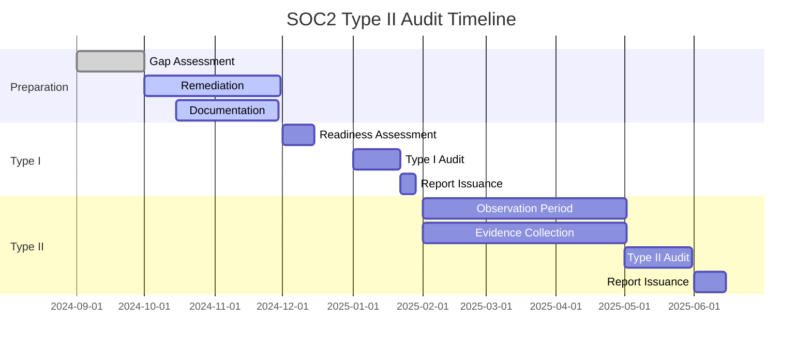

# SOC2 Type II Compliance

## Overview

REFLEKT is committed to achieving SOC2 Type II certification, demonstrating our dedication to security, availability, processing integrity, confidentiality, and privacy of customer data.

## Trust Service Criteria Implementation

### Security Principle (CC)

#### CC1: Control Environment

```typescript
// Organizational structure for security
interface SecurityGovernance {
  board: {
    oversightCommittee: 'Audit & Risk Committee'
    meetingFrequency: 'Quarterly'
    responsibilities: [
      'Risk management oversight',
      'Security policy approval',
      'Incident review',
      'Compliance monitoring'
    ]
  }
  management: {
    ciso: {
      reports_to: 'CEO',
      responsibilities: [
        'Security strategy',
        'Risk assessment',
        'Control implementation',
        'Security awareness'
      ]
    }
    securityTeam: {
      size: 5,
      roles: [
        'Security Architect',
        'Security Engineer',
        'Security Analyst',
        'Compliance Manager',
        'Security Operations'
      ]
    }
  }
}
```

#### CC2: Communication and Information

```yaml
# Security communication matrix
communication:
  internal:
    security_policies:
      channel: "Company wiki"
      frequency: "Updated annually"
      acknowledgment: "Required within 30 days"

    security_alerts:
      channel: "Slack #security-alerts"
      frequency: "As needed"
      escalation: "PagerDuty for critical"

    training:
      channel: "Learning Management System"
      frequency: "Onboarding + Annual"
      tracking: "Completion reports"

  external:
    security_posture:
      channel: "Security portal"
      content: "SOC2 report, policies"
      access: "NDA required"

    incident_notification:
      channel: "Email + Portal"
      timeline: "Within 72 hours"
      content: "Impact, remediation, prevention"
```

#### CC3: Risk Assessment

```typescript
// Risk assessment framework
interface RiskAssessment {
  methodology: 'NIST CSF + ISO 27005'
  frequency: 'Annual + Major changes'
  categories: RiskCategory[]
  treatment: RiskTreatment[]
}

interface RiskCategory {
  name: string
  inherentRisk: RiskLevel
  controls: Control[]
  residualRisk: RiskLevel
}

enum RiskLevel {
  CRITICAL = 5,
  HIGH = 4,
  MEDIUM = 3,
  LOW = 2,
  MINIMAL = 1
}

const riskRegister: RiskCategory[] = [
  {
    name: 'Data Breach',
    inherentRisk: RiskLevel.CRITICAL,
    controls: [
      'Encryption at rest',
      'Access controls',
      'DLP policies',
      'Security monitoring'
    ],
    residualRisk: RiskLevel.LOW
  },
  {
    name: 'Service Disruption',
    inherentRisk: RiskLevel.HIGH,
    controls: [
      'Redundant infrastructure',
      'Auto-scaling',
      'DDoS protection',
      'Incident response'
    ],
    residualRisk: RiskLevel.LOW
  },
  {
    name: 'Insider Threat',
    inherentRisk: RiskLevel.HIGH,
    controls: [
      'Background checks',
      'Access reviews',
      'Activity monitoring',
      'Segregation of duties'
    ],
    residualRisk: RiskLevel.MEDIUM
  }
]
```

#### CC4: Monitoring Activities

```typescript
// Continuous monitoring implementation
class SecurityMonitoring {
  private monitors: Monitor[] = [
    {
      name: 'Access Monitoring',
      tool: 'Splunk',
      checks: [
        'Failed login attempts',
        'Privilege escalation',
        'Unusual access patterns',
        'After-hours access'
      ],
      frequency: 'Real-time',
      alerts: true
    },
    {
      name: 'Vulnerability Scanning',
      tool: 'Qualys',
      checks: [
        'Infrastructure vulnerabilities',
        'Application vulnerabilities',
        'Configuration compliance',
        'Missing patches'
      ],
      frequency: 'Weekly',
      alerts: true
    },
    {
      name: 'Log Analysis',
      tool: 'ELK Stack',
      checks: [
        'Error patterns',
        'Security events',
        'Performance anomalies',
        'Compliance violations'
      ],
      frequency: 'Continuous',
      alerts: true
    }
  ]

  async performMonitoring(): Promise<MonitoringReport> {
    const results = await Promise.all(
      this.monitors.map(m => this.runMonitor(m))
    )

    return {
      timestamp: new Date(),
      results,
      issues: results.filter(r => r.hasIssues),
      metrics: this.calculateMetrics(results)
    }
  }
}
```

#### CC5: Control Activities

```yaml
# Control implementation matrix
controls:
  preventive:
    - id: CC5.1
      name: "Access Control"
      implementation: "RBAC with MFA"
      testing: "Quarterly access review"

    - id: CC5.2
      name: "Change Management"
      implementation: "GitOps with approval workflow"
      testing: "Monthly change audit"

    - id: CC5.3
      name: "Data Loss Prevention"
      implementation: "DLP policies in GCP"
      testing: "Quarterly DLP test"

  detective:
    - id: CC5.4
      name: "Security Monitoring"
      implementation: "SIEM with correlation rules"
      testing: "Weekly rule review"

    - id: CC5.5
      name: "Audit Logging"
      implementation: "Centralized logging"
      testing: "Daily log review"

  corrective:
    - id: CC5.6
      name: "Incident Response"
      implementation: "Documented IR procedures"
      testing: "Quarterly tabletop exercise"

    - id: CC5.7
      name: "Backup & Recovery"
      implementation: "Automated daily backups"
      testing: "Monthly restore test"
```

#### CC6: Logical and Physical Access

```typescript
// Access control implementation
interface AccessControl {
  logical: {
    authentication: {
      methods: ['SSO', 'MFA', 'Biometric']
      passwordPolicy: {
        minLength: 12
        complexity: true
        rotation: 90 // days
        history: 12  // passwords
      }
      mfa: {
        required: true
        methods: ['TOTP', 'SMS', 'Hardware token']
      }
    }
    authorization: {
      model: 'RBAC + ABAC'
      roles: Role[]
      reviews: 'Quarterly'
      provisioning: 'Automated with approval'
      deprovisioning: 'Immediate on termination'
    }
  }
  physical: {
    datacenters: {
      provider: 'Google Cloud'
      certifications: ['SOC2', 'ISO 27001', 'PCI DSS']
      access: 'Restricted to GCP personnel'
    }
    offices: {
      access: 'Badge + PIN'
      visitors: 'Escort required'
      cameras: 'All entry points'
      retention: '90 days'
    }
  }
}
```

#### CC7: System Operations

```yaml
# Operational procedures
operations:
  infrastructure:
    monitoring:
      - metric: "CPU utilization"
        threshold: 80%
        action: "Auto-scale"

      - metric: "Memory usage"
        threshold: 85%
        action: "Alert + investigate"

      - metric: "Disk usage"
        threshold: 90%
        action: "Cleanup + expand"

    maintenance:
      patching:
        frequency: "Monthly"
        testing: "Staging first"
        rollback: "Automated"

      updates:
        approval: "Change Advisory Board"
        window: "Sunday 2-6 AM"
        notification: "48 hours advance"

    capacity:
      planning: "Quarterly review"
      metrics: ["Growth rate", "Peak usage", "Trends"]
      buffer: "30% headroom"
```

#### CC8: Change Management

```typescript
// Change management process
class ChangeManagement {
  async requestChange(change: ChangeRequest): Promise<ChangeResult> {
    // Validate change request
    const validation = await this.validateChange(change)
    if (!validation.isValid) {
      return { status: 'rejected', reason: validation.errors }
    }

    // Risk assessment
    const risk = await this.assessRisk(change)

    // Approval workflow
    const approvals = await this.getApprovals(change, risk)
    if (!approvals.allApproved) {
      return { status: 'rejected', reason: 'Missing approvals' }
    }

    // Testing
    const testResult = await this.testChange(change)
    if (!testResult.passed) {
      return { status: 'failed', reason: testResult.errors }
    }

    // Implementation
    const implementation = await this.implementChange(change)

    // Verification
    const verification = await this.verifyChange(implementation)

    return {
      status: 'completed',
      changeId: implementation.id,
      verification: verification
    }
  }

  private approvalMatrix = {
    [RiskLevel.CRITICAL]: ['CTO', 'CISO', 'CAB'],
    [RiskLevel.HIGH]: ['Engineering Lead', 'Security Lead'],
    [RiskLevel.MEDIUM]: ['Team Lead', 'Peer Review'],
    [RiskLevel.LOW]: ['Peer Review'],
    [RiskLevel.MINIMAL]: ['Automated']
  }
}
```

#### CC9: Risk Mitigation

```yaml
# Risk mitigation strategies
mitigation:
  technical:
    - risk: "Data breach"
      controls:
        - "Encryption at rest (AES-256)"
        - "Encryption in transit (TLS 1.3)"
        - "Access controls (RBAC + MFA)"
        - "DLP policies"
        - "Security monitoring"

    - risk: "Service disruption"
      controls:
        - "Multi-region deployment"
        - "Auto-scaling"
        - "Load balancing"
        - "DDoS protection"
        - "Disaster recovery"

    - risk: "Compliance violation"
      controls:
        - "Automated compliance scanning"
        - "Policy enforcement"
        - "Audit logging"
        - "Regular assessments"
        - "Training program"

  administrative:
    - risk: "Insider threat"
      controls:
        - "Background checks"
        - "Security awareness training"
        - "Segregation of duties"
        - "Activity monitoring"
        - "Access reviews"

    - risk: "Third-party risk"
      controls:
        - "Vendor assessments"
        - "Contractual requirements"
        - "Regular reviews"
        - "Data processing agreements"
        - "Right to audit"
```

### Additional Trust Service Criteria

#### Availability (A1)

```typescript
// Availability targets and monitoring
interface AvailabilityMetrics {
  sla: {
    target: 99.9  // percentage
    measurement: 'Monthly'
    exclusions: ['Planned maintenance', 'Force majeure']
  }
  monitoring: {
    uptime: {
      tool: 'Pingdom'
      frequency: '1 minute'
      locations: ['US-East', 'US-West', 'EU', 'APAC']
    }
    performance: {
      tool: 'New Relic'
      metrics: ['Response time', 'Error rate', 'Throughput']
      alerting: true
    }
  }
  redundancy: {
    infrastructure: 'Multi-region active-active'
    database: 'Primary with read replicas'
    network: 'Multiple ISPs and CDN'
    backup: 'Daily with geo-replication'
  }
}
```

#### Processing Integrity (PI1)

```typescript
// Data processing controls
class ProcessingIntegrity {
  async validateTransaction(transaction: Transaction): Promise<ValidationResult> {
    const checks = [
      this.checkCompleteness(transaction),
      this.checkAccuracy(transaction),
      this.checkValidity(transaction),
      this.checkAuthorization(transaction),
      this.checkTimeliness(transaction)
    ]

    const results = await Promise.all(checks)
    const failed = results.filter(r => !r.passed)

    if (failed.length > 0) {
      await this.logValidationFailure(transaction, failed)
      return {
        valid: false,
        errors: failed.map(f => f.error)
      }
    }

    return { valid: true }
  }

  private async checkCompleteness(tx: Transaction): Promise<CheckResult> {
    const requiredFields = ['amount', 'from', 'to', 'timestamp', 'signature']
    const missing = requiredFields.filter(f => !tx[f])

    return {
      passed: missing.length === 0,
      error: missing.length > 0 ? `Missing fields: ${missing.join(', ')}` : null
    }
  }
}
```

#### Confidentiality (C1)

```yaml
# Confidentiality controls
confidentiality:
  classification:
    levels:
      - name: "Public"
        controls: "No special handling"
        examples: ["Marketing content", "Public documentation"]

      - name: "Internal"
        controls: "Internal access only"
        examples: ["Employee data", "Internal docs"]

      - name: "Confidential"
        controls: "Need-to-know + encryption"
        examples: ["Customer data", "Financial records"]

      - name: "Restricted"
        controls: "Strict access + audit"
        examples: ["Encryption keys", "Security credentials"]

  handling:
    storage:
      Public: "Standard storage"
      Internal: "Access controlled storage"
      Confidential: "Encrypted storage"
      Restricted: "HSM or secure enclave"

    transmission:
      Public: "HTTPS"
      Internal: "HTTPS + VPN"
      Confidential: "TLS 1.3 + encryption"
      Restricted: "Dedicated encrypted channel"

    disposal:
      Public: "Standard deletion"
      Internal: "Secure deletion"
      Confidential: "Crypto-shredding"
      Restricted: "Physical destruction"
```

#### Privacy (P1)

```typescript
// Privacy controls implementation
interface PrivacyControls {
  notice: {
    privacyPolicy: {
      url: '/privacy'
      lastUpdated: '2024-01-01'
      languages: ['en', 'fr']
      acknowledgment: 'Required on signup'
    }
    dataCollection: {
      purposes: ['Service delivery', 'Analytics', 'Security']
      lawfulBasis: ['Consent', 'Contract', 'Legitimate interest']
      retention: 'As per policy'
    }
  }
  choice: {
    consent: {
      granular: true
      withdrawable: true
      preferences: '/settings/privacy'
    }
    optOut: {
      marketing: true
      analytics: true
      dataSale: 'Not applicable - no data sale'
    }
  }
  access: {
    dataPortability: {
      format: 'JSON/CSV'
      method: 'Self-service portal'
      timeline: 'Within 30 days'
    }
    correction: {
      method: 'Portal or support'
      verification: 'Identity verification required'
      timeline: 'Within 30 days'
    }
  }
  security: {
    encryption: 'AES-256 at rest, TLS 1.3 in transit'
    access: 'Role-based with audit logging'
    breach: 'Notification within 72 hours'
  }
}
```

## Evidence Collection

### Control Testing

```yaml
# Testing procedures for SOC2 audit
testing:
  frequency:
    access_reviews: "Quarterly"
    vulnerability_scans: "Weekly"
    penetration_tests: "Annual"
    backup_restoration: "Monthly"
    incident_response: "Quarterly (tabletop)"
    security_training: "Annual"

  evidence:
    screenshots:
      - "Access control matrices"
      - "Security configurations"
      - "Monitoring dashboards"
      - "Audit logs"

    reports:
      - "Vulnerability scan reports"
      - "Penetration test reports"
      - "Access review reports"
      - "Training completion reports"

    documents:
      - "Policies and procedures"
      - "Risk assessments"
      - "Incident reports"
      - "Change tickets"
```

### Continuous Compliance

```typescript
// Automated compliance monitoring
class ComplianceMonitor {
  async checkCompliance(): Promise<ComplianceReport> {
    const checks = {
      accessControl: await this.checkAccessControl(),
      encryption: await this.checkEncryption(),
      logging: await this.checkLogging(),
      patching: await this.checkPatching(),
      backups: await this.checkBackups(),
      training: await this.checkTraining()
    }

    const issues = Object.entries(checks)
      .filter(([_, result]) => !result.compliant)
      .map(([control, result]) => ({
        control,
        issues: result.issues,
        remediation: result.remediation
      }))

    return {
      timestamp: new Date(),
      compliant: issues.length === 0,
      score: this.calculateComplianceScore(checks),
      issues,
      nextReview: this.getNextReviewDate()
    }
  }
}
```

## Audit Preparation

### Documentation Requirements

| Document | Purpose | Update Frequency |
|----------|---------|------------------|
| System Description | Overview of environment | Annual |
| Network Diagram | Infrastructure topology | Quarterly |
| Data Flow Diagram | Data processing flows | Semi-annual |
| Risk Assessment | Risk identification and treatment | Annual |
| Security Policies | Governance documentation | Annual |
| Control Matrix | Control implementation details | Quarterly |
| Testing Evidence | Proof of control effectiveness | Ongoing |

### Timeline



## Next Steps

1. [Data Protection](/security/data-protection) - Encryption and data security
2. [Access Control](/security/access-control) - Authentication and authorization
3. [Incident Response](/security/incident-response) - Response procedures
4. [Audit Logging](/security/audit-logging) - Logging and monitoring
