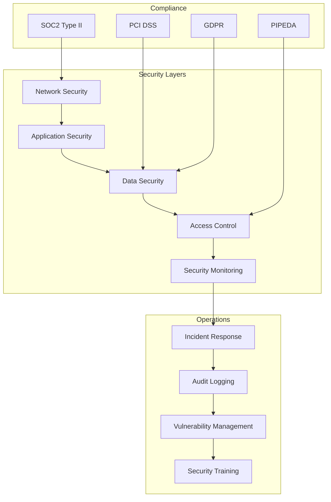
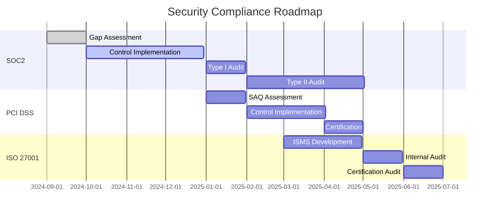

# Security Overview

## Introduction

Earna AI implements comprehensive security measures aligned with SOC2 Type II requirements, ensuring the protection of sensitive financial data and maintaining the highest standards of information security.

## Security Framework



## SOC2 Trust Service Criteria

### Security (Common Criteria)
- Firewalls and network segmentation
- Intrusion detection and prevention
- Multi-factor authentication
- Encryption at rest and in transit
- Regular security assessments

### Availability
- 99.9% uptime SLA
- Redundant infrastructure
- Disaster recovery procedures
- Load balancing and auto-scaling
- Regular backup testing

### Processing Integrity
- Data validation controls
- Transaction monitoring
- Error handling procedures
- Reconciliation processes
- Audit trails

### Confidentiality
- Data classification
- Encryption standards
- Access restrictions
- Non-disclosure agreements
- Secure disposal procedures

### Privacy
- Privacy policy compliance
- Consent management
- Data minimization
- Right to erasure
- Cross-border data transfers

## Security Architecture

### Defense in Depth

```typescript
// Security layers implementation
interface SecurityLayer {
  name: string
  controls: SecurityControl[]
  monitoring: MonitoringConfig
  alerts: AlertConfig[]
}

const securityArchitecture: SecurityLayer[] = [
  {
    name: 'Perimeter',
    controls: [
      { type: 'WAF', provider: 'Cloudflare' },
      { type: 'DDoS Protection', provider: 'Cloudflare' },
      { type: 'Rate Limiting', threshold: '100 req/min' }
    ],
    monitoring: {
      metrics: ['request_rate', 'error_rate', 'latency'],
      dashboard: 'perimeter-security'
    },
    alerts: [
      { metric: 'error_rate', threshold: 0.05, severity: 'high' },
      { metric: 'request_rate', threshold: 1000, severity: 'medium' }
    ]
  },
  {
    name: 'Application',
    controls: [
      { type: 'Authentication', method: 'OAuth2 + MFA' },
      { type: 'Authorization', method: 'RBAC' },
      { type: 'Input Validation', framework: 'Zod' },
      { type: 'CSRF Protection', implementation: 'Double Submit Cookie' }
    ],
    monitoring: {
      metrics: ['auth_failures', 'unauthorized_access', 'validation_errors'],
      dashboard: 'application-security'
    },
    alerts: [
      { metric: 'auth_failures', threshold: 5, severity: 'high' },
      { metric: 'unauthorized_access', threshold: 1, severity: 'critical' }
    ]
  },
  {
    name: 'Data',
    controls: [
      { type: 'Encryption at Rest', algorithm: 'AES-256-GCM' },
      { type: 'Encryption in Transit', protocol: 'TLS 1.3' },
      { type: 'Key Management', service: 'Google KMS' },
      { type: 'Data Masking', fields: ['ssn', 'account_number'] }
    ],
    monitoring: {
      metrics: ['encryption_failures', 'key_rotation', 'data_access'],
      dashboard: 'data-security'
    },
    alerts: [
      { metric: 'encryption_failures', threshold: 1, severity: 'critical' },
      { metric: 'unusual_data_access', threshold: 'anomaly', severity: 'high' }
    ]
  }
]
```

## Key Security Controls

### 1. Infrastructure Security

| Control | Implementation | Frequency |
|---------|---------------|-----------|
| Network Segmentation | VPC with private subnets | Continuous |
| Firewall Rules | GCP Firewall, iptables | Continuous |
| IDS/IPS | Cloud Armor, Falco | Real-time |
| Vulnerability Scanning | Qualys, OWASP ZAP | Weekly |
| Patch Management | Automated OS updates | Monthly |

### 2. Application Security

| Control | Implementation | Frequency |
|---------|---------------|-----------|
| Code Review | GitHub PR reviews | Every commit |
| Static Analysis | SonarQube, Semgrep | Every build |
| Dynamic Testing | OWASP ZAP, Burp Suite | Weekly |
| Dependency Scanning | Snyk, Dependabot | Daily |
| Container Scanning | Trivy, Clair | Every deployment |

### 3. Data Security

| Control | Implementation | Standard |
|---------|---------------|----------|
| Encryption at Rest | AES-256-GCM | FIPS 140-2 |
| Encryption in Transit | TLS 1.3 | PCI DSS |
| Key Management | Google KMS | SOC2 |
| Data Classification | 4-tier system | Internal |
| Backup Encryption | AES-256-CBC | SOC2 |

### 4. Access Control

| Control | Implementation | Policy |
|---------|---------------|---------|
| Authentication | OAuth2 + MFA | Required for all users |
| Authorization | RBAC with permissions | Least privilege |
| Session Management | JWT with refresh tokens | 30-day expiry |
| Password Policy | 12+ chars, complexity | 90-day rotation |
| Privileged Access | PAM solution | Time-limited |

## Security Operations

### Security Incident Response

```typescript
// Incident response workflow
enum IncidentSeverity {
  CRITICAL = 'P1', // Data breach, system compromise
  HIGH = 'P2',     // Unauthorized access, service disruption
  MEDIUM = 'P3',   // Policy violation, suspicious activity
  LOW = 'P4'       // Minor security issues
}

interface IncidentResponse {
  severity: IncidentSeverity
  detection: string
  containment: string[]
  eradication: string[]
  recovery: string[]
  lessons: string[]
  timeline: {
    detected: Date
    contained: Date
    resolved: Date
  }
}

const incidentResponsePlan = {
  [IncidentSeverity.CRITICAL]: {
    responseTime: '15 minutes',
    team: ['Security Lead', 'CTO', 'Legal', 'PR'],
    actions: [
      'Isolate affected systems',
      'Preserve evidence',
      'Notify executives',
      'Engage forensics team',
      'Prepare disclosure'
    ]
  },
  [IncidentSeverity.HIGH]: {
    responseTime: '1 hour',
    team: ['Security Lead', 'DevOps Lead'],
    actions: [
      'Assess scope',
      'Implement containment',
      'Review logs',
      'Apply patches'
    ]
  }
}
```

### Continuous Monitoring

```yaml
# Security monitoring configuration
monitoring:
  siem:
    platform: "Splunk Cloud"
    data_sources:
      - application_logs
      - infrastructure_logs
      - security_events
      - audit_trails

  alerts:
    - name: "Multiple Failed Logins"
      query: "failed_login_count > 5 within 5m"
      severity: high
      action: block_ip

    - name: "Data Exfiltration"
      query: "outbound_data > 100MB"
      severity: critical
      action: alert_security_team

    - name: "Privilege Escalation"
      query: "role_change to admin"
      severity: high
      action: require_approval

  dashboards:
    - security_overview
    - threat_intelligence
    - compliance_status
    - incident_metrics
```

## Compliance Certifications

### Current Certifications
- **SOC2 Type II** - In progress (Q1 2025)
- **PCI DSS Level 2** - Planned (Q2 2025)
- **ISO 27001** - Planned (Q3 2025)

### Compliance Roadmap



## Security Policies

### Information Security Policy
- Annual review and updates
- Employee acknowledgment required
- Covers data handling, acceptable use, incident response

### Data Retention Policy
- Transaction data: 7 years
- Audit logs: 3 years
- User data: As per consent or legal requirement
- Secure disposal procedures

### Vendor Management Policy
- Security assessments for all vendors
- Annual reviews
- Data processing agreements
- Right to audit clauses

### Business Continuity Plan
- RTO: 4 hours
- RPO: 1 hour
- Quarterly DR drills
- Documented recovery procedures

## Security Training

### Employee Training Program

| Topic | Frequency | Audience |
|-------|-----------|----------|
| Security Awareness | Onboarding + Annual | All employees |
| Phishing Simulation | Quarterly | All employees |
| Secure Coding | Bi-annual | Developers |
| Incident Response | Quarterly | Security team |
| Compliance Training | Annual | Relevant teams |

### Security Champions Program
- Designated security champions per team
- Monthly security meetings
- Quarterly security challenges
- Annual security conference attendance

## Security Metrics & KPIs

### Key Performance Indicators

```typescript
interface SecurityKPIs {
  meanTimeToDetect: number      // Target: < 1 hour
  meanTimeToRespond: number     // Target: < 4 hours
  patchingCompliance: number     // Target: > 95%
  vulnerabilitiesOpen: number    // Target: < 10 critical
  securityTrainingCompletion: number // Target: 100%
  phishingTestFailureRate: number    // Target: < 5%
  auditFindingsOpen: number      // Target: 0 critical
  incidentsPerMonth: number      // Target: < 5
}

const currentMetrics: SecurityKPIs = {
  meanTimeToDetect: 45,         // minutes
  meanTimeToRespond: 180,       // minutes
  patchingCompliance: 98,       // percentage
  vulnerabilitiesOpen: 3,       // count
  securityTrainingCompletion: 95, // percentage
  phishingTestFailureRate: 3,   // percentage
  auditFindingsOpen: 0,         // count
  incidentsPerMonth: 2          // average
}
```

## Security Contacts

### Security Team
- **Chief Security Officer**: security@earna.ai
- **Security Operations**: soc@earna.ai
- **Incident Response**: incident@earna.ai

### External Contacts
- **Security Auditor**: [Audit Firm Name]
- **Forensics Team**: [Forensics Provider]
- **Legal Counsel**: [Law Firm]

### Reporting Security Issues
- **Email**: security@earna.ai
- **Bug Bounty**: https://hackerone.com/earna
- **Responsible Disclosure**: 90-day disclosure policy

## Next Steps

1. [SOC2 Compliance](/security/soc2-compliance) - Detailed SOC2 requirements
2. [Data Protection](/security/data-protection) - Encryption and data security
3. [Access Control](/security/access-control) - Authentication and authorization
4. [Incident Response](/security/incident-response) - Response procedures
