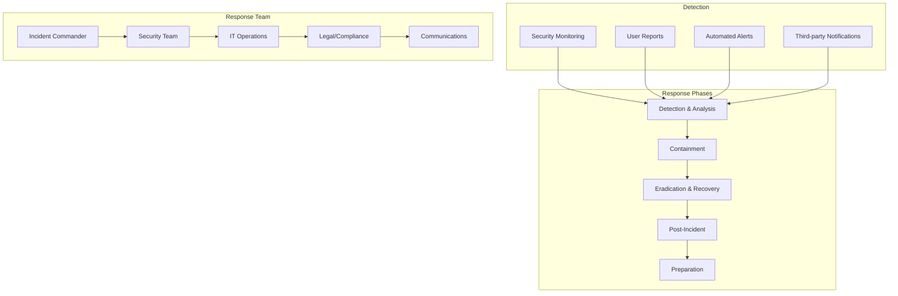
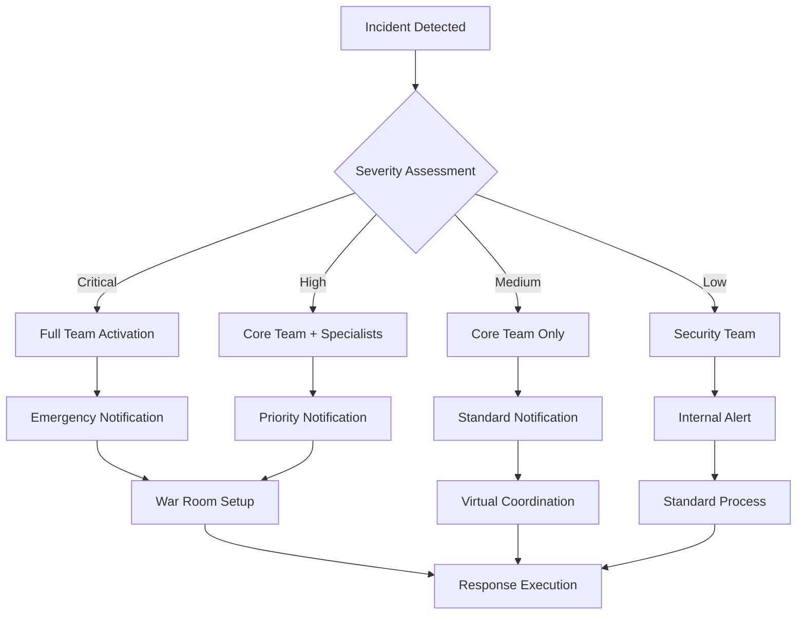
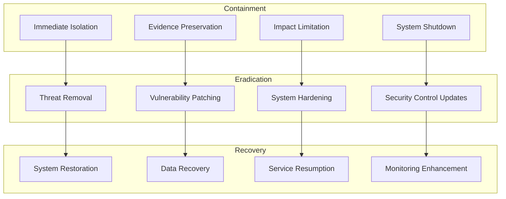
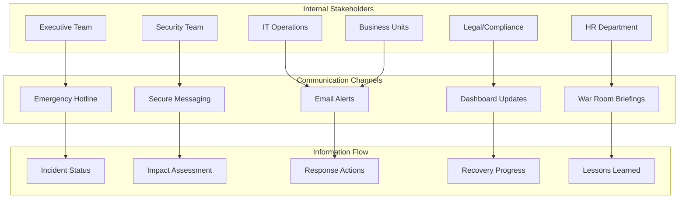

# Incident Response

## Overview

Incident response is a critical component of Earna AI's security program, providing structured processes for detecting, responding to, and recovering from security incidents. Our incident response framework is designed to minimize impact, preserve evidence, and ensure regulatory compliance.

## Incident Response Framework



## Incident Classification

### Severity Levels

```typescript
interface IncidentSeverity {
  critical: {
    definition: 'Major business impact or imminent threat'
    examples: [
      'Active data breach with customer data exposure',
      'Ransomware attack affecting core systems',
      'Complete system outage affecting customer services',
      'Confirmed insider threat with data exfiltration'
    ]
    responseTime: '15 minutes'
    escalation: 'CEO, CISO, Legal Counsel'
    externalNotification: 'May require immediate regulatory notification'
  }

  high: {
    definition: 'Significant impact to business operations'
    examples: [
      'Successful phishing attack with credential compromise',
      'Malware infection on multiple systems',
      'DDoS attack affecting service availability',
      'Unauthorized access to sensitive systems'
    ]
    responseTime: '1 hour'
    escalation: 'CISO, IT Director, Compliance Officer'
    externalNotification: 'Regulatory notification within 72 hours'
  }

  medium: {
    definition: 'Limited impact but requires investigation'
    examples: [
      'Suspicious network activity',
      'Failed security control',
      'Policy violation',
      'Potential data exposure'
    ]
    responseTime: '4 hours'
    escalation: 'Security Team Lead'
    externalNotification: 'If confirmed breach'
  }

  low: {
    definition: 'Minor security concern or false positive'
    examples: [
      'Isolated malware detection',
      'Single failed login attempts',
      'Minor configuration issues',
      'Routine security alerts'
    ]
    responseTime: '24 hours'
    escalation: 'Security Analyst'
    externalNotification: 'Not required'
  }
}
```

### Incident Categories

```yaml
incident_categories:
  data_breach:
    description: "Unauthorized access or disclosure of sensitive data"
    subcategories:
      - Customer PII exposure
      - Financial data breach
      - Employee data compromise
      - Intellectual property theft

  malware:
    description: "Malicious software affecting systems"
    subcategories:
      - Ransomware
      - Trojans
      - Worms
      - Spyware

  unauthorized_access:
    description: "Illegitimate system or data access"
    subcategories:
      - Account compromise
      - Privilege escalation
      - Insider threat
      - External intrusion

  denial_of_service:
    description: "Attacks designed to disrupt service availability"
    subcategories:
      - Network-based DDoS
      - Application-layer attacks
      - Resource exhaustion
      - Service disruption

  social_engineering:
    description: "Attacks targeting human vulnerabilities"
    subcategories:
      - Phishing
      - Vishing (voice phishing)
      - Pretexting
      - Baiting

  physical_security:
    description: "Physical threats to facilities or equipment"
    subcategories:
      - Unauthorized facility access
      - Equipment theft
      - Device tampering
      - Environmental incidents
```

## Incident Response Team (IRT)

### Team Structure

```typescript
interface IncidentResponseTeam {
  incidentCommander: {
    role: 'Overall incident coordination and decision making'
    responsibilities: [
      'Assess incident severity and impact',
      'Coordinate response activities',
      'Make critical decisions',
      'Communicate with stakeholders',
      'Ensure proper documentation'
    ]
    qualifications: 'Senior security professional with incident response experience'
    authority: 'Full authority to make response decisions'
  }

  securityLead: {
    role: 'Technical security analysis and response'
    responsibilities: [
      'Conduct technical analysis',
      'Implement security controls',
      'Coordinate with security tools',
      'Provide security expertise',
      'Lead forensic activities'
    ]
    qualifications: 'Security analyst with technical expertise'
  }

  itOperations: {
    role: 'System operations and technical implementation'
    responsibilities: [
      'Implement technical controls',
      'Manage system isolation/recovery',
      'Coordinate with infrastructure teams',
      'Perform system restoration',
      'Monitor system performance'
    ]
    qualifications: 'System administrator or DevOps engineer'
  }

  legalCompliance: {
    role: 'Legal and regulatory compliance guidance'
    responsibilities: [
      'Assess legal implications',
      'Advise on regulatory requirements',
      'Coordinate with external counsel',
      'Handle law enforcement interaction',
      'Manage legal preservation'
    ]
    qualifications: 'Legal counsel or compliance officer'
  }

  communications: {
    role: 'Internal and external communications'
    responsibilities: [
      'Manage internal communications',
      'Coordinate external notifications',
      'Handle media relations',
      'Prepare public statements',
      'Manage customer communications'
    ]
    qualifications: 'Communications or PR professional'
  }
}
```

### Team Activation



## Response Procedures

### Phase 1: Preparation

```yaml
preparation_activities:
  planning:
    - Incident response plan development
    - Playbook creation for common scenarios
    - Team role definitions and training
    - Communication plan development
    - Tool and technology preparation

  training:
    - Regular tabletop exercises
    - Incident response simulations
    - Team skill development
    - Cross-training for coverage
    - External training and certification

  tools_and_resources:
    - Incident tracking system
    - Forensic tools and software
    - Communication platforms
    - Documentation templates
    - Contact lists and escalation procedures

  monitoring:
    - Security monitoring tools
    - Log aggregation and analysis
    - Threat intelligence feeds
    - Automated alerting systems
    - Performance baseline establishment
```

### Phase 2: Detection and Analysis

```typescript
class IncidentDetection {
  async analyzeIncident(alert: SecurityAlert): Promise<IncidentAnalysis> {
    const analysis = {
      confidence: 0,
      severity: 'unknown' as IncidentSeverity,
      category: 'unknown' as IncidentCategory,
      indicators: [] as string[],
      affectedSystems: [] as string[],
      timeline: [] as TimelineEvent[]
    }

    // Initial triage
    const triage = await this.performTriage(alert)
    analysis.confidence = triage.confidence
    analysis.severity = triage.severity

    // Gather additional indicators
    const indicators = await this.gatherIndicators(alert)
    analysis.indicators = indicators

    // Identify affected systems
    const systems = await this.identifyAffectedSystems(indicators)
    analysis.affectedSystems = systems

    // Build timeline
    const timeline = await this.buildTimeline(alert, indicators)
    analysis.timeline = timeline

    // Classify incident
    analysis.category = await this.classifyIncident(analysis)

    return analysis
  }

  async gatherIndicators(alert: SecurityAlert): Promise<string[]> {
    const indicators = []

    // Network indicators
    const networkData = await this.analyzeNetworkTraffic(alert.timeframe)
    indicators.push(...networkData.suspiciousConnections)

    // System indicators
    const systemData = await this.analyzeSystemLogs(alert.timeframe)
    indicators.push(...systemData.suspiciousActivities)

    // Application indicators
    const appData = await this.analyzeApplicationLogs(alert.timeframe)
    indicators.push(...appData.anomalousRequests)

    // User behavior indicators
    const behaviorData = await this.analyzeUserBehavior(alert.timeframe)
    indicators.push(...behaviorData.suspiciousBehaviors)

    return indicators
  }
}
```

### Phase 3: Containment, Eradication, and Recovery



### Containment Strategies

```typescript
interface ContainmentStrategies {
  networkContainment: {
    isolation: 'Isolate affected network segments'
    blocking: 'Block malicious IP addresses and domains'
    filtering: 'Implement traffic filtering rules'
    monitoring: 'Enhance network monitoring'
  }

  systemContainment: {
    shutdown: 'Emergency system shutdown if necessary'
    isolation: 'Disconnect from network'
    imaging: 'Create forensic images'
    quarantine: 'Move to quarantine environment'
  }

  userAccountContainment: {
    disable: 'Disable compromised accounts'
    reset: 'Force password resets'
    revoke: 'Revoke access tokens and certificates'
    monitor: 'Enhanced monitoring of related accounts'
  }

  dataContainment: {
    access: 'Restrict data access'
    encryption: 'Additional encryption measures'
    backup: 'Secure backup creation'
    preservation: 'Legal hold implementation'
  }
}
```

## Digital Forensics

### Evidence Collection

```yaml
evidence_collection:
  digital_evidence:
    systems:
      - Memory dumps
      - Disk images
      - Log files
      - Network captures
      - Database snapshots

    procedures:
      - Chain of custody documentation
      - Forensic imaging using write-blockers
      - Hash verification for integrity
      - Duplicate evidence preservation
      - Secure evidence storage

  network_evidence:
    - Firewall logs
    - IDS/IPS alerts
    - Network flow data
    - DNS logs
    - Proxy logs

  application_evidence:
    - Application logs
    - Database audit trails
    - API access logs
    - User activity logs
    - Error logs
```

### Forensic Analysis

```typescript
class ForensicAnalysis {
  async conductAnalysis(evidence: EvidenceCollection): Promise<AnalysisReport> {
    const report = {
      timeline: [] as ForensicEvent[],
      indicators: [] as IOC[],
      attribution: null as Attribution,
      impact: null as ImpactAssessment,
      recommendations: [] as string[]
    }

    // Timeline analysis
    report.timeline = await this.buildForensicTimeline(evidence)

    // Indicator extraction
    report.indicators = await this.extractIndicators(evidence)

    // Attribution analysis
    report.attribution = await this.analyzeAttribution(evidence)

    // Impact assessment
    report.impact = await this.assessImpact(evidence)

    // Generate recommendations
    report.recommendations = await this.generateRecommendations(report)

    return report
  }

  async extractIndicators(evidence: EvidenceCollection): Promise<IOC[]> {
    const indicators = []

    // File-based indicators
    const fileIOCs = await this.extractFileIndicators(evidence.files)
    indicators.push(...fileIOCs)

    // Network indicators
    const networkIOCs = await this.extractNetworkIndicators(evidence.network)
    indicators.push(...networkIOCs)

    // Registry indicators
    const registryIOCs = await this.extractRegistryIndicators(evidence.registry)
    indicators.push(...registryIOCs)

    // Memory indicators
    const memoryIOCs = await this.extractMemoryIndicators(evidence.memory)
    indicators.push(...memoryIOCs)

    return indicators
  }
}
```

## Communication and Notification

### Internal Communications



### External Notifications

```typescript
interface ExternalNotifications {
  regulatory: {
    requirements: {
      timing: '72 hours maximum for PIPEDA breaches'
      authority: 'Privacy Commissioner of Canada'
      content: 'Nature, scope, cause, and mitigation measures'
      followUp: 'Detailed report within 30 days'
    }

    process: {
      assessment: 'Determine if notification required'
      preparation: 'Gather required information'
      review: 'Legal and compliance review'
      submission: 'Submit through official channels'
      followUp: 'Provide additional information as requested'
    }
  }

  customers: {
    criteria: {
      dataInvolved: 'Personal or financial information'
      riskLevel: 'Real risk of significant harm'
      scope: 'Number of affected individuals'
    }

    timeline: 'As soon as feasible after discovery'
    channels: ['Email', 'Website notice', 'Direct mail', 'Phone calls']
    content: [
      'Nature of the incident',
      'Information involved',
      'Steps taken to address',
      'Steps individuals can take',
      'Contact information'
    ]
  }

  partners: {
    vendors: 'If vendor systems affected'
    clients: 'If client data involved'
    insurers: 'Cyber insurance notification'
    lawEnforcement: 'If criminal activity suspected'
  }
}
```

## Recovery and Post-Incident Activities

### Recovery Planning

```yaml
recovery_procedures:
  system_restoration:
    assessment:
      - Verify threat elimination
      - Assess system integrity
      - Check data consistency
      - Validate security controls

    restoration:
      - Restore from clean backups
      - Apply security patches
      - Update security configurations
      - Implement additional controls

    validation:
      - System functionality testing
      - Security control verification
      - Performance monitoring
      - User acceptance testing

  service_resumption:
    planning:
      - Prioritize critical services
      - Plan phased restoration
      - Prepare rollback procedures
      - Coordinate with stakeholders

    execution:
      - Begin with most critical services
      - Monitor for issues during restoration
      - Communicate progress to stakeholders
      - Document any problems encountered
```

### Post-Incident Review

```typescript
class PostIncidentReview {
  async conductReview(incident: Incident): Promise<LessonsLearned> {
    const review = {
      timeline: await this.buildDetailedTimeline(incident),
      effectiveness: await this.assessResponseEffectiveness(incident),
      gaps: await this.identifyGaps(incident),
      improvements: await this.recommendImprovements(incident),
      actionItems: [] as ActionItem[]
    }

    // Stakeholder interviews
    const interviews = await this.conductStakeholderInterviews(incident)
    review.effectiveness.stakeholderFeedback = interviews

    // Process analysis
    const processAnalysis = await this.analyzeProcesses(incident)
    review.gaps.processGaps = processAnalysis.gaps

    // Tool effectiveness
    const toolAnalysis = await this.analyzeToolEffectiveness(incident)
    review.gaps.toolGaps = toolAnalysis.gaps

    // Create action items
    review.actionItems = await this.createActionItems(review)

    return review
  }

  async assessResponseEffectiveness(incident: Incident): Promise<EffectivenessAssessment> {
    return {
      detectionTime: this.calculateDetectionTime(incident),
      responseTime: this.calculateResponseTime(incident),
      containmentTime: this.calculateContainmentTime(incident),
      recoveryTime: this.calculateRecoveryTime(incident),

      communicationEffectiveness: await this.assessCommunication(incident),
      coordinationEffectiveness: await this.assessCoordination(incident),
      technicalEffectiveness: await this.assessTechnicalResponse(incident),

      successFactors: await this.identifySuccessFactors(incident),
      improvementAreas: await this.identifyImprovementAreas(incident)
    }
  }
}
```

## Incident Response Playbooks

### Ransomware Response

```yaml
ransomware_playbook:
  immediate_response:
    - Disconnect affected systems from network
    - Preserve evidence for forensics
    - Assess scope of encryption
    - Check backup availability
    - Contact incident response team

  investigation:
    - Identify ransomware variant
    - Determine entry point
    - Assess lateral movement
    - Identify all affected systems
    - Check for data exfiltration

  recovery:
    - Do not pay ransom (policy decision)
    - Restore from clean backups
    - Rebuild affected systems
    - Apply security patches
    - Enhance monitoring

  prevention:
    - Regular backup testing
    - Network segmentation
    - Endpoint detection and response
    - User awareness training
    - Patch management
```

### Data Breach Response

```yaml
data_breach_playbook:
  immediate_response:
    - Contain the breach
    - Assess data involved
    - Preserve evidence
    - Notify incident team
    - Begin documentation

  investigation:
    - Determine scope of breach
    - Identify affected individuals
    - Assess cause of breach
    - Document timeline
    - Prepare notifications

  notification:
    - Regulatory notification (72 hours)
    - Individual notification (without delay)
    - Internal stakeholder updates
    - Media response if necessary
    - Customer communication

  remediation:
    - Fix security vulnerabilities
    - Implement additional controls
    - Monitor for further incidents
    - Provide identity monitoring
    - Update policies and procedures
```

## Training and Exercises

### Training Program

```typescript
interface IncidentResponseTraining {
  basicTraining: {
    audience: 'All employees'
    frequency: 'Annual'
    topics: [
      'Incident recognition',
      'Reporting procedures',
      'Basic response actions',
      'Communication protocols'
    ]
    delivery: 'Online modules + in-person sessions'
  }

  advancedTraining: {
    audience: 'IT and Security staff'
    frequency: 'Semi-annual'
    topics: [
      'Technical response procedures',
      'Forensic techniques',
      'Tool usage',
      'Legal and compliance requirements'
    ]
    delivery: 'Hands-on workshops + simulations'
  }

  leadershipTraining: {
    audience: 'Management and executives'
    frequency: 'Annual'
    topics: [
      'Decision making during incidents',
      'Communication strategies',
      'Business continuity',
      'Legal and regulatory obligations'
    ]
    delivery: 'Executive briefings + tabletop exercises'
  }
}
```

### Exercise Program

```yaml
exercise_program:
  tabletop_exercises:
    frequency: "Quarterly"
    duration: "2-4 hours"
    participants: "Incident response team + key stakeholders"
    scenarios:
      - Data breach
      - Ransomware attack
      - Insider threat
      - Supply chain compromise

  simulations:
    frequency: "Semi-annual"
    duration: "Full day"
    participants: "Entire organization"
    complexity: "Multi-stage scenarios with realistic constraints"

  red_team_exercises:
    frequency: "Annual"
    duration: "1-2 weeks"
    participants: "External red team + internal blue team"
    scope: "Full attack simulation with business impact"
```

## Metrics and Reporting

### Key Performance Indicators

```yaml
incident_response_kpis:
  time_metrics:
    mean_time_to_detect: "Target: <1 hour"
    mean_time_to_respond: "Target: <15 minutes (critical), <1 hour (high)"
    mean_time_to_contain: "Target: <4 hours"
    mean_time_to_recover: "Target: <24 hours"

  quality_metrics:
    false_positive_rate: "Target: <20%"
    escalation_accuracy: "Target: >90%"
    stakeholder_satisfaction: "Target: >4.0/5.0"
    regulatory_compliance: "Target: 100%"

  organizational_metrics:
    training_completion: "Target: 100%"
    exercise_participation: "Target: >95%"
    process_improvement: "Target: >5 improvements per quarter"
    cost_per_incident: "Track and optimize"
```

### Reporting Dashboard

```typescript
interface IncidentDashboard {
  realTime: {
    activeIncidents: 'Current incident status'
    alertQueue: 'Pending security alerts'
    teamStatus: 'Incident team availability'
    systemHealth: 'Critical system status'
  }

  trending: {
    incidentVolume: 'Incidents over time'
    incidentTypes: 'Category distribution'
    responseTime: 'Performance trends'
    impactAnalysis: 'Business impact trends'
  }

  compliance: {
    regulatoryReporting: 'Notification compliance status'
    slaCompliance: 'Response time SLA adherence'
    trainingStatus: 'Team training compliance'
    exerciseSchedule: 'Upcoming exercises and training'
  }
}
```

## Next Steps

1. **Complete Team Training**: Ensure all team members are properly trained
2. **Conduct Tabletop Exercise**: Run scenario-based exercises
3. **Update Playbooks**: Finalize incident-specific response playbooks
4. **Deploy Tools**: Complete incident response tool deployment
5. **Test Communications**: Verify all communication channels
6. **Schedule Exercises**: Plan regular training and simulation exercises
7. **Continuous Improvement**: Establish ongoing program enhancement

## Contact Information

- **Incident Response Hotline**: +1-XXX-XXX-XXXX
- **Security Operations Center**: security-ops@earna.ai
- **Incident Commander**: incident-commander@earna.ai
- **Emergency Escalation**: emergency@earna.ai
