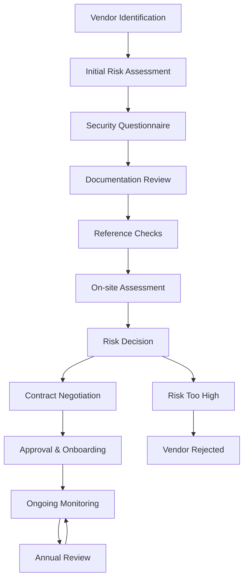
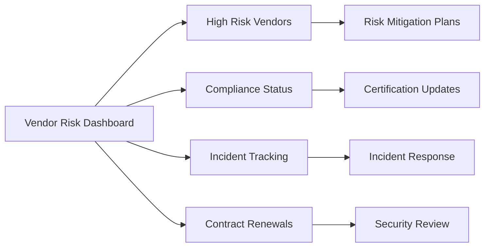

# Vendor Management

## Overview

Earna AI's Vendor Management Program ensures that third-party vendors, suppliers, and service providers maintain appropriate security standards and controls that align with our security requirements and SOC2 Type II compliance obligations.

## Vendor Risk Assessment Framework

### Risk Classification

```typescript
interface VendorRiskProfile {
  vendorId: string
  name: string
  riskLevel: 'critical' | 'high' | 'medium' | 'low'
  dataAccess: DataAccessLevel
  serviceCriticality: ServiceCriticality
  geographicLocation: string[]
  complianceRequirements: string[]
  lastAssessment: Date
  nextReview: Date
}

interface DataAccessLevel {
  customerData: boolean
  financialData: boolean
  pii: boolean
  confidentialData: boolean
  systemAccess: boolean
}

interface ServiceCriticality {
  businessImpact: 'high' | 'medium' | 'low'
  dataProcessing: boolean
  infrastructureProvider: boolean
  softwareProvider: boolean
  supportServices: boolean
}
```

### Due Diligence Process



## Security Requirements

### Mandatory Security Controls

```yaml
vendor_security_requirements:
  data_protection:
    encryption_in_transit: true
    encryption_at_rest: true
    data_retention_policy: required
    data_deletion_capabilities: required
    backup_procedures: required

  access_controls:
    multi_factor_authentication: required
    privileged_access_management: required
    access_logging: required
    regular_access_reviews: required

  compliance:
    soc2_type_ii: preferred
    iso27001: preferred
    gdpr_compliance: required_for_eu_data
    pipeda_compliance: required_for_canadian_data

  incident_management:
    incident_response_plan: required
    notification_procedures: required
    forensic_capabilities: required
    business_continuity_plan: required

  monitoring:
    security_monitoring: required
    vulnerability_management: required
    penetration_testing: annual
    security_awareness_training: required
```

## Vendor Lifecycle Management

### Onboarding Process

```typescript
class VendorOnboarding {
  private riskAssessment: VendorRiskProfile
  private securityQuestionnaire: SecurityQuestionnaire
  private contractTerms: ContractSecurityTerms

  async initiateOnboarding(vendor: VendorInfo): Promise<OnboardingResult> {
    // Step 1: Initial risk assessment
    this.riskAssessment = await this.assessInitialRisk(vendor)

    // Step 2: Send security questionnaire
    this.securityQuestionnaire = await this.sendSecurityQuestionnaire(vendor)

    // Step 3: Review documentation
    const documentation = await this.reviewSecurityDocumentation(vendor)

    // Step 4: Reference checks
    const references = await this.conductReferenceChecks(vendor)

    // Step 5: Risk decision
    const riskDecision = await this.makeRiskDecision({
      riskAssessment: this.riskAssessment,
      questionnaire: this.securityQuestionnaire,
      documentation,
      references
    })

    if (riskDecision.approved) {
      // Step 6: Contract negotiation
      this.contractTerms = await this.negotiateSecurityTerms(vendor)

      // Step 7: Final approval
      return await this.finalizeOnboarding(vendor)
    } else {
      return { status: 'rejected', reason: riskDecision.reason }
    }
  }
}
```

### Ongoing Monitoring

```typescript
interface VendorMonitoring {
  vendorId: string
  monitoringFrequency: 'quarterly' | 'semi-annual' | 'annual'
  securityScorecard: SecurityScorecard
  incidentHistory: SecurityIncident[]
  complianceStatus: ComplianceStatus
  performanceMetrics: PerformanceMetrics
  renewalDate: Date
}

interface SecurityScorecard {
  overallScore: number
  dataProtection: number
  accessManagement: number
  incidentResponse: number
  compliancePosture: number
  vulnerabilityManagement: number
  lastUpdated: Date
}
```

## Contract Security Requirements

### Standard Security Clauses

```yaml
contract_security_terms:
  data_protection:
    - "Vendor shall implement industry-standard encryption for data in transit and at rest"
    - "Vendor shall maintain data retention and deletion policies aligned with Earna AI requirements"
    - "Vendor shall provide data portability capabilities upon request"

  security_standards:
    - "Vendor shall maintain SOC2 Type II or equivalent security certification"
    - "Vendor shall conduct annual penetration testing by qualified third parties"
    - "Vendor shall implement multi-factor authentication for all administrative access"

  incident_notification:
    - "Vendor shall notify Earna AI within 4 hours of any security incident"
    - "Vendor shall provide detailed incident reports within 24 hours"
    - "Vendor shall participate in joint incident response activities as required"

  audit_rights:
    - "Earna AI reserves the right to audit vendor security controls annually"
    - "Vendor shall provide access to security documentation upon request"
    - "Vendor shall allow third-party security assessments as deemed necessary"

  termination:
    - "Vendor shall securely delete all Earna AI data within 30 days of termination"
    - "Vendor shall provide certification of data deletion"
    - "Vendor shall return or destroy all confidential information"
```

## Risk Monitoring and Reporting

### Continuous Risk Assessment

```typescript
class VendorRiskMonitoring {
  private riskDatabase: VendorRiskDatabase
  private threatIntelligence: ThreatIntelligenceService

  async assessContinuousRisk(vendorId: string): Promise<RiskAssessment> {
    // Monitor external threat intelligence
    const threatData = await this.threatIntelligence.getVendorThreats(vendorId)

    // Check public security incidents
    const securityIncidents = await this.checkPublicSecurityIncidents(vendorId)

    // Review compliance status
    const complianceStatus = await this.checkComplianceStatus(vendorId)

    // Calculate risk score
    const riskScore = this.calculateRiskScore({
      threatData,
      securityIncidents,
      complianceStatus
    })

    // Generate alerts if risk threshold exceeded
    if (riskScore > this.getRiskThreshold(vendorId)) {
      await this.generateRiskAlert(vendorId, riskScore)
    }

    return {
      vendorId,
      riskScore,
      lastAssessed: new Date(),
      recommendations: this.generateRecommendations(riskScore)
    }
  }
}
```

### Vendor Risk Dashboard



## Fourth Party Risk Management

### Supply Chain Security

```typescript
interface FourthPartyRisk {
  vendorId: string
  subcontractors: Subcontractor[]
  supplyChainDepth: number
  criticalDependencies: CriticalDependency[]
  riskAggregation: SupplyChainRisk
}

interface Subcontractor {
  name: string
  serviceType: string
  dataAccess: boolean
  geographicLocation: string
  securityAssessment: SecurityAssessment
  lastReviewed: Date
}

class SupplyChainRiskManager {
  async assessFourthPartyRisk(vendorId: string): Promise<FourthPartyRisk> {
    // Map vendor's supply chain
    const subcontractors = await this.mapSupplyChain(vendorId)

    // Assess each subcontractor's risk
    const assessments = await Promise.all(
      subcontractors.map(sub => this.assessSubcontractorRisk(sub))
    )

    // Calculate aggregated risk
    const aggregatedRisk = this.calculateSupplyChainRisk(assessments)

    return {
      vendorId,
      subcontractors,
      supplyChainDepth: this.calculateDepth(subcontractors),
      criticalDependencies: this.identifyCriticalDependencies(assessments),
      riskAggregation: aggregatedRisk
    }
  }
}
```

## Vendor Exit Management

### Secure Offboarding Process

```yaml
vendor_exit_procedures:
  data_management:
    - "Inventory all data held by vendor"
    - "Ensure secure data deletion or return"
    - "Obtain deletion certificates"
    - "Verify data removal from backup systems"

  access_revocation:
    - "Revoke all system access immediately"
    - "Disable API keys and tokens"
    - "Remove from privileged access lists"
    - "Update firewall and network access rules"

  knowledge_transfer:
    - "Document critical processes and procedures"
    - "Transfer operational knowledge to internal teams"
    - "Secure handover of credentials and configurations"
    - "Update disaster recovery procedures"

  final_assessment:
    - "Conduct exit security review"
    - "Update risk assessments for remaining vendors"
    - "Document lessons learned"
    - "Update vendor management procedures as needed"
```

## SOC2 Compliance Alignment

Our vendor management program aligns with SOC2 Type II requirements:

- **Security**: Vendor security assessments and ongoing monitoring
- **Availability**: Vendor SLA monitoring and business continuity requirements
- **Processing Integrity**: Vendor data processing controls and validation
- **Confidentiality**: Vendor confidentiality agreements and data protection controls
- **Privacy**: Vendor privacy impact assessments and PIPEDA compliance verification

## Contact Information

For vendor management inquiries:
- **Email**: vendor-security@earna.ai
- **Slack**: #vendor-management
- **Emergency**: security-incident@earna.ai

## Next Steps

1. Review current vendor inventory against this framework
2. Implement continuous risk monitoring tools
3. Update vendor contracts with enhanced security requirements
4. Establish vendor security scorecard system
5. Develop fourth-party risk assessment capabilities
