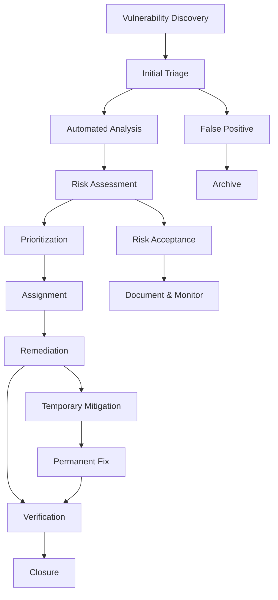
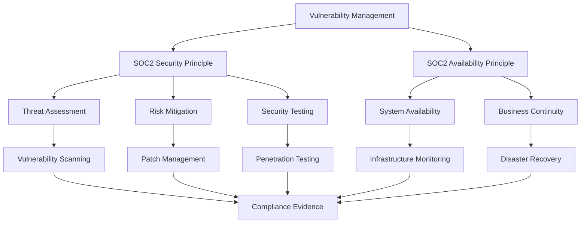

# Vulnerability Management

## Overview

Earna AI's Vulnerability Management Program provides systematic identification, assessment, prioritization, and remediation of security vulnerabilities across our infrastructure, applications, and systems. Our program aligns with industry best practices and SOC2 Type II compliance requirements.

## Vulnerability Management Framework

### Core Components

```typescript
interface VulnerabilityAssessment {
  vulnerabilityId: string
  discoveryDate: Date
  lastAssessed: Date
  source: VulnerabilitySource
  affectedAssets: AssetInfo[]
  severity: VulnerabilitySeverity
  cvssScore: CVSSScore
  exploitability: ExploitabilityMetrics
  businessImpact: BusinessImpactAssessment
  remediationPlan: RemediationPlan
  status: VulnerabilityStatus
  assignedTo: string[]
  dueDate: Date
}

enum VulnerabilitySource {
  AUTOMATED_SCAN = 'automated_scan',
  PENETRATION_TEST = 'penetration_test',
  SECURITY_RESEARCH = 'security_research',
  THREAT_INTELLIGENCE = 'threat_intelligence',
  BUG_BOUNTY = 'bug_bounty',
  INTERNAL_DISCOVERY = 'internal_discovery',
  VENDOR_NOTIFICATION = 'vendor_notification'
}

enum VulnerabilitySeverity {
  CRITICAL = 'critical',
  HIGH = 'high',
  MEDIUM = 'medium',
  LOW = 'low',
  INFORMATIONAL = 'informational'
}

enum VulnerabilityStatus {
  OPEN = 'open',
  IN_PROGRESS = 'in_progress',
  MITIGATED = 'mitigated',
  REMEDIATED = 'remediated',
  ACCEPTED_RISK = 'accepted_risk',
  FALSE_POSITIVE = 'false_positive',
  DUPLICATE = 'duplicate'
}
```

### Vulnerability Discovery Pipeline



## Vulnerability Scanning and Assessment

### Automated Scanning Infrastructure

```typescript
class VulnerabilityScanner {
  private scanEngines: ScanEngine[]
  private assetInventory: AssetInventory
  private threatIntelligence: ThreatIntelligenceService

  async performComprehensiveScan(): Promise<ScanResult> {
    const scanResults: ScanResult = {
      scanId: this.generateScanId(),
      startTime: new Date(),
      assetsCovered: 0,
      vulnerabilitiesFound: 0,
      findings: []
    }

    // Get current asset inventory
    const assets = await this.assetInventory.getAllAssets()
    scanResults.assetsCovered = assets.length

    // Parallel scanning across different asset types
    const scanPromises = [
      this.scanNetworkAssets(assets.filter(a => a.type === 'network')),
      this.scanWebApplications(assets.filter(a => a.type === 'web_app')),
      this.scanContainerImages(assets.filter(a => a.type === 'container')),
      this.scanCloudResources(assets.filter(a => a.type === 'cloud')),
      this.scanEndpoints(assets.filter(a => a.type === 'endpoint'))
    ]

    const results = await Promise.all(scanPromises)

    // Consolidate and deduplicate findings
    scanResults.findings = this.consolidateFindings(results.flat())
    scanResults.vulnerabilitiesFound = scanResults.findings.length
    scanResults.endTime = new Date()

    // Enrich with threat intelligence
    await this.enrichWithThreatIntel(scanResults.findings)

    return scanResults
  }

  async scanWebApplications(webApps: Asset[]): Promise<Finding[]> {
    const findings: Finding[] = []

    for (const app of webApps) {
      // OWASP Top 10 testing
      const owaspFindings = await this.performOWASPScan(app)

      // API security testing
      const apiFindings = await this.performAPIScan(app)

      // Authentication & authorization testing
      const authFindings = await this.performAuthScan(app)

      findings.push(...owaspFindings, ...apiFindings, ...authFindings)
    }

    return findings
  }
}
```

### CVSS Scoring and Risk Assessment

```typescript
interface CVSSScore {
  version: '3.1' | '4.0'
  baseScore: number
  temporalScore?: number
  environmentalScore?: number
  vectorString: string
  exploitCodeMaturity?: ExploitCodeMaturity
  remediationLevel?: RemediationLevel
  reportConfidence?: ReportConfidence
}

interface RiskCalculation {
  vulnerabilityId: string
  cvssScore: number
  exploitabilityScore: number
  businessCriticalityScore: number
  assetValueScore: number
  threatLandscapeScore: number
  compensatingControlsScore: number
  finalRiskScore: number
  riskLevel: 'critical' | 'high' | 'medium' | 'low'
}

class RiskAssessmentEngine {
  calculateComprehensiveRisk(vuln: VulnerabilityAssessment): RiskCalculation {
    // Base CVSS score (40% weight)
    const cvssWeight = 0.4
    const normalizedCVSS = vuln.cvssScore.baseScore / 10

    // Exploitability factor (25% weight)
    const exploitWeight = 0.25
    const exploitScore = this.calculateExploitabilityScore(vuln.exploitability)

    // Business criticality (20% weight)
    const businessWeight = 0.2
    const businessScore = this.calculateBusinessCriticality(vuln.affectedAssets)

    // Asset value (10% weight)
    const assetWeight = 0.1
    const assetScore = this.calculateAssetValue(vuln.affectedAssets)

    // Threat landscape (5% weight)
    const threatWeight = 0.05
    const threatScore = this.calculateThreatLandscape(vuln)

    // Calculate final risk score
    const rawScore = (
      (normalizedCVSS * cvssWeight) +
      (exploitScore * exploitWeight) +
      (businessScore * businessWeight) +
      (assetScore * assetWeight) +
      (threatScore * threatWeight)
    ) * 10

    // Apply compensating controls reduction
    const compensatingReduction = this.assessCompensatingControls(vuln)
    const finalScore = Math.max(0, rawScore - compensatingReduction)

    return {
      vulnerabilityId: vuln.vulnerabilityId,
      cvssScore: vuln.cvssScore.baseScore,
      exploitabilityScore: exploitScore,
      businessCriticalityScore: businessScore,
      assetValueScore: assetScore,
      threatLandscapeScore: threatScore,
      compensatingControlsScore: compensatingReduction,
      finalRiskScore: finalScore,
      riskLevel: this.determineRiskLevel(finalScore)
    }
  }
}
```

## Remediation and Patch Management

### Patch Management Process

```yaml
patch_management:
  categorization:
    critical_patches:
      timeline: "immediate (0-72 hours)"
      approval_required: false
      emergency_change: true
      rollback_plan: required

    high_priority_patches:
      timeline: "1-2 weeks"
      approval_required: true
      testing_required: "limited"
      rollback_plan: required

    standard_patches:
      timeline: "monthly cycle"
      approval_required: true
      testing_required: "comprehensive"
      rollback_plan: required

    low_priority_patches:
      timeline: "quarterly cycle"
      approval_required: true
      testing_required: "comprehensive"
      rollback_plan: optional

  testing_stages:
    development:
      environment: "isolated dev environment"
      duration: "2-5 days"
      validation: "functional testing"

    staging:
      environment: "production-like staging"
      duration: "3-7 days"
      validation: "integration testing"

    production:
      deployment: "phased rollout"
      monitoring: "enhanced monitoring"
      rollback_criteria: "performance degradation > 5%"
```

### Remediation Workflow

```typescript
class RemediationManager {
  async createRemediationPlan(vuln: VulnerabilityAssessment): Promise<RemediationPlan> {
    const riskAssessment = await this.riskEngine.calculateRisk(vuln)

    const remediationOptions = await this.identifyRemediationOptions(vuln)
    const selectedOption = this.selectOptimalRemediation(remediationOptions, riskAssessment)

    return {
      vulnerabilityId: vuln.vulnerabilityId,
      remediationType: selectedOption.type,
      timeline: this.calculateTimeline(riskAssessment.riskLevel),
      resources: selectedOption.resources,
      dependencies: await this.identifyDependencies(selectedOption),
      testingPlan: await this.createTestingPlan(selectedOption),
      rollbackPlan: await this.createRollbackPlan(selectedOption),
      approvals: this.determineApprovalRequirements(riskAssessment),
      milestones: this.createMilestones(selectedOption),
      successCriteria: selectedOption.successCriteria
    }
  }

  async executeRemediation(plan: RemediationPlan): Promise<RemediationResult> {
    const execution: RemediationExecution = {
      planId: plan.id,
      startTime: new Date(),
      status: 'in_progress',
      completedMilestones: [],
      issues: []
    }

    try {
      // Execute pre-remediation checks
      await this.executePreChecks(plan)

      // Deploy remediation
      if (plan.remediationType === 'patch') {
        await this.deployPatch(plan)
      } else if (plan.remediationType === 'configuration_change') {
        await this.applyConfigurationChange(plan)
      } else if (plan.remediationType === 'mitigation') {
        await this.implementMitigation(plan)
      }

      // Execute post-remediation verification
      const verificationResult = await this.verifyRemediation(plan)

      execution.status = verificationResult.success ? 'completed' : 'failed'
      execution.endTime = new Date()

      return {
        execution,
        verificationResult,
        success: verificationResult.success
      }

    } catch (error) {
      // Execute rollback if necessary
      await this.executeRollback(plan)
      throw error
    }
  }
}
```

## Third-Party and Supply Chain Security

### Dependency Vulnerability Management

```typescript
interface DependencyVulnerability {
  packageName: string
  version: string
  vulnerabilityId: string
  severity: VulnerabilitySeverity
  affectedVersions: string[]
  fixedVersion?: string
  workaround?: string
  exploitAvailable: boolean
  dependencyChain: string[]
  usageContext: UsageContext[]
}

class DependencyScanner {
  async scanProjectDependencies(projectPath: string): Promise<DependencyVulnerability[]> {
    const vulnerabilities: DependencyVulnerability[] = []

    // Scan direct dependencies
    const directDeps = await this.getDirectDependencies(projectPath)
    for (const dep of directDeps) {
      const vulns = await this.checkVulnerabilities(dep)
      vulnerabilities.push(...vulns)
    }

    // Scan transitive dependencies
    const transitiveDeps = await this.getTransitiveDependencies(projectPath)
    for (const dep of transitiveDeps) {
      const vulns = await this.checkVulnerabilities(dep)
      vulnerabilities.push(...vulns.map(v => ({
        ...v,
        dependencyChain: dep.chain
      })))
    }

    // Check for known malicious packages
    const maliciousFindings = await this.scanForMaliciousPackages(
      [...directDeps, ...transitiveDeps]
    )

    return [...vulnerabilities, ...maliciousFindings]
  }

  async generateDependencyReport(): Promise<DependencySecurityReport> {
    const projects = await this.getAllProjects()
    const allVulnerabilities: DependencyVulnerability[] = []

    for (const project of projects) {
      const projectVulns = await this.scanProjectDependencies(project.path)
      allVulnerabilities.push(...projectVulns)
    }

    return {
      reportDate: new Date(),
      totalProjects: projects.length,
      totalDependencies: await this.countUniqueDependencies(projects),
      vulnerabilities: {
        critical: allVulnerabilities.filter(v => v.severity === VulnerabilitySeverity.CRITICAL),
        high: allVulnerabilities.filter(v => v.severity === VulnerabilitySeverity.HIGH),
        medium: allVulnerabilities.filter(v => v.severity === VulnerabilitySeverity.MEDIUM),
        low: allVulnerabilities.filter(v => v.severity === VulnerabilitySeverity.LOW)
      },
      remediationSummary: await this.generateRemediationSummary(allVulnerabilities),
      trends: await this.calculateSecurityTrends()
    }
  }
}
```

### Container Security Scanning

```yaml
container_security_scanning:
  scan_triggers:
    - build_time_scan
    - registry_push_scan
    - runtime_scan
    - scheduled_scan

  scanning_layers:
    base_image:
      - os_vulnerabilities
      - package_vulnerabilities
      - configuration_issues

    application_layer:
      - dependency_vulnerabilities
      - code_vulnerabilities
      - secrets_detection

    configuration:
      - dockerfile_best_practices
      - security_benchmarks
      - privilege_escalation

  compliance_checks:
    - cis_docker_benchmark
    - nist_cybersecurity_framework
    - pci_dss_container_requirements
    - sox_compliance_checks

  remediation_actions:
    automatic:
      - base_image_updates
      - dependency_updates
      - configuration_fixes

    manual_review:
      - architectural_changes
      - custom_code_fixes
      - complex_configuration_updates
```

## Compliance and Reporting

### Vulnerability Metrics and KPIs

```typescript
interface VulnerabilityMetrics {
  timePeriod: DateRange
  discoveryMetrics: {
    totalVulnerabilities: number
    bySource: Record<VulnerabilitySource, number>
    bySeverity: Record<VulnerabilitySeverity, number>
    trendsOverTime: TrendData[]
  }

  remediationMetrics: {
    meanTimeToRemediate: number
    medianTimeToRemediate: number
    remediationByTimeline: {
      withinSLA: number
      breachedSLA: number
    }
    remediationBySeverity: Record<VulnerabilitySeverity, RemediationStats>
  }

  riskMetrics: {
    totalRiskExposure: number
    riskReduction: number
    residualRisk: number
    acceptedRisk: number
  }

  complianceMetrics: {
    soc2Compliance: ComplianceScore
    regulatoryCompliance: ComplianceScore
    industryBenchmarks: BenchmarkComparison
  }
}

class VulnerabilityReporting {
  async generateExecutiveReport(period: DateRange): Promise<ExecutiveVulnerabilityReport> {
    const metrics = await this.calculateMetrics(period)

    return {
      executiveSummary: {
        overallRiskPosture: this.assessOverallRisk(metrics),
        keyRiskIndicators: this.identifyKeyRisks(metrics),
        remediationProgress: this.summarizeProgress(metrics),
        complianceStatus: this.assessCompliance(metrics),
        budgetImpact: await this.calculateBudgetImpact(metrics)
      },

      riskAnalysis: {
        criticalVulnerabilities: await this.getCriticalVulns(period),
        emergingThreats: await this.getEmergingThreats(period),
        industryComparison: await this.benchmarkAgainstIndustry(),
        riskTrends: this.analyzeRiskTrends(metrics)
      },

      operationalMetrics: {
        scanCoverage: this.calculateScanCoverage(),
        remediationEfficiency: this.calculateEfficiency(metrics),
        teamPerformance: await this.assessTeamPerformance(period),
        toolEffectiveness: await this.assessToolEffectiveness()
      },

      recommendations: {
        immediate: await this.getImmediateActions(),
        shortTerm: await this.getShortTermActions(),
        strategic: await this.getStrategicRecommendations()
      }
    }
  }
}
```

### SOC2 Compliance Integration



## Integration and Automation

### Security Tool Integration

```typescript
interface SecurityToolIntegration {
  toolType: 'SAST' | 'DAST' | 'SCA' | 'IAST' | 'Container' | 'Infrastructure'
  toolName: string
  apiEndpoint: string
  authenticationMethod: 'api_key' | 'oauth' | 'certificate'
  scanSchedule: CronExpression
  resultFormat: 'sarif' | 'json' | 'xml' | 'csv'
  automaticImport: boolean
  falsePositiveFiltering: boolean
}

class VulnerabilityOrchestrator {
  private integrations: SecurityToolIntegration[]
  private workflowEngine: WorkflowEngine

  async orchestrateSecurityScanning(): Promise<OrchestrationResult> {
    const scanResults: ToolResult[] = []

    // Parallel execution of all configured scanners
    const scanPromises = this.integrations.map(integration =>
      this.executeScan(integration)
    )

    const results = await Promise.all(scanPromises)
    scanResults.push(...results.flat())

    // Normalize and deduplicate findings
    const normalizedFindings = await this.normalizeFindings(scanResults)
    const deduplicatedFindings = this.deduplicateFindings(normalizedFindings)

    // Enrich with business context
    const enrichedFindings = await this.enrichFindings(deduplicatedFindings)

    // Trigger automated workflows
    await this.triggerAutomatedWorkflows(enrichedFindings)

    return {
      totalScans: this.integrations.length,
      totalFindings: enrichedFindings.length,
      newFindings: enrichedFindings.filter(f => f.isNew),
      automatedRemediations: await this.getAutomatedRemediations(),
      workflowsTriggered: await this.getTriggeredWorkflows()
    }
  }
}
```

### Automated Remediation Workflows

```yaml
automated_workflows:
  low_risk_patches:
    trigger: "vulnerability_severity = low AND exploitability = low"
    actions:
      - auto_create_patch_ticket
      - schedule_maintenance_window
      - execute_patch_deployment
      - verify_remediation
      - close_ticket

  dependency_updates:
    trigger: "vulnerability_type = dependency AND fix_available = true"
    actions:
      - create_pull_request
      - run_automated_tests
      - request_code_review
      - merge_on_approval
      - deploy_to_staging
      - verify_no_regressions

  configuration_fixes:
    trigger: "vulnerability_type = misconfiguration AND automated_fix_available = true"
    actions:
      - backup_current_config
      - apply_configuration_fix
      - validate_configuration
      - rollback_on_failure
      - document_change

  emergency_response:
    trigger: "vulnerability_severity = critical AND exploitability = high"
    actions:
      - notify_security_team
      - create_incident_ticket
      - implement_temporary_mitigation
      - schedule_emergency_patch
      - coordinate_response_team
```

## Contact Information

For vulnerability management inquiries:
- **Email**: vuln-management@earna.ai
- **Slack**: #vulnerability-management
- **Emergency**: security-incident@earna.ai

## Next Steps

1. Implement comprehensive vulnerability scanning across all asset types
2. Deploy automated patch management and remediation capabilities
3. Establish risk-based prioritization and SLA frameworks
4. Integrate with existing security tools and SIEM platforms
5. Develop advanced metrics and executive reporting capabilities
