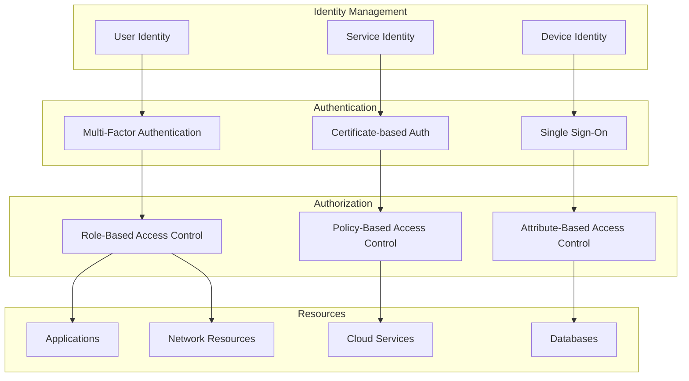
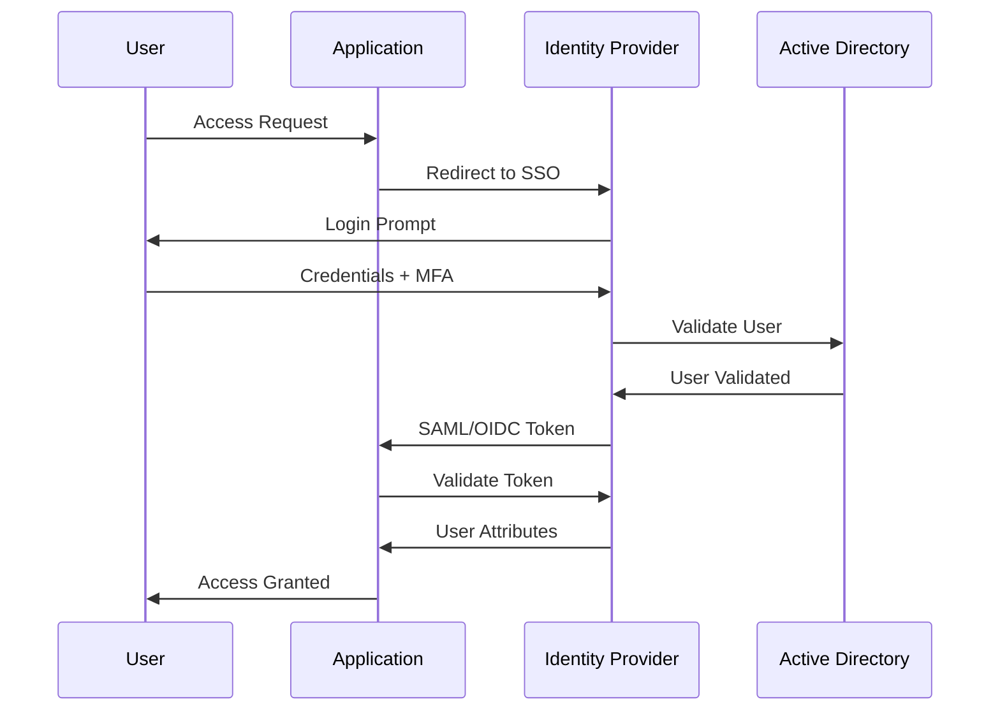
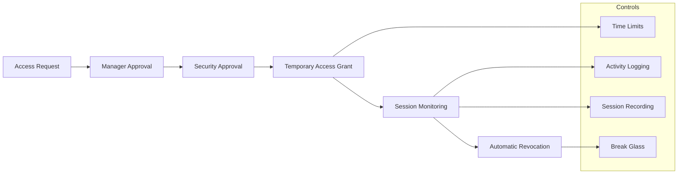
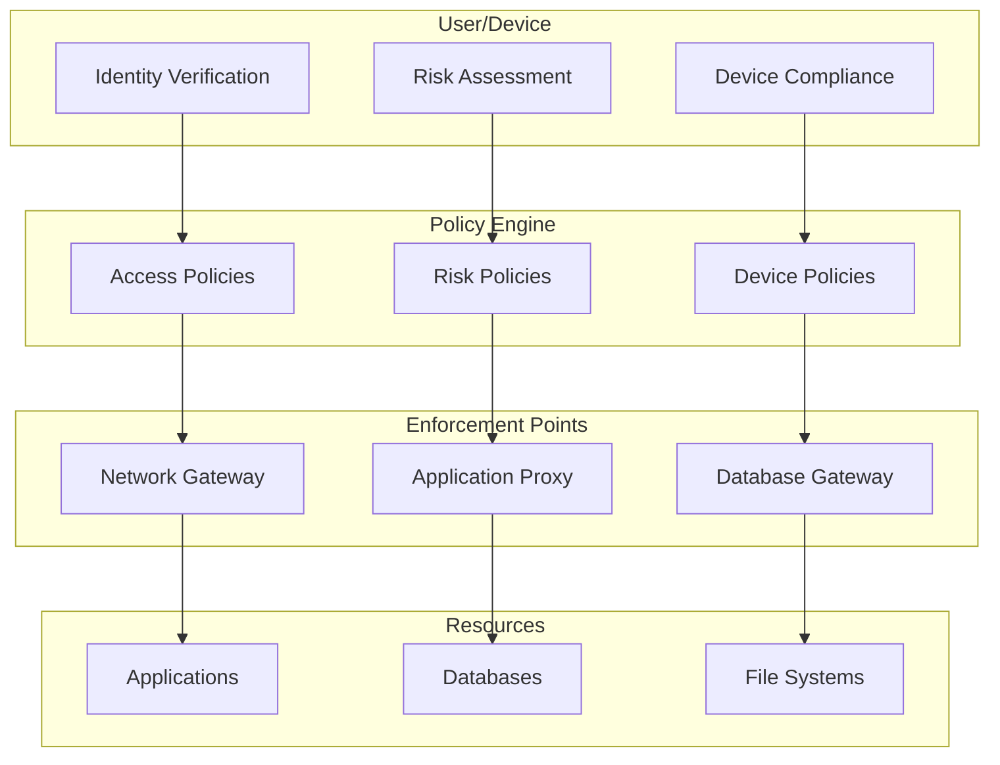
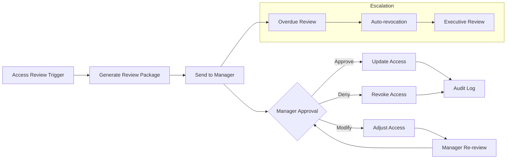

# Access Control

## Overview

Access control is a fundamental security principle that ensures only authorized users can access systems, data, and resources. Earna AI implements a comprehensive access control framework aligned with SOC2 Type II requirements and the principle of least privilege.

## Access Control Framework



## Identity Management

### User Lifecycle Management

```typescript
interface UserLifecycle {
  provisioning: {
    trigger: 'HR onboarding process'
    approval: 'Manager and IT approval required'
    timing: 'Before first day of work'

    process: {
      identityCreation: 'Unique user identifier'
      roleAssignment: 'Based on job function'
      systemAccess: 'According to role requirements'
      credentialDelivery: 'Secure delivery mechanism'
    }
  }

  modification: {
    triggers: [
      'Role change',
      'Department transfer',
      'Promotion/demotion',
      'Project assignment'
    ]
    approval: 'Manager approval required'
    timing: 'Effective date of change'

    process: {
      accessReview: 'Review current access'
      roleUpdate: 'Update role assignments'
      accessAdjustment: 'Add/remove access as needed'
      notification: 'Notify user and stakeholders'
    }
  }

  deprovisioning: {
    triggers: [
      'Employment termination',
      'Extended leave',
      'Contract expiration',
      'System retirement'
    ]
    approval: 'HR and IT approval'
    timing: 'Immediate for termination'

    process: {
      accountDisablement: 'Immediate account lockout'
      accessRevocation: 'Remove all system access'
      dataHandling: 'Secure data transfer/deletion'
      auditTrail: 'Complete audit documentation'
    }
  }
}
```

### Identity Governance

```yaml
identity_governance:
  user_categories:
    employees:
      lifecycle: "Full HR integration"
      authentication: "Corporate SSO + MFA"
      authorization: "Role-based access control"
      monitoring: "Standard user activity monitoring"

    contractors:
      lifecycle: "Contract-based provisioning"
      authentication: "Sponsored account + MFA"
      authorization: "Limited role-based access"
      monitoring: "Enhanced activity monitoring"

    service_accounts:
      lifecycle: "System-based provisioning"
      authentication: "Certificate or key-based"
      authorization: "Principle of least privilege"
      monitoring: "Automated activity monitoring"

    privileged_users:
      lifecycle: "Executive approval required"
      authentication: "Enhanced MFA (hardware tokens)"
      authorization: "Just-in-time privilege elevation"
      monitoring: "Real-time privileged activity monitoring"
```

## Authentication

### Multi-Factor Authentication (MFA)

```typescript
class MFAManager {
  async authenticateUser(credentials: Credentials): Promise<AuthResult> {
    const factors = []

    // Factor 1: Something you know (password/PIN)
    const knowledge = await this.validateKnowledgeFactor(credentials.password)
    if (!knowledge.valid) {
      return { success: false, reason: 'Invalid credentials' }
    }
    factors.push(knowledge)

    // Factor 2: Something you have (token/device)
    const possession = await this.validatePossessionFactor(credentials.token)
    if (!possession.valid) {
      return { success: false, reason: 'Invalid token' }
    }
    factors.push(possession)

    // Factor 3: Something you are (biometric) - Optional for high-security
    if (credentials.biometric && this.isHighSecurityRequired(credentials.user)) {
      const inherence = await this.validateInherenceFactor(credentials.biometric)
      if (!inherence.valid) {
        return { success: false, reason: 'Biometric authentication failed' }
      }
      factors.push(inherence)
    }

    // Risk-based authentication
    const risk = await this.assessRisk(credentials)
    if (risk.level === 'high' && factors.length < 2) {
      return { success: false, reason: 'Additional authentication required' }
    }

    return {
      success: true,
      sessionToken: await this.generateSessionToken(credentials.user),
      factors: factors.map(f => f.type),
      riskLevel: risk.level
    }
  }

  supportedFactors = {
    knowledge: [
      'Password',
      'PIN',
      'Security questions'
    ],
    possession: [
      'SMS OTP',
      'Email OTP',
      'TOTP (Authenticator app)',
      'Hardware security keys (FIDO2/WebAuthn)',
      'Smart cards'
    ],
    inherence: [
      'Fingerprint',
      'Face recognition',
      'Voice recognition'
    ]
  }
}
```

### Single Sign-On (SSO)



## Authorization

### Role-Based Access Control (RBAC)

```yaml
rbac_model:
  roles:
    read_only:
      description: "View-only access to assigned resources"
      permissions:
        - read:customer_data
        - read:transaction_data
        - read:reports
      exclusions:
        - write:*
        - admin:*

    analyst:
      description: "Data analysis and reporting capabilities"
      inherits: ["read_only"]
      permissions:
        - create:reports
        - execute:queries
        - export:data
      restrictions:
        - "PII data requires additional approval"

    compliance_officer:
      description: "Compliance monitoring and reporting"
      inherits: ["analyst"]
      permissions:
        - read:audit_logs
        - create:compliance_reports
        - access:regulatory_data
        - manage:kyc_records

    administrator:
      description: "System administration capabilities"
      permissions:
        - admin:system_config
        - manage:users
        - access:system_logs
        - execute:maintenance
      restrictions:
        - "Cannot access customer PII without business justification"

    security_admin:
      description: "Security administration and incident response"
      permissions:
        - admin:security_config
        - investigate:incidents
        - access:security_logs
        - manage:security_tools
```

### Attribute-Based Access Control (ABAC)

```typescript
interface ABACPolicy {
  subject: {
    attributes: {
      userId: string
      department: string
      clearanceLevel: 'public' | 'internal' | 'confidential' | 'restricted'
      roles: string[]
      location: string
      timeOfDay: string
    }
  }

  resource: {
    attributes: {
      dataClassification: 'public' | 'internal' | 'confidential' | 'restricted'
      owner: string
      department: string
      sensitivity: 'low' | 'medium' | 'high'
      geolocation: string
    }
  }

  action: {
    attributes: {
      operation: 'read' | 'write' | 'update' | 'delete' | 'execute'
      purpose: 'business' | 'administrative' | 'audit'
      urgency: 'routine' | 'urgent' | 'emergency'
    }
  }

  environment: {
    attributes: {
      time: Date
      location: string
      network: 'internal' | 'external' | 'vpn'
      deviceType: 'managed' | 'unmanaged'
      riskLevel: 'low' | 'medium' | 'high'
    }
  }
}

class ABACEngine {
  async evaluateAccess(request: AccessRequest): Promise<AccessDecision> {
    const policies = await this.getApplicablePolicies(request)

    for (const policy of policies) {
      const decision = await this.evaluatePolicy(policy, request)

      if (decision.effect === 'DENY') {
        return {
          result: 'DENY',
          reason: decision.reason,
          policy: policy.id
        }
      }
    }

    // Default deny
    return {
      result: 'DENY',
      reason: 'No explicit permit policy found',
      policy: 'default'
    }
  }
}
```

## Privileged Access Management (PAM)

### Just-in-Time Access



### Privileged Account Security

```typescript
interface PrivilegedAccountManagement {
  accountTypes: {
    administrative: {
      requirements: ['Executive approval', 'Security team review']
      authentication: 'Enhanced MFA with hardware tokens'
      monitoring: 'Real-time session monitoring'
      recording: 'Complete session recording'
      access: 'Just-in-time elevation'
    }

    service: {
      requirements: ['System owner approval', 'Security review']
      authentication: 'Certificate-based or API keys'
      monitoring: 'Automated activity monitoring'
      rotation: 'Automated credential rotation'
      storage: 'Secure vault management'
    }

    emergency: {
      requirements: ['Break-glass procedures']
      authentication: 'Multi-person authorization'
      monitoring: 'Immediate alert and review'
      documentation: 'Complete incident documentation'
      review: 'Post-incident review required'
    }
  }

  controls: {
    credentialVault: {
      technology: 'Enterprise password manager'
      features: [
        'Automatic password generation',
        'Secure credential sharing',
        'Access approval workflows',
        'Audit logging'
      ]
    }

    sessionManagement: {
      recording: 'All privileged sessions recorded'
      monitoring: 'Real-time anomaly detection'
      controls: 'Session time limits and break-glass'
      analysis: 'Post-session activity analysis'
    }
  }
}
```

## Application Access Control

### API Security

```yaml
api_security:
  authentication:
    methods:
      - OAuth 2.0 with PKCE
      - JWT tokens with RS256
      - API keys for service-to-service
      - mTLS for high-security APIs

    token_management:
      access_token_lifetime: "15 minutes"
      refresh_token_lifetime: "30 days"
      token_rotation: "Automatic on refresh"
      revocation: "Immediate revocation support"

  authorization:
    scopes:
      - read:profile
      - read:transactions
      - write:transactions
      - admin:users
      - admin:system

    rate_limiting:
      public_apis: "100 requests/minute"
      authenticated: "1000 requests/minute"
      privileged: "10000 requests/minute"

    endpoint_protection:
      - Input validation and sanitization
      - Output filtering based on permissions
      - Resource-level authorization
      - Audit logging for sensitive operations
```

### Database Access Control

```typescript
class DatabaseAccessControl {
  async enforceRowLevelSecurity(user: User, query: Query): Promise<Query> {
    const modifiedQuery = query.clone()

    // Apply data classification filters
    const classification = await this.getUserDataClassification(user)
    modifiedQuery.addFilter('data_classification', '<=', classification)

    // Apply department restrictions
    if (!user.hasRole('GLOBAL_ACCESS')) {
      modifiedQuery.addFilter('department', '=', user.department)
    }

    // Apply customer data restrictions
    if (query.touches('customer_data')) {
      const customers = await this.getAuthorizedCustomers(user)
      modifiedQuery.addFilter('customer_id', 'IN', customers)
    }

    // Apply temporal restrictions
    if (query.touches('historical_data') && !user.hasPermission('access_historical')) {
      const cutoff = new Date()
      cutoff.setMonths(cutoff.getMonths() - 12)
      modifiedQuery.addFilter('created_at', '>', cutoff)
    }

    return modifiedQuery
  }

  columnLevelSecurity = {
    'customer.ssn': ['COMPLIANCE_OFFICER', 'PRIVACY_OFFICER'],
    'customer.bank_account': ['FINANCIAL_ANALYST', 'COMPLIANCE_OFFICER'],
    'transaction.details': ['ANALYST', 'COMPLIANCE_OFFICER'],
    'employee.salary': ['HR_MANAGER', 'FINANCE_MANAGER'],
    'system.secrets': ['SYSTEM_ADMIN', 'SECURITY_ADMIN']
  }
}
```

## Network Access Control

### Zero Trust Architecture



### Network Segmentation

```yaml
network_segments:
  dmz:
    description: "Public-facing services"
    access: "Internet-facing with WAF protection"
    resources: ["Load balancers", "Web servers", "API gateways"]
    controls: ["DDoS protection", "Rate limiting", "WAF rules"]

  application:
    description: "Internal application servers"
    access: "Internal network only"
    resources: ["App servers", "Microservices", "Message queues"]
    controls: ["Internal firewall", "Service mesh security", "mTLS"]

  data:
    description: "Database and storage systems"
    access: "Database network only"
    resources: ["Databases", "File storage", "Backup systems"]
    controls: ["Database firewall", "Encryption", "Access logging"]

  management:
    description: "Administrative and monitoring systems"
    access: "Privileged access only"
    resources: ["Monitoring", "Logging", "Management tools"]
    controls: ["VPN access", "MFA required", "Session recording"]

  secure:
    description: "High-security systems"
    access: "Air-gapped or highly restricted"
    resources: ["Key management", "HSM", "Security tools"]
    controls: ["Physical access control", "Hardware security", "Auditing"]
```

## Access Reviews and Recertification

### Automated Access Reviews

```typescript
class AccessReviewManager {
  async conductPeriodicReview(): Promise<ReviewResult> {
    const reviews = []

    // Role-based reviews (quarterly)
    const roleReviews = await this.reviewRoleAssignments()
    reviews.push(...roleReviews)

    // Privileged access reviews (monthly)
    const privilegedReviews = await this.reviewPrivilegedAccess()
    reviews.push(...privilegedReviews)

    // Dormant account reviews (monthly)
    const dormantReviews = await this.reviewDormantAccounts()
    reviews.push(...dormantReviews)

    // Vendor access reviews (quarterly)
    const vendorReviews = await this.reviewVendorAccess()
    reviews.push(...vendorReviews)

    return {
      totalReviews: reviews.length,
      approvals: reviews.filter(r => r.status === 'approved').length,
      revocations: reviews.filter(r => r.status === 'revoked').length,
      pending: reviews.filter(r => r.status === 'pending').length
    }
  }

  async reviewRoleAssignments(): Promise<Review[]> {
    const users = await this.getAllUsers()
    const reviews = []

    for (const user of users) {
      const currentRoles = await this.getUserRoles(user.id)
      const recommendedRoles = await this.calculateRecommendedRoles(user)

      if (!this.rolesMatch(currentRoles, recommendedRoles)) {
        reviews.push({
          type: 'role_assignment',
          user: user.id,
          current: currentRoles,
          recommended: recommendedRoles,
          reviewer: user.managerId,
          dueDate: this.calculateDueDate('quarterly')
        })
      }
    }

    return reviews
  }
}
```

### Certification Workflows



## Monitoring and Compliance

### Access Control Metrics

```yaml
access_control_kpis:
  authentication:
    success_rate: ">99.5%"
    mfa_adoption: "100% for privileged accounts"
    failed_attempts: "<1% of total attempts"
    lockout_frequency: "Monitor for attack patterns"

  authorization:
    policy_violations: "0 per month"
    unauthorized_access_attempts: "Monitor and investigate all"
    privilege_escalation_attempts: "0 tolerance"
    access_review_completion: "100% within SLA"

  provisioning:
    new_user_setup_time: "<24 hours"
    access_modification_time: "<4 hours"
    deprovisioning_time: "<1 hour for terminations"
    orphaned_accounts: "0 accounts"

  compliance:
    access_review_completion: "100% within deadlines"
    policy_compliance: ">99%"
    audit_findings: "<5 per year"
    remediation_time: "<30 days"
```

### Continuous Monitoring

```typescript
interface AccessMonitoring {
  realTimeAlerts: {
    privilegedAccess: 'Alert on all privileged account usage'
    failedLogins: 'Alert after 3 failed attempts'
    unusualPatterns: 'ML-based anomaly detection'
    policyViolations: 'Immediate alert and block'
  }

  periodicReporting: {
    daily: 'Access activity summary'
    weekly: 'Access review status'
    monthly: 'Compliance metrics dashboard'
    quarterly: 'Executive access report'
  }

  auditSupport: {
    logging: 'Complete access attempt logging'
    retention: '7 years for compliance'
    searchability: 'Advanced search and filtering'
    export: 'Audit-ready report generation'
  }
}
```

## Incident Response

### Access-Related Incidents

```yaml
incident_types:
  unauthorized_access:
    severity: "Critical"
    response_time: "15 minutes"
    actions:
      - Immediately disable compromised account
      - Review access logs for scope of breach
      - Conduct forensic analysis
      - Notify affected stakeholders
      - Implement additional monitoring

  privilege_escalation:
    severity: "High"
    response_time: "30 minutes"
    actions:
      - Contain escalation attempt
      - Review system vulnerabilities
      - Patch security gaps
      - Enhance monitoring controls
      - Conduct security assessment

  insider_threat:
    severity: "High"
    response_time: "1 hour"
    actions:
      - Coordinate with HR and legal
      - Preserve evidence
      - Implement discrete monitoring
      - Review data access patterns
      - Plan controlled investigation

  system_compromise:
    severity: "Critical"
    response_time: "Immediate"
    actions:
      - Isolate affected systems
      - Revoke all system access
      - Implement emergency access procedures
      - Conduct incident response
      - Plan system restoration
```

## Integration and Automation

### Identity Provider Integration

```typescript
interface IdentityIntegration {
  activeDirectory: {
    synchronization: 'Real-time user/group sync'
    authentication: 'LDAP/LDAPS'
    groupMapping: 'AD groups to application roles'
    passwordPolicy: 'Centralized policy enforcement'
  }

  cloudIdentityProviders: {
    azureAD: 'SAML/OIDC integration'
    googleWorkspace: 'OAuth 2.0 integration'
    okta: 'Universal directory integration'
    auth0: 'Social and enterprise identity'
  }

  provisioning: {
    scim: 'Automated user provisioning'
    justInTime: 'JIT provisioning for SSO'
    workflows: 'Custom provisioning workflows'
    approval: 'Automated approval workflows'
  }
}
```

### Access Control Automation

```yaml
automation_capabilities:
  user_lifecycle:
    onboarding:
      - HR system integration
      - Automated role assignment
      - Welcome email with instructions
      - Manager notification

    changes:
      - Role change detection
      - Access adjustment workflows
      - Approval routing
      - Change notifications

    offboarding:
      - Termination trigger detection
      - Immediate access revocation
      - Manager handover workflows
      - Compliance documentation

  compliance:
    reviews:
      - Automated review generation
      - Approval workflow routing
      - Escalation handling
      - Compliance reporting

    monitoring:
      - Real-time policy enforcement
      - Anomaly detection
      - Risk scoring
      - Automated remediation
```

## Next Steps

1. **Complete Identity Integration**: Finalize SSO and identity provider integration
2. **Deploy PAM Solution**: Implement comprehensive privileged access management
3. **Enhance Monitoring**: Deploy advanced access monitoring and analytics
4. **Automate Reviews**: Implement automated access review workflows
5. **Conduct Training**: Train all staff on access control procedures
6. **Perform Assessment**: Conduct comprehensive access control audit
7. **Continuous Improvement**: Establish ongoing access control enhancement program

## Contact Information

- **Identity Management**: identity@earna.ai
- **Access Control Team**: access-control@earna.ai
- **Security Operations**: security-ops@earna.ai
- **Emergency Access**: emergency-access@earna.ai
