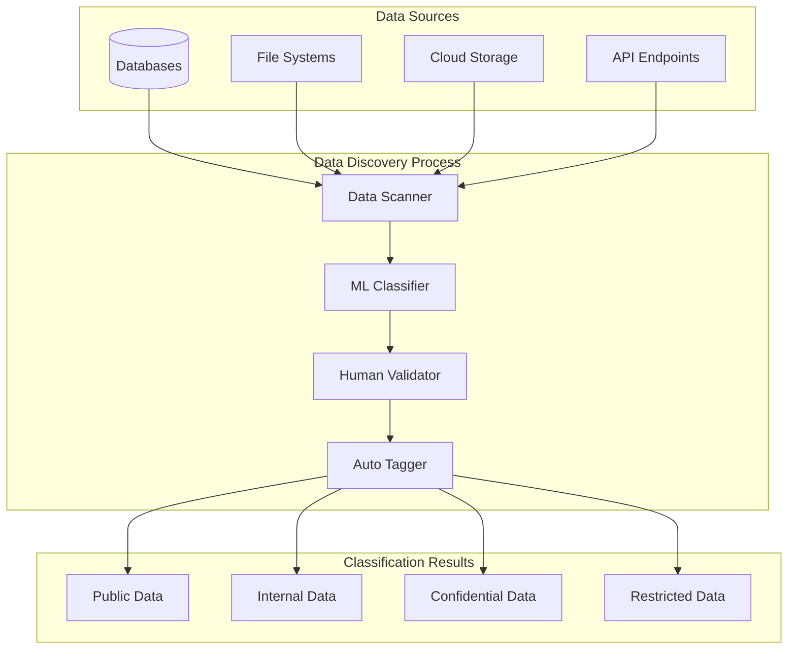
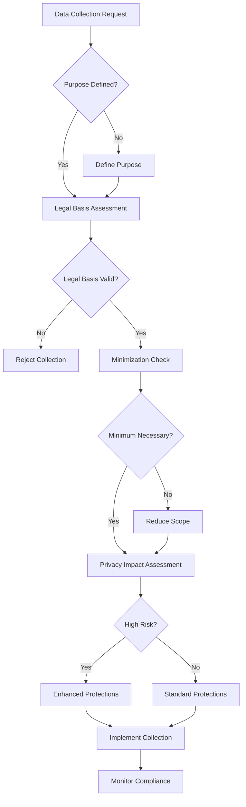
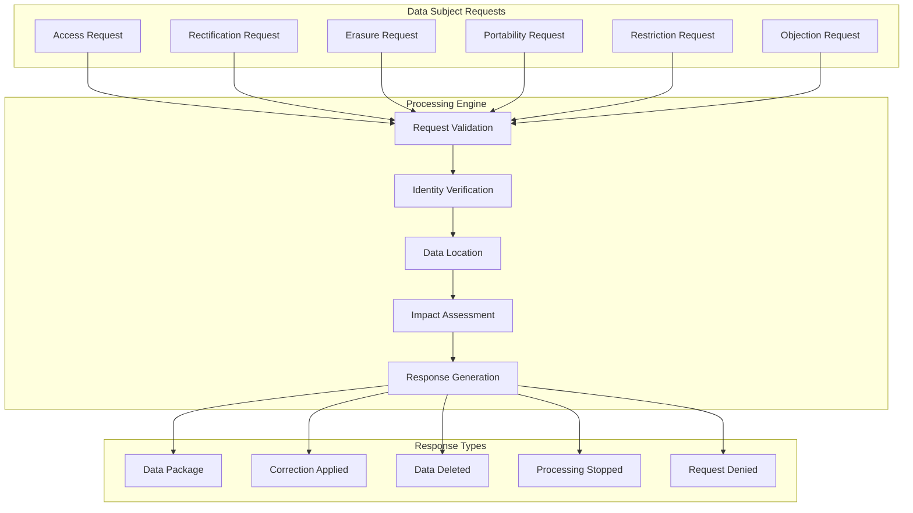
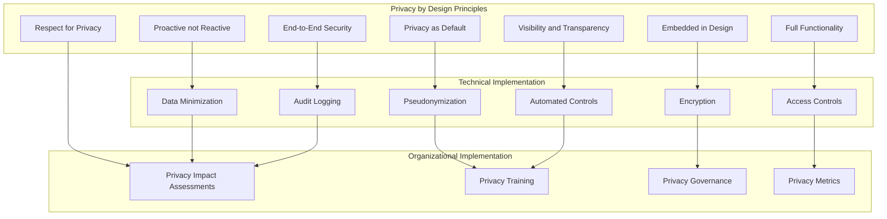

# Data Protection

## Overview

Data protection is a cornerstone of Earna AI's security program, ensuring that sensitive customer data, financial information, and business-critical assets are properly classified, secured, and managed throughout their lifecycle. This document outlines our comprehensive data protection strategy aligned with SOC2 Type II requirements and Canadian privacy regulations.

## Data Classification Framework

### Classification Levels

```typescript
interface DataClassification {
  public: {
    definition: 'Information intended for public disclosure'
    examples: ['Marketing materials', 'Press releases', 'Public documentation']
    handling: 'No special protection required'
    retention: 'Business-driven'
  }

  internal: {
    definition: 'Information for internal business use'
    examples: ['Policies', 'Procedures', 'Internal communications']
    handling: 'Access controls applied'
    retention: 'Standard business retention'
  }

  confidential: {
    definition: 'Sensitive business information'
    examples: ['Financial reports', 'Strategic plans', 'Vendor contracts']
    handling: 'Encryption and strict access controls'
    retention: 'Extended retention periods'
  }

  restricted: {
    definition: 'Highly sensitive regulated information'
    examples: ['Customer PII', 'Financial data', 'Authentication credentials']
    handling: 'Highest security controls, encryption, audit logging'
    retention: 'Regulatory compliance requirements'
  }
}
```

### Automated Data Discovery



## Data Protection Controls

### Encryption Standards

```yaml
encryption_requirements:
  data_at_rest:
    algorithm: "AES-256"
    key_management: "Hardware Security Module (HSM)"
    key_rotation: "Annual"
    compliance: "FIPS 140-2 Level 3"

    implementation:
      databases:
        - PostgreSQL: "Transparent Data Encryption (TDE)"
        - MongoDB: "WiredTiger encryption"
        - Redis: "Redis encryption at rest"

      file_systems:
        - Linux: "LUKS full disk encryption"
        - Cloud: "Native cloud encryption (AWS KMS, GCP KMS)"

      backups:
        - Encrypted before transmission
        - Separate encryption keys
        - Secure key escrow

  data_in_transit:
    protocol: "TLS 1.3"
    certificate_authority: "Trusted CA"
    perfect_forward_secrecy: true

    implementation:
      web_traffic: "HTTPS with HSTS"
      api_communications: "mTLS for service-to-service"
      database_connections: "SSL/TLS encrypted"
      file_transfers: "SFTP or secure APIs"

  data_in_use:
    application_level:
      - Field-level encryption for PII
      - Tokenization for payment data
      - Secure enclaves where available

    memory_protection:
      - Secure memory allocation
      - Memory scrubbing after use
      - Process isolation
```

### Access Control Matrix

| Data Classification | Read Access | Write Access | Admin Access | Retention |
|-------------------|-------------|--------------|--------------|-----------|
| **Public** | All authenticated users | Content managers | IT administrators | Business-driven |
| **Internal** | Employees only | Department leads | IT administrators | 3 years default |
| **Confidential** | Need-to-know basis | Senior management | Security team | 5-7 years |
| **Restricted** | Authorized personnel only | Compliance officers | CISO approval | Regulatory requirements |

### Data Loss Prevention (DLP)

```typescript
class DataLossPrevention {
  async monitorDataFlow(data: DataFlow): Promise<DLPResult> {
    const results = {
      allowed: true,
      violations: [] as string[],
      actions: [] as string[]
    }

    // Content inspection
    const contentAnalysis = await this.analyzeContent(data.content)
    if (contentAnalysis.containsPII) {
      results.violations.push('PII detected in unauthorized channel')
      results.actions.push('Block transmission and alert security team')
      results.allowed = false
    }

    // Destination validation
    if (data.destination.external && !data.destination.approved) {
      results.violations.push('Transmission to unapproved external destination')
      results.actions.push('Block and require approval')
      results.allowed = false
    }

    // User authorization
    const authorized = await this.checkUserAuthorization(
      data.user,
      data.classification,
      data.action
    )
    if (!authorized) {
      results.violations.push('Insufficient user privileges')
      results.actions.push('Block and log unauthorized attempt')
      results.allowed = false
    }

    return results
  }

  patterns = {
    creditCard: /\b(?:\d{4}[-\s]?){3}\d{4}\b/,
    ssn: /\b\d{3}-\d{2}-\d{4}\b/,
    sin: /\b\d{3}[-\s]?\d{3}[-\s]?\d{3}\b/,
    email: /\b[A-Za-z0-9._%+-]+@[A-Za-z0-9.-]+\.[A-Z|a-z]{2,}\b/,
    phoneNumber: /\b(\+1[-.\s]?)?\(?[0-9]{3}\)?[-.\s]?[0-9]{3}[-.\s]?[0-9]{4}\b/
  }
}
```

## Data Handling Procedures

### Data Collection



### Data Processing

```yaml
data_processing_principles:
  lawfulness:
    - Consent obtained
    - Legal obligation
    - Vital interests
    - Public task
    - Legitimate interests

  fairness:
    - Transparent processing
    - No deception
    - Reasonable expectations
    - No unfair disadvantage

  transparency:
    - Clear privacy notices
    - Accessible information
    - Proactive communication
    - Regular updates

  purpose_limitation:
    - Specified purposes
    - Explicit purposes
    - Legitimate purposes
    - Compatible use only

  data_minimization:
    - Adequate data only
    - Relevant data only
    - Limited to purpose
    - Regular review

  accuracy:
    - Current information
    - Correction procedures
    - Regular updates
    - Source verification

  storage_limitation:
    - Defined retention periods
    - Regular deletion
    - Anonymization options
    - Archive procedures

  security:
    - Appropriate measures
    - Risk-based approach
    - Regular assessment
    - Incident response
```

### Data Sharing and Transfer

```typescript
interface DataSharingGovernance {
  internal: {
    authorization: 'Need-to-know basis'
    tracking: 'Complete audit trail'
    controls: 'Role-based access'
    monitoring: 'Real-time monitoring'
  }

  external: {
    partners: {
      assessment: 'Due diligence required'
      contracts: 'Data processing agreements'
      monitoring: 'Ongoing compliance checks'
      liability: 'Shared responsibility model'
    }

    vendors: {
      vetting: 'Security assessment'
      agreements: 'Standard contractual clauses'
      oversight: 'Regular audits'
      termination: 'Data return procedures'
    }

    regulators: {
      basis: 'Legal obligation'
      scope: 'Minimum necessary'
      format: 'Secure transmission'
      tracking: 'Complete documentation'
    }
  }

  crossBorder: {
    assessment: 'Adequacy decisions'
    safeguards: 'Appropriate safeguards'
    consent: 'Explicit consent when required'
    monitoring: 'Transfer impact assessments'
  }
}
```

## Data Subject Rights

### Rights Management System



### Request Processing

```typescript
class DataSubjectRightsManager {
  async processRequest(request: DataSubjectRequest): Promise<Response> {
    // Step 1: Validate request
    const validation = await this.validateRequest(request)
    if (!validation.valid) {
      return this.createResponse('invalid', validation.reason)
    }

    // Step 2: Verify identity
    const identity = await this.verifyIdentity(request.requester)
    if (!identity.verified) {
      return this.requestAdditionalVerification(request)
    }

    // Step 3: Locate data
    const dataLocations = await this.findAllData(request.subject)

    // Step 4: Assess feasibility
    const feasibility = await this.assessFeasibility(request, dataLocations)
    if (!feasibility.feasible) {
      return this.createResponse('not_feasible', feasibility.reason)
    }

    // Step 5: Process request
    switch (request.type) {
      case 'access':
        return await this.processAccessRequest(dataLocations)
      case 'rectification':
        return await this.processRectificationRequest(request, dataLocations)
      case 'erasure':
        return await this.processErasureRequest(dataLocations)
      case 'portability':
        return await this.processPortabilityRequest(dataLocations)
      case 'restriction':
        return await this.processRestrictionRequest(dataLocations)
      case 'objection':
        return await this.processObjectionRequest(dataLocations)
    }
  }

  private async processErasureRequest(locations: DataLocation[]): Promise<Response> {
    const deletionResults: DeletionResult[] = []

    for (const location of locations) {
      // Check for legal obligations
      if (await this.hasLegalRetentionObligation(location)) {
        deletionResults.push({
          location: location.id,
          status: 'retained',
          reason: 'Legal retention obligation'
        })
        continue
      }

      // Perform deletion
      const result = await this.secureDelete(location)
      deletionResults.push(result)
    }

    return this.createDeletionResponse(deletionResults)
  }
}
```

## Data Breach Management

### Incident Response Process

```yaml
breach_response:
  detection:
    monitoring:
      - Security information and event management (SIEM)
      - Data loss prevention (DLP) alerts
      - User access monitoring
      - External notifications

    reporting:
      - Employee incident reporting
      - Customer complaints
      - Vendor notifications
      - Third-party discoveries

  containment:
    immediate:
      - Isolate affected systems
      - Revoke compromised credentials
      - Block unauthorized access
      - Preserve evidence

    assessment:
      - Determine scope of breach
      - Identify data types affected
      - Assess number of individuals
      - Evaluate risk of harm

  notification:
    regulators:
      timeline: "72 hours maximum"
      authority: "Privacy Commissioner of Canada"
      content: "Breach details, impact, mitigation"

    individuals:
      timeline: "Without undue delay"
      method: "Direct communication preferred"
      content: "Nature of breach, likely consequences, measures taken"

    stakeholders:
      - Board of directors
      - Senior management
      - Legal counsel
      - Insurance provider
```

### Breach Documentation

```typescript
interface BreachRecord {
  incident: {
    id: string
    discoveredDate: Date
    discoveredBy: string
    incidentType: 'Unauthorized access' | 'Data loss' | 'System compromise' | 'Human error'
    affectedSystems: string[]
  }

  impact: {
    dataTypes: DataType[]
    recordCount: number
    individualCount: number
    geographicScope: string[]
    riskAssessment: {
      identityTheft: 'Low' | 'Medium' | 'High'
      financialLoss: 'Low' | 'Medium' | 'High'
      reputationalDamage: 'Low' | 'Medium' | 'High'
      physicalHarm: 'Low' | 'Medium' | 'High'
    }
  }

  response: {
    containment: {
      actions: string[]
      timestamp: Date
      effectiveness: string
    }

    investigation: {
      rootCause: string
      timeline: string
      evidenceCollected: string[]
    }

    notifications: {
      regulator: {
        sent: boolean
        date: Date
        reference: string
      }
      individuals: {
        sent: boolean
        date: Date
        method: string
        count: number
      }
    }

    remediation: {
      immediate: string[]
      longTerm: string[]
      preventive: string[]
      cost: number
    }
  }
}
```

## Data Retention and Disposal

### Retention Schedule

```yaml
retention_schedule:
  customer_data:
    personal_information:
      retention: "7 years after account closure"
      legal_basis: "PCMLTFA requirements"
      disposal_method: "Secure deletion with verification"

    transaction_records:
      retention: "7 years from transaction date"
      legal_basis: "PCMLTFA and tax requirements"
      disposal_method: "Secure deletion with audit trail"

    communication_records:
      retention: "5 years from last communication"
      legal_basis: "Business requirements"
      disposal_method: "Automated deletion"

  employee_data:
    personnel_files:
      retention: "7 years after employment ends"
      legal_basis: "Labour standards and tax requirements"
      disposal_method: "Secure shredding and deletion"

    payroll_records:
      retention: "7 years from payment date"
      legal_basis: "Tax and employment law requirements"
      disposal_method: "Secure deletion with verification"

  business_data:
    contracts:
      retention: "7 years after expiration"
      legal_basis: "Limitation periods"
      disposal_method: "Secure deletion"

    financial_records:
      retention: "7 years from fiscal year end"
      legal_basis: "Tax and corporate law requirements"
      disposal_method: "Secure deletion with audit trail"
```

### Secure Disposal

```typescript
class SecureDisposal {
  async disposeData(dataAsset: DataAsset): Promise<DisposalResult> {
    // Verify disposal authorization
    const authorized = await this.verifyDisposalAuthorization(dataAsset)
    if (!authorized) {
      throw new Error('Disposal not authorized')
    }

    // Check for legal holds
    const holds = await this.checkLegalHolds(dataAsset)
    if (holds.length > 0) {
      return {
        status: 'delayed',
        reason: 'Legal hold active',
        holds: holds
      }
    }

    // Perform disposal based on data type and location
    let result: DisposalResult

    switch (dataAsset.location.type) {
      case 'database':
        result = await this.disposeDatabaseData(dataAsset)
        break
      case 'file_system':
        result = await this.disposeFileSystemData(dataAsset)
        break
      case 'cloud_storage':
        result = await this.disposeCloudData(dataAsset)
        break
      case 'backup':
        result = await this.disposeBackupData(dataAsset)
        break
      case 'physical':
        result = await this.disposePhysicalData(dataAsset)
        break
    }

    // Generate disposal certificate
    await this.generateDisposalCertificate(dataAsset, result)

    // Update retention records
    await this.updateRetentionRecords(dataAsset, result)

    return result
  }

  private async disposeDatabaseData(asset: DataAsset): Promise<DisposalResult> {
    const operations = []

    // Secure deletion with overwrite
    operations.push(await this.secureDelete(asset.location))

    // Verify deletion
    operations.push(await this.verifyDeletion(asset.location))

    // Update indexes
    operations.push(await this.updateDatabaseIndexes(asset.location))

    return {
      status: 'completed',
      method: 'secure_database_deletion',
      operations: operations,
      verification: await this.generateVerificationHash(operations)
    }
  }
}
```

## Privacy by Design

### Implementation Framework



### Technical Privacy Controls

```typescript
interface PrivacyControls {
  dataMinimization: {
    collection: 'Collect only necessary data'
    processing: 'Process only for stated purpose'
    retention: 'Keep only as long as needed'
    access: 'Grant access only when required'
  }

  pseudonymization: {
    implementation: 'Replace identifiers with pseudonyms'
    keyManagement: 'Separate key storage'
    reversibility: 'Controlled re-identification'
    automation: 'Automated pseudonymization'
  }

  anonymization: {
    techniques: ['K-anonymity', 'L-diversity', 'T-closeness']
    validation: 'Re-identification risk assessment'
    monitoring: 'Ongoing anonymity validation'
    documentation: 'Anonymization methodology'
  }

  consentManagement: {
    capture: 'Granular consent capture'
    storage: 'Consent record management'
    withdrawal: 'Easy consent withdrawal'
    verification: 'Consent verification mechanisms'
  }
}
```

## Compliance Monitoring

### Key Performance Indicators

```yaml
data_protection_kpis:
  privacy_metrics:
    data_subject_requests:
      - Total requests received
      - Response time (target: <30 days)
      - Request fulfillment rate (target: 100%)
      - Request accuracy rate (target: >95%)

    consent_management:
      - Consent capture rate (target: 100%)
      - Consent withdrawal processing time
      - Consent update accuracy
      - Granular consent adoption

    data_breaches:
      - Number of incidents (target: 0)
      - Time to detection (target: <1 hour)
      - Time to containment (target: <4 hours)
      - Notification timeliness (target: 100%)

  technical_metrics:
    encryption_coverage:
      - Data at rest encryption (target: 100%)
      - Data in transit encryption (target: 100%)
      - Key rotation compliance (target: 100%)

    access_control:
      - Unauthorized access attempts
      - Access review completion rate
      - Privileged access monitoring
      - Identity verification success rate

    data_lifecycle:
      - Retention policy compliance
      - Automated disposal success rate
      - Data classification accuracy
      - Backup encryption coverage
```

### Audit and Assessment

```typescript
class DataProtectionAudit {
  async conductComplianceAudit(): Promise<AuditResult> {
    const results = {
      overallScore: 0,
      findings: [] as Finding[],
      recommendations: [] as Recommendation[],
      riskLevel: 'Unknown' as RiskLevel
    }

    // Technical controls audit
    const technicalResults = await this.auditTechnicalControls()
    results.findings.push(...technicalResults.findings)

    // Process audit
    const processResults = await this.auditProcesses()
    results.findings.push(...processResults.findings)

    // Documentation audit
    const documentationResults = await this.auditDocumentation()
    results.findings.push(...documentationResults.findings)

    // Training audit
    const trainingResults = await this.auditTraining()
    results.findings.push(...trainingResults.findings)

    // Calculate overall score
    results.overallScore = this.calculateComplianceScore(results.findings)
    results.riskLevel = this.determineRiskLevel(results.overallScore)

    // Generate recommendations
    results.recommendations = await this.generateRecommendations(results.findings)

    return results
  }

  private async auditTechnicalControls(): Promise<AuditSection> {
    const controls = [
      'Encryption implementation',
      'Access control effectiveness',
      'Data classification accuracy',
      'Backup encryption',
      'Audit logging completeness',
      'Data retention automation'
    ]

    const findings = []
    for (const control of controls) {
      const result = await this.testControl(control)
      if (!result.compliant) {
        findings.push({
          control: control,
          severity: result.severity,
          description: result.description,
          remediation: result.remediation
        })
      }
    }

    return { section: 'Technical Controls', findings }
  }
}
```

## Training and Awareness

### Data Protection Training Program

```yaml
training_program:
  all_employees:
    frequency: "Annual"
    duration: "2 hours"
    topics:
      - Data classification and handling
      - Privacy principles and rights
      - Incident reporting procedures
      - Secure data disposal
      - Password and access management
    assessment: "Required with 80% pass rate"

  data_handlers:
    frequency: "Semi-annual"
    duration: "4 hours"
    topics:
      - Advanced data handling procedures
      - Encryption and security tools
      - Data subject request processing
      - Cross-border transfer requirements
      - Breach response procedures
    assessment: "Required with 85% pass rate"

  privacy_team:
    frequency: "Quarterly"
    duration: "8 hours"
    topics:
      - Regulatory updates
      - Privacy impact assessments
      - Consent management
      - Vendor assessments
      - Audit preparation
    assessment: "Certification maintenance"
```

## Next Steps

1. **Complete Data Discovery**: Implement automated data discovery and classification
2. **Deploy DLP Solution**: Implement comprehensive data loss prevention
3. **Enhance Monitoring**: Deploy advanced privacy monitoring tools
4. **Update Procedures**: Finalize all data handling procedures
5. **Conduct Training**: Train all staff on data protection requirements
6. **Perform Assessment**: Conduct comprehensive privacy audit
7. **Continuous Improvement**: Establish ongoing privacy enhancement program

## Contact Information

- **Data Protection Officer**: dpo@earna.ai
- **Privacy Team**: privacy@earna.ai
- **Security Incident**: security-incident@earna.ai
- **Data Subject Requests**: privacy-requests@earna.ai
