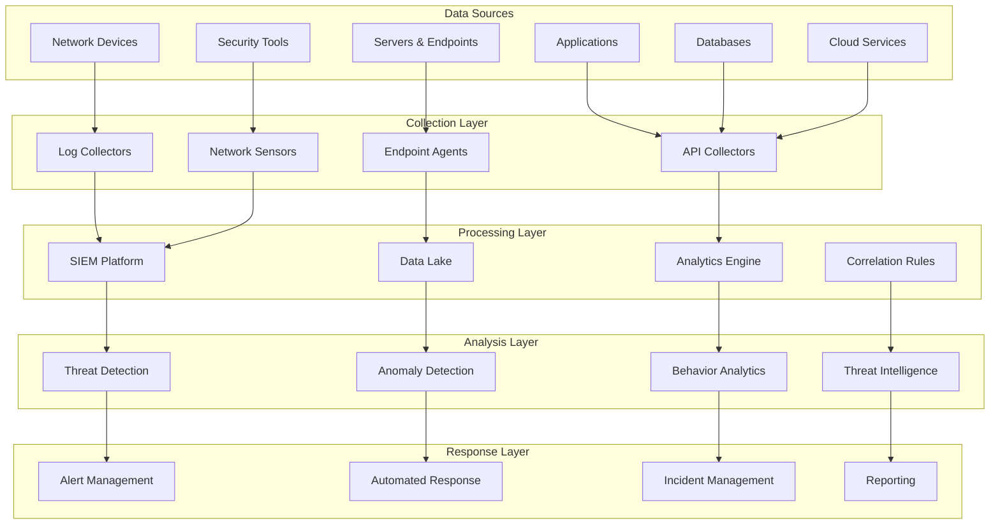
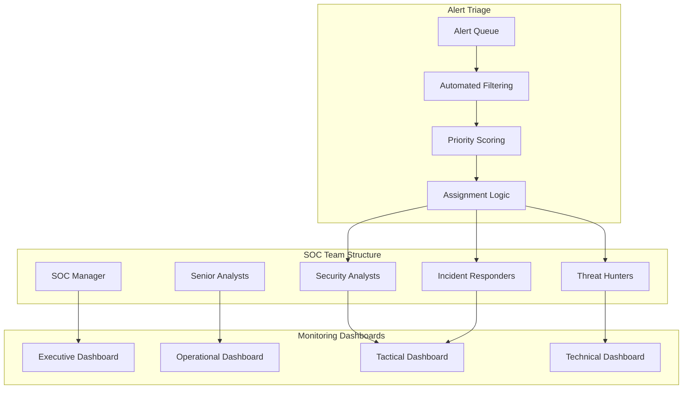
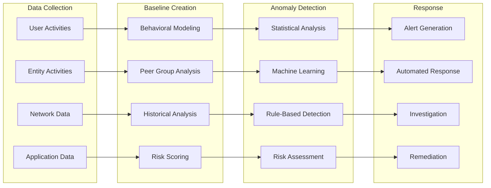
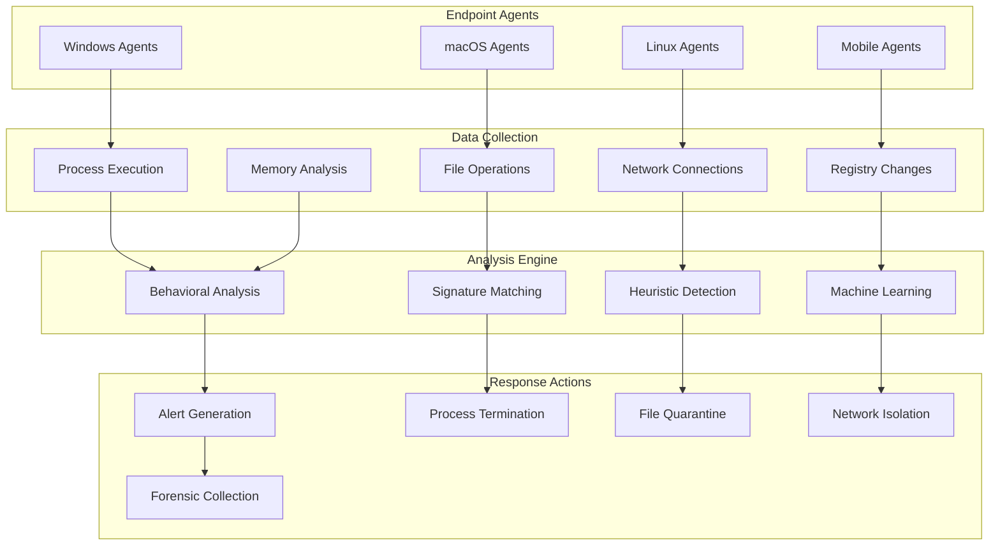
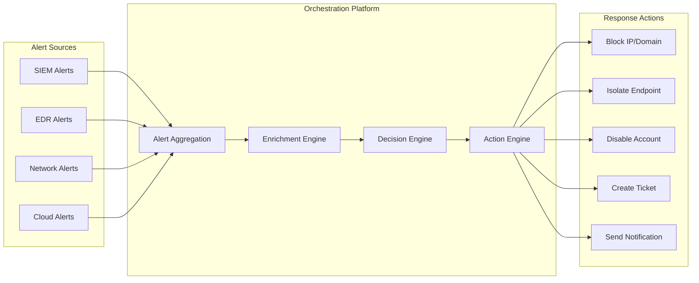

# Security Monitoring

## Overview

Security monitoring is the continuous process of collecting, analyzing, and responding to security events and indicators across Earna AI's infrastructure. Our security monitoring program provides real-time visibility into threats, enables rapid incident response, and supports compliance requirements.

## Monitoring Architecture



## Security Information and Event Management (SIEM)

### SIEM Platform Requirements

```typescript
interface SIEMRequirements {
  dataIngestion: {
    volume: '10TB+ per day'
    sources: '100+ log sources'
    formats: ['Syslog', 'CEF', 'LEEF', 'JSON', 'XML', 'Custom parsers']
    realTime: 'Sub-second processing latency'
  }

  storage: {
    hotData: '90 days online'
    warmData: '1 year searchable'
    coldData: '7 years archived'
    compression: '80% compression ratio'
  }

  processing: {
    correlation: 'Real-time event correlation'
    enrichment: 'Threat intelligence integration'
    normalization: 'Common event format'
    analytics: 'Machine learning capabilities'
  }

  alerting: {
    ruleEngine: 'Flexible rule creation'
    falsePositives: '<5% false positive rate'
    responseTime: '<1 minute alert generation'
    escalation: 'Multi-tier escalation'
  }

  compliance: {
    retention: 'Configurable retention policies'
    reporting: 'Automated compliance reports'
    auditTrail: 'Complete audit trail'
    integrity: 'Tamper-evident logging'
  }
}
```

### Log Sources and Data Collection

```yaml
log_sources:
  network:
    firewalls:
      - Palo Alto Networks
      - Fortinet FortiGate
      - pfSense
    routers_switches:
      - Cisco
      - Juniper
      - Arista
    load_balancers:
      - F5 BIG-IP
      - NGINX
      - HAProxy

  security_tools:
    ids_ips:
      - Suricata
      - Snort
      - Security Onion
    vulnerability_scanners:
      - Nessus
      - Rapid7
      - OpenVAS
    endpoint_protection:
      - CrowdStrike Falcon
      - Microsoft Defender
      - SentinelOne

  servers:
    operating_systems:
      - Windows Event Logs
      - Linux syslog
      - macOS unified logs
    web_servers:
      - Apache access/error logs
      - Nginx access/error logs
      - IIS logs
    databases:
      - PostgreSQL logs
      - MySQL logs
      - MongoDB logs

  applications:
    custom_applications:
      - Application logs
      - API access logs
      - Error logs
      - Performance logs
    cloud_services:
      - AWS CloudTrail
      - Google Cloud Audit Logs
      - Azure Activity Logs
```

## Threat Detection

### Rule-Based Detection

```typescript
class ThreatDetectionEngine {
  private rules: DetectionRule[] = [
    {
      id: 'LOGIN_BRUTE_FORCE',
      name: 'Brute Force Login Attempt',
      description: 'Multiple failed login attempts from same source',
      query: `
        SELECT source_ip, username, COUNT(*) as attempts
        FROM auth_logs
        WHERE event_type = 'login_failure'
          AND timestamp > NOW() - INTERVAL 5 MINUTE
        GROUP BY source_ip, username
        HAVING attempts >= 5
      `,
      severity: 'HIGH',
      category: 'Authentication'
    },

    {
      id: 'UNUSUAL_DATA_TRANSFER',
      name: 'Unusual Data Transfer Volume',
      description: 'Data transfer volume exceeds baseline',
      query: `
        SELECT user_id, SUM(bytes_transferred) as total_bytes
        FROM data_transfer_logs
        WHERE timestamp > NOW() - INTERVAL 1 HOUR
        GROUP BY user_id
        HAVING total_bytes > (SELECT AVG(bytes_transferred) * 3
                             FROM user_baselines WHERE user_id = user_id)
      `,
      severity: 'MEDIUM',
      category: 'Data Protection'
    },

    {
      id: 'PRIVILEGED_ACCOUNT_USAGE',
      name: 'After-Hours Privileged Account Access',
      description: 'Privileged account used outside business hours',
      query: `
        SELECT username, action, timestamp
        FROM auth_logs
        WHERE account_type = 'privileged'
          AND (HOUR(timestamp) < 7 OR HOUR(timestamp) > 19)
          AND DAYOFWEEK(timestamp) NOT IN (1, 7)
      `,
      severity: 'HIGH',
      category: 'Access Control'
    }
  ]

  async evaluateRules(): Promise<Alert[]> {
    const alerts = []

    for (const rule of this.rules) {
      const results = await this.executeQuery(rule.query)

      for (const result of results) {
        const alert = {
          ruleId: rule.id,
          ruleName: rule.name,
          severity: rule.severity,
          category: rule.category,
          timestamp: new Date(),
          data: result,
          status: 'NEW'
        }

        alerts.push(alert)
        await this.sendAlert(alert)
      }
    }

    return alerts
  }
}
```

### Machine Learning-Based Detection

```yaml
ml_detection:
  user_behavior_analytics:
    models:
      - Login pattern analysis
      - Data access pattern analysis
      - Application usage pattern analysis
      - Network behavior analysis

    features:
      - Time of access
      - Geolocation
      - Device fingerprinting
      - Resource access patterns
      - Data volume patterns

    algorithms:
      - Isolation Forest (anomaly detection)
      - One-Class SVM
      - LSTM networks (sequence analysis)
      - Clustering algorithms

  network_traffic_analysis:
    techniques:
      - Protocol analysis
      - Flow analysis
      - Payload inspection
      - Timing analysis

    detection_targets:
      - Command and control communications
      - Data exfiltration
      - Lateral movement
      - Malware communications

  endpoint_behavior:
    monitoring:
      - Process execution patterns
      - File system activity
      - Registry modifications
      - Network connections

    detection:
      - Malware behavior
      - Privilege escalation
      - Persistence mechanisms
      - Credential theft
```

## Real-Time Monitoring

### Security Operations Center (SOC)



### 24/7 Monitoring Coverage

```typescript
interface SOCOperations {
  staffing: {
    tier1Analysts: {
      count: 4
      shift: '24/7 coverage'
      responsibilities: [
        'Monitor security alerts',
        'Perform initial triage',
        'Execute response playbooks',
        'Escalate to Tier 2'
      ]
    }

    tier2Analysts: {
      count: 2
      shift: 'Business hours + on-call'
      responsibilities: [
        'Deep investigation',
        'Threat hunting',
        'Complex incident response',
        'Escalate to Tier 3'
      ]
    }

    tier3Specialists: {
      count: 1
      shift: 'On-call'
      responsibilities: [
        'Expert analysis',
        'Advanced forensics',
        'Custom tool development',
        'Process improvement'
      ]
    }
  }

  processes: {
    alertTriage: {
      sla: '5 minutes for critical, 15 minutes for high'
      automation: '70% of alerts auto-processed'
      escalation: 'Automatic escalation after SLA breach'
    }

    incidentResponse: {
      classification: 'Within 30 minutes'
      containment: 'Within 1 hour for critical'
      communication: 'Stakeholder notification within 15 minutes'
    }
  }
}
```

## Threat Intelligence Integration

### Intelligence Sources

```yaml
threat_intelligence:
  commercial_feeds:
    - IBM X-Force
    - Recorded Future
    - ThreatConnect
    - Anomali

  open_source_feeds:
    - MISP communities
    - OTX AlienVault
    - VirusTotal
    - URLVoid

  government_feeds:
    - Canadian Centre for Cyber Security
    - US-CERT
    - CISA feeds

  industry_sharing:
    - Financial sector ISACs
    - Technology sector sharing
    - Regional threat sharing groups

  internal_intelligence:
    - Incident artifacts
    - Honeypot data
    - Deception technology
    - Internal research
```

### Intelligence Processing

```typescript
class ThreatIntelligence {
  async processIntelligence(feed: ThreatFeed): Promise<ProcessedIntelligence> {
    const processed = {
      indicators: [] as IOC[],
      tactics: [] as string[],
      techniques: [] as string[],
      procedures: [] as string[],
      attribution: null as Attribution,
      confidence: 0
    }

    // Extract indicators of compromise
    processed.indicators = await this.extractIOCs(feed)

    // Map to MITRE ATT&CK framework
    const mappings = await this.mapToMITRE(feed)
    processed.tactics = mappings.tactics
    processed.techniques = mappings.techniques
    processed.procedures = mappings.procedures

    // Attribution analysis
    processed.attribution = await this.analyzeAttribution(feed)

    // Calculate confidence score
    processed.confidence = await this.calculateConfidence(feed)

    // Enrich existing events
    await this.enrichEvents(processed)

    return processed
  }

  async enrichEvents(intelligence: ProcessedIntelligence): Promise<void> {
    for (const indicator of intelligence.indicators) {
      // Find matching events in SIEM
      const events = await this.findMatchingEvents(indicator)

      for (const event of events) {
        // Add threat intelligence context
        await this.addThreatContext(event, {
          indicator: indicator,
          attribution: intelligence.attribution,
          confidence: intelligence.confidence,
          tactics: intelligence.tactics
        })

        // Re-score event risk
        event.riskScore = await this.calculateRiskScore(event)

        // Trigger alert if risk increased significantly
        if (event.riskScore > event.previousRiskScore + 50) {
          await this.triggerAlert(event)
        }
      }
    }
  }
}
```

## Advanced Analytics

### User and Entity Behavior Analytics (UEBA)



### Behavioral Analysis

```typescript
class BehavioralAnalytics {
  async analyzeUserBehavior(userId: string): Promise<BehaviorAnalysis> {
    const user = await this.getUser(userId)
    const activities = await this.getUserActivities(userId, '30 days')

    const analysis = {
      riskScore: 0,
      anomalies: [] as Anomaly[],
      patterns: [] as Pattern[],
      recommendations: [] as string[]
    }

    // Analyze login patterns
    const loginAnalysis = await this.analyzeLoginPatterns(activities.logins)
    if (loginAnalysis.anomalous) {
      analysis.anomalies.push({
        type: 'login_pattern',
        description: 'Unusual login times or locations',
        severity: loginAnalysis.severity,
        evidence: loginAnalysis.evidence
      })
    }

    // Analyze data access patterns
    const dataAnalysis = await this.analyzeDataAccess(activities.dataAccess)
    if (dataAnalysis.anomalous) {
      analysis.anomalies.push({
        type: 'data_access',
        description: 'Unusual data access patterns',
        severity: dataAnalysis.severity,
        evidence: dataAnalysis.evidence
      })
    }

    // Analyze application usage
    const appAnalysis = await this.analyzeApplicationUsage(activities.applications)
    if (appAnalysis.anomalous) {
      analysis.anomalies.push({
        type: 'application_usage',
        description: 'Unusual application usage',
        severity: appAnalysis.severity,
        evidence: appAnalysis.evidence
      })
    }

    // Calculate overall risk score
    analysis.riskScore = this.calculateRiskScore(analysis.anomalies)

    return analysis
  }

  private async analyzeLoginPatterns(logins: LoginEvent[]): Promise<PatternAnalysis> {
    const baseline = await this.getLoginBaseline(logins[0].userId)

    const analysis = {
      anomalous: false,
      severity: 'LOW' as Severity,
      evidence: [] as string[]
    }

    // Check for unusual times
    const unusualTimes = logins.filter(login =>
      this.isUnusualTime(login.timestamp, baseline.typicalTimes)
    )

    if (unusualTimes.length > baseline.typicalTimes.length * 0.3) {
      analysis.anomalous = true
      analysis.severity = 'MEDIUM'
      analysis.evidence.push(`${unusualTimes.length} logins at unusual times`)
    }

    // Check for unusual locations
    const unusualLocations = logins.filter(login =>
      !baseline.typicalLocations.includes(login.location)
    )

    if (unusualLocations.length > 0) {
      analysis.anomalous = true
      analysis.severity = 'HIGH'
      analysis.evidence.push(`${unusualLocations.length} logins from unusual locations`)
    }

    // Check for impossible travel
    const travelViolations = this.detectImpossibleTravel(logins)
    if (travelViolations.length > 0) {
      analysis.anomalous = true
      analysis.severity = 'CRITICAL'
      analysis.evidence.push('Impossible travel detected')
    }

    return analysis
  }
}
```

## Network Security Monitoring

### Network Traffic Analysis

```yaml
network_monitoring:
  traffic_analysis:
    deep_packet_inspection:
      - Protocol analysis
      - Payload inspection
      - Malware detection
      - Data exfiltration detection

    flow_analysis:
      - Connection patterns
      - Bandwidth utilization
      - Communication relationships
      - Anomaly detection

    metadata_analysis:
      - DNS queries
      - SSL/TLS certificates
      - HTTP headers
      - Network timing

  detection_capabilities:
    lateral_movement:
      - Internal port scanning
      - Credential reuse
      - Administrative tool usage
      - Unusual internal connections

    data_exfiltration:
      - Large data transfers
      - Unusual protocols
      - Encrypted tunnels
      - DNS tunneling

    command_control:
      - Periodic communications
      - Domain generation algorithms
      - Fast flux networks
      - Encrypted channels
```

### Intrusion Detection System (IDS)

```typescript
interface IDSConfiguration {
  signatures: {
    commercial: 'Snort VRT rules'
    opensource: 'Emerging Threats rules'
    custom: 'Organization-specific rules'
    updates: 'Daily signature updates'
  }

  deployment: {
    placement: 'Network taps and spans'
    coverage: '100% of network segments'
    redundancy: 'High availability pairs'
    performance: '10Gbps+ throughput'
  }

  tuning: {
    falsePositives: 'Continuous tuning to <5%'
    customization: 'Environment-specific rules'
    suppression: 'Known good traffic filtering'
    optimization: 'Performance optimization'
  }

  integration: {
    siem: 'Real-time alert forwarding'
    orchestration: 'Automated response integration'
    threatIntel: 'IOC enrichment'
    forensics: 'Packet capture integration'
  }
}
```

## Endpoint Detection and Response (EDR)

### Endpoint Monitoring



### Advanced Threat Detection

```typescript
class EndpointThreatDetection {
  async analyzeThreat(event: EndpointEvent): Promise<ThreatAnalysis> {
    const analysis = {
      threatType: 'unknown' as ThreatType,
      confidence: 0,
      severity: 'LOW' as Severity,
      indicators: [] as string[],
      recommendedActions: [] as string[]
    }

    // Analyze process behavior
    if (event.type === 'process_execution') {
      const processAnalysis = await this.analyzeProcess(event.process)

      if (processAnalysis.suspicious) {
        analysis.threatType = 'malware'
        analysis.confidence += 0.3
        analysis.indicators.push(...processAnalysis.indicators)
      }
    }

    // Analyze file operations
    if (event.fileOperations?.length > 0) {
      const fileAnalysis = await this.analyzeFileOperations(event.fileOperations)

      if (fileAnalysis.suspicious) {
        analysis.threatType = 'ransomware'
        analysis.confidence += 0.4
        analysis.indicators.push(...fileAnalysis.indicators)
      }
    }

    // Analyze network connections
    if (event.networkConnections?.length > 0) {
      const networkAnalysis = await this.analyzeNetworkConnections(event.networkConnections)

      if (networkAnalysis.suspicious) {
        analysis.threatType = 'command_control'
        analysis.confidence += 0.3
        analysis.indicators.push(...networkAnalysis.indicators)
      }
    }

    // Determine severity and actions
    analysis.severity = this.calculateSeverity(analysis.confidence)
    analysis.recommendedActions = this.getRecommendedActions(analysis)

    return analysis
  }

  private async analyzeProcess(process: ProcessInfo): Promise<ProcessAnalysis> {
    const analysis = {
      suspicious: false,
      indicators: [] as string[]
    }

    // Check process reputation
    const reputation = await this.checkProcessReputation(process.hash)
    if (reputation.malicious) {
      analysis.suspicious = true
      analysis.indicators.push('Known malicious process')
    }

    // Check process behavior
    if (process.parentProcess === 'winword.exe' && process.name === 'powershell.exe') {
      analysis.suspicious = true
      analysis.indicators.push('Office application spawning PowerShell')
    }

    // Check for living-off-the-land techniques
    if (this.isLOLBin(process.name) && process.commandLine.includes('encoded')) {
      analysis.suspicious = true
      analysis.indicators.push('Suspicious use of legitimate tool')
    }

    return analysis
  }
}
```

## Cloud Security Monitoring

### Multi-Cloud Monitoring

```yaml
cloud_monitoring:
  aws:
    services:
      - CloudTrail (API calls)
      - VPC Flow Logs (network)
      - GuardDuty (threat detection)
      - Config (configuration changes)
      - CloudWatch (metrics and logs)

    detection_focus:
      - Unusual API activity
      - Privilege escalation
      - Resource misconfigurations
      - Data access patterns

  gcp:
    services:
      - Cloud Audit Logs
      - VPC Flow Logs
      - Security Command Center
      - Cloud Asset Inventory
      - Cloud Monitoring

    detection_focus:
      - Project modifications
      - IAM changes
      - Network security
      - Compute instance activity

  azure:
    services:
      - Activity Logs
      - NSG Flow Logs
      - Azure Security Center
      - Azure Sentinel
      - Monitor Logs

    detection_focus:
      - Subscription changes
      - Resource group modifications
      - Identity and access
      - Network traffic analysis
```

## Compliance Monitoring

### Regulatory Compliance

```typescript
interface ComplianceMonitoring {
  sox: {
    requirements: [
      'Access control monitoring',
      'Change management tracking',
      'Data integrity verification',
      'Segregation of duties enforcement'
    ]
    monitoring: {
      privilegedAccess: 'Real-time monitoring of privileged accounts'
      dataChanges: 'Audit trail of all financial data modifications'
      systemChanges: 'Tracking of all system configuration changes'
    }
  }

  pipeda: {
    requirements: [
      'Personal data access monitoring',
      'Data retention compliance',
      'Breach detection and notification',
      'Consent management tracking'
    ]
    monitoring: {
      dataAccess: 'Monitor all access to personal information'
      dataMovement: 'Track data transfers and sharing'
      retentionViolations: 'Alert on retention policy violations'
    }
  }

  pci: {
    requirements: [
      'Cardholder data access monitoring',
      'Network security monitoring',
      'System hardening verification',
      'Vulnerability management tracking'
    ]
    monitoring: {
      cardholderData: 'Monitor access to cardholder data environment'
      networkSegmentation: 'Verify network segmentation integrity'
      vulnerabilities: 'Track vulnerability remediation'
    }
  }
}
```

## Automated Response and Orchestration

### Security Orchestration



### Automated Playbooks

```yaml
automated_playbooks:
  malware_detection:
    trigger: "EDR detects malware"
    actions:
      - Isolate affected endpoint
      - Collect forensic artifacts
      - Scan related systems
      - Create incident ticket
      - Notify security team

  brute_force_attack:
    trigger: "Multiple failed login attempts"
    actions:
      - Block source IP address
      - Disable targeted account
      - Require password reset
      - Notify user and manager
      - Escalate if repeated

  data_exfiltration:
    trigger: "Unusual data transfer detected"
    actions:
      - Block network connection
      - Preserve evidence
      - Notify data owner
      - Create high-priority incident
      - Engage legal team
```

## Metrics and Reporting

### Security Metrics

```yaml
security_metrics:
  operational:
    alert_volume: "Daily alert count and trends"
    false_positive_rate: "Percentage of false positives"
    mean_time_to_detect: "Average time from event to alert"
    mean_time_to_respond: "Average time from alert to response"
    coverage: "Percentage of assets monitored"

  effectiveness:
    threat_detection_rate: "Percentage of threats detected"
    incident_containment_time: "Time to contain incidents"
    vulnerability_remediation: "Time to patch vulnerabilities"
    compliance_score: "Compliance posture score"

  business_impact:
    security_incidents: "Number and impact of incidents"
    downtime_prevented: "Estimated downtime prevented"
    cost_avoidance: "Estimated cost of prevented incidents"
    compliance_violations: "Number of compliance violations"
```

### Executive Reporting

```typescript
class SecurityReporting {
  async generateExecutiveReport(period: string): Promise<ExecutiveReport> {
    return {
      summary: {
        totalAlerts: await this.getTotalAlerts(period),
        criticalIncidents: await this.getCriticalIncidents(period),
        threatsBlocked: await this.getThreatsBlocked(period),
        complianceScore: await this.getComplianceScore(period)
      },

      threatLandscape: {
        topThreats: await this.getTopThreats(period),
        attackTrends: await this.getAttackTrends(period),
        industryComparison: await this.getIndustryComparison(period)
      },

      operationalMetrics: {
        mttr: await this.getMTTR(period),
        mttd: await this.getMTTD(period),
        falsePositiveRate: await this.getFalsePositiveRate(period),
        coveragePercentage: await this.getCoveragePercentage()
      },

      recommendations: await this.getRecommendations(period)
    }
  }
}
```

## Technology Stack

### Core Platforms

```yaml
technology_stack:
  siem:
    primary: "Splunk Enterprise Security"
    alternatives: ["IBM QRadar", "Microsoft Sentinel", "Elastic SIEM"]
    deployment: "On-premises with cloud backup"
    sizing: "10TB/day ingestion capacity"

  edr:
    primary: "CrowdStrike Falcon"
    alternatives: ["Microsoft Defender ATP", "SentinelOne"]
    coverage: "100% of endpoints"
    features: ["Real-time protection", "Threat hunting", "Forensics"]

  network_monitoring:
    ids: "Suricata"
    network_analysis: "Zeek (Bro)"
    packet_capture: "Moloch"
    traffic_analysis: "ntopng"

  orchestration:
    platform: "Phantom (Splunk)"
    alternatives: ["Demisto", "IBM Resilient", "Swimlane"]
    integrations: "100+ security tool integrations"
    playbooks: "50+ automated playbooks"
```

## Next Steps

1. **Complete SIEM Deployment**: Finalize SIEM platform configuration
2. **Deploy EDR Solution**: Roll out endpoint detection across all devices
3. **Implement UEBA**: Deploy user behavior analytics capabilities
4. **Configure Playbooks**: Set up automated response playbooks
5. **Train SOC Team**: Complete training for all monitoring staff
6. **Establish Baselines**: Create behavioral baselines for monitoring
7. **Continuous Improvement**: Regular tuning and enhancement program

## Contact Information

- **Security Operations Center**: soc@earna.ai
- **Security Monitoring Team**: monitoring@earna.ai
- **24/7 Security Hotline**: +1-XXX-XXX-XXXX
- **Threat Intelligence**: threat-intel@earna.ai
